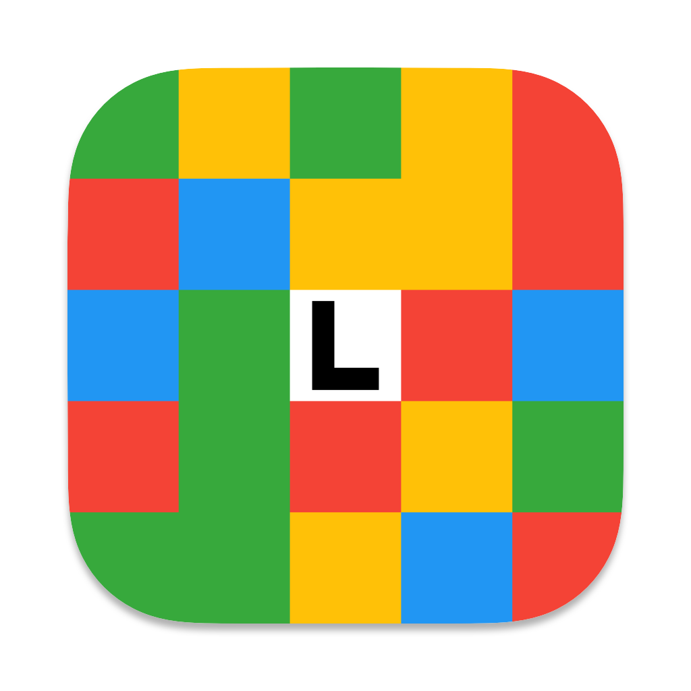

<div align="center">
  
  <h1 align="center">lailai's Home</h1>
</div>

## 介绍

本项目使用 [Docusaurus](https://docusaurus.io) 构建，项目托管于 [GitHub](https://github.com/lailai0916/lailai0916.github.io)。

Docusaurus 是一个开源的静态网站生成器，专门用于构建文档网站。

它由 Facebook 开发，旨在帮助开发者和团队轻松创建和维护技术文档、知识库、博客等。

## 特性

- 🦖 **Docusaurus** - 基于 [Docusaurus](https://docusaurus.io)，提供强大的文档生成和博客功能。
- 🌱 **易于使用** - 通过简单的配置和 Markdown 文件管理，快速创建文档网站。
- 🎨 **美观整洁** - 优先考虑阅读体验，界面简洁而美观。
- ✍️ **Markdown 支持** - 书写方便，支持 Markdown 和 KaTeX，适合技术文档。
- 🌐 **国际化** - 内置多语言支持，便于跨语言环境的文档管理。
- 🎨 **主题与插件** - 提供丰富的主题和插件，支持高度自定义的外观和功能。
- 📚 **文档版本管理** - 支持文档版本控制，适合需要管理多个版本的项目。
- ⚛️ **React 组件支持** - 可在文档中嵌入 [React](https://react.dev) 组件，增强交互性。
- 🖥️ **PWA 支持** - 支持渐进式网页应用（PWA），可安装并离线使用。
- 💯 **SEO 优化** - 内置搜索引擎优化功能，便于被搜索引擎收录。
- 🔎 **强大搜索功能** - 集成 [Algolia DocSearch](https://docsearch.algolia.com)，提供精准的全文搜索体验。
- 📊 **Google 分析** - 集成 [Google Analytics](https://analytics.google.com)，提供详细的流量分析。
- 🚀 **GitHub Pages 部署** - 支持直接部署到 [GitHub Pages](https://pages.github.com)，方便托管和共享。

## 文件目录

```bash
Home
├── blog                           # 博客
│   ├── authors.yml                # 作者配置文件
│   ├── tags.yml                   # 标签配置文件
│   └── solution
├── docs                           # 文档
│   ├── contest
│   ├── note
│   ├── project
├── src                            # 源代码
│   ├── components                 # 自定义组件
│   ├── css                        # 自定义 CSS
│   ├── data                       # 数据资料
│   ├── pages                      # 自定义页面
│   └── theme                      # 自定义主题
├── static                         # 静态资源
│   └── img                        # 静态图片
├── babel.config.js
├── docusaurus.config.ts           # 网站配置文件
├── sidebars.ts                    # 文档侧边栏
├── package.json
└── LICENSE                        # 许可证文件
```

## 赞助

|               支付宝               |              微信支付              |
| :--------------------------------: | :--------------------------------: |
|  |  |

## 许可证

This website's content is licensed under the [CC BY-NC-SA 4.0](https://creativecommons.org/licenses/by-nc-sa/4.0/?ref=chooser-v1).
