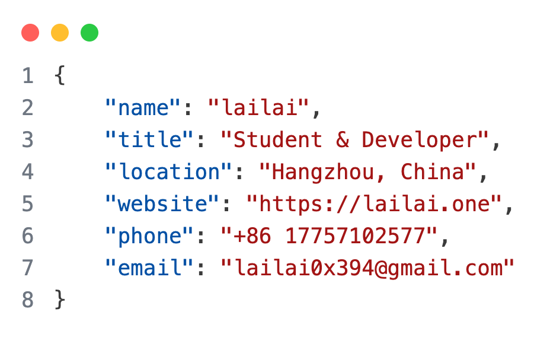
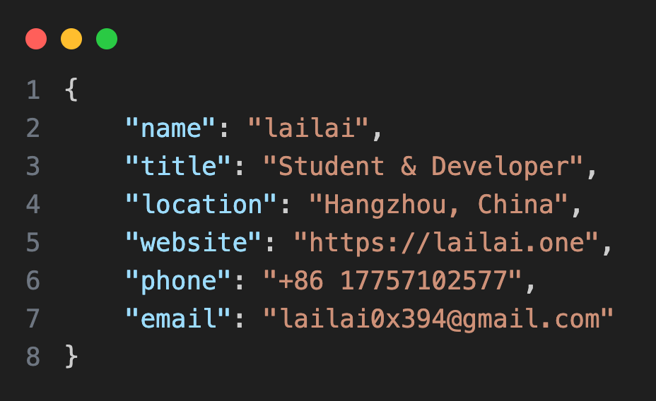

使用 VSCode 的 CodeSnap 插件制作了一套 JSON 风格的个人名片。

<!-- truncate -->

## 效果展示

|              浅色版本               |              深色版本              |
| :---------------------------------: | :--------------------------------: |
|  |  |


## 代码

```json
{
    "name": "lailai",
    "title": "Student & Developer",
    "location": "Hangzhou, China",
    "phone": "+86 17757102577",
    "email": "lailai0x394@gmail.com",
    "website": "https://www.lailai.one"
}
```
