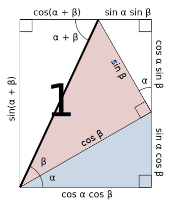
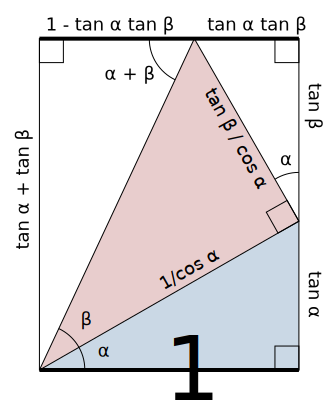

---
# Display h2 to h5 headings
toc_min_heading_level: 2
toc_max_heading_level: 5
---

import Desmos from '@site/src/components/BrowserWindow/Desmos';

# 三角函数

## 参考资料

- [三角函数 - 维基百科](https://zh.wikipedia.org/wiki/三角函数)
- [《关于我不背三角公式，高考数学144这件事》 一个式子推出所有三角公式 - bilibili](https://www.bilibili.com/video/BV18f4y1Q7GC)

## 前置知识

### 任意角

《人教版高中必修一》：一条射线围绕其端点逆时针旋转形成的角叫做正角，顺时针旋转形成的角叫做负角。

旋转不限于一圈，因此任意角的大小可以为任意实数。

### 弧度制

《人教版高中必修一》：长度等于半径的圆弧所对应的圆心角叫做 $1$ 弧度（Radian），弧度单位用 rad 表示，读作弧度。

圆周长与半径之比为 $2\pi$，因此 $360^\circ = 2\pi$ 弧度。

弧度和角度成正比，其他角度都可以通过换算得到：

|    角度    |       弧度        |    角度     |       弧度        |
| :--------: | :---------------: | :---------: | :---------------: |
| $0^\circ$  |        $0$        | $90^\circ$  | $\dfrac{\pi}{2}$  |
| $15^\circ$ | $\dfrac{\pi}{12}$ | $120^\circ$ | $\dfrac{2\pi}{3}$ |
| $30^\circ$ | $\dfrac{\pi}{6}$  | $180^\circ$ |       $\pi$       |
| $45^\circ$ | $\dfrac{\pi}{4}$  | $270^\circ$ | $\dfrac{3\pi}{2}$ |
| $60^\circ$ | $\dfrac{\pi}{3}$  | $360^\circ$ |      $2\pi$       |

### 单位圆

单位圆指平面直角坐标系上，圆心为原点，半径为单位长度的圆。

单位圆的方程：$x^2+y^2=1$。

<Desmos url="ecbaehbecs" />

### 距离公式

距离公式：$A(x_0,y_0),B(x_1,y_1)$ 两点之间的距离为 $\sqrt{(x_0-x_1)^2+(y_0-y_1)^2}$。

<Desmos url="bjodmisvtc" />

构造直角三角形，两条直角边的长度分别为 $(x_1-x_0)$ 和 $(y_1-y_0)$。

而斜边的长度就是 $A$ 点和 $B$ 点的距离 $d$，根据勾股定理：

$$
d=\sqrt{(x_0-x_1)^2+(y_0-y_1)^2}
$$

:::tip

$A,B$ 两点之间的距离一般用 $|AB|$ 表示。

:::

## 三角函数的定义

### 锐角三角函数

锐角三角函数是在直角三角形中，以一个锐角为基准，定义对边、邻边和斜边中两边之比的函数。

### 任意角三角函数

锐角三角函数定义是基于 **直角三角形** 的，但直角三角形的锐角只能在 $(0,\frac{\pi}{2})$ 范围内。

超出这个范围的三角函数就没有意义了，所以高中时会用 **单位圆** 定义任意角三角函数。

如图，将斜边为 $1$ 的直角三角形放入单位圆内。

不难发现，不管 $\theta$ 的大小，斜边 $c$ 永远等于半径 $1$，带入锐角三角函数的定义：

$$
\sin{\theta}=\frac{a}{c}=a,\cos{\theta}=\frac{b}{c}=b
$$

而 $a$ 和 $b$ 恰好是这个点的 **纵坐标** 和 **横坐标**.

所以是单位圆周上辐角为 $\theta$ 的点的纵坐标 $y=\sin{\theta}$，横坐标 $x=\cos{\theta}$。

:::warning

这个点坐标是 $(\cos{\theta},\sin{\theta})$，$\cos$ 在前面，$\sin$ 在后面。

:::

$$
\tan{\theta}=\frac{a}{b}=\frac{\sin{\theta}}{\cos{\theta}}=\frac{y}{x}
$$

不难发现，$\frac{y}{x}$ 是计算直线斜率 $k$ 的公式。

所以一条直线的倾斜角为 $\theta$ 时，该直线的斜率 $k=\tan{\theta}$。

## 三角函数的信息

### 表格

|  函数  |    $\sin{x}$     |    $\cos{x}$     |         $\tan{x}$         |    $\cot{x}$     |         $\sec{x}$         |     $\csc{x}$      |
| :----: | :--------------: | :--------------: | :-----------------------: | :--------------: | :-----------------------: | :----------------: |
|  名称  |       正弦       |       余弦       |           正切            |       余切       |           正割            |        余割        |
|  定义  |  $\dfrac{a}{c}$  |  $\dfrac{b}{c}$  |      $\dfrac{a}{b}$       |  $\dfrac{b}{a}$  |      $\dfrac{c}{b}$       |   $\dfrac{c}{a}$   |
| 定义域 | $x\in\mathbb{R}$ | $x\in\mathbb{R}$ | $x\ne\dfrac{\pi}{2}+k\pi$ |   $x\ne k\pi$    | $x\ne\dfrac{\pi}{2}+k\pi$ |    $x\ne k\pi$     |
|  值域  |   $y\in[-1,1]$   |   $y\in[-1,1]$   |     $y\in\mathbb{R}$      | $y\in\mathbb{R}$ |    $y\le1 \lor y\ge1$     | $y\le1 \lor y\ge1$ |
| 奇偶性 |      奇函数      |      偶函数      |          奇函数           |      奇函数      |          偶函数           |       奇函数       |
|  周期  |      $2\pi$      |      $2\pi$      |           $\pi$           |      $\pi$       |          $2\pi$           |       $2\pi$       |

### 三角函数的图像

红色为 $\sin$，蓝色为 $\cos$，绿色为 $\tan$，橙色为 $\cot$，紫色为 $\sec$，黑色为 $\csc$。

<Desmos url="zhow2jcijw" />

### 常用三角函数值表

<style>{`
  .center-table th, .center-table td {
    text-align: center;
  }
`}</style>

<table className="center-table">
  <thead>
    <tr>
      <th>角度</th>
      <th>弧度</th>
      <th>$\sin{\theta}$</th>
      <th>$\cos{\theta}$</th>
      <th>$\tan{\theta}$</th>
      <th>$\cot{\theta}$</th>
      <th>$\sec{\theta}$</th>
      <th>$\csc{\theta}$</th>
    </tr>
  </thead>
  <tbody>
    <tr><td>$0^\circ$</td><td>$0$</td><td>$0$</td><td>$1$</td><td>$0$</td><td>$/$</td><td>$1$</td><td>$/$</td></tr>
    <tr><td>$15^\circ$</td><td>$\dfrac{\pi}{12}$</td><td>$\dfrac{\sqrt{6}-\sqrt{2}}{4}$</td><td>$\dfrac{\sqrt{6}+\sqrt{2}}{4}$</td><td>$2 - \sqrt{3}$</td><td>$2 + \sqrt{3}$</td><td>$\dfrac{4}{\sqrt{6}+\sqrt{2}}$</td><td>$\dfrac{4}{\sqrt{6}-\sqrt{2}}$</td></tr>
    <tr><td>$30^\circ$</td><td>$\dfrac{\pi}{6}$</td><td>$\dfrac{1}{2}$</td><td>$\dfrac{\sqrt{3}}{2}$</td><td>$\dfrac{\sqrt{3}}{3}$</td><td>$\sqrt{3}$</td><td>$\dfrac{2}{\sqrt{3}}$</td><td>$2$</td></tr>
    <tr><td>$45^\circ$</td><td>$\dfrac{\pi}{4}$</td><td>$\dfrac{\sqrt{2}}{2}$</td><td>$\dfrac{\sqrt{2}}{2}$</td><td>$1$</td><td>$1$</td><td>$\sqrt{2}$</td><td>$\sqrt{2}$</td></tr>
    <tr><td>$60^\circ$</td><td>$\dfrac{\pi}{3}$</td><td>$\dfrac{\sqrt{3}}{2}$</td><td>$\dfrac{1}{2}$</td><td>$\sqrt{3}$</td><td>$\dfrac{\sqrt{3}}{3}$</td><td>$2$</td><td>$\dfrac{2}{\sqrt{3}}$</td></tr>
    <tr><td>$90^\circ$</td><td>$\dfrac{\pi}{2}$</td><td>$1$</td><td>$0$</td><td>$/$</td><td>$0$</td><td>$/$</td><td>$1$</td></tr>
    <tr><td>$120^\circ$</td><td>$\dfrac{2\pi}{3}$</td><td>$\dfrac{\sqrt{3}}{2}$</td><td>$-\dfrac{1}{2}$</td><td>$-\sqrt{3}$</td><td>$-\dfrac{\sqrt{3}}{3}$</td><td>$-2$</td><td>$\dfrac{2}{\sqrt{3}}$</td></tr>
    <tr><td>$180^\circ$</td><td>$\pi$</td><td>$0$</td><td>$-1$</td><td>$0$</td><td>$/$</td><td>$-1$</td><td>$/$</td></tr>
    <tr><td>$270^\circ$</td><td>$\dfrac{3\pi}{2}$</td><td>$-1$</td><td>$0$</td><td>$/$</td><td>$0$</td><td>$/$</td><td>$-1$</td></tr>
    <tr><td>$360^\circ$</td><td>$2\pi$</td><td>$0$</td><td>$1$</td><td>$0$</td><td>$/$</td><td>$1$</td><td>$/$</td></tr>
  </tbody>
</table>

## 三角函数的恒等式

### 平方恒等式

$$
\boxed{\begin{array}{l}
  \\
  \sin^2{\alpha}+\cos^2{\alpha}=1 \\
  \\
  1+\tan^2{\alpha}=\sec^2{\alpha} \\
  \\
  \cot^2{\alpha}+1=\csc^2{\alpha} \\
  \\
\end{array}}
$$

### 商数恒等式

$$
\boxed{\begin{array}{l}
  \\
  \tan{\alpha}=\dfrac{\sin{\alpha}}{\cos{\alpha}} \\
  \\
  \cot{\alpha}=\dfrac{\cos{\alpha}}{\sin{\alpha}} \\
  \\
\end{array}}
$$

### 倒数恒等式

$$
\boxed{\begin{array}{l}
  \\
  \sin{\alpha}=\dfrac{1}{\csc{\alpha}} \\
  \\
  \cos{\alpha}=\dfrac{1}{\sec{\alpha}} \\
  \\
  \tan{\alpha}=\dfrac{1}{\cot{\alpha}} \\
  \\
\end{array}}
$$

### 积的恒等式

$$
\boxed{\begin{array}{l}
  \\
  \sin{\alpha}=\tan{\alpha}\cos{\alpha} \\
  \\
  \cos{\alpha}=\cot{\alpha}\sin{\alpha} \\
  \\
  \tan{\alpha}=\sin{\alpha}\sec{\alpha} \\
  \\
  \cot{\alpha}=\cos{\alpha}\csc{\alpha} \\
  \\
  \sec{\alpha}=\tan{\alpha}\csc{\alpha} \\
  \\
  \csc{\alpha}=\sec{\alpha}\cot{\alpha} \\
  \\
\end{array}}
$$

### 推导过程

上图中蓝色三角形是直角三角形，根据勾股定理：

$$
\sin^2{\theta}+\cos^2{\theta}=1
$$

等式两边同时除以 $\sin^2{\theta}$ 或 $\cos^2{\theta}$ 可得：

$$
1+\tan^2{\alpha}=\sec^2{\alpha}
$$

$$
\cot^2{\alpha}+1=\csc^2{\alpha}
$$

对于其他三组恒等式，将锐角三角函数的定义带入即可证明：

$$
\sin{\theta}=\frac{a}{c},\cos{\theta}=\frac{b}{c},\tan{\theta}=\frac{a}{b},\cot{\theta}=\frac{b}{a},\sec{\theta}=\frac{c}{b},\csc{\theta}=\frac{c}{a}
$$

:::note[示例]

- $\dfrac{\sin{\theta}}{\cos{\theta}}=\dfrac{a/c}{b/c}=\dfrac{a}{b}=\tan{\theta}$

:::

## 三角函数的公式

### 两角和差公式

#### 无字证明

一个精妙的无字证明：



$$
\sin{(\alpha+\beta)}=\sin{\alpha}\cos{\beta}+\cos{\alpha}\sin{\beta}
$$

$$
\cos{(\alpha+\beta)}=\cos{\alpha}\cos{\beta}-\sin{\alpha}\sin{\beta}
$$



$$
\tan{(\alpha+\beta)}=\dfrac{\tan{\alpha}+\tan{\beta}}{1-\tan{\alpha}\tan{\beta}}
$$

#### 推导过程

##### 余弦差角公式推导

:::tip

余弦差角公式是本文 **唯一** 需要通过几何推导来证明的公式。

其他公式都可以通过代入已有公式推导得出。

:::

如图，设 $\angle AOB'=\alpha,\angle BOB'=\beta$。

则 $A,B$ 两点的坐标分别为 $A(\cos{\alpha},\sin{\alpha}),B(\cos{\beta},\sin{\beta})$。

根据距离公式：

$$
\begin{aligned}
  |AB|^2 &= (\cos{\alpha}-\cos{\beta})^2+(\sin{\alpha}-\sin{\beta})^2 \\
  &= \cos^2{\alpha}-2\cos{\alpha}\cos{\beta}+\cos^2{\beta}+sin^2{\alpha}-2\sin{\alpha}\sin{\beta}+sin^2{\beta} \\
  &= 2-2(\cos{\alpha}\cos{\beta}+\sin{\alpha}\sin{\beta})
\end{aligned}
$$

让 $OA$ 和 $OB$ 同时绕原点顺时针旋转 $\beta$，得到 $OA'$ 和 $OB'$。

此时 $OB$ 和 $x$ 轴重合，$\angle A'OB'=\alpha-\beta$。

所以 $A',B'$ 两点的坐标分别为 $A'(\cos{(\alpha-\beta)},\sin{(\alpha-\beta)}),B'(1,0)$。

根据距离公式：

$$
\begin{aligned}
  |A'B'|^2 &= (\cos{(\alpha-\beta)}-1)^2+(\sin{(\alpha-\beta)}-0)^2 \\
  &= \cos^2{(\alpha-\beta)}-2\cos{(\alpha-\beta)}+1+\sin^2{(\alpha+\beta)} \\
  &= 2-2\cos{(\alpha-\beta)}
\end{aligned}
$$

不难证明 $\triangle ABO\cong\triangle A'B'O$，所以 $|AB|=|A'B'|$。

所以 $|AB|^2=|A'B'|^2=\cos{(\alpha-\beta)}=\cos{\alpha}\cos{\beta}+\sin{\alpha}\sin{\beta}$。

##### 余弦和角公式推导

$$
\begin{aligned}
  \cos{(\alpha+\beta)} &= \cos{(\alpha-(-\beta))} \\
  &= \cos{\alpha}\cos{(-\beta)}+\sin{\alpha}\sin{(-\beta)} \\
  &= \cos{\alpha}\cos{\beta}-\sin{\alpha}\sin{\beta}
\end{aligned}
$$

##### 正弦差角公式推导

$$
\cos{(\dfrac{\pi}{2}-\theta)}=\cos{\dfrac{\pi}{2}}\cos{\theta}+\sin{\dfrac{\pi}{2}}\sin{\theta}=\sin{\theta}
$$

$$
\sin{(\dfrac{\pi}{2}-\theta)}=\cos{(\dfrac{\pi}{2}-(\dfrac{\pi}{2}-\theta))}=\cos{\theta}
$$

$$
\begin{aligned}
  \sin{(\alpha-\beta)} &= \cos{(\dfrac{\pi}{2}-(\alpha-\beta))} \\
  &= \cos{((\dfrac{\pi}{2}-\alpha)+\beta)} \\
  &= \cos{(\dfrac{\pi}{2}-\alpha)}\cos{\beta}-\sin{(\dfrac{\pi}{2}-\alpha)}\sin{\beta} \\
  &= \sin{\alpha}\cos{\beta}-\cos{\alpha}\sin{\beta}
\end{aligned}
$$

##### 正弦和角公式推导

$$
\begin{aligned}
  \sin{(\alpha+\beta)} &= \sin{(\alpha-(-\beta))} \\
  &= \sin{\alpha}\cos{(-\beta)}+\cos{\alpha}\sin{(-\beta)} \\
  &= \sin{\alpha}\cos{\beta}+\cos{\alpha}\sin{\beta}
\end{aligned}
$$

##### 正切差角公式推导

$$
\begin{aligned}
  \tan{(\alpha-\beta)} &= \dfrac{\sin{(\alpha-\beta)}}{\cos{(\alpha-\beta)}} \\
  &= \dfrac{\sin{\alpha}\cos{\beta}-\cos{\alpha}\sin{\beta}}{\cos{\alpha}\cos{\beta}+\sin{\alpha}\sin{\beta}} \\
  &= \dfrac{\tan{\alpha}-\tan{\beta}}{1+\tan{\alpha}\tan{\beta}}
\end{aligned}
$$

##### 正切和角公式推导

$$
\begin{aligned}
  \tan{(\alpha+\beta)} &= \tan{(\alpha-(-\beta))} \\
  &= \dfrac{\tan{\alpha}-\tan{(-\beta)}}{1+\tan{\alpha}\tan{(-\beta})} \\
  &= \dfrac{\tan{\alpha}+\tan{\beta}}{1-\tan{\alpha}\tan{\beta}}
\end{aligned}
$$

#### 公式总结

$$
\sin{(\alpha+\beta)}=\sin{\alpha}\cos{\beta}+\cos{\alpha}\sin{\beta}
$$

$$
\sin{(\alpha-\beta)}=\sin{\alpha}\cos{\beta}-\cos{\alpha}\sin{\beta}
$$

$$
\cos{(\alpha+\beta)}=\cos{\alpha}\cos{\beta}-\sin{\alpha}\sin{\beta}
$$

$$
\cos{(\alpha-\beta)}=\cos{\alpha}\cos{\beta}+\sin{\alpha}\sin{\beta}
$$

$$
\tan{(\alpha+\beta)}=\dfrac{\tan{\alpha}+\tan{\beta}}{1-\tan{\alpha}\tan{\beta}}
$$

$$
\tan{(\alpha-\beta)}=\dfrac{\tan{\alpha}-\tan{\beta}}{1+\tan{\alpha}\tan{\beta}}
$$

### 诱导公式

#### 推导过程

诱导公式可以用和差角公式直接计算。

:::note[示例]

- $\sin{(\frac{\pi}{2}+\alpha)}=\sin{\frac{\pi}{2}}\cos{\alpha}+\cos{\frac{\pi}{2}}\sin{\alpha}=\cos{\alpha}$

:::

#### 记忆方法

口诀：奇变偶不变，符号看象限。

1. 奇变偶不变：奇偶指 $\frac{\pi}{2}$ 的系数，例如 $\pi,2\pi$ 是偶数，$\frac{\pi}{2},\frac{3\pi}{2}$ 是奇数。如果是偶数，公式前后函数名一致；如果是奇数，改成对应的函数名。（$\sin\leftrightarrow\cos,\tan\leftrightarrow\cot,\sec\leftrightarrow\csc$）

2. 符号看象限：把 $\alpha$ 看作第一象限角（例如设 $\alpha=\frac{\pi}{4}$），计算出前面的值在后面函数的正负号：

|   象限   |                 范围                 | $\sin{\alpha}$ | $\cos{\alpha}$ | $\tan{\alpha}$ | $\cot{\alpha}$ | $\sec{\alpha}$ | $\csc{\alpha}$ |
| :------: | :----------------------------------: | :------------: | :------------: | :------------: | :------------: | :------------: | :------------: |
| 第一象限 |    $(2k\pi,2k\pi+\dfrac{\pi}{2})$    |      $+$       |      $+$       |      $+$       |      $+$       |      $+$       |      $+$       |
| 第二象限 |  $(2k\pi+\dfrac{\pi}{2},2k\pi+\pi)$  |      $+$       |      $-$       |      $-$       |      $-$       |      $-$       |      $+$       |
| 第三象限 | $(2k\pi+\pi,2k\pi+\dfrac{3\pi}{2})$  |      $-$       |      $-$       |      $+$       |      $+$       |      $-$       |      $-$       |
| 第四象限 | $(2k\pi+\dfrac{3\pi}{2},2k\pi+2\pi)$ |      $-$       |      $+$       |      $-$       |      $-$       |      $+$       |      $-$       |

:::note[示例]

化简 $\sin{(\frac{3\pi}{2}-\alpha)}$。

1. $\frac{3\pi}{2}=3\cdot\frac{\pi}{2}$ 是奇数，所以要将 $\sin$ 变成 $\cos$。
2. 把 $\alpha$ 看作第一象限角，则 $(\frac{3\pi}{2}-\alpha)$ 为第三象限角，$\cos$ 在第三象限为负数，所以为负号。
3. 所以 $\sin{(\frac{3\pi}{2}-\alpha)}=-\cos{\alpha}$。

:::

#### 公式汇总

##### 第一组

$$
\sin{(\frac{\pi}{2}+\alpha)}=\cos{\alpha}
$$

$$
\sin{(\frac{\pi}{2}-\alpha)}=\cos{\alpha}
$$

$$
\cos{(\frac{\pi}{2}+\alpha)}=-\sin{\alpha}
$$

$$
\cos{(\frac{\pi}{2}-\alpha)}=\sin{\alpha}
$$

##### 第二组

$$
\sin{(\pi+\alpha)}=-\sin{\alpha}
$$

$$
\sin{(\pi-\alpha)}=\sin{\alpha}
$$

$$
\cos{(\pi+\alpha)}=-\cos{\alpha}
$$

$$
\cos{(\pi-\alpha)}=-\cos{\alpha}
$$

##### 第三组

$$
\sin{(\frac{3\pi}{2}+\alpha)}=-\cos{\alpha}
$$

$$
\sin{(\frac{3\pi}{2}-\alpha)}=-\cos{\alpha}
$$

$$
\cos{(\frac{3\pi}{2}+\alpha)}=\sin{\alpha}
$$

$$
\cos{(\frac{3\pi}{2}-\alpha)}=-\sin{\alpha}
$$

##### 第四组

$$
\sin{(2\pi+\alpha)}=\sin{\alpha}
$$

$$
\sin{(2\pi-\alpha)}=-\sin{\alpha}
$$

$$
\cos{(2\pi+\alpha)}=\cos{\alpha}
$$

$$
\cos{(2\pi-\alpha)}=\cos{\alpha}
$$

### 6.3 二倍角公式

#### 6.3.1 推导过程

##### 余弦二倍角公式推导

$$
\begin{aligned}
  \cos{2\alpha} &= \cos{(\alpha+\alpha)} \\
  &= \cos{\alpha}\cos{\alpha}-\sin{\alpha}\sin{\alpha} \\
  &= \cos^2{\alpha}-\sin^2{\alpha}=1-2\sin^2{\alpha}=2\cos^2{\alpha}-1
\end{aligned}
$$

:::tip

最后一行的三个公式等价。

:::

##### 正弦二倍角公式推导

$$
\begin{aligned}
  \sin{2\alpha} &= \sin{(\alpha+\alpha)} \\
  &= \sin{\alpha}\cos{\alpha}+\cos{\alpha}\sin{\alpha} \\
  &= 2\sin{\alpha}\cos{\alpha}
\end{aligned}
$$

##### 正切二倍角公式推导

$$
\begin{aligned}
  \tan{2\alpha} &= \dfrac{\sin{2\alpha}}{\cos{2\alpha}} \\
  &= \dfrac{2\sin{\alpha}\cos{\alpha}}{\cos^2{\alpha}-\sin^2{\alpha}} \\
  &= \dfrac{2\sin{\alpha}\cos{\alpha}}{\cos^2{\alpha}-\sin^2{\alpha}} \\
  &= \dfrac{2\sin{\alpha}\cos{\alpha}/\cos^2{\alpha}}{\cos^2{\alpha}/\cos^2{\alpha}-  \sin^2{\alpha}/\cos^2{\alpha}} \\
  &= \dfrac{2\tan{\alpha}}{1-\tan^2{\alpha}}
\end{aligned}
$$

#### 6.3.2 公式

$$
\begin{array}{l}
  \sin{2\alpha}=2\sin{\alpha}\cos{\alpha} \\
  \cos{2\alpha}=\cos^2{\alpha}-\sin^2{\alpha}=1-2\sin^2{\alpha}=2\cos^2{\alpha}-1 \\
  \tan{2\alpha}=\dfrac{2\tan{\alpha}}{1-\tan^2{\alpha}}
\end{array}
$$

### 6.4 三倍角公式

#### 6.4.1 推导过程

##### 正弦三倍角公式推导

$$
\begin{aligned}
  \sin{3\alpha} &= \sin{(2\alpha+\alpha)} \\
  &= \sin{2\alpha}\cos{\alpha}+\cos{2\alpha}\sin{\alpha} \\
  &= 2\sin{\alpha}(1-\sin^2{\alpha})+(1-2\sin^2{\alpha})\sin{\alpha} \\
  &= 3\sin{\alpha}-4\sin^3{\alpha}
\end{aligned}
$$

##### 余弦三倍角公式推导

$$
\begin{aligned}
  \cos{3\alpha} &= \cos{(2\alpha+\alpha)} \\
  &= \cos{2\alpha}\cos{\alpha}-\sin{2\alpha}\sin{\alpha} \\
  &= (2\cos^2{\alpha}-1)\cos{\alpha}-2(1-\cos^2{\alpha})\cos{\alpha} \\
  &= 4\cos^3{\alpha}-3\cos{\alpha}
\end{aligned}
$$

##### 正切三倍角公式推导

$$
\begin{aligned}
  \tan{3\alpha} &= \dfrac{\sin{3\alpha}}{\cos{3\alpha}} \\
  &= \dfrac{3\sin{\alpha}-4\sin^3{\alpha}}{4\cos^3{\alpha}-3\cos{\alpha}} \\
  &= \dfrac{4\sin{\alpha}\sin{(\dfrac{\pi}{3}+\alpha)}\sin{(\dfrac{\pi}{3}-\alpha)}}{4\cos{\alpha}\cos{(\dfrac{\pi}{3}-\alpha)}\cos{(\dfrac{\pi}{3}+\alpha)}} \\
  &= \tan{\alpha}\tan{(\dfrac{\pi}{3}-\alpha)}\tan{(\dfrac{\pi}{3}+\alpha)}
\end{aligned}
$$

#### 6.4.2 公式

$$
\sin{3\alpha}=3\sin{\alpha}-4\sin^3{\alpha}
$$

$$
\cos{3\alpha}=-3\cos{\alpha}+4\cos^3{\alpha}
$$

$$
\tan{3\alpha}=\tan{\alpha}\tan{(\dfrac{\pi}{3}-\alpha)}\tan{(\dfrac{\pi}{3}+\alpha)}
$$

### 6.5 半角公式

#### 6.5.1 推导过程

##### 余弦半角公式推导

$$
\cos{2\theta}=2\cos^2{\theta}-1
$$

令 $\alpha=2\theta$。

$$
\begin{array}{l}
  \cos{\alpha}=2\cos^2{\dfrac{\alpha}{2}}-1 \\
  \Rightarrow \cos^2{\dfrac{\alpha}{2}}=\dfrac{1+\cos{\alpha}}{2} \\
  \Rightarrow \cos{\dfrac{\alpha}{2}}=\pm\sqrt{\dfrac{1+\cos{\alpha}}{2}}
\end{array}
$$

##### 正弦半角公式推导

$$
\cos{2\theta}=1-2\sin^2{\theta}
$$

令 $\alpha=2\theta$。

$$
\begin{array}{l}
  \cos{\alpha}=1-2\sin^2{\dfrac{\alpha}{2}} \\
  \Rightarrow \sin^2{\dfrac{\alpha}{2}}=\dfrac{1-\cos{\alpha}}{2} \\
  \Rightarrow \sin{\dfrac{\alpha}{2}}=\pm\sqrt{\dfrac{1-\cos{\alpha}}{2}}
\end{array}
$$

##### 正切半角公式推导

$$
\begin{aligned}
  \tan{\dfrac{\alpha}{2}} &= \dfrac{\sin{\dfrac{\alpha}{2}}}{\cos{\dfrac{\alpha}{2}}} \\
  &= \dfrac{\pm\sqrt{\dfrac{1-\cos{\alpha}}{2}}}{\pm\sqrt{\dfrac{1+\cos{\alpha}}{2}}} \\
  &= \pm\sqrt{\dfrac{1-\cos{\alpha}}{1+\cos{\alpha}}}
\end{aligned}
$$

$$
\begin{aligned}
  \tan{\dfrac{\alpha}{2}} &= \dfrac{\sin{\dfrac{\alpha}{2}}}{\cos{\dfrac{\alpha}{2}}} \\
  &= \dfrac{\sin{\dfrac{\alpha}{2}}\cdot2\cos{\dfrac{\alpha}{2}}}{\cos{\dfrac{\alpha}{2}}\cdot2\cos{\dfrac{\alpha}{2}}} \\
  &= \dfrac{2\sin{\dfrac{\alpha}{2}}\cos{\dfrac{\alpha}{2}}}{2\cos^2{\dfrac{\alpha}{2}}} \\
  &= \dfrac{\sin{\alpha}}{1+\cos{\alpha}}
\end{aligned}
$$

$$
\begin{aligned}
  \tan{\dfrac{\alpha}{2}} &= \dfrac{\sin{\dfrac{\alpha}{2}}}{\cos{\dfrac{\alpha}{2}}} \\
  &= \dfrac{\sin{\dfrac{\alpha}{2}}\cdot2\sin{\dfrac{\alpha}{2}}}{\cos{\dfrac{\alpha}{2}}\cdot2\sin{\dfrac{\alpha}{2}}} \\
  &= \dfrac{2\sin^2{\dfrac{\alpha}{2}}}{2\sin{\dfrac{\alpha}{2}}\cos{\dfrac{\alpha}{2}}} \\
  &= \dfrac{1-\cos{\alpha}}{\sin{\alpha}}
\end{aligned}
$$

:::tip

以上的三个正切半角公式等价。

:::

#### 6.5.2 公式

$$
\sin{\dfrac{\alpha}{2}}=\pm\sqrt{\dfrac{1-\cos{\alpha}}{2}}
$$

$$
\cos{\dfrac{\alpha}{2}}=\pm\sqrt{\dfrac{1+\cos{\alpha}}{2}}
$$

$$
\tan{\dfrac{\alpha}{2}}=\pm\sqrt{\dfrac{1-\cos{\alpha}}{1+\cos{\alpha}}}=\dfrac{\sin{\alpha}}{1+\cos{\alpha}}=\dfrac{1-\cos{\alpha}}{\sin{\alpha}}
$$

### 6.6 积化和差公式

#### 6.6.1 推导过程

正弦两角和差公式：

$$
\sin{(\alpha+\beta)}=\sin{\alpha}\cos{\beta}+\cos{\alpha}\sin{\beta}
$$

$$
\sin{(\alpha-\beta)}=\sin{\alpha}\cos{\beta}-\cos{\alpha}\sin{\beta}
$$

令 $\sin{\alpha}\cos{\beta}=x,\cos{\alpha}\sin{\beta}=y$。

已知 $x,y$ 两数的和为 $\sin{(\alpha+\beta)}$，差为 $\sin{(\alpha-\beta)}$。

这是 ~~小学二年级~~ 的和差问题：

$$
x=\sin{\alpha}\cos{\beta}=\dfrac{1}{2}[\sin{(\alpha+\beta)}+\sin{(\alpha-\beta)}]
$$

$$
y=\cos{\alpha}\sin{\beta}=\dfrac{1}{2}[\sin{(\alpha+\beta)}-\sin{(\alpha-\beta)}]
$$

同理，用余弦两角和差公式，可以求出另外两组积化和差公式：

$$
\cos{(\alpha+\beta)}=\cos{\alpha}\cos{\beta}-\sin{\alpha}\sin{\beta}=x-y
$$

$$
\cos{(\alpha-\beta)}=\cos{\alpha}\cos{\beta}+\sin{\alpha}\sin{\beta}=x+y
$$

$$
x=\cos{\alpha}\cos{\beta}=\dfrac{1}{2}[\cos{(\alpha+\beta)}+\cos{(\alpha-\beta)}]
$$

$$
y=\sin{\alpha}\sin{\beta}=-\dfrac{1}{2}[\cos{(\alpha+\beta)}-\cos{(\alpha-\beta)}]
$$

#### 6.6.2 记忆方法

```
sc=(s+s)/2
cs=(s-s)/2
cc=(c+c)/2
ss=-(c-c)/2
```

#### 6.6.3 公式

$$
\sin{\alpha}\cos{\beta}=\dfrac{1}{2}[\sin{(\alpha+\beta)}+\sin{(\alpha-\beta)}]
$$

$$
\cos{\alpha}\sin{\beta}=\dfrac{1}{2}[\sin{(\alpha+\beta)}-\sin{(\alpha-\beta)}]
$$

$$
\cos{\alpha}\cos{\beta}=\dfrac{1}{2}[\cos{(\alpha+\beta)}+\cos{(\alpha-\beta)}]
$$

$$
\sin{\alpha}\sin{\beta}=-\dfrac{1}{2}[\cos{(\alpha+\beta)}-\cos{(\alpha-\beta)}]
$$

### 6.7 和差化积公式

#### 6.7.1 推导过程

积化和差公式：

$$
\sin{\alpha}\cos{\beta}=\dfrac{1}{2}[\sin{(\alpha+\beta)}+\sin{(\alpha-\beta)}]
$$

$$
\cos{\alpha}\sin{\beta}=\dfrac{1}{2}[\sin{(\alpha+\beta)}-\sin{(\alpha-\beta)}]
$$

$$
\cos{\alpha}\cos{\beta}=\dfrac{1}{2}[\cos{(\alpha+\beta)}+\cos{(\alpha-\beta)}]
$$

$$
\sin{\alpha}\sin{\beta}=-\dfrac{1}{2}[\cos{(\alpha+\beta)}-\cos{(\alpha-\beta)}]
$$

令 $\alpha+\beta=A,\alpha-\beta=B$，则 $\alpha=\frac{A+B}{2},\beta=\frac{A-B}{2}$。

带入积化和差公式：

$$
\sin{\dfrac{A+B}{2}}\cos{\dfrac{A-B}{2}}=\dfrac{1}{2}[\sin{A}+\sin{B}]
$$

$$
\cos{\dfrac{A+B}{2}}\sin{\dfrac{A-B}{2}}=\dfrac{1}{2}[\sin{A}-\sin{B}]
$$

$$
\cos{\dfrac{A+B}{2}}\cos{\dfrac{A-B}{2}}=\dfrac{1}{2}[\cos{A}+\cos{B}]
$$

$$
\sin{\dfrac{A+B}{2}}\sin{\dfrac{A-B}{2}}=-\dfrac{1}{2}[\cos{A}-\cos{B}]
$$

移项得：

$$
\sin{A}+\sin{B}=2\sin{\dfrac{A+B}{2}}\cos{\dfrac{A-B}{2}}
$$

$$
\sin{A}-\sin{B}=2\cos{\dfrac{A+B}{2}}\sin{\dfrac{A-B}{2}}
$$

$$
\cos{A}+\cos{B}=2\cos{\dfrac{A+B}{2}}\cos{\dfrac{A-B}{2}}
$$

$$
\cos{A}-\cos{B}=-2\sin{\dfrac{A+B}{2}}\sin{\dfrac{A-B}{2}}
$$

#### 6.7.2 公式

$$
\sin{\alpha}+\sin{\beta}=2\sin{\dfrac{\alpha+\beta}{2}}\cos{\dfrac{\alpha-\beta}{2}}
$$

$$
\sin{\alpha}-\sin{\beta}=2\cos{\dfrac{\alpha+\beta}{2}}\sin{\dfrac{\alpha-\beta}{2}}
$$

$$
\cos{\alpha}+\cos{\beta}=2\cos{\dfrac{\alpha+\beta}{2}}\cos{\dfrac{\alpha-\beta}{2}}
$$

$$
\cos{\alpha}-\cos{\beta}=-2\sin{\dfrac{\alpha+\beta}{2}}\sin{\dfrac{\alpha-\beta}{2}}
$$

### 6.8 辅助角公式

#### 6.8.1 推导过程

$$
\begin{aligned}
  a\sin{\theta}+b\cos{\theta} &= \sqrt{a^2+b^2}(\dfrac{a}{\sqrt{a^2+b^2}}\sin{\theta}+\dfrac{b}{\sqrt{a^2+b^2}}\cos{\theta}) \\
  &= \sqrt{a^2+b^2}(\cos{\varphi}\sin{\theta}+\sin{\varphi}\cos{\theta}) \\
  &= \sqrt{a^2+b^2}\sin{(\theta+\varphi)}
\end{aligned}
$$

:::tip

第一行到第二行，$\dfrac{a}{\sqrt{a^2+b^2}}$ 和 $\dfrac{b}{\sqrt{a^2+b^2}}$ 的平方和等于 $1$，而 $\cos{\varphi}$ 和 $\sin{\varphi}$ 的平方和也等于 $1$，所以可以换元。

:::

同理，可以将 $\cos{\varphi}$ 和 $\sin{\varphi}$ 交换位置。

$\begin{aligned}
  {} a\sin{\theta}+b\cos{\theta} &= \sqrt{a^2+b^2}(\dfrac{a}{\sqrt{a^2+b^2}}\sin{\theta}+\dfrac{b}{\sqrt{a^2+b^2}}\cos{\theta}) \\
  &= \sqrt{a^2+b^2}(\sin{\varphi}\sin{\theta}+\cos{\varphi}\cos{\theta}) \\
  &= \sqrt{a^2+b^2}\cos{(\theta-\varphi)}
\end{aligned}$

#### 6.8.2 公式

$$
a\sin{\theta}+b\cos{\theta}=\sqrt{a^2+b^2}\sin{(\theta+\varphi)},\tan{\varphi}=\dfrac{b}{a}
$$

$$
a\sin{\theta}+b\cos{\theta}=\sqrt{a^2+b^2}\cos{(\theta-\varphi)},\tan{\varphi}=\dfrac{a}{b}
$$

### 6.9 万能公式

#### 6.9.1 推导过程

##### 正弦万能公式推导

$$
\begin{aligned}
  \sin{\alpha} &= \sin{(\dfrac{\alpha}{2}+\dfrac{\alpha}{2})} \\
  &= 2\sin{\dfrac{\alpha}{2}}\cos{\dfrac{\alpha}{2}} \\
  &= \dfrac{2\sin{\dfrac{\alpha}{2}}\cos{\dfrac{\alpha}{2}}}{\cos^2{\dfrac{\alpha}{2}}+\sin^2{\dfrac{\alpha}{2}}} \\
  &= \dfrac{2\tan{\dfrac{\alpha}{2}}}{1+\tan^2{\dfrac{\alpha}{2}}}
\end{aligned}
$$

##### 余弦万能公式推导

$$
\begin{aligned}
  \cos{\alpha} &= \cos{(\dfrac{\alpha}{2}+\dfrac{\alpha}{2})} \\
  &= \cos^2{\dfrac{\alpha}{2}}-\sin^2{\dfrac{\alpha}{2}} \\
  &= \dfrac{\cos^2{\dfrac{\alpha}{2}}-\sin^2{\dfrac{\alpha}{2}}}{\cos^2{\dfrac{\alpha}{2}}+\sin^2{\dfrac{\alpha}{2}}} \\
  &= \dfrac{1-\tan^2{\dfrac{\alpha}{2}}}{1+\tan^2{\dfrac{\alpha}{2}}}
\end{aligned}
$$

##### 正切万能公式推导

$$
\tan{\alpha}=\dfrac{\sin{\alpha}}{\cos{\alpha}}=\dfrac{2\tan{\dfrac{\alpha}{2}}}{1-\tan^2{\dfrac{\alpha}{2}}}
$$

#### 6.9.2 公式

$$
\sin{\alpha}=\dfrac{2\tan{\dfrac{\alpha}{2}}}{1+\tan^2{\dfrac{\alpha}{2}}}
$$

$$
\cos{\alpha}=\dfrac{1-\tan^2{\dfrac{\alpha}{2}}}{1+\tan^2{\dfrac{\alpha}{2}}}
$$

$$
\tan{\alpha}=\dfrac{2\tan{\dfrac{\alpha}{2}}}{1-\tan^2{\dfrac{\alpha}{2}}}
$$

## 拓展内容

以下内容为 **高中物理** 或 **大学数学** 的内容，可作为扩展阅读。

### 反三角函数

$$
\sin{(\arcsin x)}=x
$$

- [反三角函数 - 维基百科](https://zh.wikipedia.org/wiki/反三角函数)
- [这个视频可能颠覆你对反三角函数的认识！ - bilibili](https://www.bilibili.com/video/BV1oC4y1G7Zk/)

### 欧拉公式

$$
e^{i\theta}=\cos{\theta}+i\sin{\theta}
$$

- [【官方双语】微分方程概论-第五章：在3.14分钟内理解e^iπ - bilibili](https://www.bilibili.com/video/BV1G4411D7kZ)
- [用几何直觉理解欧拉公式！【中学生也能懂|manim】 - bilibili](https://www.bilibili.com/video/BV1bF411P7RL)

### 双曲函数

$$
e^{j\theta}=\cosh{\theta}+j\sinh{\theta}
$$

- [双曲函数——带你领略课本上没有的神奇函数！ - bilibili](https://www.bilibili.com/video/BV1xp4y1v7cw)
- [双曲正弦，余弦是如何得到的？有和正弦余弦有什么关系？|manim - bilibili](https://www.bilibili.com/video/BV1RV411o7sY)

### 简谐运动

$$
x=A\cos{(\omega t+\varphi)}
$$

- [地球打穿一个洞，人跳进去会发生什么？李永乐老师讲简谐运动 - bilibili](https://www.bilibili.com/video/BV1Nb411g76W)

### 傅里叶变换

$$
F(\omega)=\displaystyle\int_{-\infty}^{\infty}f(x)e^{-i\omega x}dx
$$

- [【官方双语】形象展示傅里叶变换 - bilibili](https://www.bilibili.com/video/BV1pW411J7s8)
- [这个算法改变了世界 - bilibili](https://www.bilibili.com/video/BV1CY411R7bA)
