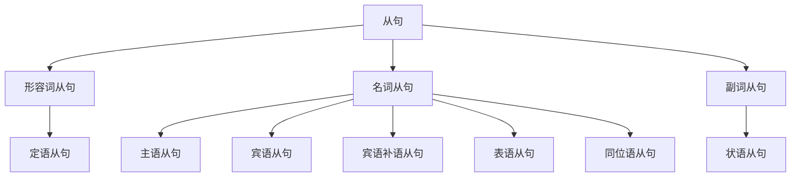

# 语法综述

## 前言

每种语言都有独特的语法体系，它构成了语言的框架，规定了语言的结构和表达方式。

学习语法体系有助于将零散的语法规则有机地整合。

## 引入

所有的句子拆到不能再拆，就是 **简单句**。

简单句是英语句子的基础形式，可以概括为“什么+怎么样”。

这包括句子的两个重要部分：“什么”是 **主语**，“怎么样”是 **谓语**。

谓语通常包含一个核心动词，称为 **谓语动词**。

$$
\underbrace{\text{The cat}}_{\text{主语}}
\underbrace{\overbrace{\text{eats}}^{\text{谓语动词}}\text{ a fish}}_{\text{谓语}}
\text{.}
$$

:::tip

每个简单句 **有且仅有** 一个谓语动词。

:::

## 谓语动词

谓语动词有 $5$ 个基本类别：

1. 不及物动词
2. 单及物动词
3. 双及物动词
4. 复杂及物动词
5. 连系动词

:::tip

1. “及物”的“及”意为“达到、关联、带着”，“及物”指动作需要带有对象，而这个对象就是宾语。
2. “连系动词”也被称为“系动词”。

:::

## 句子

### 句子分类

- 见 [句子分类](句子/句子分类)

英语中有 $3$ 种句子：

1. 简单句（Simple Sentences）：不能再拆分的句子。
2. 复合句（Compound Sentences）：由多个 **并列** 的简单句组成，一般用连词拼接。
3. 复杂句（Complex Sentences）：由 **主句** 和 **从句** 组成，即用一个简单句充当另一个句子的句子成分。

### 简单句

上文的 $5$ 种谓语动词分别对应了简单句的 $5$ 种基本句型：

1. 主语 + **不及物动词**

:::note[示例]

- He **sleeps**.

:::

2. 主语 + **单及物动词** + 宾语

:::note[示例]

- She **bought** a dress.

:::

3. 主语 + **双及物动词** + 间接宾语 + 直接宾语

:::note[示例]

- I **teach** you English.

:::

4. 主语 + **复杂及物动词** + 宾语 + 宾语补语

:::note[示例]

- Emmy **considers** you smart.

:::

5. 主语 + **连系动词** + 主语补语（表语）

:::note[示例]

- He **is** tall.
- The soup **smells** nice.

:::

扩展句型

还有一些扩展句型：

6. there + be + 主语

:::note[示例]

- There **is** a cat.

:::

可理解为第 $5$ 种句型“主语+系动词+表语”的倒装。

7. 主语 + 谓语动词 + 状语

:::note[示例]

- I **live** in China.

:::

可理解为第 $1$ 种句型“主语+谓语动词”的延伸（但这里的状语比较重要）。

8. 主语 + 谓语动词 + 宾语 + 状语

:::note[示例]

- I **put** the apple on the table.

:::

可理解为第 $4$ 种句型“主语+谓语动词+宾语+宾语补语”的延伸。

### 句子成分

句子成分是构成句子的不同部分，每个部分承担特定的语法功能，帮助表达完整的意义。

上文的简单句中已经出现了 $5$ 种句子成分：

1. 主语

- 句子中执行动作或被描述的对象。
- 一般为 **名词**。

2. 谓语动词

- 描述主语的动作或状态。
- 一般为 **动词**。

3. 宾语

- 定义：动作的承受者或被影响的对象。
- 一般为 **名词**。

4. 宾语补语

- 补充说明宾语的性质或状态。
- 一般为 **名词** 或 **形容词**。

5. 主语补语（表语）

- 定义：补充说明主语的性质或状态的词语。
- 作用：使主语的含义更完整。
- 一般为 **名词** 或 **形容词**。

还有另外 $3$ 种句子成分：

6. 定语

- 定义：修饰名词或代词的词语。
- 作用：限定名词或代词的范围或特征。
- 一般为 **形容词**。

7. 状语

- 定义：修饰动词、形容词或副词的词语。
- 作用：说明动作发生的时间、地点、方式、原因等。
- 一般为 **副词**。

8. 同位语

- 定义：紧跟在名词或代词后面，解释说明它的词语。
- 作用：对名词或代词进行补充说明。
- 一般为 **名词**。

### 复合句

由多个 **并列** 的简单句组成，一般用连词拼接。

:::note[示例]

- He likes coffee, **and** she likes tea.
- She wanted to go to the park, **but** it was raining.
- He studied for the test, **yet** he didn’t pass.

:::

### 复杂句

由 **主句** 和 **从句** 组成，即用一个简单句充当另一个句子的句子成分。

:::note[示例]

- I saw **that the cat ate a fish**.

:::

- 见 [从句](句子/从句)

这是一个简单句：

$$
\text{I saw something.}
$$

这也是一个简单句：

$$
\text{The cat eat a fish.}
$$

我们将第二句稍作修改后，替换第一句中的宾语 something：

$$
\text{I saw }
\underbrace{\text{that the cat ate a fish}}_{\text{宾语}}
\text{.}
$$

此时第二句充当第一句的 **宾语**，所以这就是一个 **宾语从句**。

$$
\underbrace{\text{I saw}}_{\text{主句}}
\text{ }
\underbrace{\text{that the cat ate a fish}}_{\text{（宾语）从句}}
\text{.}
$$

:::tip

充当什么句子成分，就是什么从句。

:::

有 $8$ 种句子成分，除了谓语动词无法被替代，其他 $7$ 种分别对应了：

1. 主语从句
2. 宾语从句
3. 宾语补语从句
4. 主语补语从句（表语从句）
5. 定语从句
6. 状语从句
7. 同位语从句

这些从句还可以根据词性分类。

主语从句、宾语从句、宾语补语从句、表语从句、同位语从句有 **名词** 的性质，所以合称为 **名词从句**。

表语从句有 **形容词** 的性质，所以也被称作 **形容词从句**。

同位语从句有 **副词** 的性质，所以也被称作 **副词从句**。

## 词性

### 动词

- 见 [动词分类](动词/动词分类)

表示动作或状态。

:::note[示例]

- He **runs** fast.

:::

:::tip

英语的核心是动词，因此设置一个独立的章节讲解。

:::

### 名词

- 见 [名词](词性/名词)

表示人、事物、地点或概念。

:::note[示例]

- **Dog** barks.

:::

### 冠词

- 见 [冠词](词性/冠词)

限定名词的范围。

:::note[示例]

- **The** cat sleeps.

:::

### 代词

- 见 [代词](词性/代词)

代替名词或名词短语。

:::note[示例]

- **She** is here.

:::

### 形容词

- 见 [形容词](词性/形容词)

修饰名词或代词。

:::note[示例]

- There is a **big** house.

:::

### 数词

- 见 [数词](词性/数词)

表示数目和次序。

:::note[示例]

- I have **two** books.

:::

### 副词

- 见 [副词](词性/副词)

修饰动词、形容词、副词或整个句子。

:::note[示例]

- He runs **quickly**.

:::

### 介词

- 见 [介词](词性/介词)

表示名词与句子中其他词的关系。

:::note[示例]

- She lives **in** London.

:::

### 连词

- 见 [连词](词性/连词)

连接词、短语或句子。

:::note[示例]

- I like tea **and** coffee.

:::

### 叹词

- 见 [叹词](词性/叹词)

表达强烈情感或反应。

:::note[示例]

- **Wow**! That’s amazing.

:::

## 参考资料

- [英语语法 - 维基百科](https://zh.wikipedia.org/wiki/英語文法)
- [一个视频说清整个英语语法体系(重塑你的语法认知框架) - 英语兔 - bilibili](https://www.bilibili.com/video/BV1r54y1m7gd)
