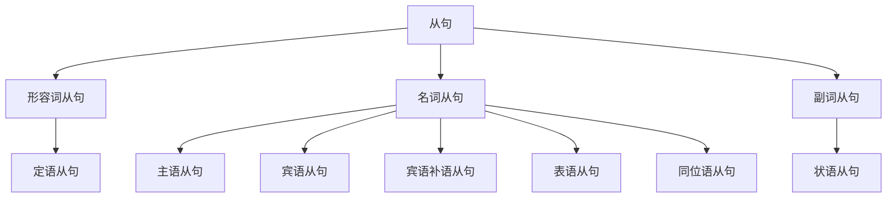

# 语法综述

## 前言

每种语言都有独特的语法体系，它构成了语言的框架，规定了语言的结构和表达方式。

学习语法体系有助于将零散的语法规则有机地整合。

## 句子

### 句子分类

- 见 [句子分类](句子/句子分类)

英语有 $3$ 种句子：

1. 简单句（Simple Sentences）：不能再拆
2. 复合句（Compound Sentences）：不分主次
3. 复杂句（Complex Sentences）：主句+从句

### 引入

英语句子的基础形式是 **简单句**，可以概括为“什么+怎么样”。

这包括句子的两个重要部分：“什么”是 **主语**，“怎么样”是 **谓语**。

谓语通常包含一个核心动词，称为 **谓语动词**。

每个简单句 **有且仅有一个** 谓语动词。

$$
\underbrace{\text{The cat}}_{\text{主语}}
\underbrace{\overbrace{\text{eats}}^{\text{谓语动词}}\text{ a fish}}_{\text{谓语}}
\text{.}
$$

谓语动词有 $5$ 个基本类别：

1. 不及物动词
2. 单及物动词
3. 双及物动词
4. 复杂及物动词
5. 连系动词

### 简单句

这 $5$ 种谓语动词分别对应了简单句的 $5$ 种基本句型：

1. 主语 + **不及物动词**

- He **sleeps**.

2. 主语 + **单及物动词** + 宾语

- She **bought** a dress.

3. 主语 + **双及物动词** + 间接宾语 + 直接宾语

- I **teach** you English.

4. 主语 + **复杂及物动词** + 宾语 + 宾语补语

- Emmy **considers** you smart.
- She **gave** me a gift.

5. 主语 + **连系动词** + 主语补语（表语）

- He **is** tall.
- The soup **smiles** nice.

其他句型

还有一种“八大句型”的分类：

6. there + be + 主语

- There is a cat.

可理解为第 $5$ 种句型“主语+系动词+表语”的倒装。

7. 主语 + 谓语动词 + 状语

- I live in China.

可理解为第 $1$ 种句型“主语+谓语动词”的延伸（但这里的状语很重要）。

8. 主语 + 谓语动词 + 宾语 + 状语

- I put the banana on the table.

可理解为第 $4$ 种句型“主语+谓语动词+宾语+宾语补语”的延伸。

### 复合句

不分主次，多个简单句的叠加，一般用 **连词** 拼接。

- He likes coffee, **and** she likes tea.
- She wanted to go to the park, **but** it was raining.
- He studied for the test, **yet** he didn’t pass.

### 句子成分

句子成分是构成句子的不同部分，每个部分承担特定的语法功能，帮助表达完整的意义。

简单句的 $5$ 种基本句型里已经包含了 $5$ 种句子成分：

1. 主语

- 定义：句子中执行动作或被描述的对象。
- 作用：表明句子是关于谁或什么的。

2. 谓语动词

- 定义：句子中表示动作或状态的动词。
- 作用：说明主语做了什么或是什么状态。

3. 宾语

- 定义：动作的承受者或被影响的对象。
- 作用：表明动作的对象是谁或什么。

4. 宾语补语

- 定义：补充说明宾语的性质或状态的词语。
- 作用：使宾语的含义更完整。

5. 主语补语（表语）

- 定义：补充说明主语的性质或状态的词语。
- 作用：使主语的含义更完整。

还有另外 $3$ 种句子成分：

6. 定语

- 定义：修饰名词或代词的词语。
- 作用：限定名词或代词的范围或特征。

7. 状语

- 定义：修饰动词、形容词或副词的词语。
- 作用：说明动作发生的时间、地点、方式、原因等。

8. 同位语

- 定义：紧跟在名词或代词后面，解释说明它的词语。
- 作用：对名词或代词进行补充说明。

### 复杂句

主句+从句，用一个简单句充当另一个句子的句子成分。

- 见 [从句](句子/从句)

这是一个简单句：

$$
\text{I saw something.}
$$

这也是一个简单句：

$$
\text{The cat eat a fish.}
$$

我们可以将第一句的宾语 something 替换为第二句：

$$
\text{I saw }
\underbrace{\text{that the cat ate a fish}}_{\text{宾语}}
\text{.}
$$

此时第二句充当第一句的 **宾语**，这就是一个 **宾语从句**。

$$
\underbrace{\text{I saw }}_{\text{主句}}
\underbrace{\text{that the cat ate a fish}}_{\text{（宾语）从句}}
\text{.}
$$

充当什么句子成分，就是什么从句。

有 $8$ 种句子成分，除了谓语动词无法被替代，其他 $7$ 种分别对应了：

1. 主语从句
2. 宾语从句
3. 宾语补语从句
4. 主语补语从句（表语从句）
5. 定语从句
6. 状语从句
7. 同位语从句

这些从句还可以根据词性分类。

主语从句、宾语从句、宾语补语从句、表语从句、同位语从句有 **名词** 的性质，所以合称为 **名词从句**。

表语从句有 **形容词** 的性质，所以也被称作 **形容词从句**。

同位语从句有 **副词** 的性质，所以也被称作 **副词从句**。

## 词性

### 动词

- 表动作

### 名词

- 见 [名词](词性/名词)
- 表人或事物

### 冠词

- 见 [冠词](词性/冠词)
- 说明人或事物

### 代词

- 见 [代词](词性/代词)
- 代替人或事物

### 形容词

- 见 [形容词](词性/形容词)
- 形容人或事物

### 数词

- 见 [数词](词性/数词)
- 表示数目和次序

### 副词

- 见 [副词](词性/副词)
- 修饰动作或形容词

### 介词

- 见 [介词](词性/介词)
- 表示和其他词关系

### 连词

- 见 [连词](词性/连词)
- 连接词和句

### 叹词

- 见 [叹词](词性/叹词)
- 表感叹

## 动词

- 见 [动词分类](动词/动词分类)

英语的核心是动词。

## 参考资料

- [英语语法 - 维基百科](https://zh.wikipedia.org/wiki/英語文法)
- [一个视频说清整个英语语法体系(重塑你的语法认知框架) - 英语兔 - bilibili](https://www.bilibili.com/video/BV1r54y1m7gd)
