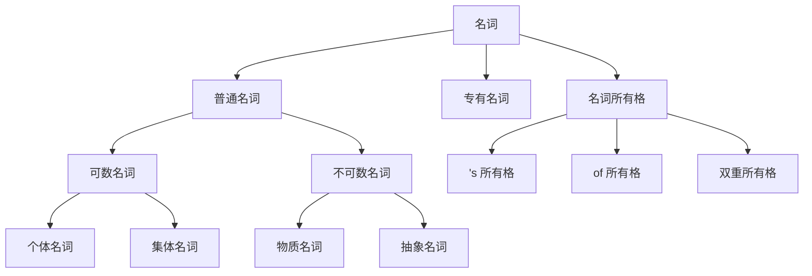

# 名词

## 普通名词

普通名词（Common Noun）是表示某类人、事物、地点或抽象概念的通用名称。

### 可数名词

可数名词（Countable Noun）是指能够用数词计算的具体事物。

#### 个体名词

表示单个可以被数的实体。

:::note[示例]

- boy、carrot、rabbit

:::

- 可数名词有单复数形式  
- 复数一般在词尾加 **-s**，如 `carrot → carrots`，`rabbit → rabbits`  
- 特例变化：
  - `box → boxes`
  - `man → men`
  - `child → children`

:::tip

名词本身可体现单复数信息，这是字母语言的一大优势。

:::

#### 集体名词

表示一组个体组成的整体，根据语境可视为单数或复数。

:::note[示例]

- family、team、audience、fruit

:::

- **单数用法**：The team is large.
- **复数用法**：The team are working together.
- 有的集合名词只作复数：police、people  
- 有的集合名词只作单数：furniture、baggage

### 不可数名词

不可数名词（Uncountable Noun）是无法用数词直接计算的名词，通常无复数形式。

#### 物质名词

表示无法分离为个体的物质或材料。

:::note[示例]

- water、milk、bread、air、beer、wood、paper

:::

- 通常不说 `two waters`，而说 `two glasses of water`
- 若 water 表示“水域”时可数，如：**international waters**

#### 抽象名词

表示看不见、摸不着的抽象概念。

:::note[示例]

- power、peace、honesty、pleasure

:::

:::tip

有时抽象名词也可数，例如：

- Thank you → It's a pleasure.

此时 pleasure 表示“一件愉快的事”，即具体化。

:::

## 专有名词

专有名词（Proper Noun）用于表示某个特定的人、地点、机构、时间等，通常**首字母大写**，一般**不可数**。

:::note[示例]

- 人名：Jack、Harry Potter、Michael
- 地名：Earth、Asia、China、London
- 机构名：United Nations、Bank of China
- 时间名：Monday、August、New Year

:::

:::tip

专有名词在某些语境下可以变为可数：

- There's a Michael downstairs.（泛指众多 Michael 中的一个）
- There are three Michaels in my class.

:::

## 名词所有格

### 's 所有格（Saxon Genitive）

用于表示所属关系，常用于有生命的事物，也可用于无生命名词表达性质。

:::note[示例]

- The rabbit's carrot（兔子的胡萝卜）
- Michael's computer（Michael 的电脑）
- Tom and Jerry's room（Tom 和 Jerry 共有的房间）
- Today's news（今天的新闻）

:::

:::tip

- 并列名词共有物：在最后一个名词后加 `'s`
- 各自拥有物：各个名词分别加 `'s`，名词变复数

:::

### of 所有格（Prepositional Genitive）

用于表示关系或特征，结构为：`A of B`，其中 B 修饰 A。

:::note[示例]

- The brightness of the moon（月亮的亮度）
- A friend of Michael（Michael 的一个朋友）
- A photo of Michael（Michael 出现在里面的照片）

:::

:::tip

- `A photo of Michael's` → Michael 拍的照片  
- `A photo of Michael` → Michael 出现在照片中  
- `A friend of Michael's` = one of Michael's friends

:::

### 双重所有格（Double Genitive）

结构为 `a[n] + 名词 + of + 所有格`，用于表达某人所属的一类事物中的一个。

:::note[示例]

- I am a friend of Michael's.
- That is a photo of Alice's.

:::

## 思维导图

