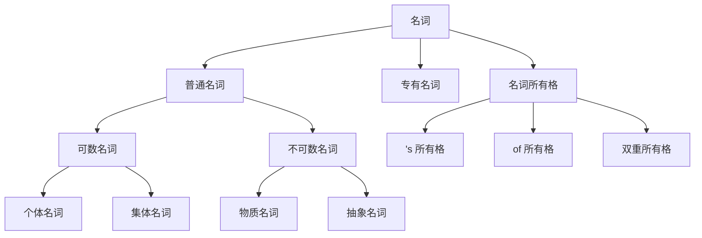

# 名词

## 普通名词

### 可数名词

#### 个体名词

:::note[示例]

- boy、carrot

:::

#### 集体名词

:::note[示例]

- family、team、audience、fruit

:::

### 不可数名词

#### 物质名词

:::note[示例]

- water、milk、bread、air、beer、wood、paper

:::

#### 抽象名词

:::note[示例]

- power、peace、honesty

:::

## 专有名词

首字母大写

:::note[示例]

- Earth、Asia、China、New Year、Jack、Harry Potter、Hangzhou、London、United Nations、Bank of China

:::

## 名词所有格

### 's 所有格

### of 所有格

### 双重所有格

## 思维导图

