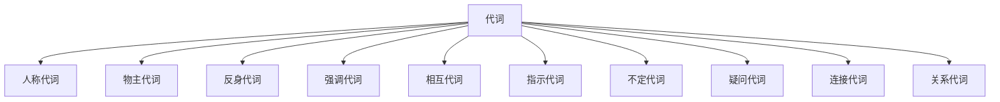

# 代词

## 人称代词 & 物主代词 & 反身代词

### 表格

<table className="center-table">
  <thead>
    <tr>
      <th rowSpan="2" colSpan="2">人称 / 类别</th>
      <th colSpan="2">人称代词</th>
      <th colSpan="2">物主代词</th>
      <th rowSpan="2">反身代词</th>
    </tr>
    <tr>
      <th>主格</th>
      <th>宾格</th>
      <th>形容词性</th>
      <th>名词性</th>
    </tr>
  </thead>
  <tbody>
    <tr>
      <td rowSpan="2">第一人称</td>
      <td>单数</td>
      <td>I</td>
      <td>me</td>
      <td>my</td>
      <td>mine</td>
      <td>myself</td>
    </tr>
    <tr>
      <td>复数</td>
      <td>we</td>
      <td>us</td>
      <td>our</td>
      <td>ours</td>
      <td>ourselves</td>
    </tr>
    <tr>
      <td rowSpan="2">第二人称</td>
      <td>单数</td>
      <td>you</td>
      <td>you</td>
      <td>your</td>
      <td>yours</td>
      <td>yourself</td>
    </tr>
    <tr>
      <td>复数</td>
      <td>you</td>
      <td>you</td>
      <td>your</td>
      <td>yours</td>
      <td>yourselves</td>
    </tr>
    <tr>
      <td rowSpan="3">第三人称</td>
      <td rowSpan="3">单数</td>
      <td>he</td>
      <td>him</td>
      <td>his</td>
      <td>his</td>
      <td>himself</td>
    </tr>
    <tr>
      <td>she</td>
      <td>her</td>
      <td>her</td>
      <td>hers</td>
      <td>herself</td>
    </tr>
    <tr>
      <td>it</td>
      <td>it</td>
      <td>its</td>
      <td>its</td>
      <td>itself</td>
    </tr>
    <tr>
      <td>第三人称</td>
      <td>复数</td>
      <td>they</td>
      <td>them</td>
      <td>their</td>
      <td>theirs</td>
      <td>themselves</td>
    </tr>
  </tbody>
</table>

### 人称代词

1. 规则：主格——动词前面；宾格——动词、介词后面。
2. 顺序：第二人称、第一人称、第三人称；男在前面、女在后面。（承认错误、担当责任，第一人称在前面）

### 物主代词

1. 规则：形物代——加名词；名物代——不加动词。
2. 形物代 + 名词 = 名物代。

### 反身代词

## 思维导图

