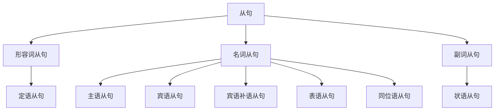

# 从句

这是一个简单句：

$$
\text{I saw something.}
$$

这也是一个简单句：

$$
\text{The cat eat a fish.}
$$

我们可以将第一句的宾语 something 替换为第二句：

$$
\text{I saw }
\underbrace{\text{that the cat ate a fish}}_{\text{宾语}}
\text{.}
$$

此时第二句充当第一句的 **宾语**，这就是一个 **宾语从句**。

$$
\underbrace{\text{I saw }}_{\text{主句}}
\underbrace{\text{that the cat ate a fish}}_{\text{（宾语）从句}}
\text{.}
$$

充当什么句子成分，就是什么从句。

有 $8$ 种句子成分，除了谓语动词无法被替代，其他 $7$ 种分别对应了：

1. 主语从句
2. 宾语从句
3. 宾语补语从句
4. 主语补语从句（表语从句）
5. 定语从句
6. 状语从句
7. 同位语从句

这些从句还可以根据词性分类。

主语从句、宾语从句、宾语补语从句、表语从句、同位语从句有 **名词** 的性质，所以合称为 **名词从句**。

表语从句有 **形容词** 的性质，所以也被称作 **形容词从句**。

同位语从句有 **副词** 的性质，所以也被称作 **副词从句**。

