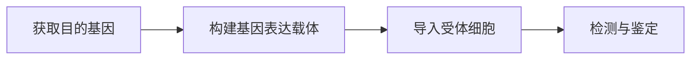
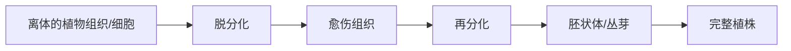
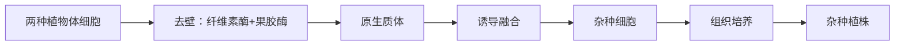
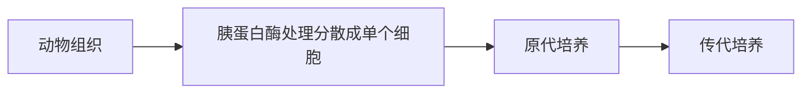
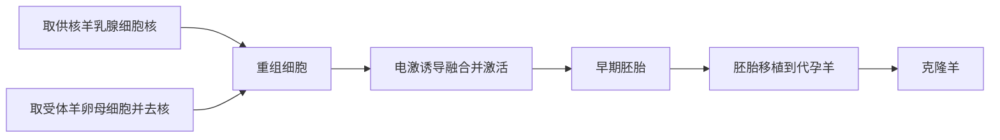
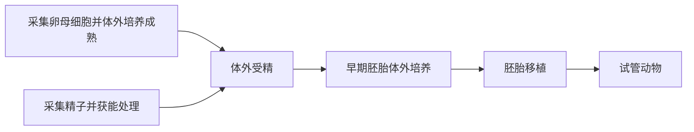

## 第一章 发酵工程

### 传统发酵技术

#### 发酵与微生物

- **发酵**（Fermentation）：微生物在无氧或有氧条件下，利用自身的酶把有机物分解或转化，积累代谢产物的过程；
- 传统发酵靠天然存在的多种微生物混合发酵，多为家庭作坊式的开放操作；
- 常见微生物：**酵母菌**（真菌，兼性厌氧）、**醋酸菌**（细菌，需氧）、**乳酸菌**（细菌，厌氧）、**毛霉**（真菌）。

#### 果酒的制作

- 菌种：**酵母菌**；原理：无氧条件下把葡萄糖分解为酒精和二氧化碳；
- 反应式：

$$\text{C}_6\text{H}_{12}\text{O}_6\to 2\text{C}_2\text{H}_5\text{OH}+2\text{CO}_2+\text{能量}$$

- 温度：$18\ ^\circ\text{C}\sim 30\ ^\circ\text{C}$，一般控制在 $18\ ^\circ\text{C}\sim 25\ ^\circ\text{C}$；
- 关键操作：
  1. 冲洗葡萄要在 **去除枝梗之前**，先冲洗后去梗，避免杂菌与农药随伤口进入；
  2. 榨汁后装入发酵瓶，装至容积 $2/3$ 处，留出空间供微生物繁殖和气体积累；
  3. 发酵瓶要 **密封**，营造无氧环境；每隔一段时间拧松瓶盖 **排气**（$\text{CO}_2$），排气时不能开盖太久；
- 酵母菌代谢特点：先进行 **需氧呼吸大量繁殖**，待氧气耗尽后再无氧发酵产生酒精，故前期不必严格无氧。

#### 果醋的制作

- 菌种：**醋酸菌**（需氧型细菌）；原理：氧气充足时，把乙醇氧化为乙酸；
- 反应式：

$$\text{C}_2\text{H}_5\text{OH}+\text{O}_2\to\text{CH}_3\text{COOH}+\text{H}_2\text{O}$$

- 当缺少糖源时，醋酸菌可先将乙醇变为乙醛再变为乙酸；氧气、糖源都充足时，还能将糖直接转化为乙酸；
- 温度：$30\ ^\circ\text{C}\sim 35\ ^\circ\text{C}$（高于果酒），需 **持续通入无菌空气**。

果酒与果醋的比较：

|          |                    果酒                     |                    果醋                     |
| :------: | :-----------------------------------------: | :-----------------------------------------: |
|   菌种   |                   酵母菌                    |                   醋酸菌                    |
| 菌种类型 |              真菌（兼性厌氧）               |                细菌（需氧）                 |
|   条件   |                    无氧                     |                    需氧                     |
|   温度   | $18\ ^\circ\text{C}\sim 25\ ^\circ\text{C}$ | $30\ ^\circ\text{C}\sim 35\ ^\circ\text{C}$ |
|   产物   |               酒精、二氧化碳                |                    乙酸                     |

先制果酒、后制果醋时，只需将发酵温度升高、通入氧气，即可由酵母菌发酵转为醋酸菌发酵。

#### 腐乳的制作

- 主要菌种：**毛霉**（丝状真菌），此外还有酵母、曲霉等；
- 原理：毛霉等产生的 **蛋白酶** 把豆腐中的蛋白质分解为小分子的肽和氨基酸，**脂肪酶** 把脂肪水解为甘油和脂肪酸，形成独特的风味；
- 制作流程：

- 加盐：既能析出豆腐中的水分使其变硬，又能 **抑制杂菌生长**，防止豆腐腐败；越接近瓶口越要多加盐；
- 卤汤中的 **酒** 能抑制杂菌、赋予香味，含量一般控制在 $12\%$ 左右：酒精浓度过低易腐败，过高则腐乳成熟过慢。

#### 泡菜的制作

- 主要菌种：**乳酸菌**（厌氧型细菌）；原理：无氧条件下把葡萄糖分解为乳酸；
- 反应式：

$$\text{C}_6\text{H}_{12}\text{O}_6\to 2\text{C}_3\text{H}_6\text{O}_3+\text{能量}$$

- 关键操作：泡菜坛要 **装满、压实、密封**，坛沿加水封口，隔绝空气、防止杂菌污染；
- **亚硝酸盐问题**：腌制过程中硝酸盐被杂菌还原为 **亚硝酸盐**，含量随腌制时间先升高后降低；一般在腌制 $10$ 天左右含量最高，此后逐渐下降；
- 亚硝酸盐检测：在盐酸酸化条件下，亚硝酸盐与 **对氨基苯磺酸** 发生重氮化反应，再与 **$N$-1-萘基乙二胺** 结合生成 **紫红色** 染料，与标准显色液比色即可估测含量。

### 微生物的培养技术及应用

#### 培养基

- **培养基**（Culture Medium）：人们按微生物对营养物质的需要，配制的供其生长繁殖的营养基质；
- 营养要素：**碳源、氮源、水、无机盐、特殊营养物质**，还要满足对 pH、渗透压、氧气的需求；
- 按物理状态分类：

|    类型    |          特点          |            用途            |
| :--------: | :--------------------: | :------------------------: |
| 液体培养基 |       不加凝固剂       |     扩大培养、工业生产     |
| 固体培养基 | 加入 **琼脂** 作凝固剂 | 分离、鉴定、计数、菌种保存 |

- **琼脂** 是从红藻中提取的多糖，绝大多数微生物不能分解，是理想的凝固剂；
- 选择培养基与鉴别培养基：
  - **选择培养基**：加入某种物质，允许特定微生物生长、抑制其他微生物（如加入青霉素筛选抗性菌，无氮培养基筛选固氮菌）；
  - **鉴别培养基**：加入某种指示剂，使目的菌落呈现特定颜色以区分（如伊红美蓝培养基鉴别大肠杆菌，菌落呈深紫色并有金属光泽）。

#### 无菌技术

- 目的：获得 **纯培养**，防止外来杂菌污染，也保护操作者与环境；
- 核心是 **消毒** 与 **灭菌**：

|          |            消毒            |                 灭菌                 |
| :------: | :------------------------: | :----------------------------------: |
|   程度   | 杀灭部分微生物（不含芽孢） | 杀灭 **全部** 微生物（含芽孢、孢子） |
| 常用方法 |  煮沸、巴氏消毒、化学药剂  |       灼烧、干热、**高压蒸汽**       |
|   对象   |    皮肤、空气、操作台面    |        培养基、接种工具、器皿        |

- 常用灭菌方法：
  - **灼烧灭菌**：接种环、接种针等金属工具直接在火焰上灼烧；
  - **干热灭菌**：玻璃器皿、金属用具，$160\ ^\circ\text{C}\sim 170\ ^\circ\text{C}$ 加热 $1\sim 2$ 小时；
  - **高压蒸汽灭菌**：培养基、蒸馏水等，在 $100\ \text{kPa}$、$121\ ^\circ\text{C}$ 下维持 $15\sim 30$ 分钟；
- **巴氏消毒法**：$70\ ^\circ\text{C}\sim 75\ ^\circ\text{C}$ 煮 $30$ 分钟，或 $80\ ^\circ\text{C}\sim 90\ ^\circ\text{C}$ 煮 $30\sim 60$ 秒，既杀菌又保留营养和风味，用于牛奶、果酒等。

#### 微生物的纯培养

- **纯培养**：从只含一种微生物的群体中，或从混杂群体中分离出 **单一菌株** 并培养；
- **接种** 是纯培养的关键，常用两种方法：

**平板划线法**

- 原理：通过接种环在 **固体培养基** 表面连续划线稀释，逐渐把聚集的菌种分散为单个细胞；
- 划线要点：每次划线前后都要 **灼烧接种环** 并冷却；后一区的划线要从前一区的末端开始，且各区互不交叉；最后可获得由单个细胞繁殖成的 **单个菌落**。

**稀释涂布平板法**

- 原理：将菌液 **梯度稀释** 后，取少量涂布到固体培养基表面，使单个细胞均匀分散；
- 优点：菌落分散均匀，便于 **计数** 和挑取单菌落。

#### 微生物的计数与保存

- **稀释涂布平板法计数**：统计培养后平板上的菌落数，反推原菌液中的活菌数目；
  - 为使结果准确，一般选择菌落数在 $30\sim 300$ 之间的平板计数；
  - 每个稀释度至少涂布 $3$ 个平板，取平均值；
  - **该法测得的数目往往偏小**：两个或多个细胞连在一起时只形成一个菌落；
- 计算公式（设稀释倍数为 $n$，涂布体积为 $V\ \text{mL}$，平均菌落数为 $C$）：

$$\text{每毫升活菌数}=\frac{C\times n}{V}$$

- **显微镜直接计数法**：用血细胞计数板在显微镜下直接数，测得的是 **活菌与死菌的总数**；
- 菌种保存：
  - **临时或短期保存**：接种到 **固体斜面培养基** 上，$4\ ^\circ\text{C}$ 冰箱冷藏，需定期转接；
  - **长期保存**：在 $-20\ ^\circ\text{C}$ 以下，向培养液中加入 **甘油** 并冷冻保存。

### 发酵工程及其应用

#### 发酵工程

- **发酵工程**（Fermentation Engineering）：采用现代工程技术手段，利用微生物的某些特定功能，为人类生产有用产品，或直接把微生物应用于工业生产的技术；
- 与传统发酵相比，发酵工程是 **大规模、机械化、自动化** 的纯种发酵，可精确控制条件；
- 一般流程：

- 核心设备是 **发酵罐**，发酵过程中要严格控制温度、pH、溶氧、通气量、搅拌速度等，并 **及时检测** 培养液中的微生物数目、产物浓度等指标；
- 发酵的产物包括：
  - 微生物 **细胞本身**（如单细胞蛋白、食用菌）；
  - 微生物的 **代谢产物**（如抗生素、氨基酸、有机酸、酶、维生素等）。

#### 发酵工程的应用

- **食品工业**：生产酒类、食醋、酱油、乳制品，以及 **单细胞蛋白**（微生物菌体本身作食品或饲料）；
- **医药工业**：生产抗生素、维生素、氨基酸，以及利用基因工程菌生产 **胰岛素、干扰素、疫苗** 等；
- **农牧业**：生产微生物肥料、微生物农药、饲料添加剂；
- **环境保护**：处理污水与有机废弃物。

## 第二章 基因工程

### 基因工程的原理

#### 基因工程的概念

- **基因工程**（Genetic Engineering，又称基因拼接技术、DNA 重组技术）：按人们的意愿，把一种生物的某种基因提取出来，加以修饰改造，转移到另一种生物细胞内定向改造其遗传性状的技术；
- 操作水平：**DNA（基因）水平**；原理：**基因重组**；
- 特点：可以打破物种界限，实现 **定向** 改造，使不同种生物的基因重新组合；
- 结果：产生转基因生物或表达出人类需要的产物。

#### 基因工程的工具

基因工程需要三种基本工具：**限制酶**（分子手术刀）、**DNA 连接酶**（分子缝合针）、**载体**（分子运输车）。

**限制酶（限制性核酸内切酶）**

- 来源：主要从 **原核生物**（细菌）中分离，是其抵御外来 DNA 的防御机制；
- 功能：识别双链 DNA 上 **特定的核苷酸序列**，并在特定位点切开磷酸二酯键；
- **专一性**：一种限制酶只识别一种特定序列，识别序列通常为 $6$ 个碱基且呈 **回文结构**；
- 切割结果分两类：

|          |               黏性末端               |            平末端            |
| :------: | :----------------------------------: | :--------------------------: |
| 切割位置 | 在识别序列内 **错位** 切开磷酸二酯键 | 在识别序列中央 **平齐** 切开 |
|   末端   |       露出几个未配对的单链碱基       |          无单链突出          |
|   连接   |        末端互补，容易配对连接        |     不能互补，连接较困难     |

例如 $\text{EcoR I}$ 识别 $\text{GAATTC}$，在 $\text{G}$ 与 $\text{A}$ 之间切开，产生带 $\text{AATT}$ 突出的黏性末端。

**DNA 连接酶**

- 功能：把两段 DNA 之间的缺口 **连接** 起来，即催化形成 **磷酸二酯键**；
- 常用两种：
  - **$\text{E.coli}$ DNA 连接酶**：只能连接 **黏性末端**；
  - **$\text{T}_4$ DNA 连接酶**：黏性末端和平末端都能连接，但连接平末端的效率较低；
- 注意与 DNA 聚合酶区分：DNA 连接酶连接的是两个 DNA 片段（缝合缺口），DNA 聚合酶是在模板上延伸子链。

**载体**

- 作用：把目的基因 **运送** 到受体细胞中，并使其在受体细胞中稳定存在、复制或表达；
- 最常用的载体是 **质粒**——细菌细胞内一种独立于拟核 DNA 的小型环状 DNA；此外还有噬菌体、动植物病毒等；
- 一个理想的载体应具备：
  - 能在受体细胞中 **自我复制**，或整合到受体染色体上随之复制；
  - 有一个至多个 **限制酶切点**，供目的基因插入；
  - 有 **标记基因**（如抗生素抗性基因），便于筛选含重组 DNA 的受体细胞；
  - 对受体细胞无害。

### 基因工程的操作步骤

基因工程的操作一般包括四个步骤：**获取目的基因、构建基因表达载体、导入受体细胞、检测与鉴定**。其中构建基因表达载体是 **核心**。

#### 第一步：获取目的基因

- **目的基因**：编码人们所需蛋白质（或性状）的基因；
- 获取途径：
  - **从基因文库中获取**：把生物全部 DNA 切成片段、分别导入受体菌保存，构成基因组文库或 cDNA 文库；
  - **利用 PCR 扩增**：已知目的基因序列时，用 PCR 大量复制；
  - **人工化学合成**：目的基因较小、序列已知时直接合成。

#### 第二步：构建基因表达载体

- 目的：使目的基因能在受体细胞中 **稳定存在并表达**，是基因工程的核心；
- 组成：**目的基因 + 启动子 + 终止子 + 标记基因**；
  - **启动子**：RNA 聚合酶识别和结合的部位，驱动基因转录，是转录能否开始的关键；
  - **终止子**：使转录在此终止；
  - **标记基因**：用于筛选含目的基因的细胞；
- 构建过程：用 **同一种限制酶** 分别切割目的基因和载体，使二者产生 **相同的黏性末端**，再用 DNA 连接酶连接成 **重组 DNA**。

#### 第三步：将目的基因导入受体细胞

- 原理：**转化**——受体细胞吸收外源 DNA 并使其性状发生改变；
- 不同受体的常用方法：

|   受体   |                  常用导入方法                  |
| :------: | :--------------------------------------------: |
| 植物细胞 |    **农杆菌转化法**、基因枪法、花粉管通道法    |
| 动物细胞 |          **显微注射法**（常用受精卵）          |
|  微生物  | 用 $\text{Ca}^{2+}$ 处理使细菌成为感受态后转化 |

- 农杆菌转化法：农杆菌的 $\text{Ti}$ 质粒上有一段 $\text{T-DNA}$ 可转移并整合到植物染色体上，把目的基因插入 $\text{T-DNA}$ 即可随之转移。

#### 第四步：目的基因的检测与鉴定

- **分子水平检测**：
  - 检测目的基因是否插入：用 **DNA 分子杂交**（DNA–DNA），看是否含目的基因；
  - 检测是否转录出 mRNA：用 **分子杂交**（DNA–RNA）；
  - 检测是否翻译出蛋白质：用 **抗原–抗体杂交**；
- **个体水平鉴定**：进行相关性状的鉴定（如转抗虫基因的棉花要做抗虫接种实验）。

### PCR 技术

- **PCR**（Polymerase Chain Reaction，聚合酶链式反应）：在体外 **大量扩增** 特定 DNA 片段的技术；
- 原理：以 DNA 半保留复制为基础，在体外重复「变性—复性—延伸」的循环；
- 必需条件：**模板 DNA、两种引物、四种脱氧核苷酸、耐高温的 DNA 聚合酶（$\text{Taq}$ 酶）、缓冲液**；
- **引物**（Primer）：一小段与模板互补的单链 DNA 或 RNA，DNA 聚合酶只能从引物的 $3'$ 端开始延伸，故 PCR 必须有引物；
- 一个循环的三个步骤：

|   步骤   |                    温度                     |            过程            |
| :------: | :-----------------------------------------: | :------------------------: |
| **变性** | $90\ ^\circ\text{C}\sim 95\ ^\circ\text{C}$ |  高温使双链解开为单链模板  |
| **复性** | $55\ ^\circ\text{C}\sim 60\ ^\circ\text{C}$ |  降温使引物与模板互补配对  |
| **延伸** |            $72\ ^\circ\text{C}$             | 聚合酶以脱氧核苷酸延伸子链 |

- 扩增倍数：每循环一次 DNA 数目加倍，$n$ 个循环后由 $1$ 个模板变为 $2^n$ 个；
- 因反复经历 $90\ ^\circ\text{C}$ 以上高温，必须使用从 **嗜热菌** 中提取的 **耐高温 DNA 聚合酶**，普通酶会失活。

### 基因工程的应用与安全性

#### 基因工程的应用

- **农业**：培育抗虫、抗病、抗逆、高产、优质的转基因作物（如抗虫棉、耐贮存番茄）；
- **医药**：生产 **基因工程药物**（如利用大肠杆菌生产人胰岛素、干扰素）和 **基因工程疫苗**；
- **环保**：培育能降解污染物的 **超级细菌** 处理污染；
- **基础研究**：作为研究基因结构与功能的工具。

#### 转基因生物的安全性

- 争论集中在 **食物安全、生物安全、环境安全** 三方面；
- 支持方：转基因技术是常规育种的延伸，经过严格检验的产品是安全的；
- 谨慎方：可能出现新的过敏原或毒性物质，外源基因可能通过花粉等 **扩散** 到近缘物种，影响生物多样性；
- 我国态度：**不反对、不禁止，但要** 加强监管、规范管理、科学评估、严格审批。

## 第三章 细胞工程

### 植物细胞工程

#### 理论基础

- **细胞工程**（Cell Engineering）：以细胞为基本单位，在细胞水平或细胞器水平上，按人们的意愿改变细胞内遗传物质或获得细胞产品的技术；
- 植物细胞工程的理论基础是 **细胞的全能性**——已分化的植物细胞仍具有发育成完整植株的潜能。

#### 植物组织培养

- **原理**：细胞的全能性；
- 概念：在 **无菌** 和人工控制的条件下，把植物的离体器官、组织或细胞培养在含有营养物质和植物激素的培养基上，诱导其发育成完整植株；
- 流程：

- 两个关键过程：
  - **脱分化**：使已分化的细胞恢复分裂能力，形成排列疏松、无规则的 **愈伤组织**；
  - **再分化**：诱导愈伤组织分化出根、芽等器官，进而形成完整植株；
- 植物激素中，**生长素与细胞分裂素的比例** 决定分化方向：比例适中利于愈伤组织；比值高利于生根，比值低利于长芽；
- 应用：**微型繁殖**（快速大量无性繁殖优良品种）、**制备人工种子**（把胚状体包裹在胶囊中）、生产脱毒苗、生产次生代谢产物。

#### 植物体细胞杂交

- **概念**：把不同种植物的 **体细胞** 融合成杂种细胞，再培育成新植株的技术；
- **意义**：**克服远缘杂交不亲和的障碍**，实现不同种间的遗传物质结合；
- 流程：

- 去壁：用 **纤维素酶和果胶酶** 去除细胞壁，得到有活力的 **原生质体**；
- 诱导融合的方法：**物理法**（离心、振动、电激）和 **化学法**（聚乙二醇 PEG）；
- 融合完成的标志：**新的细胞壁** 再生；
- 关键：诱导原生质体融合，融合依据的是 **细胞膜的流动性**。

### 动物细胞工程

#### 动物细胞培养

- **原理**：细胞增殖；
- 概念：从动物体内取出相关的组织，将其分散成 **单个细胞**，在体外条件下让细胞增殖的技术；
- 流程：

- 用 **胰蛋白酶（或胶原蛋白酶）** 把组织处理成分散的单个细胞制成细胞悬液；
- 培养条件：无菌、无毒的环境，营养（合成培养基常需加入 **血清、血浆** 等天然成分），适宜的温度和 pH，气体环境（$\text{O}_2$ 保证呼吸，$\text{CO}_2$ 维持 pH）；
- 细胞特性：
  - **贴壁生长**：多数细胞要附着在瓶壁上才能增殖；
  - **接触抑制**：细胞长成单层、相互接触后停止分裂；
  - **细胞株与细胞系**：原代培养的细胞传至 $10\sim 50$ 代后能维持二倍体核型的为 **细胞株**；发生 **基因突变**、成为能无限增殖的为 **细胞系**。

#### 动物体细胞核移植与克隆

- **动物体细胞核移植**：把动物 **体细胞的细胞核** 移入 **去核的卵母细胞** 中，使其发育成新个体的技术；
- **克隆**：由无性繁殖产生遗传物质相同的个体或细胞群，核移植是动物克隆的核心；
- 用 **卵母细胞** 而非受精卵作受体的原因：卵母细胞体积大、易操作，且其细胞质中含有能促使 **体细胞核全能性表达** 的物质；
- 「多莉」羊流程：

- 「多莉」的性状主要与 **供核** 的母羊相同（细胞核控制性状），少量性状受卵母细胞质中的遗传物质影响；
- 意义：加速家畜遗传改良、保护濒危物种、生产转基因克隆动物。

#### 单克隆抗体

- **单克隆抗体**（Monoclonal Antibody）：由 **单个 B 淋巴细胞** 增殖产生的、化学性质单一、特异性强的抗体；
- 制备原理：把两种细胞的优势结合起来——

|      |   骨髓瘤细胞    |    效应 B 淋巴细胞    |
| :--: | :-------------: | :-------------------: |
| 优势 | 能 **无限增殖** | 能产生 **特异性抗体** |
| 不足 |  不能产生抗体   |     不能无限增殖      |

- **杂交瘤细胞** 同时具备「无限增殖」和「产生特异性抗体」两大特性；
- 制备流程：

- 两次筛选：**第一次** 用特定培养基筛选出 **杂交瘤细胞**（除去未融合和自身融合的细胞）；**第二次** 通过抗体检测筛选出 **能产生所需抗体** 的杂交瘤细胞；
- 诱导融合方法：物理法、化学法，以及动物细胞特有的 **灭活的病毒**（如灭活的仙台病毒）；
- 优点：**特异性强、灵敏度高**，可大量制备；
- 应用：诊断试剂、运载药物的「**生物导弹**」（把抗体与药物结合，精准杀灭癌细胞而不伤害正常细胞）。

### 细胞融合与器官移植

- **细胞融合**：两个或多个细胞融合成一个细胞的过程；诱导方法有物理法、化学法（PEG）、生物法（灭活的病毒）；
- **胚胎干细胞**（Embryonic Stem Cell，ES 细胞）：来自早期胚胎或原始性腺，具有发育的 **全能性或多能性**，可在体外增殖而不分化，是组织工程和再生医学的重要来源；
- **器官移植** 面临的主要问题：**免疫排斥反应** 和 **供体器官短缺**；可通过组织配型、免疫抑制、异种器官（转基因动物提供器官）等途径缓解。

## 第四章 胚胎工程

### 受精与早期胚胎发育

#### 受精

- **受精**：精子和卵子融合形成受精卵的过程，一般在雌性动物的 **输卵管** 内完成；
- 精子获能：刚排出的精子无受精能力，须在雌性生殖道内经历 **获能** 才能受精；
- 防止多精入卵的两道屏障：
  - **透明带反应**：精子入卵后透明带结构改变，阻止其他精子穿过；
  - **卵细胞膜反应**（卵黄膜封闭作用）：卵细胞膜发生变化，阻止后续精子进入；
- 受精完成的标志：出现 **雌、雄两个原核**，或在卵细胞膜与透明带之间可见 **两个极体**。

#### 早期胚胎发育

- 发育顺序：

$$\text{受精卵}\to\text{卵裂}\to\text{桑椹胚}\to\text{囊胚}\to\text{原肠胚}$$

- **卵裂期**：受精卵进行有丝分裂，细胞数目增多但 **胚胎总体积不增大**，每个细胞体积减小，有机物总量减少；
- **囊胚**：出现 **囊胚腔**，细胞分化为 **内细胞团**（将发育为胎儿）和 **滋养层**（将发育为胎膜和胎盘）；
- **原肠胚**：出现 **外胚层、中胚层、内胚层** 三个胚层，各胚层将分化成不同的组织和器官。

### 胚胎工程技术及应用

#### 胚胎移植

- **胚胎移植**：把良种雌性动物体内的早期胚胎，或体外培育的早期胚胎，移植到 **同种、生理状态相同** 的雌性动物体内，使之继续发育的技术；
- 被称为其他胚胎工程技术的「**最后一道工序**」；
- 生理学基础：
  - 供、受体在 **生理上的一致性**——须用 **激素处理使供、受体同期发情**；
  - 受体对外来胚胎基本 **不发生免疫排斥**；
  - 胚胎在受体子宫内有相对独立的发育能力，受体只提供发育的环境和营养，**不改变胚胎的遗传特性**；
- 意义：充分发挥优良母畜的繁殖潜力，是家畜快速繁育和胚胎工程推广的桥梁。

#### 体外受精与试管动物

- **试管动物**：卵母细胞与精子在 **体外** 受精，发育成早期胚胎后移植到母体内产生的后代；
- 流程：

- 卵母细胞要培养到 **减数第二次分裂中期（$\text{MII}$ 中期）** 才具备受精能力；精子须先 **获能**。

#### 胚胎分割

- **胚胎分割**：把一个早期胚胎切割成两份或多份，再分别移植，从而获得同卵双胎或多胎的技术，属于 **动物的无性繁殖**；
- 一般选 **桑椹胚或囊胚** 进行分割；分割囊胚时要将 **内细胞团均等分割**，否则会影响分割后胚胎的恢复和发育；
- 结果：得到遗传物质 **完全相同** 的后代。

#### 胚胎干细胞的应用

- 利用胚胎干细胞可在体外培养获得多种组织、器官，用于 **组织工程与再生医学**；
- 结合转基因和核移植技术，可获得转基因克隆动物或作为 **生物反应器** 生产药用蛋白。

## 第五章 生物技术的安全性与伦理问题

### 转基因生物的安全性

- 转基因技术的安全性争论集中在三方面：

|   方面   |                担忧                |
| :------: | :--------------------------------: |
| 食物安全 |   可能出现新过敏原、抗生素抗性等   |
| 生物安全 |    外源基因扩散、影响物种多样性    |
| 环境安全 | 转基因生物成为「入侵物种」破坏生态 |

- 理性态度：既要看到转基因技术的巨大价值，也要正视潜在风险，通过 **科学评估、规范监管、严格审批** 趋利避害。

### 关注生殖性克隆人

- **治疗性克隆**：利用克隆技术得到胚胎干细胞，进而获得组织、器官用于医疗，**不以生育为目的**——多数国家在严格监管下允许研究；
- **生殖性克隆**：以 **克隆出完整个体** 为目的，即「克隆人」——因严重违背伦理道德、损害人类尊严，为世界各国 **普遍禁止**；
- 我国明确态度：**禁止生殖性克隆人，不反对治疗性克隆**。

### 关注基因诊断与基因治疗

- **基因诊断**：利用 DNA 分子杂交等技术，检测特定基因是否存在、是否异常，从而诊断遗传病或病原体感染；具有 **灵敏、特异、快速** 的特点；
- **基因治疗**：把 **正常的外源基因** 导入患者细胞，以补偿缺陷基因或抑制异常基因，从根本上治疗疾病；
  - 途径分为 **体外途径**（在体外将基因导入受体细胞再输回体内）和 **体内途径**（把基因直接导入患者体内）；
  - 是目前最有希望根治遗传病的方法，但技术尚不成熟，仍面临 **安全性和伦理** 的挑战。
