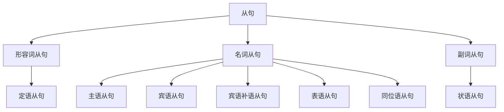

本文为我的英语语法笔记。

## 参考资料

- [英语语法 - 维基百科](https://zh.wikipedia.org/zh-cn/英語文法)
- [一个视频说清整个英语语法体系(重塑你的语法认知框架) - bilibili](https://www.bilibili.com/video/BV1r54y1m7gd)
- [英语语法笔记 | 𝐿𝑖𝑢𝑤𝑒𝑖'𝑠 𝐷𝑜𝑐𝑠](https://docs.liuwei.vin/notes/engilsh/yingyutu/)

## 前言

每种语言都有独特的 <Notation>**语法体系**</Notation>，它构成了语言的骨架，规范了表达方式与结构规则。

系统学习语法，有助于将零散的语法现象有机整合，建立清晰完整的认知框架。

## 引入

所有英语句子拆到不能再拆，就是 **简单句**。

简单句是英语句子的基础形式，可概括为「**什么**」+「**怎么样**」。

这包括句子的两个重要部分：「什么」是 **主语**，「怎么样」是 **谓语**。

## 动词

### 谓语动词

**谓语** 包含一个核心动词，称为 **谓语动词**。

$$
\underbrace{\text{The cat}}_{\text{主语}}
\underbrace{\overbrace{\text{eats}}^{\text{谓语动词}}\text{ a fish}}_{\text{谓语}}
\text{.}
$$

**谓语** 和 **谓语动词** 是有区别的，句子主语后面的余下句子部分都是谓语，而谓语动词只是谓语的一部分。

$$
\text{谓语}\supseteq\text{谓语动词}
$$

每个简单句 **有且仅有** 一个谓语动词。

### 动词分类

详见 [动词分类](grammar/verbs/verb-classification)。

谓语动词有 $5$ 种类别：

1. 不及物动词（Intransitive Verbs）：不需要宾语，描述动作或状态。
2. 单及物动词（Monotransitive Verbs）：需要一个直接宾语。
3. 双及物动词（Ditransitive Verbs）：需要一个直接宾语和一个间接宾语。
4. 复杂及物动词（Complex Transitive Verbs）：需要一个直接宾语和一个补语。
5. 连系动词（Linking Verbs）：连接主语和表语，描述状态或身份。

## 句子

### 句子分类

详见 [句子分类](grammar/sentences/sentence-types)。

英语中，句子有 $3$ 种类别：

1. 简单句（Simple Sentences）：不能再拆分的句子。
2. 复合句（Compound Sentences）：由多个 **并列** 的简单句组成，通常用并列连词连接。
3. 复杂句（Complex Sentences）：由 **主句** 和 **从句** 组成，从句充当主句的某个句子成分。

### 简单句

上文的 $5$ 种谓语动词分别对应了简单句的 $5$ 种基本句型：

1. 主语 + **不及物动词**（S + V）

:::example

- He **sleeps**.

:::

2. 主语 + **单及物动词** + 宾语（S + V + O）

:::example

- She **bought** a dress.

:::

3. 主语 + **双及物动词** + 间接宾语 + 直接宾语（S + V + IO + DO）

:::example

- I **teach** you English.

:::

4. 主语 + **复杂及物动词** + 宾语 + 宾语补语（S + V + O + OC）

:::example

- Emmy **considers** you smart.

:::

5. 主语 + **连系动词** + 主语补语（表语）（S + V + P）

:::example

- He **is** tall.
- The soup **smells** nice.

:::

:::tip

- 平时所谓的“主谓宾”就是第 $2$ 种句型，“主系表”就是第 $5$ 种句型。
- “及物”的“及”意为“达到、关联、带着”，“及物”指动作需要带有对象，而这个对象就是宾语。
- “连系动词”也称为“系动词”，“主语补语”也称为“表语”。

:::

扩展句型

还有一些句型，可以理解为以上 $5$ 种句型的扩展：

6. there + be + 主语（存现句）

:::example

- There **is** a cat.

:::

可理解为第 $5$ 种句型“主语 + 连系动词 + 表语”的倒装。

7. 主语 + 谓语动词 + 状语

:::example

- I **live** in China.

:::

可理解为第 $1$ 种句型“主语 + 谓语动词”的延伸（但这里的状语比较重要）。

8. 主语 + 谓语动词 + 宾语 + 状语

:::example

- I **put** the apple on the table.

:::

可理解为第 $4$ 种句型“主语 + 谓语动词 + 宾语 + 宾语补语”的延伸。

### 句子成分

句子成分是构成句子的不同部分，每个部分承担特定的语法功能，帮助表达完整的意义。

上文的简单句中已经出现了 $5$ 种句子成分：

1. 主语（Subject）

- 句子中执行动作或被描述的对象。
- 通常为 **名词**。

2. 谓语动词（Predicate Verb）

- 描述主语的动作或状态。
- 通常为 **动词**。

3. 宾语（Object）

- 动作的承受者或被影响的对象。
- 通常为 **名词**。

4. 宾语补语（Object Complement）

- 补充说明宾语的性质或状态。
- 通常为 **名词** 或 **形容词**。

5. 主语补语（表语）（Predicative）

- 补充说明主语的性质或状态的词语。
- 通常为 **名词** 或 **形容词**。

还有另外 $3$ 种句子成分：

6. 定语（Attribute）

- 修饰名词或代词的词语。
- 通常为 **形容词**。

7. 状语（Adverbial）

- 修饰动词、形容词或副词的词语。
- 通常为 **副词**。

8. 同位语（Appositive）

- 紧跟在名词或代词后面，解释说明它的词语。
- 通常为 **名词**。

### 复合句

由多个 **并列** 的简单句组成，通常用并列连词连接。

:::example

- He likes coffee, **and** she likes tea.
- She wanted to go to the park, **but** it was raining.
- He studied for the test, **yet** he didn’t pass.

:::

### 复杂句

由 **主句** 和 **从句** 组成，从句充当主句的某个句子成分。

:::example

- I saw **that the cat ate a fish**.
- I wonder **where she is from**.

:::

详见 [从句](grammar/sentences/clauses)。

这是一个简单句 A：

$$
\text{I saw something.}
$$

这是另一个简单句 B：

$$
\text{The cat ate a fish.}
$$

将 B 句稍作修改后替换 A 句的宾语 something：

$$
\text{I saw }
\underbrace{\text{that the cat ate a fish}}_{\text{宾语（something）}}
\text{.}
$$

此时 B 句充当 A 句的 **宾语**，形成一个 **宾语从句**。

$$
\underbrace{\text{I saw}}_{\text{主句}}
\text{ }
\underbrace{\text{that the cat ate a fish}}_{\text{（宾语）从句}}
\text{.}
$$

:::tip

充当什么句子成分，就是什么从句。

:::

上文中有 $8$ 种句子成分，除了谓语动词不可由从句替代，其余 $7$ 种分别对应以下从句：

1. 主语从句

:::example

- **That she left** surprised me.

:::

2. 宾语从句

:::example

- I know **that he is honest**.

:::

3. 宾语补语从句

:::example

- She made it clear **that she disagreed**.

:::

4. 表语从句

:::example

- The problem is **that we lack time**.

:::

5. 定语从句

:::example

- The book **that I read** is great.

:::

6. 状语从句

:::example

- I’ll go **if it doesn’t rain**.

:::

7. 同位语从句

:::example

- The news **that he won** excited us.

:::

这些从句还可以按词性分类。

1. 名词从句：主语从句、宾语从句、宾语补语从句、表语从句、同位语从句有 **名词** 的性质，所以合称为 **名词从句**。
2. 形容词从句：定语从句有 **形容词** 的性质，所以也被称作 **形容词从句**。
3. 副词从句：状语从句有 **副词** 的性质，所以也被称作 **副词从句**。

## 词性

### 动词

详见 [动词分类](grammar/verbs/verb-classification)。

表示动作或状态。

:::example

- He **runs** fast.

:::

:::tip

英语的核心是动词，因此设置一个独立的章节讲解。

:::

### 名词

详见 [名词](grammar/parts-of-speech/nouns)。

表示人、事物、地点或概念。

:::example

- **Dog** barks.

:::

### 冠词

详见 [冠词](grammar/parts-of-speech/articles)。

限定名词的范围。

:::example

- **The** cat sleeps.

:::

### 代词

详见 [代词](grammar/parts-of-speech/pronouns)。

代替名词或名词短语。

:::example

- **She** is here.

:::

### 数词

详见 [数词](grammar/parts-of-speech/numerals)。

表示数目和次序。

:::example

- I have **two** books.

:::

### 形容词

详见 [形容词](grammar/parts-of-speech/adjectives)。

修饰名词或代词。

:::example

- There is a **big** house.

:::

### 副词

详见 [副词](grammar/parts-of-speech/adverbs)。

修饰动词、形容词、副词或整个句子。

:::example

- He runs **quickly**.

:::

### 介词

详见 [介词](grammar/parts-of-speech/prepositions)。

表示名词与句子中其他词的关系。

:::example

- She lives **in** London.

:::

### 连词

详见 [连词](grammar/parts-of-speech/conjunctions)。

连接词、短语或句子。

:::example

- I like tea **and** coffee.

:::

### 叹词

详见 [叹词](grammar/parts-of-speech/interjections)。

表达强烈情感或反应。

:::example

- **Wow**! That’s amazing.

:::

## 单词变形

- 名词——复数
- 名词——所有格
- 动词——三单
- 动词——现在分词
- 动词——过去式
- 动词——过去分词
- 形容词和副词——比较级和最高级

:::tip

英语单词的变形包含许多不规则变化，这些变化通常与发音规律、历史演变或语言习惯有关。

:::
