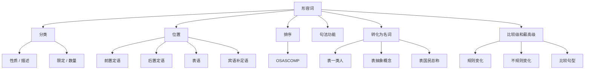

## 简介

**形容词**（Adjective）是用来 **修饰名词或代词**，描述其 **性质**、**状态**、**特征** 或 **数量** 的词。

形容词在句中可作 **定语**、**表语**、**宾语补足语**、**主语补足语** 等成分。

## 分类

按 **语义** 可分为 4 类：

|      类型      |              含义              |                              示例                              |
| :------------: | :----------------------------: | :------------------------------------------------------------: |
| **性质形容词** |    描述事物本质属性，可比较    | good（好的）, kind（善良的）, smart（聪明的）, brave（勇敢的） |
| **描述形容词** |    描述外观、状态等具体特征    |  tall（高的）, red（红色的）, round（圆的）, broken（破损的）  |
| **限定形容词** | 表所属、指示、数量等，不可比较 |     this（这个）, my（我的）, some（一些）, all（所有的）      |
| **数量形容词** |         表示数量或顺序         |    one（一）, first（第一）, many（许多）, several（几个）     |

:::tip

只有 **性质形容词** 和部分 **描述形容词** 可以比较（有比较级 / 最高级），**限定形容词** 与 **数量形容词** 通常不可比较。

:::

## 形容词的位置

### 前置定语

形容词作定语时，**通常置于** 被修饰名词的 **前面**。

:::example

- a **beautiful** girl（一个漂亮的女孩）
- an **interesting** book（一本有趣的书）
- **cold** weather（寒冷的天气）

:::

### 后置定语

以下情况形容词 **置于名词后**：

|                      情况                      |                              示例                              |
| :--------------------------------------------: | :------------------------------------------------------------: |
| 修饰 **复合不定代词**（some-/any-/every-/no-） |             something **important**（重要的事情）              |
|      与表示长度、年龄、宽度等数量短语连用      | a boy **ten years old** = a ten-year-old boy（一个十岁的男孩） |
|      **以 -able / -ible 结尾**（可后置）       |      the only solution **possible**（唯一可行的解决办法）      |
|          与 enough 连用，enough 后置           |       good **enough**（足够好）_(注意：~~enough good~~)_       |
|        以 a- 开头的表语形容词作定语后置        |      the man **alive**（活着的人）_(不说 the alive man)_       |
|      形容词短语作定语（含介词 / 不定式）       |    a man **proud of his work**（一个为自己工作而自豪的人）     |

:::tip

以 **a-** 开头的表语形容词：**alive, alone, afraid, asleep, awake, ashamed, aware, alike**，**只能作表语**（或后置定语），不能作前置定语。

:::

:::example

- The baby is **asleep**.（婴儿睡着了。）_(表语 ✓)_
- ~~the asleep baby~~ ✗ → the **sleeping** baby（睡着的婴儿）✓ _(改用现在分词)_

:::

### 表语

形容词置于 **连系动词** 之后作 **表语**。

:::example

- She is **happy**.（她很开心。）
- The soup tastes **delicious**.（这汤尝起来很美味。）
- He looks **tired**.（他看起来很累。）

:::

### 宾语补足语

形容词置于 **宾语** 之后，补充说明宾语的状态。

:::example

- We painted the wall **white**.（我们把墙刷成了白色。）
- The news made me **sad**.（这消息让我很难过。）
- Keep the door **open**.（让门开着。）

:::

## 形容词的排序

多个形容词同时修饰一个名词时，按 **「描绘 → 大小 → 年龄 → 形状 → 颜色 → 国籍 → 材料 → 用途」** 的顺序排列，可用首字母 **OSASCOMP** 记忆。

| 缩写  |          类别          |                         示例                          |
| :---: | :--------------------: | :---------------------------------------------------: |
| **O** | Opinion（看法 / 评价） | beautiful（美丽的）, ugly（丑陋的）, lovely（可爱的） |
| **S** |      Size（大小）      |      big（大的）, small（小的）, tiny（微小的）       |
| **A** |   Age（年龄 / 新旧）   |       old（老的）, young（年轻的）, new（新的）       |
| **S** |     Shape（形状）      |     round（圆的）, square（方的）, flat（扁平的）     |
| **C** |     Color（颜色）      |    red（红色的）, blue（蓝色的）, golden（金色的）    |
| **O** | Origin（国籍 / 来源）  | Chinese（中国的）, French（法国的）, lunar（月球的）  |
| **M** |    Material（材料）    |  wooden（木制的）, plastic（塑料的）, silk（丝绸的）  |
| **P** |    Purpose（用途）     |       sleeping（睡觉用的）, racing（比赛用的）        |

:::example

- a **lovely small old round red Chinese wooden** dining table（一张可爱的小巧老式圆形红色中国木质餐桌）
  _(O-S-A-S-C-O-M-P + 名词)_
- a **beautiful young French** lady（一位美丽年轻的法国女士）
- a **big round wooden** table（一张大的圆形木桌）

:::

:::tip

记忆口诀：**「美小新圆色国材用」**——「美」（看法）「小」（大小）「新」（年龄）「圆」（形状）「色」（颜色）「国」（国籍）「材」（材料）「用」（用途）。

实际写作中很少同时出现 4 个以上形容词，记住前 3 – 4 类的顺序即可。

:::

## 句法功能

形容词可充当以下句子成分：

|      成分      |                                     示例                                     |
| :------------: | :--------------------------------------------------------------------------: |
|    **定语**    |                      a **clever** boy（一个聪明的男孩）                      |
|    **表语**    |                       She is **clever**.（她很聪明。）                       |
| **宾语补足语** |                We found her **clever**.（我们发现她很聪明。）                |
| **主语补足语** | He was elected **chairman**.（他被选为主席。）_(注意 chairman 是名词作补语)_ |
|    **状语**    |         He arrived home **tired**.（他到家时很累。）_(描述主语状态)_         |

## 形容词转化为名词

部分形容词加 **the** 后可表示 **一类人** 或 **抽象概念**。

### 表示一类人

`the + 形容词` 表示某一类人，谓语用 **复数**。

:::example

- **The rich** are not always happy.（富人未必总是幸福。）
- **The young** should respect **the old**.（年轻人应该尊敬老年人。）
- **The poor** need more help.（穷人需要更多帮助。）
- **The wounded** were sent to the hospital.（伤者被送往了医院。）

:::

### 表示抽象概念

`the + 形容词` 表示某种抽象概念，谓语用 **单数**。

:::example

- **The good**, **the bad**, and **the ugly** _(善、恶、丑——抽象概念)_
- **The unknown** is always frightening.（未知总是令人恐惧。）

:::

### 表示国民总称

部分表示国籍的形容词加 **the** 表示该国国民全体。

:::example

- **the Chinese**（中国人）
- **the French**（法国人）
- **the British**（英国人）

:::

## 比较级和最高级

### 构成规则

1. 单音节词及部分双音节词：在词尾加 -er（比较级）或 -est（最高级）。
2. 部分双音节词及多音节词：在词前加 more（比较级）或 most（最高级）。
3. 特殊规则（为保持发音或拼写规律）。
   1. 以 e 结尾：去除重复的 e。
   2. 以「辅音+y」结尾：将 y 改为 i。
   3. 重读闭音节单词（以「单元音+单辅音」结尾）：双写末尾辅音。
4. 不规则变化。

:::tip

双音节形容词和副词的比较级和最高级：

- 一般以 -le, -ow, -er 或 -y 结尾的双音节词发音轻且结构简单，通常用 -er / -est。
- 而结构复杂的双音节词，通常用 more / most。
- 有些双音节词的两种形式都可以接受（例如 polite $\to$ politer / more polite $\to$ politest / most polite，但 more polite 更常用）。

:::

:::example

- long（长的）$\to$ longer $\to$ longest
- tall（高的）$\to$ taller $\to$ tallest
- simple（简单的）$\to$ simpler $\to$ simplest

:::

:::example

- modern（现代的）$\to$ more modern $\to$ most modern
- interesting（有趣的）$\to$ more interesting $\to$ most interesting
- difficult（困难的）$\to$ more difficult $\to$ most difficult

:::

:::example

- nice（美好的）$\to$ nicer $\to$ nicest
- large（大的）$\to$ larger $\to$ largest
- late（晚的）$\to$ later $\to$ latest

:::

:::example

- happy（快乐的）$\to$ happier $\to$ happiest
- easy（容易的）$\to$ easier $\to$ easiest
- busy（忙碌的）$\to$ busier $\to$ busiest

:::

:::example

- big（大的）$\to$ bigger $\to$ biggest
- fat（胖的）$\to$ fatter $\to$ fattest

:::

:::example

- good（好的）/ well（好地）$\to$ better $\to$ best
- bad（坏的）/ badly（坏地）$\to$ worse $\to$ worst
- many（许多）/ much（许多）$\to$ more $\to$ most
- little（少的）$\to$ less $\to$ least
- far（远的）$\to$ farther $\to$ farthest（距离远）/ far $\to$ further $\to$ furthest（程度深）

:::

### 常见句型

|            句型            |                                  示例                                  |
| :------------------------: | :--------------------------------------------------------------------: |
|    A + 比较级 + than B     |                He is **taller than** me.（他比我高。）                 |
|       as + 原级 + as       |      She is **as smart as** her brother.（她和她哥哥一样聪明。）       |
|  not as / so + 原级 + as   |              I am **not as tall as** you.（我没有你高。）              |
|   the + 最高级 + of / in   |       He is **the tallest in** our class.（他是我们班最高的。）        |
|   比较级 + and + 比较级    |       It is **getting hotter and hotter**.（天气变得越来越热。）       |
| the + 比较级，the + 比较级 | **The harder** you try, **the more** you gain.（你越努力，收获越多。） |
|      倍数 + as ... as      |       This is **twice as long as** that.（这个是那个的两倍长。）       |
|    倍数 + 比较级 + than    |   This is **three times longer than** that.（这个是那个的三倍长。）    |

:::tip

形容词最高级前 **必须加 the**，副词最高级前 **the 可省略**。

「越来越……」：比较级 + and + 比较级；多音节用 more and more + 原级。

:::

:::example

- It is becoming **more and more difficult**.（这变得越来越难。）

:::

## 思维导图

