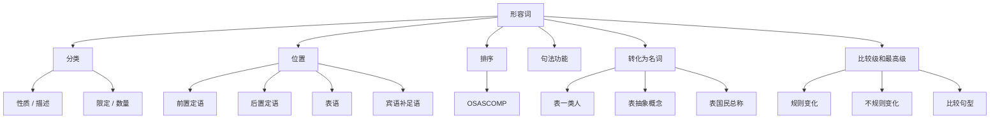

## 简介

**形容词**（Adjective）是用来 **修饰名词或代词**，描述其 **性质**、**状态**、**特征** 或 **数量** 的词。

形容词在句中可作 **定语**、**表语**、**宾语补足语**、**主语补足语** 等成分。

## 分类

按 **语义** 可分为 $4$ 类：

|      类型      |              含义              |           示例            |
| :------------: | :----------------------------: | :-----------------------: |
| **性质形容词** |    描述事物本质属性，可比较    | good, kind, smart, brave  |
| **描述形容词** |    描述外观、状态等具体特征    | tall, red, round, broken  |
| **限定形容词** | 表所属、指示、数量等，不可比较 |    this, my, some, all    |
| **数量形容词** |         表示数量或顺序         | one, first, many, several |

:::tip

只有 **性质形容词** 和部分 **描述形容词** 可以比较（有比较级 / 最高级），**限定形容词** 与 **数量形容词** 通常不可比较。

:::

## 形容词的位置

### 前置定语

形容词作定语时，**通常置于** 被修饰名词的 **前面**。

:::example

- a **beautiful** girl
- an **interesting** book
- **cold** weather

:::

### 后置定语

以下情况形容词 **置于名词后**：

|                      情况                      |                     示例                     |
| :--------------------------------------------: | :------------------------------------------: |
| 修饰 **复合不定代词**（some-/any-/every-/no-） |           something **important**            |
|      与表示长度、年龄、宽度等数量短语连用      | a boy **ten years old** = a ten-year-old boy |
|      **以 -able / -ible 结尾**（可后置）       |        the only solution **possible**        |
|          与 enough 连用，enough 后置           |  good **enough** _(注意：~~enough good~~)_   |
|        以 a- 开头的表语形容词作定语后置        |   the man **alive** _(不说 the alive man)_   |
|      形容词短语作定语（含介词 / 不定式）       |         a man **proud of his work**          |

:::tip

以 **a-** 开头的表语形容词：**alive, alone, afraid, asleep, awake, ashamed, aware, alike**，**只能作表语**（或后置定语），不能作前置定语。

:::

:::example

- The baby is **asleep**. _(表语 ✓)_
- ~~the asleep baby~~ ✗ → the **sleeping** baby ✓ _(改用现在分词)_

:::

### 表语

形容词置于 **连系动词** 之后作 **表语**。

:::example

- She is **happy**.
- The soup tastes **delicious**.
- He looks **tired**.

:::

### 宾语补足语

形容词置于 **宾语** 之后，补充说明宾语的状态。

:::example

- We painted the wall **white**.
- The news made me **sad**.
- Keep the door **open**.

:::

## 形容词的排序

多个形容词同时修饰一个名词时，按 **「描绘 → 大小 → 年龄 → 形状 → 颜色 → 国籍 → 材料 → 用途」** 的顺序排列，可用首字母 **OSASCOMP** 记忆。

| 缩写  |          类别          |          示例           |
| :---: | :--------------------: | :---------------------: |
| **O** | Opinion（看法 / 评价） | beautiful, ugly, lovely |
| **S** |      Size（大小）      |    big, small, tiny     |
| **A** |   Age（年龄 / 新旧）   |     old, young, new     |
| **S** |     Shape（形状）      |   round, square, flat   |
| **C** |     Color（颜色）      |    red, blue, golden    |
| **O** | Origin（国籍 / 来源）  | Chinese, French, lunar  |
| **M** |    Material（材料）    |  wooden, plastic, silk  |
| **P** |    Purpose（用途）     |    sleeping, racing     |

:::example

- a **lovely small old round red Chinese wooden** dining table
  _(O-S-A-S-C-O-M-P + 名词)_
- a **beautiful young French** lady
- a **big round wooden** table

:::

:::tip

记忆口诀：**「美小新圆色国材用」**——「美」（看法）「小」（大小）「新」（年龄）「圆」（形状）「色」（颜色）「国」（国籍）「材」（材料）「用」（用途）。

实际写作中很少同时出现 $4$ 个以上形容词，记住前 $3\sim 4$ 类的顺序即可。

:::

## 句法功能

形容词可充当以下句子成分：

|      成分      |                            示例                             |
| :------------: | :---------------------------------------------------------: |
|    **定语**    |                      a **clever** boy                       |
|    **表语**    |                     She is **clever**.                      |
| **宾语补足语** |                  We found her **clever**.                   |
| **主语补足语** | He was elected **chairman**. _(注意 chairman 是名词作补语)_ |
|    **状语**    |         He arrived home **tired**. _(描述主语状态)_         |

## 形容词转化为名词

部分形容词加 **the** 后可表示 **一类人** 或 **抽象概念**。

### 表示一类人

`the + 形容词` 表示某一类人，谓语用 **复数**。

:::example

- **The rich** are not always happy.
- **The young** should respect **the old**.
- **The poor** need more help.
- **The wounded** were sent to the hospital.

:::

### 表示抽象概念

`the + 形容词` 表示某种抽象概念，谓语用 **单数**。

:::example

- **The good**, **the bad**, and **the ugly** _(善、恶、丑——抽象概念)_
- **The unknown** is always frightening.

:::

### 表示国民总称

部分表示国籍的形容词加 **the** 表示该国国民全体。

:::example

- **the Chinese**（中国人）
- **the French**（法国人）
- **the British**（英国人）

:::

## 比较级和最高级

### 构成规则

1. 单音节词及部分双音节词：在词尾加 -er（比较级）或 -est（最高级）。
2. 部分双音节词及多音节词：在词前加 more（比较级）或 most（最高级）。
3. 特殊规则（为保持发音或拼写规律）。
   1. 以 e 结尾：去除重复的 e。
   2. 以「辅音+y」结尾：将 y 改为 i。
   3. 重读闭音节单词（以「单元音+单辅音」结尾）：双写末尾辅音。
4. 不规则变化。

:::tip

双音节形容词和副词的比较级和最高级：

- 一般以 -le, -ow, -er 或 -y 结尾的双音节词发音轻且结构简单，通常用 -er / -est。
- 而结构复杂的双音节词，通常用 more / most。
- 有些双音节词的两种形式都可以接受（例如 polite $\to$ politer / more polite $\to$ politest / most polite，但 more polite 更常用）。

:::

:::example

- long $\to$ longer $\to$ longest
- tall $\to$ taller $\to$ tallest
- simple $\to$ simpler $\to$ simplest

:::

:::example

- modern $\to$ more modern $\to$ most modern
- interesting $\to$ more interesting $\to$ most interesting
- difficult $\to$ more difficult $\to$ most difficult

:::

:::example

- nice $\to$ nicer $\to$ nicest
- large $\to$ larger $\to$ largest
- late $\to$ later $\to$ latest

:::

:::example

- happy $\to$ happier $\to$ happiest
- easy $\to$ easier $\to$ easiest
- busy $\to$ busier $\to$ busiest

:::

:::example

- big $\to$ bigger $\to$ biggest
- fat $\to$ fatter $\to$ fattest

:::

:::example

- good / well $\to$ better $\to$ best
- bad / badly $\to$ worse $\to$ worst
- many / much $\to$ more $\to$ most
- little $\to$ less $\to$ least
- far $\to$ farther $\to$ farthest（距离远）/ far $\to$ further $\to$ furthest（程度深）

:::

### 常见句型

|            句型            |                      示例                      |
| :------------------------: | :--------------------------------------------: |
|    A + 比较级 + than B     |           He is **taller than** me.            |
|       as + 原级 + as       |      She is **as smart as** her brother.       |
|  not as / so + 原级 + as   |          I am **not as tall as** you.          |
|   the + 最高级 + of / in   |      He is **the tallest in** our class.       |
|   比较级 + and + 比较级    |      It is **getting hotter and hotter**.      |
| the + 比较级，the + 比较级 | **The harder** you try, **the more** you gain. |
|      倍数 + as ... as      |       This is **twice as long as** that.       |
|    倍数 + 比较级 + than    |   This is **three times longer than** that.    |

:::tip

形容词最高级前 **必须加 the**，副词最高级前 **the 可省略**。

「越来越……」：比较级 + and + 比较级；多音节用 more and more + 原级。

:::

:::example

- It is becoming **more and more difficult**.

:::

## 思维导图

