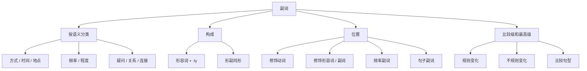

## 简介

**副词**（Adverb）是用来修饰 **动词**、**形容词**、**其他副词** 或 **整个句子** 的词，表示动作或状态的方式、时间、地点、程度、频率、语气等。

$$
\underbrace{\text{adverb}}_{\text{副词}}
=\underbrace{\text{ad}}_{\text{加于}}
+\underbrace{\text{verb}}_{\text{动词}}
$$

## 按语义分类

|   类型   |                  常见副词                  |               示例               |
| :------: | :----------------------------------------: | :------------------------------: |
| **方式** |  quickly, slowly, well, badly, carefully   |    She sings **beautifully**.    |
| **时间** | now, then, soon, today, yesterday, already |      He left **yesterday**.      |
| **地点** |  here, there, everywhere, abroad, inside   |          Come **here**.          |
| **频率** |  always, usually, often, sometimes, never  |     I **always** drink tea.      |
| **程度** |  very, quite, too, almost, hardly, rather  |       It is **too** late.        |
| **疑问** |           when, where, why, how            |     **Where** are you going?     |
| **关系** |        when, where, why（引导从句）        |     The day **when** we met.     |
| **连接** |   however, therefore, besides, otherwise   | It rained; **however**, we went. |

## 构成

### 由形容词加 -ly

大多数副词由形容词加 **-ly** 构成。

1. 一般情况：直接加 -ly。
2. 特殊规则（为保持发音或拼写规律）。
   1. 以「辅音+y」结尾：将 y 改为 i，再加 -ly。
   2. 以 -le 结尾：去 e 再加 -y。
   3. 以 -ic 结尾：加 -ally。

:::example

- quick $\to$ quickly
- slow $\to$ slowly
- careful $\to$ carefully

:::

:::example

- happy $\to$ happily
- easy $\to$ easily
- busy $\to$ busily

:::

:::example

- simple $\to$ simply
- gentle $\to$ gently
- terrible $\to$ terribly

:::

:::example

- basic $\to$ basically
- automatic $\to$ automatically

:::

### 形副同形

部分词的 **形容词与副词形式相同**。

:::example

- fast、early、hard、late、long、high、deep、near、straight

:::

:::tip

部分副词加 -ly 后 **语义改变**：

- hard _(努力地)_ vs. hardly _(几乎不)_
- late _(晚)_ vs. lately _(最近)_
- near _(在附近)_ vs. nearly _(几乎)_
- high _(高高地)_ vs. highly _(高度地，非常)_
- deep _(深地)_ vs. deeply _(深深地，情感上)_

:::

### 其他构成

|    构成方式     |              示例              |
| :-------------: | :----------------------------: |
|   原形即副词    |  just, soon, now, then, very   |
|  名词 + -wise   | clockwise, otherwise, likewise |
| 名词 + -ward(s) |   forward, backward, upward    |

## 位置

### 修饰动词

通常位于 **动词之后**；若动词带宾语，置于 **宾语之后**。

:::example

- He runs **quickly**.
- She reads the book **carefully**.

:::

### 修饰形容词 / 副词

通常位于 **被修饰词之前**。

:::example

- It is **very** cold.
- He runs **quite** fast.

:::

### 频率副词

通常位于：

- **实义动词之前**。
- **be 动词** / **助动词** / **情态动词** 之后。

:::example

- I **often** go swimming.
- He is **always** late.
- You should **never** lie.

:::

### 句子副词

修饰整个句子的副词通常置于 **句首**，用 **逗号** 与主句分隔。

:::example

- **Fortunately**, no one was hurt.
- **Honestly**, I don't know.

:::

## 比较级和最高级

### 构成规则

副词的比较级和最高级构成规则与形容词类似，详见 [形容词](adjectives)。

1. 单音节副词及少数双音节副词：在词尾加 **-er**（比较级）或 **-est**（最高级）。
2. 以 **-ly** 结尾的多音节副词：在词前加 **more** / **most**。
3. 不规则变化。

:::example

- fast $\to$ faster $\to$ fastest
- hard $\to$ harder $\to$ hardest
- early $\to$ earlier $\to$ earliest

:::

:::example

- quickly $\to$ more quickly $\to$ most quickly
- carefully $\to$ more carefully $\to$ most carefully

:::

:::example

- well $\to$ better $\to$ best
- badly $\to$ worse $\to$ worst
- much $\to$ more $\to$ most
- little $\to$ less $\to$ least
- far $\to$ farther / further $\to$ farthest / furthest

:::

### 常见句型

|            句型            |                      示例                      |
| :------------------------: | :--------------------------------------------: |
|    A + 比较级 + than B     |         He runs **faster than** I do.          |
|       as + 原级 + as       |     She works **as hard as** her brother.      |
|   the + 最高级 + of / in   |       He runs **(the) fastest** of all.        |
|   比较级 + and + 比较级    |         He runs **faster and faster**.         |
| the + 比较级，the + 比较级 | **The harder** you try, **the more** you gain. |

:::tip

副词最高级前的 **the 通常可省略**，这与形容词最高级不同。

:::

## 思维导图

