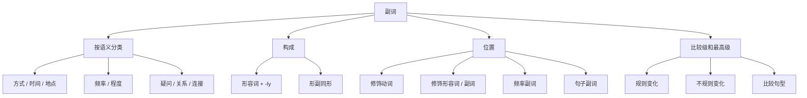

## 简介

**副词**（Adverb）是用来修饰 **动词**、**形容词**、**其他副词** 或 **整个句子** 的词，表示动作或状态的方式、时间、地点、程度、频率、语气等。

$$
\underbrace{\text{adverb}}_{\text{副词}}
=\underbrace{\text{ad}}_{\text{加于}}
+\underbrace{\text{verb}}_{\text{动词}}
$$

## 按语义分类

|   类型   |                  常见副词                  |                               示例                               |
| :------: | :----------------------------------------: | :--------------------------------------------------------------: |
| **方式** |  quickly, slowly, well, badly, carefully   |           She sings **beautifully**.（她唱得很动听。）           |
| **时间** | now, then, soon, today, yesterday, already |              He left **yesterday**.（他昨天走了。）              |
| **地点** |  here, there, everywhere, abroad, inside   |                   Come **here**.（到这儿来。）                   |
| **频率** |  always, usually, often, sometimes, never  |             I **always** drink tea.（我总是喝茶。）              |
| **程度** |  very, quite, too, almost, hardly, rather  |                 It is **too** late.（太晚了。）                  |
| **疑问** |           when, where, why, how            |             **Where** are you going?（你要去哪里？）             |
| **关系** |        when, where, why（引导从句）        |           The day **when** we met.（我们相遇的那天。）           |
| **连接** |   however, therefore, besides, otherwise   | It rained; **however**, we went.（下雨了；然而，我们还是去了。） |

## 构成

### 由形容词加 -ly

大多数副词由形容词加 **-ly** 构成。

1. 一般情况：直接加 -ly。
2. 特殊规则（为保持发音或拼写规律）。
   1. 以「辅音+y」结尾：将 y 改为 i，再加 -ly。
   2. 以 -le 结尾：去 e 再加 -y。
   3. 以 -ic 结尾：加 -ally。

:::example

- quick（快的）$\to$ quickly
- slow（慢的）$\to$ slowly
- careful（细心的）$\to$ carefully

:::

:::example

- happy（快乐的）$\to$ happily
- easy（容易的）$\to$ easily
- busy（忙碌的）$\to$ busily

:::

:::example

- simple（简单的）$\to$ simply
- gentle（温柔的）$\to$ gently
- terrible（糟糕的）$\to$ terribly

:::

:::example

- basic（基本的）$\to$ basically
- automatic（自动的）$\to$ automatically

:::

### 形副同形

部分词的 **形容词与副词形式相同**。

:::example

- fast（快的 / 快地）、early（早的 / 早地）、hard（努力的 / 努力地）、late（晚的 / 晚地）、long（长的 / 长久地）、high（高的 / 高地）、deep（深的 / 深地）、near（近的 / 近地）、straight（直的 / 直地）

:::

:::tip

部分副词加 -ly 后 **语义改变**：

- hard _(努力地)_ vs. hardly _(几乎不)_
- late _(晚)_ vs. lately _(最近)_
- near _(在附近)_ vs. nearly _(几乎)_
- high _(高高地)_ vs. highly _(高度地，非常)_
- deep _(深地)_ vs. deeply _(深深地，情感上)_

:::

### 其他构成

|    构成方式     |                                示例                                 |
| :-------------: | :-----------------------------------------------------------------: |
|   原形即副词    | just（刚刚）, soon（很快）, now（现在）, then（那时）, very（非常） |
|  名词 + -wise   |   clockwise（顺时针地）, lengthwise（纵向地）, stepwise（逐步地）   |
| 名词 + -ward(s) |          forward（向前）, backward（向后）, upward（向上）          |

## 位置

### 修饰动词

通常位于 **动词之后**；若动词带宾语，置于 **宾语之后**。

:::example

- He runs **quickly**.（他跑得很快。）
- She reads the book **carefully**.（她认真地读这本书。）

:::

### 修饰形容词 / 副词

通常位于 **被修饰词之前**。

:::example

- It is **very** cold.（天很冷。）
- He runs **quite** fast.（他跑得相当快。）

:::

### 频率副词

通常位于：

- **实义动词之前**。
- **be 动词** / **助动词** / **情态动词** 之后。

:::example

- I **often** go swimming.（我经常去游泳。）
- He is **always** late.（他总是迟到。）
- You should **never** lie.（你绝不该撒谎。）

:::

### 句子副词

修饰整个句子的副词通常置于 **句首**，用 **逗号** 与主句分隔。

:::example

- **Fortunately**, no one was hurt.（幸运的是，没有人受伤。）
- **Honestly**, I don't know.（说实话，我不知道。）

:::

## 比较级和最高级

### 构成规则

副词的比较级和最高级构成规则与形容词类似，详见 [形容词](/docs/note/english/grammar/parts-of-speech/adjectives)。

1. 单音节副词及少数双音节副词：在词尾加 **-er**（比较级）或 **-est**（最高级）。
2. 以 **-ly** 结尾的多音节副词：在词前加 **more** / **most**。
3. 不规则变化。

:::example

- fast（快地）$\to$ faster $\to$ fastest
- hard（努力地）$\to$ harder $\to$ hardest
- early（早地）$\to$ earlier $\to$ earliest

:::

:::example

- quickly（快地）$\to$ more quickly $\to$ most quickly
- carefully（细心地）$\to$ more carefully $\to$ most carefully

:::

:::example

- well（好地）$\to$ better $\to$ best
- badly（差地）$\to$ worse $\to$ worst
- much（很，非常）$\to$ more $\to$ most
- little（少地）$\to$ less $\to$ least
- far（远地）$\to$ farther / further $\to$ farthest / furthest

:::

### 常见句型

|            句型            |                                  示例                                  |
| :------------------------: | :--------------------------------------------------------------------: |
|    A + 比较级 + than B     |            He runs **faster than** I do.（他跑得比我快。）             |
|       as + 原级 + as       |     She works **as hard as** her brother.（她和她哥哥一样努力。）      |
|   the + 最高级 + of / in   |     He runs **(the) fastest** of all.（他跑得是所有人中最快的。）      |
|   比较级 + and + 比较级    |           He runs **faster and faster**.（他跑得越来越快。）           |
| the + 比较级，the + 比较级 | **The harder** you try, **the more** you gain.（你越努力，收获越多。） |

:::tip

副词最高级前的 **the 通常可省略**，这与形容词最高级不同。

:::

## 思维导图

