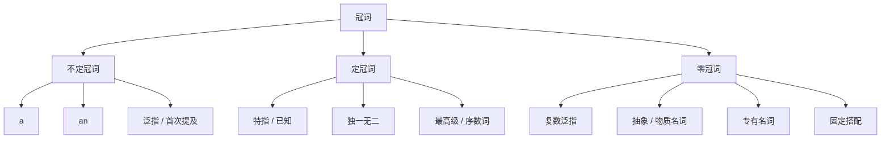

## 简介

**冠词**（Article）是放在名词前，用于 **限定** 名词所指范围的虚词。

冠词分为 3 类：**不定冠词**（a / an）、**定冠词**（the）和 **零冠词**（不加任何冠词）。

|   类别   |  形式  |           作用            |                  示例                   |
| :------: | :----: | :-----------------------: | :-------------------------------------: |
| 不定冠词 | a / an |   表示 **泛指** 的一个    | a book（一本书）/ an apple（一个苹果）  |
|  定冠词  |  the   | 表示 **特指** 或 **已知** |  the book on the desk（桌上的那本书）   |
|  零冠词  |   —    | 不加冠词，表示泛指或类指  | Water is essential.（水是必不可少的。） |

## 不定冠词（a/an）

**不定冠词**（Indefinite Article）用于 **单数可数名词** 前，表示「一个」或「某一个」，不强调具体所指。

### 形式选择

a 与 an 的区别在于 **后接单词的首音**，而非首字母：

- **a**：后接以 **辅音音素** 开头的词。
- **an**：后接以 **元音音素** 开头的词。

:::example

- a university（一所大学）_(u 发 /juː/，辅音起始)_
- an hour（一小时）_(h 不发音，元音起始)_
- a one-eyed cat（一只独眼猫）_(one 发 /wʌn/，辅音起始)_
- an MP3 player（一个 MP3 播放器）_(M 发 /em/，元音起始)_

:::

### 主要用法

|         用法          |                                示例                                 |
| :-------------------: | :-----------------------------------------------------------------: |
|     首次提及某物      |          I saw **a** dog yesterday.（我昨天看见一条狗。）           |
|     表示任意一个      |               **A** child needs love.（孩子需要爱。）               |
| 表示「每一」（= per） |             Twice **a** day.（一天两次。）_(每天两次)_              |
|      表示某一类       |             **A** tiger is dangerous.（老虎是危险的。）             |
|    用于职业 / 身份    |             She is **an** engineer.（她是一名工程师。）             |
|    用于数量 / 计量    | a hundred（一百）, a dozen（一打）, a few（几个）, a little（一点） |

:::tip

不定冠词 **不能** 用于 **不可数名词** 或 **复数名词** 前。

如需表达「一些」之意，用 **some** / **any** 等限定词替代。

:::

## 定冠词（the）

**定冠词**（Definite Article）表示 **特指** 的人或事物，可修饰单数、复数、可数和不可数名词。

### 主要用法

|         用法          |                                 示例                                  |
| :-------------------: | :-------------------------------------------------------------------: |
|   再次提及前文事物    | I bought a book. **The** book is new.（我买了一本书。这本书是新的。） |
|   双方都明确的事物    |              Please close **the** door.（请把门关上。）               |
|     被限定语修饰      |      **The** girl in red is my sister.（穿红衣的女孩是我妹妹。）      |
|  世上独一无二的事物   |   **the** sun（太阳）, **the** moon（月亮）, **the** earth（地球）    |
|    方位 / 自然现象    |     **the** east（东方）, **the** wind（风）, **the** sky（天空）     |
| 形容词最高级 / 序数词 |             **the** best（最好的）, **the** first（第一）             |
|       乐器名前        |                     play **the** piano（弹钢琴）                      |
|     某些专有名词      |     **the** United States（美国）, **the** Yangtze River（长江）      |
|     表示一类事物      |           **The** whale is a mammal.（鲸是一种哺乳动物。）            |

:::tip

形容词加 **the** 表示 **一类人**，谓语用 **复数**：

- **The rich** are not always happy.
- **The young** should respect **the old**.

:::

### the 与专有名词

|                    加 the                    |             不加 the              |
| :------------------------------------------: | :-------------------------------: |
|          河流：the Nile, the Thames          |  湖泊：Lake Tahoe, Qinghai Lake   |
|       海洋：the Pacific, the Atlantic        |  山峰：Mount Everest, Mount Tai   |
|     群岛：the Philippines, the Maldives      |    单座岛屿：Taiwan, Greenland    |
|        山脉：the Alps, the Himalayas         |    国家（单名）：China, Japan     |
| 含 of 的专名：the People's Republic of China | 城市 / 街道：Beijing, Wall Street |

## 零冠词

**零冠词**（Zero Article）即不加任何冠词，常用于以下情形：

|          用法           |                                     示例                                     |
| :---------------------: | :--------------------------------------------------------------------------: |
| 泛指的复数 / 不可数名词 |                   Books are my friends.（书是我的朋友。）                    |
|        抽象名词         |                 Honesty is the best policy.（诚实为上策。）                  |
|        物质名词         |                 Water boils at 100°C.（水在 100°C 时沸腾。）                 |
|        专有名词         |             China is a great country.（中国是一个伟大的国家。）              |
|   三餐 / 球类 / 学科    |   have breakfast（吃早餐）/ play football（踢足球）/ study math（学数学）    |
|     交通方式（by）      |           by bus（乘公交）, by train（乘火车）, by plane（乘飞机）           |
|       称呼 / 头衔       |          Doctor Smith（史密斯医生）, President Lincoln（林肯总统）           |
|   节日 / 月份 / 星期    |       on Monday（在周一）, in May（在 5 月）, on Christmas（在圣诞节）       |
|   固定搭配 / 习惯表达   | at home（在家）, at school（在校）, in bed（在床上）, go to school（去上学） |

:::tip

同一名词加冠词与不加冠词的语义差别：

- go to **school** _(上学)_ vs. go to **the school** _(去学校这个地点)_
- in **bed** _(睡觉)_ vs. on **the bed** _(在床上这个物体)_
- in **hospital** _(住院)_ vs. in **the hospital** _(在医院里)_

:::

## 思维导图

