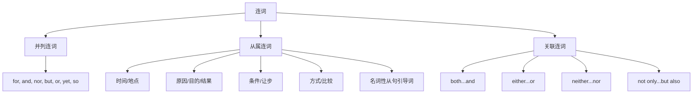

## 简介

**连词**（Conjunction）是连接词、短语、从句或句子的虚词，本身不充当句子成分。

按语法功能可分为 3 类：**并列连词**、**从属连词**、**关联连词**。

## 并列连词

**并列连词**（Coordinating Conjunction）连接 **语法地位相同** 的成分。

常见并列连词可用 **FANBOYS** 记忆：

|  连词   |   语义   |                 示例                 |
| :-----: | :------: | :----------------------------------: |
| **for** |   原因   |  He stayed home, for he was tired.   |
| **and** |   并列   |        I like tea and coffee.        |
| **nor** |   否定   | He doesn't smoke, nor does he drink. |
| **but** |   转折   |        She is young but wise.        |
| **or**  |   选择   |        Is it black or white?         |
| **yet** | 让步转折 |  The plan is simple, yet effective.  |
| **so**  |   结果   |   It rained, so we stayed inside.    |

:::tip

并列连词连接 2 个独立句子时，应在连词前加 **逗号**。

并列连词不应放在句首（正式书面语规范），但口语中可见。

:::

### 并列连词的省略

并列 3 项及以上时，通常只在最后两项之间用连词。

:::example

- I bought pens, books, and erasers.

:::

## 从属连词

**从属连词**（Subordinating Conjunction）连接 **从句** 与 **主句**，引导出 **从属关系**。

引导的从句通常为 **状语从句**，少数引导 **名词性从句**。

按语义可分为以下几类：

|   类型   |                      常见连词                      |                 示例                 |
| :------: | :------------------------------------------------: | :----------------------------------: |
| **时间** | when, while, as, before, after, since, until, once |     I called him when I arrived.     |
| **地点** |                  where, wherever                   |        Sit wherever you like.        |
| **原因** |            because, since, as, now that            |  She stayed because it was raining.  |
| **目的** |            so that, in order that, lest            |  Speak loudly so that all can hear.  |
| **结果** |               so...that, such...that               | He was so tired that he fell asleep. |
| **条件** |       if, unless, provided that, as long as        |         I'll go if you come.         |
| **让步** |   though, although, even though, while, whereas    |   Though tired, she kept working.    |
| **方式** |                as, as if, as though                |   He acts as if he were the boss.    |
| **比较** |                   than, as...as                    |       He is taller than I am.        |

:::tip

英语中 **「虽然」和「但是」不能同时出现** 在同一句中。

中文「**虽然**……**但是**……」结构在英语中只保留 **一个**：either `although` or `but`，不能两个都用。

:::

:::example

- Although he is rich, he is unhappy. ~~Although he is rich, but he is unhappy.~~

:::

### 引导名词性从句的从属连词

某些从属连词引导 **名词性从句**（详见 [从句](../sentences/clauses)）。

|    连词    |          作用          |              示例               |
| :--------: | :--------------------: | :-----------------------------: |
|    that    | 引导陈述意义的名词从句 |    I know that he is right.     |
| whether/if | 引导疑问意义的名词从句 | I wonder whether she will come. |

## 关联连词

**关联连词**（Correlative Conjunction）是 **成对** 出现的连词，连接对等成分。

|        关联连词        |    语义    |                      示例                       |
| :--------------------: | :--------: | :---------------------------------------------: |
|       both...and       |   两者都   |          Both Tom and Jerry are tired.          |
|  not only...but also   | 不仅……而且 |        Not only he but also I am wrong.         |
|      either...or       |  二者择一  |           Either you or he is wrong.            |
|     neither...nor      |  两者都不  |          Neither you nor he is right.           |
|      whether...or      |   是否……   |      Whether you agree or not, I will go.       |
|        as...as         |  和……一样  |         She is as smart as her brother.         |
|    no sooner...than    |  一……就……  | No sooner had he arrived than it began to rain. |
| hardly/scarcely...when |  一……就……  |   Hardly had I sat down when the phone rang.    |

:::tip

**关联连词** 连接的两个成分应保持 **对等结构**（平行结构）。

:::

:::example

- He is **not only smart but also diligent**. _(形 $+$ 形)_
- She **either sings or dances**. _(动 $+$ 动)_

:::

### 关联连词的主谓一致

`either...or`、`neither...nor`、`not only...but also` 连接 **两个主语** 时，**就近原则**：谓语动词与 **靠近** 的主语保持一致（详见 [主谓一致](../sentences/subject-verb-agreement)）。

:::example

- Either you or he **is** wrong.
- Neither Tom nor his friends **are** here.

:::

## 思维导图

