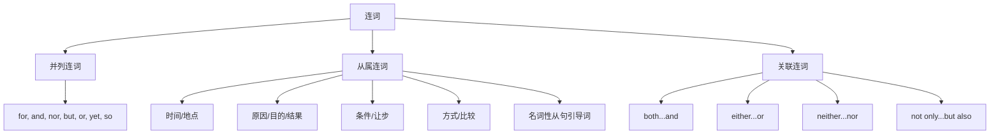

## 简介

**连词**（Conjunction）是连接词、短语、从句或句子的虚词，本身不充当句子成分。

按语法功能可分为 3 类：**并列连词**、**从属连词**、**关联连词**。

## 并列连词

**并列连词**（Coordinating Conjunction）连接 **语法地位相同** 的成分。

常见并列连词可用 **FANBOYS** 记忆：

|  连词   |   语义   |                               示例                               |
| :-----: | :------: | :--------------------------------------------------------------: |
| **for** |   原因   |  He stayed home, for he was tired.（他待在家里，因为他累了。）   |
| **and** |   并列   |            I like tea and coffee.（我喜欢茶和咖啡。）            |
| **nor** |   否定   |   He doesn't smoke, nor does he drink.（他不抽烟，也不喝酒。）   |
| **but** |   转折   |         She is young but wise.（她虽然年轻，但很睿智。）         |
| **or**  |   选择   |           Is it black or white?（它是黑色还是白色？）            |
| **yet** | 让步转折 | The plan is simple, yet effective.（这个方案很简单，却很有效。） |
| **so**  |   结果   | It rained, so we stayed inside.（下雨了，所以我们待在了室内。）  |

:::tip

并列连词连接 2 个独立句子时，应在连词前加 **逗号**。

并列连词不应放在句首（正式书面语规范），但口语中可见。

:::

### 并列连词的省略

并列 3 项及以上时，通常只在最后两项之间用连词。

:::example

- I bought pens, books, and erasers.（我买了钢笔、书和橡皮。）

:::

## 从属连词

**从属连词**（Subordinating Conjunction）连接 **从句** 与 **主句**，引导出 **从属关系**。

引导的从句通常为 **状语从句**，少数引导 **名词性从句**。

按语义可分为以下几类：

|   类型   |                      常见连词                      |                                示例                                |
| :------: | :------------------------------------------------: | :----------------------------------------------------------------: |
| **时间** | when, while, as, before, after, since, until, once |       I called him when I arrived.（我到达时给他打了电话。）       |
| **地点** |                  where, wherever                   |           Sit wherever you like.（你想坐哪儿就坐哪儿。）           |
| **原因** |            because, since, as, now that            |   She stayed because it was raining.（她留下来了，因为在下雨。）   |
| **目的** |            so that, in order that, lest            | Speak loudly so that all can hear.（大声说，这样所有人都能听见。） |
| **结果** |               so...that, such...that               |  He was so tired that he fell asleep.（他太累了，以至于睡着了。）  |
| **条件** |       if, unless, provided that, as long as        |              I'll go if you come.（你来的话我就去。）              |
| **让步** |   though, although, even though, while, whereas    |    Though tired, she kept working.（尽管很累，她仍继续工作。）     |
| **方式** |                as, as if, as though                |    He acts as if he were the boss.（他表现得好像自己是老板。）     |
| **比较** |                   than, as...as                    |               He is taller than I am.（他比我高。）                |

:::tip

英语中 **「虽然」和「但是」不能同时出现** 在同一句中。

中文「**虽然**……**但是**……」结构在英语中只保留 **一个**：either `although` or `but`，不能两个都用。

:::

:::example

- Although he is rich, he is unhappy.（虽然他很富有，但并不快乐。） ~~Although he is rich, but he is unhappy.~~

:::

### 引导名词性从句的从属连词

某些从属连词引导 **名词性从句**（详见 [从句](/docs/note/english/grammar/sentences/clauses)）。

|    连词    |          作用          |                          示例                           |
| :--------: | :--------------------: | :-----------------------------------------------------: |
|    that    | 引导陈述意义的名词从句 |      I know that he is right.（我知道他是对的。）       |
| whether/if | 引导疑问意义的名词从句 | I wonder whether she will come.（我想知道她是否会来。） |

## 关联连词

**关联连词**（Correlative Conjunction）是 **成对** 出现的连词，连接对等成分。

|        关联连词        |    语义    |                                   示例                                    |
| :--------------------: | :--------: | :-----------------------------------------------------------------------: |
|       both...and       |   两者都   |          Both Tom and Jerry are tired.（Tom 和 Jerry 都累了。）           |
|  not only...but also   | 不仅……而且 |        Not only he but also I am wrong.（不仅他错了，我也错了。）         |
|      either...or       |  二者择一  |             Either you or he is wrong.（不是你错就是他错。）              |
|     neither...nor      |  两者都不  |              Neither you nor he is right.（你和他都不对。）               |
|      whether...or      |   是否……   |    Whether you agree or not, I will go.（无论你同不同意，我都会去。）     |
|        as...as         |  和……一样  |          She is as smart as her brother.（她和她哥哥一样聪明。）          |
|    no sooner...than    |  一……就……  | No sooner had he arrived than it began to rain.（他刚一到就开始下雨了。） |
| hardly/scarcely...when |  一……就……  |    Hardly had I sat down when the phone rang.（我刚坐下电话就响了。）     |

:::tip

**关联连词** 连接的两个成分应保持 **对等结构**（平行结构）。

:::

:::example

- He is **not only smart but also diligent**.（他不仅聪明，而且勤奋。）_(形 $+$ 形)_
- She **either sings or dances**.（她要么唱歌，要么跳舞。）_(动 $+$ 动)_

:::

### 关联连词的主谓一致

`either...or`、`neither...nor`、`not only...but also` 连接 **两个主语** 时，**就近原则**：谓语动词与 **靠近** 的主语保持一致（详见 [主谓一致](/docs/note/english/grammar/sentences/subject-verb-agreement)）。

:::example

- Either you or he **is** wrong.（不是你错就是他错。）
- Neither Tom nor his friends **are** here.（Tom 和他的朋友们都不在这里。）

:::

## 思维导图

