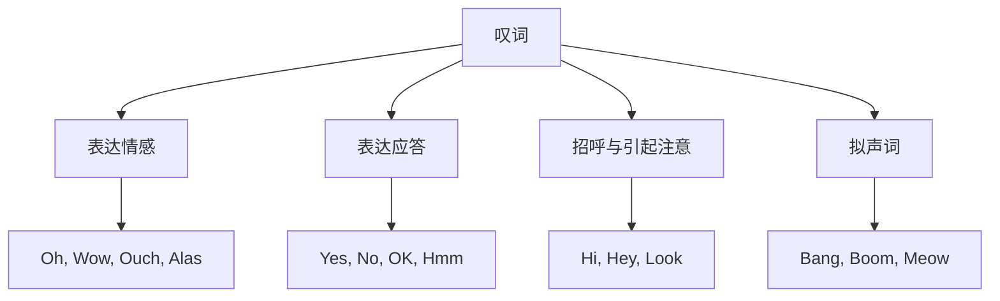

## 简介

**叹词**（Interjection）是表达 **情感**、**态度** 或 **应答** 的词，独立于句子的语法结构。

叹词在句子中不作任何成分，可独立成句，通常后接 **逗号** 或 **感叹号**。

## 按语义分类

### 表达情感

| 叹词 |    情感    |                        示例                         |
| :--: | :--------: | :-------------------------------------------------: |
|  Oh  | 惊讶、理解 |            Oh, I see.（哦，我明白了。）             |
|  Ah  | 满意、领悟 |      Ah, that feels good.（啊，这感觉真好。）       |
| Wow  |    惊叹    |        Wow, what a view!（哇，多美的景色！）        |
| Ouch |    疼痛    |          Ouch! That hurts.（哎哟！好疼。）          |
| Alas | 悲伤、惋惜 |          Alas, he is gone.（唉，他走了。）          |
| Yuck |    厌恶    | Yuck, this tastes terrible.（呸，这味道太糟糕了。） |
| Phew |  松一口气  |         Phew, that was close!（呼，好险！）         |
| Yay  | 喜悦、欢呼 |           Yay, we won!（耶，我们赢了！）            |

### 表达应答

|    叹词    |    用途    |                 示例                 |
| :--------: | :--------: | :----------------------------------: |
| Yes / Yeah |    肯定    |   Yes, I agree.（是的，我同意。）    |
|     No     |    否定    |     No, I can't.（不，我不能。）     |
|     OK     |    同意    |   OK, let's go.（好，我们走吧。）    |
|    Sure    |  表示当然  | Sure, no problem.（当然，没问题。）  |
|   Maybe    |    不定    |    Maybe later.（也许待会儿吧。）    |
|    Hmm     | 犹豫、思考 | Hmm, let me think.（嗯，让我想想。） |

### 招呼与引起注意

|    叹词    |    用途    |                          示例                          |
| :--------: | :--------: | :----------------------------------------------------: |
| Hi / Hello |    问候    |            Hi! How are you?（嗨！你好吗？）            |
|    Hey     | 招呼、提醒 |             Hey, watch out!（嘿，小心！）              |
|    Look    |  引起注意  |      Look, the bus is coming.（看，公交车来了。）      |
|   Listen   |  引起注意  | Listen, I have something to say.（听着，我有话要说。） |

### 拟声词

部分叹词由 **声音模仿** 而来，称为 **拟声词**。

|   叹词    |  拟声对象  |                            示例                             |
| :-------: | :--------: | :---------------------------------------------------------: |
|   Bang    | 爆炸、撞击 |     Bang! The door slammed shut.（砰！门猛地关上了。）      |
|   Boom    |   爆炸声   |      Boom! The fireworks went off.（轰！烟花炸开了。）      |
|  Splash   |   水花声   |   Splash! He fell into the pool.（扑通！他掉进了泳池。）    |
| Tick-tock |   时钟声   | The clock went tick-tock all night.（钟摆滴答响了一整夜。） |
|   Meow    |    猫叫    |              The cat said meow.（猫喵喵叫。）               |
|   Woof    |    狗叫    |              The dog said woof.（狗汪汪叫。）               |

## 用法特点

### 独立性

叹词独立于句子的语法结构，**去掉不影响** 主句完整性。

:::example

- Oh, I forgot to tell you.（哦，我忘了告诉你。）
- I forgot to tell you.（我忘了告诉你。）_(去掉叹词后句子完整)_

:::

### 标点

- 独立成句：使用 **感叹号**。
- 用于句首：通常用 **逗号** 与主句分隔。
- 表达强烈情感：使用 **感叹号**。

:::example

- Wow!（哇！）
- Hey, come here.（嘿，过来。）
- Ouch! That hurts!（哎哟！好疼！）

:::

### 与感叹句的区别

**叹词** 是 **词类**，**感叹句** 是 **句类**。

|  类别  |             定义              |                                    示例                                    |
| :----: | :---------------------------: | :------------------------------------------------------------------------: |
|  叹词  |       独立表达情感的词        |                      Wow!（哇！）/ Oh dear!（天哪！）                      |
| 感叹句 | 含 what 或 how 引导的强调结构 | What a beautiful day!（多美好的一天！）/ How smart she is!（她多聪明啊！） |

:::tip

叹词在书面语中使用较少，主要见于 **对话**、**小说人物语言** 和 **网络非正式文本**。

学术写作和正式文本应避免使用叹词。

:::

## 思维导图

