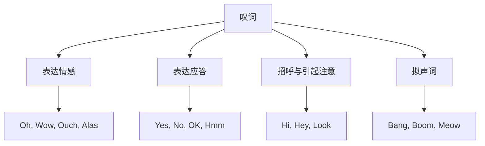

## 简介

**叹词**（Interjection）是表达 **情感**、**态度** 或 **应答** 的词，独立于句子的语法结构。

叹词在句子中不作任何成分，可独立成句，通常后接 **逗号** 或 **感叹号**。

## 按语义分类

### 表达情感

| 叹词 |    情感    |            示例             |
| :--: | :--------: | :-------------------------: |
|  Oh  | 惊讶、理解 |         Oh, I see.          |
|  Ah  | 满意、领悟 |    Ah, that feels good.     |
| Wow  |    惊叹    |      Wow, what a view!      |
| Ouch |    疼痛    |      Ouch! That hurts.      |
| Alas | 悲伤、惋惜 |      Alas, he is gone.      |
| Yuck |    厌恶    | Yuck, this tastes terrible. |
| Phew |  松一口气  |    Phew, that was close!    |
| Yay  | 喜悦、欢呼 |        Yay, we won!         |

### 表达应答

|    叹词    |    用途    |        示例        |
| :--------: | :--------: | :----------------: |
| Yes / Yeah |    肯定    |   Yes, I agree.    |
|     No     |    否定    |    No, I can't.    |
|     OK     |    同意    |   OK, let's go.    |
|    Sure    |  表示当然  | Sure, no problem.  |
|   Maybe    |    不定    |    Maybe later.    |
|    Hmm     | 犹豫、思考 | Hmm, let me think. |

### 招呼与引起注意

|    叹词    |    用途    |               示例               |
| :--------: | :--------: | :------------------------------: |
| Hi / Hello |    问候    |         Hi! How are you?         |
|    Hey     | 招呼、提醒 |         Hey, watch out!          |
|    Look    |  引起注意  |     Look, the bus is coming.     |
|   Listen   |  引起注意  | Listen, I have something to say. |

### 拟声词

部分叹词由 **声音模仿** 而来，称为 **拟声词**。

|   叹词    |  拟声对象  |                示例                 |
| :-------: | :--------: | :---------------------------------: |
|   Bang    | 爆炸、撞击 |    Bang! The door slammed shut.     |
|   Boom    |   爆炸声   |    Boom! The fireworks went off.    |
|  Splash   |   水花声   |   Splash! He fell into the pool.    |
| Tick-tock |   时钟声   | The clock went tick-tock all night. |
|   Meow    |    猫叫    |         The cat said meow.          |
|   Woof    |    狗叫    |         The dog said woof.          |

## 用法特点

### 独立性

叹词独立于句子的语法结构，**去掉不影响** 主句完整性。

:::example

- Oh, I forgot to tell you.
- I forgot to tell you. _(去掉叹词后句子完整)_

:::

### 标点

- 独立成句：使用 **感叹号**。
- 用于句首：通常用 **逗号** 与主句分隔。
- 表达强烈情感：使用 **感叹号**。

:::example

- Wow!
- Hey, come here.
- Ouch! That hurts!

:::

### 与感叹句的区别

**叹词** 是 **词类**，**感叹句** 是 **句类**。

|  类别  |             定义              |                   示例                    |
| :----: | :---------------------------: | :---------------------------------------: |
|  叹词  |       独立表达情感的词        |              Wow! / Oh dear!              |
| 感叹句 | 含 what 或 how 引导的强调结构 | What a beautiful day! / How smart she is! |

:::tip

叹词在书面语中使用较少，主要见于 **对话**、**小说人物语言** 和 **网络非正式文本**。

学术写作和正式文本应避免使用叹词。

:::

## 思维导图

