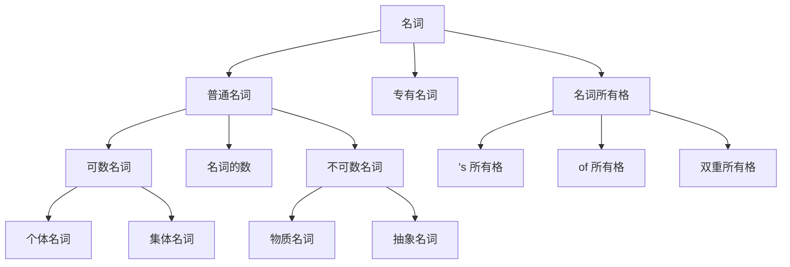

## 普通名词

普通名词（Common Noun）是表示某类人、事物、地点或抽象概念的通用名称。

### 名词的数

普通名词分为 **可数名词** 和 **不可数名词**。

可数名词有 **单数** 和 **复数** 两种形式。

#### 构成规则

1. 一般情况：加 -s。
2. 特殊规则（（为保持发音或拼写规律）。
   1. 以 -s, -x, -sh, -ch 结尾：加 -es。
   2. 以「辅音+y」结尾：将 y 改为 i，再加 -es。
   3. 以 f 或 fe 结尾：将 f 改为 v，再加 -es。
   4. 以 o 结尾：加 -s 或 -es。
3. 不规则变化。

:::tip

以 o 结尾的名词的复数形式：英语本身的普通名词（前为辅音字母），通常加 -es；外来词、缩写、科技词或音节轻的词，通常加 -s。

:::

:::example

- carrot $\to$ carrots
- rabbit $\to$ rabbits

:::

:::example

- box $\to$ boxes
- wish $\to$ wishes
- bus $\to$ buses
- watch $\to$ watches

:::

:::example

- city $\to$ cities
- century $\to$ centuries
- baby $\to$ babies
- country $\to$ countries

:::

:::example

- knife $\to$ knives
- wife $\to$ wives
- leaf $\to$ leaves

:::

:::example

- tomato $\to$ tomatoes
- potato $\to$ potatoes
- hero $\to$ heroes
- mango $\to$ mangoes

:::

:::example

- man $\to$ men
- foot $\to$ feet
- mouse $\to$ mice
- child $\to$ children

:::

### 可数名词

可数名词（Countable Noun）是指能够用数词计算的具体事物。

#### 个体名词

表示个体的人或事物的词。

:::example

- boy、carrot、rabbit

:::

:::tip

名词本身可体现单复数信息，这是字母语言的一大优势。

:::

#### 集体名词

表示一群人或一类事物的词，根据语境可视为单数或复数。

:::example

- family、team、audience、fruit

:::

- **单数用法**：The team is large.
- **复数用法**：The team are working together.
- 有的集合名词只作复数：police、people
- 有的集合名词只作单数：furniture、baggage

### 不可数名词

不可数名词（Uncountable Noun）是无法用数词直接计算的名词，通常无复数形式。

#### 物质名词

表示无法分为个体的东西的词。

:::example

- water、milk、bread、air、beer、wood、paper

:::

- 通常不说 `two waters`，而说 `two glasses of water`
- 若 water 表示“水域”时可数，如：**international waters**

#### 抽象名词

表示状态、品质、行为、感情等抽象概念等词。

:::example

- power、peace、honesty、pleasure

:::

:::tip

有时抽象名词也可数。例如：

- Thank you → It's a pleasure.

此时 pleasure 表示“一件愉快的事”，即具体化。

:::

## 专有名词

表示人、地方、事物、机构、组织等的词，通常 **首字母大写**，一般 **不可数**。

:::example

- 人名：Jack、Harry Potter、Michael
- 地名：Earth、Asia、China、London
- 机构名：United Nations、Bank of China
- 时间名：Monday、August、New Year

:::

:::tip

专有名词在某些语境下可以变为可数：

- There's a Michael downstairs.（泛指众多 Michael 中的一个）
- There are three Michaels in my class.

:::

## 名词所有格

### 's 所有格

用于表示所属关系，常用于有生命的事物，也可用于无生命名词表达性质。

:::example

- The rabbit's carrot（兔子的胡萝卜）
- Michael's computer（Michael 的电脑）
- Tom and Jerry's room（Tom 和 Jerry 共有的房间）
- Today's news（今天的新闻）

:::

:::tip

- 并列名词共有物：在最后一个名词后加 `'s`
- 各自拥有物：各个名词分别加 `'s`，名词变复数

:::

### of 所有格

用于表示关系或特征，结构为：`A of B`，其中 B 修饰 A。

:::example

- The brightness of the moon（月亮的亮度）
- A friend of Michael（Michael 的一个朋友）
- A photo of Michael（Michael 出现在里面的照片）

:::

:::tip

- `A photo of Michael's` → Michael 拍的照片
- `A photo of Michael` → Michael 出现在照片中
- `A friend of Michael's` = one of Michael's friends

:::

### 双重所有格

双重所有格主要表示整体中的一部分，有两种形式：

1. 名词 + of + 's 所有格

:::example

- I am a friend of Michael's.
- That is a photo of Alice's.

:::

2. 名词 + of + 名词性物主代词

:::example

- I lost a book of mine.

:::

## 思维导图

