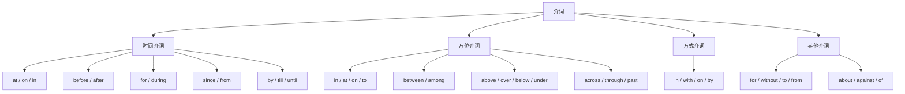

## 简介

**介词**（Preposition）是用在 **名词**、**代词** 或 **名词性结构** 之前，表示其与句子其他成分关系的虚词。

$$
\underbrace{\text{preposition}}_{\text{介词}}
=\underbrace{\text{pre}}_{\text{在……之前}}
+\underbrace{\text{position}}_{\text{位置}}
$$

介词不能单独充当句子成分，必须与后面的 **宾语**（名词、代词、动名词等）组成 **介词短语**。

按语义可分为 4 类：**时间介词**、**方位介词**、**方式介词** 和 **其他介词**。

## 时间介词

### on & at & in

|  介词  |               用法                |            示例            |
| :----: | :-------------------------------: | :------------------------: |
| **at** |         时刻 / 某一时间点         |   at 8 o'clock, at noon    |
| **on** |         具体某一天 / 日期         |   on Monday, on May 1st    |
| **in** | 较长时段（月 / 年 / 季节 / 世纪） | in May, in 2026, in summer |

:::tip

记忆口诀：**at 小（点）、on 中（天）、in 大（段）**。

:::

### after & before

- **before**：在……之前。
- **after**：在……之后。

二者既可作介词（后接名词），也可作连词（后接从句）。

:::example

- I will leave **before** noon.
- We had dinner **after** the meeting.

:::

### for & during

- **for** + **时段**：表示动作 **持续的时间长度**。
- **during** + **时间名词**：表示动作 **发生在某段时间内**。

:::example

- I have lived here **for** ten years.
- He fell asleep **during** the meeting.

:::

### since & from

- **since** + **时间点**：从过去某时 **持续至今**，常与 **完成时态** 连用。
- **from** + **时间点**：仅表示 **起始**，不强调持续。

:::example

- I have studied English **since** 2015.
- The shop is open **from** 9 a.m. to 6 p.m.

:::

### by & till & until

- **by**：**不晚于**，强调最迟期限。
- **till** / **until**：**直到**，强调持续到某一时刻。

:::example

- Finish the report **by** Friday. _(最迟周五前完成)_
- I waited **until** midnight. _(一直等到午夜)_

:::

:::tip

**till** 和 **until** 语义几乎一致，但 **until** 更正式，可用于句首。

:::

## 方位介词

### in & at & on & to

|  介词  |       用法        |     示例     |
| :----: | :---------------: | :----------: |
| **in** | 在某空间 / 范围内 | in the room  |
| **at** | 在某具体地点 / 点 | at the door  |
| **on** |  在……表面 / 接触  | on the desk  |
| **to** |  朝向 / 到达某地  | go to school |

### between & among

- **between**：在 **两者** 之间，或在 **可区分的多者** 之间。
- **among**：在 **三者及以上**（看作整体）之间。

:::example

- The book is **between** Tom and Jerry.
- He sat **among** the crowd.

:::

### above & over & below & under

|   介词    |           用法            |                示例                 |
| :-------: | :-----------------------: | :---------------------------------: |
| **above** | 在……上方（不接触，泛指）  |     The bird flew **above** us.     |
| **over**  | 在……正上方（垂直 / 覆盖） |  A lamp hangs **over** the table.   |
| **below** | 在……下方（不接触，泛指）  | See the note **below** the picture. |
| **under** | 在……正下方（垂直 / 覆盖） |   The cat is **under** the chair.   |

### across & over & through & past

|    介词     |          用法           |            示例             |
| :---------: | :---------------------: | :-------------------------: |
| **across**  | 从 **表面** 穿过 / 横过 | walk **across** the street  |
|  **over**   |    从 **上方** 越过     |   jump **over** the wall    |
| **through** |    从 **内部** 穿过     | walk **through** the forest |
|  **past**   |    从 **旁边** 经过     |  walk **past** the school   |

### behind & beside & inside & outside

|    介词     |       用法       |              示例               |
| :---------: | :--------------: | :-----------------------------: |
| **behind**  |     在……后面     | The cat is **behind** the door. |
| **beside**  | 在……旁边（紧邻） |       Sit **beside** me.        |
| **inside**  |     在……里面     |       **inside** the box        |
| **outside** |     在……外面     |      **outside** the house      |

:::tip

- **beside** = next to（旁边）
- **besides** = in addition to（除……之外，还）

两个词形相近但语义不同，注意区分。

:::

## 方式介词

### in

表示 **语言**、**材料**、**形式**、**穿着** 等。

:::example

- speak **in** English
- written **in** ink
- pay **in** cash
- the girl **in** red

:::

### with

表示 **使用工具** 或 **伴随**。

:::example

- cut **with** a knife
- write **with** a pen
- coffee **with** sugar

:::

### on

表示 **媒介** 或 **方式**。

:::example

- on foot, on TV, on the radio, on the phone

:::

### by

表示 **方式** 或 **手段**，后接 **零冠词** 名词。

:::example

- by bus, by train, by email, by mistake

:::

:::tip

「步行」用 **on foot**，不用 ~~by foot~~。

:::

## 其他介词

### with

- 伴随：a girl **with** long hair
- 工具：write **with** a pen
- 关于：be patient **with** children

### for

- 目的：a gift **for** you
- 原因：thank you **for** your help
- 时长：study **for** two hours
- 支持：vote **for** him

### without

表示 **没有** 或 **不**。

:::example

- He left **without** saying a word.
- Life **without** music is dull.

:::

### to

- 方向：go **to** school
- 对象：give it **to** me
- 时间终点：from 9 **to** 5
- 比较：prefer tea **to** coffee

### from

- 起源：a letter **from** Tom
- 起点：**from** Monday to Friday
- 来源：made **from** wood

:::tip

- **made of** + 材料（看得出原料）：The desk is made **of** wood.
- **made from** + 材料（看不出原料）：Paper is made **from** wood.

:::

### about

- 关于：a book **about** physics
- 大约：**about** twenty people

### against

- 反对：vote **against** the plan
- 靠着：lean **against** the wall

### of

表示 **所属**、**关于** 或 **构成**。

:::example

- the cover **of** the book
- a story **of** love
- a cup **of** tea

:::

## 介词的位置

介词通常位于其宾语之前，但在以下情况可后置：

|    情况    |                    示例                    |
| :--------: | :----------------------------------------: |
| 特殊疑问句 |        What are you looking **at**?        |
|  定语从句  | The man (whom) I spoke **to** is my uncle. |
|  被动语态  |       He is well taken care **of**.        |
| 不定式短语 |      I need a pen to write **with**.       |

## 思维导图

