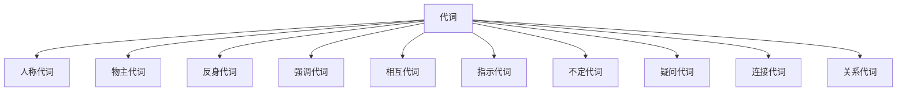

# 代词

代词（Pronoun）是代替名词或名词短语。

$$
\underbrace{\text{pronoun}}_{\text{代词}}
=\underbrace{\text{pro}}_{\text{代替}}
+\underbrace{\text{noun}}_{\text{名词}}
$$

## 人称代词 & 物主代词 & 反身代词

### 表格

<table className="center-table">
  <thead>
    <tr>
      <th rowSpan="2" colSpan="2">人称 / 类别</th>
      <th colSpan="2">人称代词</th>
      <th colSpan="2">物主代词</th>
      <th rowSpan="2">反身代词</th>
    </tr>
    <tr>
      <th>主格</th>
      <th>宾格</th>
      <th>形容词性</th>
      <th>名词性</th>
    </tr>
  </thead>
  <tbody>
    <tr>
      <td rowSpan="2">第一人称</td>
      <td>单数</td>
      <td>I</td>
      <td>me</td>
      <td>my</td>
      <td>mine</td>
      <td>myself</td>
    </tr>
    <tr>
      <td>复数</td>
      <td>we</td>
      <td>us</td>
      <td>our</td>
      <td>ours</td>
      <td>ourselves</td>
    </tr>
    <tr>
      <td rowSpan="2">第二人称</td>
      <td>单数</td>
      <td>you</td>
      <td>you</td>
      <td>your</td>
      <td>yours</td>
      <td>yourself</td>
    </tr>
    <tr>
      <td>复数</td>
      <td>you</td>
      <td>you</td>
      <td>your</td>
      <td>yours</td>
      <td>yourselves</td>
    </tr>
    <tr>
      <td rowSpan="3">第三人称</td>
      <td rowSpan="3">单数</td>
      <td>he</td>
      <td>him</td>
      <td>his</td>
      <td>his</td>
      <td>himself</td>
    </tr>
    <tr>
      <td>she</td>
      <td>her</td>
      <td>her</td>
      <td>hers</td>
      <td>herself</td>
    </tr>
    <tr>
      <td>it</td>
      <td>it</td>
      <td>its</td>
      <td>its</td>
      <td>itself</td>
    </tr>
    <tr>
      <td>第三人称</td>
      <td>复数</td>
      <td>they</td>
      <td>them</td>
      <td>their</td>
      <td>theirs</td>
      <td>themselves</td>
    </tr>
  </tbody>
</table>

### 人称代词

#### 主格

- 主格：动词前面。

#### 宾格

- 宾格：动词和介词后面。

:::tip

人称代词的顺序：第二人称、第一人称、第三人称（表达承认错误或担当责任时，将第一人称放在前面）。

:::

### 物主代词

#### 形容词性

- 形容词性物主代词：加名词。

#### 名词性

- 名词性物主代词：不加动词。
- 形物代 + 名词 = 名物代。

### 反身代词

## 不定代词

### 普通不定代词

#### both & either & all & neither & none

#### other & another & others & the other & the others

#### some & any

#### few & a few & little & a little

#### many & much

#### each & every

### 复合不定代词

|  类别  |   some-   |   any-   |   every-   |   no-   |
| :----: | :-------: | :------: | :--------: | :-----: |
|  -one  |  someone  |  anyone  |  everyone  | no one  |
| -body  | somebody  | anybody  | everybody  | nobody  |
| -thing | something | anything | everything | nothing |

## 指示代词

## 疑问代词

## 思维导图

