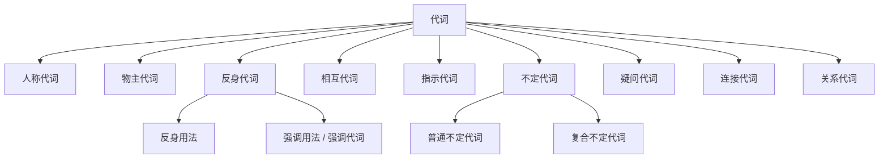

代词（Pronoun）是代替名词或名词短语。

$$
\underbrace{\text{pronoun}}_{\text{代词}}
=\underbrace{\text{pro}}_{\text{代替}}
+\underbrace{\text{noun}}_{\text{名词}}
$$

## 人称代词 & 物主代词 & 反身代词

### 表格

<table style={{ textAlign: 'center' }}>
  <thead>
    <tr>
      <th rowSpan="2" colSpan="2">
        人称 / 类别
      </th>
      <th colSpan="2">人称代词</th>
      <th colSpan="2">物主代词</th>
      <th rowSpan="2">反身代词</th>
    </tr>
    <tr>
      <th>主格</th>
      <th>宾格</th>
      <th>形容词性</th>
      <th>名词性</th>
    </tr>
  </thead>
  <tbody>
    <tr>
      <td rowSpan="2">第一人称</td>
      <td>单数</td>
      <td>I</td>
      <td>me</td>
      <td>my</td>
      <td>mine</td>
      <td>myself</td>
    </tr>
    <tr>
      <td>复数</td>
      <td>we</td>
      <td>us</td>
      <td>our</td>
      <td>ours</td>
      <td>ourselves</td>
    </tr>
    <tr>
      <td rowSpan="2">第二人称</td>
      <td>单数</td>
      <td>you</td>
      <td>you</td>
      <td>your</td>
      <td>yours</td>
      <td>yourself</td>
    </tr>
    <tr>
      <td>复数</td>
      <td>you</td>
      <td>you</td>
      <td>your</td>
      <td>yours</td>
      <td>yourselves</td>
    </tr>
    <tr>
      <td rowSpan="4">第三人称</td>
      <td rowSpan="3">单数</td>
      <td>he</td>
      <td>him</td>
      <td>his</td>
      <td>his</td>
      <td>himself</td>
    </tr>
    <tr>
      <td>she</td>
      <td>her</td>
      <td>her</td>
      <td>hers</td>
      <td>herself</td>
    </tr>
    <tr>
      <td>it</td>
      <td>it</td>
      <td>its</td>
      <td>its</td>
      <td>itself</td>
    </tr>
    <tr>
      <td>复数</td>
      <td>they</td>
      <td>them</td>
      <td>their</td>
      <td>theirs</td>
      <td>themselves</td>
    </tr>
  </tbody>
</table>

### 人称代词

**人称代词**（Personal Pronoun）用于代替前文出现过的人或事物。

#### 主格

**主格** 在句中通常作 **主语**，位于动词前面。

:::example

- **He** is a teacher.
- **They** are playing football.

:::

#### 宾格

**宾格** 在句中通常作 **宾语**，位于 **动词** 或 **介词** 后面。

:::example

- I saw **him** yesterday.
- This gift is for **her**.

:::

:::tip

人称代词的并列顺序：**第二人称 → 第三人称 → 第一人称**（2-3-1），即 **you and I**、**he and I**、**you, he and I**。

承认错误或承担责任时，将 **第一人称放在前面**（1-2-3），即 **I and you are to blame**。

:::

:::example

- **You and I** are good friends. _(常态顺序)_
- **I and Tom** broke the window. _(担责顺序)_

:::

### 物主代词

**物主代词**（Possessive Pronoun）表示 **所属关系**，分为 **形容词性** 和 **名词性** 两种。

#### 形容词性

**形容词性物主代词** 后必须加 **名词**，作 **定语**。

:::example

- **My** book is on the desk.
- **Their** house is large.

:::

#### 名词性

**名词性物主代词** 后 **不加名词**，本身相当于「形容词性物主代词 + 名词」。

$$
\underbrace{\text{形容词性物主代词}+\text{名词}}_{\text{my book}}
=\underbrace{\text{名词性物主代词}}_{\text{mine}}
$$

:::example

- This book is **mine**. _(= my book)_
- **Yours** is on the shelf. _(= your book)_

:::

:::tip

**its** 与 **it's**、**their** 与 **they're**、**your** 与 **you're**、**whose** 与 **who's** 是常见的拼写混淆。带 `'s` / `'re` 的都是 **be 动词缩写**，不是物主代词。

:::

:::example

- The dog wagged **its** tail. _(物主代词)_
- **It's** raining. _(= it is)_

:::

### 反身代词

**反身代词**（Reflexive Pronoun）由「物主代词 / 宾格 + -self / -selves」构成，表示 **动作回到主语自身**。

#### 反身用法

当句子的 **主语** 与 **宾语** 是 **同一个人 / 物** 时，宾语必须用反身代词。

:::example

- He hurt **himself**.
- Take care of **yourself**.
- The cat is washing **itself**.

:::

反身代词也常用于固定短语：

| 短语                 | 含义         |
| :------------------- | :----------- |
| by oneself           | 独自；独立地 |
| help oneself to      | 自取（食物） |
| enjoy oneself        | 玩得开心     |
| teach oneself        | 自学         |
| make oneself at home | 别拘束       |
| lose oneself in      | 沉浸于       |

#### 强调用法

反身代词放在 **被强调的名词或代词之后**，或 **句末**，起 **强调作用**，去掉不影响句子结构，这种用法又称 **强调代词**（Emphatic Pronoun）。

:::example

- The president **himself** answered the phone.
- I did the work **myself**.

:::

:::tip

如何区分「反身用法」与「强调用法」：

- **反身**：充当句子成分（宾语 / 表语），去掉句子不完整。
- **强调**：不充当句子成分，去掉句子仍完整。

:::

## 相互代词

**相互代词**（Reciprocal Pronoun）表示动作 **互相之间** 发生，只有两个：**each other** 和 **one another**。

|    代词     |   传统区分（已弱化）    |                  示例                   |
| :---------: | :---------------------: | :-------------------------------------: |
| each other  |      两者 **之间**      |   Tom and Jerry love **each other**.    |
| one another | **三者及以上** 相互之间 | The team members trust **one another**. |

:::tip

现代英语中 **each other** 与 **one another** 已基本通用，「两者 / 多者」的区分仅在严格的正式写作中保留。

相互代词有 **所有格** 形式：**each other's**、**one another's**。

:::

:::example

- They borrowed **each other's** notes.

:::

## 指示代词

**指示代词**（Demonstrative Pronoun）用于 **指示** 特定的人或物，共 4 个。

| 代词  |  数  |      距离 / 时间      |           示例            |
| :---: | :--: | :-------------------: | :-----------------------: |
| this  | 单数 | 近指（空间 / 时间近） |   **This** is my book.    |
| these | 复数 | 近指（空间 / 时间近） | **These** are my friends. |
| that  | 单数 | 远指（空间 / 时间远） | **That** was a long day.  |
| those | 复数 | 远指（空间 / 时间远） | **Those** were the days.  |

### 用法

|      用法       |                         示例                         |
| :-------------: | :--------------------------------------------------: |
|   指代人或物    |               **This** is my brother.                |
| 电话 / 介绍他人 |      **This** is Tom speaking. _(电话自我介绍)_      |
|  避免重复名词   | The weather here is better than **that** of Beijing. |
| 指代前文 / 后文 |               **That** is what I mean.               |

:::tip

电话中介绍自己用 **this**（这里），询问对方用 **that**（那边）：

- This is Tom (speaking). _(我是 Tom)_
- Is **that** Jerry? _(你是 Jerry 吗?)_

这与中文「我是…… / 您是……」的指向相反，需特别注意。

:::

## 疑问代词

**疑问代词**（Interrogative Pronoun）用于构成 **特殊疑问句**，对人、物、所属等提问。

| 代词  |    询问对象    |       在从句中成分        |             示例             |
| :---: | :------------: | :-----------------------: | :--------------------------: |
|  who  |   人（主格）   |        主语 / 表语        |     **Who** is calling?      |
| whom  |   人（宾格）   |     动词 / 介词的宾语     |  To **whom** did you speak?  |
| whose |    所属关系    |       定语 / 名词性       |   **Whose** book is this?    |
| what  |  事物 / 职业   | 主语 / 宾语 / 表语 / 定语 |    **What** do you want?     |
| which | 一定范围内选择 |    主语 / 宾语 / 定语     | **Which** color do you like? |

:::tip

**what** 与 **which** 的区别：

- **what**：在 **无限定范围** 内提问。
- **which**：在 **限定范围** 内选择。

例如「你喜欢什么颜色？」是 _What color do you like?_；「红色和蓝色你喜欢哪种？」是 _Which color do you like, red or blue?_

:::

:::tip

口语中 **who** 常代替 **whom** 作宾语，但在介词之后必须用 **whom**：

- **Who** did you see? _(口语)_
- To **whom** did you speak? _(正式)_

:::

## 不定代词

**不定代词**（Indefinite Pronoun）指代 **不确定的** 人或事物，分为 **普通不定代词** 和 **复合不定代词**。

### 普通不定代词

#### both & either & all & neither & none

按 **数量** 与 **肯定 / 否定** 区分：

|  代词   |    数量    | 肯否 |      语义       |         示例          |
| :-----: | :--------: | :--: | :-------------: | :-------------------: |
|  both   |    两者    | 肯定 |     两者都      |  **Both** are right.  |
| either  |    两者    | 肯定 | 两者中任一 / 都 |  **Either** will do.  |
| neither |    两者    | 否定 |    两者都不     | **Neither** is right. |
|   all   | 三者及以上 | 肯定 |     全部都      |   **All** are here.   |
|  none   | 三者及以上 | 否定 |    全部都不     |   **None** is here.   |

:::tip

- **both** 作主语时谓语用 **复数**。
- **either / neither** 作主语时谓语用 **单数**。
- **all / none** 作主语时，可数用复数、不可数用单数。

:::

:::example

- **Both** of them **are** my friends.
- **Neither** of the answers **is** correct.
- **None** of the water **was** wasted.

:::

#### other & another & others & the other & the others

|    代词    |        含义        |           限定性           |            说明             |
| :--------: | :----------------: | :------------------------: | :-------------------------: |
|  another   |       另一个       | 不限定（从多个中再取一个） |    后接 **单数可数名词**    |
|   other    |       其他的       |          形容词性          |  后接 **名词**，通常用复数  |
|   others   |    其他人 / 物     |       不限定（泛指）       | =other + 复数名词，泛指其他 |
| the other  | 另一个（两者中的） |     限定（两者剩下的）     |          通常单数           |
| the others |   其余的（全部）   |  限定（一组中剩下的全部）  |   = the other + 复数名词    |

:::tip

记忆口诀：**one... the other**（两个之间），**some... others**（多个泛指），**some... the others**（多个中剩下全部）。

:::

:::example

- I have two pens; one is red, **the other** is blue.
- Some students like math, **others** like English.
- Of the ten apples, three are rotten and **the others** are fresh.
- Would you like **another** cup of tea?

:::

#### some & any

二者均表示「**一些**」，区别在 **句型**。

| 代词 |           典型句型            |                             示例                             |
| :--: | :---------------------------: | :----------------------------------------------------------: |
| some | 肯定句、表请求 / 邀请的疑问句 |  I have **some** questions. / Would you like **some** tea?   |
| any  |  否定句、一般疑问句、条件句   | I don't have **any** money. / Do you have **any** questions? |

:::tip

**any** 出现在肯定句中表示「**任何一个**」，强调泛指。

:::

:::example

- **Any** child can do this. _(任何一个孩子)_
- You may take **any** book you like.

:::

#### few & a few & little & a little

按 **可数 / 不可数** 与 **肯定 / 否定** 区分：

|   代词   |  修饰对象  |     语义倾向     |                   示例                    |
| :------: | :--------: | :--------------: | :---------------------------------------: |
|   few    |  可数名词  | 否定（几乎没有） |  He has **few** friends. _(没什么朋友)_   |
|  a few   |  可数名词  |   肯定（一些）   | He has **a few** friends. _(有几个朋友)_  |
|  little  | 不可数名词 | 否定（几乎没有） |  There is **little** water. _(几乎没水)_  |
| a little | 不可数名词 |   肯定（一些）   | There is **a little** water. _(有一些水)_ |

:::tip

加上 **a** 后语义由 **消极** 转为 **积极**，这是该组词最易混淆之处。

:::

#### many & much

二者均表示「**许多**」，按 **可数 / 不可数** 区分。

| 代词 |  修饰对象  |           示例           |
| :--: | :--------: | :----------------------: |
| many |  可数名词  |  I have **many** books.  |
| much | 不可数名词 | There is **much** water. |

:::tip

**a lot of** / **lots of** 可同时修饰可数与不可数名词，是 **many** / **much** 的常用替代，在口语中更自然。

**much** 在肯定句中较少单独使用，常用于否定句和疑问句。

:::

#### each & every

二者均表示「**每一个**」，但 **侧重点** 不同。

| 代词  |        侧重点        |     词性      |             示例             |
| :---: | :------------------: | :-----------: | :--------------------------: |
| each  |   **个体**（逐个）   | 代词 / 形容词 |  **Each** of us has a book.  |
| every | **整体**（无一例外） |   仅形容词    | **Every** student must come. |

:::tip

- **each** 可单独作主语 / 宾语；**every** 只能作 **定语**。
- **each** 用于 **两者及以上**；**every** 用于 **三者及以上**。
- 谓语都用 **单数**。

:::

:::example

- **Each** of the students has a textbook.
- **Every** student has a textbook.

:::

### 复合不定代词

由 **some- / any- / every- / no-** 加 **-one / -body / -thing** 构成 12 个 **复合不定代词**。

|  类别  |   some-   |   any-   |   every-   |   no-   |
| :----: | :-------: | :------: | :--------: | :-----: |
|  -one  |  someone  |  anyone  |  everyone  | no one  |
| -body  | somebody  | anybody  | everybody  | nobody  |
| -thing | something | anything | everything | nothing |

:::tip

复合不定代词的用法要点：

1. 作主语时谓语用 **单数**。
2. 形容词 **后置** 修饰（something **important**，不是 ~~important something~~）。
3. **no one** 是唯一 **分写** 的形式，其余都连写。
4. **-one** 与 **-body** 含义相同，前者更书面。

:::

:::example

- **Someone** is knocking at the door.
- I have **nothing important** to say.
- **Everyone** **was** happy.

:::

## 连接代词

**连接代词**（Conjunctive Pronoun）引导 **名词性从句**（主语从句、宾语从句、表语从句、同位语从句），且 **在从句中充当成分**（详见 [从句](/docs/note/english/grammar/sentences/clauses)）。

常见连接代词：**who / whom / whose / what / which / whatever / whoever / whichever**。

:::example

- I don't know **who** he is. _(who 在从句中作表语)_
- Tell me **what** you want. _(what 在从句中作宾语)_
- **Whoever** breaks the rule will be punished. _(whoever 引导主语从句)_

:::

## 关系代词

**关系代词**（Relative Pronoun）引导 **定语从句**，**代替先行词** 并 **在从句中充当成分**（详见 [从句](/docs/note/english/grammar/sentences/clauses)）。

常见关系代词：**who / whom / whose / which / that / as**。

| 关系代词 | 先行词  |    在从句中成分    |
| :------: | :-----: | :----------------: |
|   who    |   人    |    主语 / 宾语     |
|   whom   |   人    |  动词 / 介词宾语   |
|  whose   | 人 / 物 |        定语        |
|  which   |   物    |    主语 / 宾语     |
|   that   | 人 / 物 |    主语 / 宾语     |
|    as    | 人 / 物 | 主语 / 宾语 / 表语 |

:::example

- The man **who** called me is my uncle.
- The book **which / that** I bought is interesting.
- The girl **whose** hair is long is my sister.

:::

:::tip

**连接代词** 与 **关系代词** 形式重合（who / whom / whose / which / what），区别在于：

- **连接代词**：引导 **名词性从句**，无先行词。
- **关系代词**：引导 **定语从句**，必有先行词，且代替它。

**that** 只作关系代词，不作连接代词。**what** 只作连接代词，不作关系代词。

:::

## 思维导图

