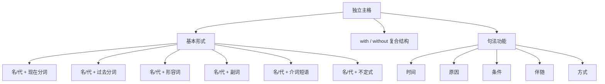

## 简介

**独立主格**（Absolute Construction）是由 **名词 / 代词** 与 **非谓语动词 / 形容词 / 副词 / 介词短语** 构成的 **逻辑主谓结构**。

独立主格在句中作 **状语**，逻辑主语 **不同于** 主句主语，故称「独立」。

$$
\underbrace{\text{逻辑主语}}_{\text{名词 / 代词}}+\underbrace{\text{非谓语 / 形容词 / 副词 / 介词短语}}_{\text{逻辑谓语}}
$$

独立主格在结构上 **不是从句**（无谓语动词），但在功能上 **等价于状语从句**。

## 基本形式

按逻辑谓语的形式可分为 6 种。

### 名词 / 代词 + 现在分词

逻辑主语与逻辑谓语为 **主动** 关系。

:::example

- **Weather permitting**, we'll have a picnic.
- **The sun rising**, we set out.
- **Time permitting**, I will visit you.

:::

### 名词 / 代词 + 过去分词

逻辑主语与逻辑谓语为 **被动** 或 **完成** 关系。

:::example

- **The work done**, they went home.
- **His homework finished**, he watched TV.
- **All things considered**, your plan is best.

:::

### 名词 / 代词 + 形容词

形容词描述逻辑主语的 **状态**。

:::example

- He sat there, **his face red with anger**.
- She fell asleep, **the lamp still on**.

:::

### 名词 / 代词 + 副词

副词表示位置、方向等。

:::example

- The meeting **over**, everyone left.
- **Class over**, students rushed out.

:::

### 名词 / 代词 + 介词短语

介词短语描述逻辑主语的 **状态** 或 **位置**。

:::example

- He stood there, **his hands in his pockets**.
- She walked in, **a book under her arm**.

:::

### 名词 / 代词 + 不定式

不定式表示 **将来动作**。

:::example

- **So much work to do**, I cannot rest.
- **A lot of things to attend to**, I had to stay up late.

:::

## with / without 复合结构

由 **with / without** 引导的复合结构是独立主格的常见形式。

$$
\text{with / without}+\text{宾语}+\text{宾语补语}
$$

宾语补语可以是 **现在分词**、**过去分词**、**形容词**、**副词**、**介词短语**、**不定式** 或 **名词**。

| 宾语补语形式 |               示例                |
| :----------: | :-------------------------------: |
|   现在分词   | with the sun **shining** brightly |
|   过去分词   |      with the work **done**       |
|    形容词    |    with his eyes **wide open**    |
|     副词     |       with the light **on**       |
|   介词短语   |    with a book **in his hand**    |
|    不定式    |    with so much work **to do**    |
|     名词     |     with him **as my friend**     |

:::example

- **With the sun shining brightly**, we set off.
- **With the door closed**, the room was quiet.
- He sat there **with his eyes closed**.
- **With so many problems to solve**, I felt stressed.

:::

:::tip

**with** 结构和 **without** 结构在语法上完全对称，只是语义相反。

:::

:::example

- **Without anyone noticing**, he slipped out.

:::

## 句法功能

独立主格在主句中充当 **状语**，可表示 **时间、原因、条件、伴随、方式** 等。

### 时间状语

:::example

- **The lecture being over**, we left the hall.

:::

### 原因状语

:::example

- **The weather being fine**, we went swimming.
- **There being no taxi**, we had to walk home.

:::

### 条件状语

:::example

- **Weather permitting**, we'll start tomorrow.
- **Other things being equal**, this one is the best.

:::

### 伴随状语

:::example

- He stood at the door, **his hands behind his back**.
- She came in, **a baby in her arms**.

:::

### 方式状语

:::example

- He walked away, **his head held high**.

:::

## 易错点

### 与状语从句的区别

|     类型     |  逻辑主语   | 谓语形式 |              示例               |
| :----------: | :---------: | :------: | :-----------------------------: |
| **状语从句** |  从句主语   | 谓语动词 | When the rain stopped, we left. |
| **独立主格** | 名词 / 代词 | 非谓语等 |   The rain stopping, we left.   |

### 与分词状语的区别

|     类型     |            逻辑主语             |
| :----------: | :-----------------------------: |
| **分词状语** |       与主句主语 **一致**       |
| **独立主格** | 与主句主语 **不一致**，自带主语 |

:::example

- **Walking down the street**, I met an old friend. _(分词状语，I 走街上)_
- **The street being crowded**, I had to walk slowly. _(独立主格，街拥挤)_

:::

### there being 结构

**there is** 句型的非谓语形式为 **there being**，常作独立主格。

:::example

- **There being no time left**, we had to hurry.
- **There being a flood**, the road was closed.

:::

### it being 结构

**it is** 句型的非谓语形式为 **it being**。

:::example

- **It being late**, we went home.
- **It being rainy**, the game was cancelled.

:::

## 思维导图

