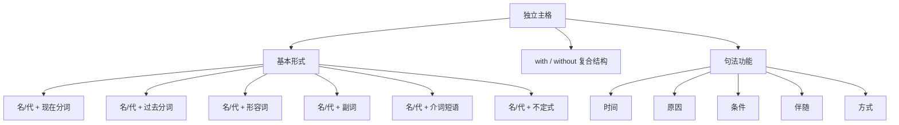

## 简介

**独立主格**（Absolute Construction）是由 **名词 / 代词** 与 **非谓语动词 / 形容词 / 副词 / 介词短语** 构成的 **逻辑主谓结构**。

独立主格在句中作 **状语**，逻辑主语 **不同于** 主句主语，故称「独立」。

$$
\underbrace{\text{逻辑主语}}_{\text{名词 / 代词}}+\underbrace{\text{非谓语 / 形容词 / 副词 / 介词短语}}_{\text{逻辑谓语}}
$$

独立主格在结构上 **不是从句**（无谓语动词），但在功能上 **等价于状语从句**。

## 基本形式

按逻辑谓语的形式可分为 6 种。

### 名词 / 代词 + 现在分词

逻辑主语与逻辑谓语为 **主动** 关系。

:::example

- **Weather permitting**, we'll have a picnic.（天气允许的话，我们就去野餐。）
- **The sun rising**, we set out.（太阳升起，我们便出发了。）
- **Time permitting**, I will visit you.（时间允许的话，我会去看你。）

:::

### 名词 / 代词 + 过去分词

逻辑主语与逻辑谓语为 **被动** 或 **完成** 关系。

:::example

- **The work done**, they went home.（工作做完了，他们就回家了。）
- **His homework finished**, he watched TV.（作业写完后，他看了电视。）
- **All things considered**, your plan is best.（综合考虑，你的方案最好。）

:::

### 名词 / 代词 + 形容词

形容词描述逻辑主语的 **状态**。

:::example

- He sat there, **his face red with anger**.（他坐在那里，气得满脸通红。）
- She fell asleep, **the lamp still on**.（她睡着了，灯还亮着。）

:::

### 名词 / 代词 + 副词

副词表示位置、方向等。

:::example

- The meeting **over**, everyone left.（会议结束，大家都离开了。）
- **Class over**, students rushed out.（下课后，学生们冲了出去。）

:::

### 名词 / 代词 + 介词短语

介词短语描述逻辑主语的 **状态** 或 **位置**。

:::example

- He stood there, **his hands in his pockets**.（他站在那里，双手插在口袋里。）
- She walked in, **a book under her arm**.（她走了进来，腋下夹着一本书。）

:::

### 名词 / 代词 + 不定式

不定式表示 **将来动作**。

:::example

- **So much work to do**, I cannot rest.（有那么多工作要做，我无法休息。）
- **A lot of things to attend to**, I had to stay up late.（有很多事要处理，我只好熬夜。）

:::

## with / without 复合结构

由 **with / without** 引导的复合结构是独立主格的常见形式。

$$
\text{with / without}+\text{宾语}+\text{宾语补语}
$$

宾语补语可以是 **现在分词**、**过去分词**、**形容词**、**副词**、**介词短语**、**不定式** 或 **名词**。

| 宾语补语形式 |                        示例                         |
| :----------: | :-------------------------------------------------: |
|   现在分词   | with the sun **shining** brightly（阳光灿烂地照着） |
|   过去分词   |        with the work **done**（工作已完成）         |
|    形容词    |     with his eyes **wide open**（他睁大着眼睛）     |
|     副词     |           with the light **on**（灯开着）           |
|   介词短语   |    with a book **in his hand**（手里拿着一本书）    |
|    不定式    |   with so much work **to do**（有那么多工作要做）   |
|     名词     |    with him **as my friend**（有他作为我的朋友）    |

:::example

- **With the sun shining brightly**, we set off.（阳光灿烂，我们便出发了。）
- **With the door closed**, the room was quiet.（门关着，房间里很安静。）
- He sat there **with his eyes closed**.（他闭着眼睛坐在那里。）
- **With so many problems to solve**, I felt stressed.（有那么多问题要解决，我感到压力很大。）

:::

:::tip

**with** 结构和 **without** 结构在语法上完全对称，只是语义相反。

:::

:::example

- **Without anyone noticing**, he slipped out.（没有人注意，他悄悄溜了出去。）

:::

## 句法功能

独立主格在主句中充当 **状语**，可表示 **时间、原因、条件、伴随、方式** 等。

### 时间状语

:::example

- **The lecture being over**, we left the hall.（讲座结束，我们离开了礼堂。）

:::

### 原因状语

:::example

- **The weather being fine**, we went swimming.（天气晴朗，我们去游泳了。）
- **There being no taxi**, we had to walk home.（没有出租车，我们只好走回家。）

:::

### 条件状语

:::example

- **Weather permitting**, we'll start tomorrow.（天气允许的话，我们明天就动身。）
- **Other things being equal**, this one is the best.（其他条件相同的话，这个是最好的。）

:::

### 伴随状语

:::example

- He stood at the door, **his hands behind his back**.（他站在门口，双手背在身后。）
- She came in, **a baby in her arms**.（她走了进来，怀里抱着一个婴儿。）

:::

### 方式状语

:::example

- He walked away, **his head held high**.（他昂首离去。）

:::

## 易错点

### 与状语从句的区别

|     类型     |  逻辑主语   | 谓语形式 |                           示例                            |
| :----------: | :---------: | :------: | :-------------------------------------------------------: |
| **状语从句** |  从句主语   | 谓语动词 | When the rain stopped, we left.（雨停后，我们就离开了。） |
| **独立主格** | 名词 / 代词 | 非谓语等 |   The rain stopping, we left.（雨停了，我们就离开了。）   |

### 与分词状语的区别

|     类型     |            逻辑主语             |
| :----------: | :-----------------------------: |
| **分词状语** |       与主句主语 **一致**       |
| **独立主格** | 与主句主语 **不一致**，自带主语 |

:::example

- **Walking down the street**, I met an old friend.（走在街上，我遇到了一位老朋友。）_(分词状语，I 走街上)_
- **The street being crowded**, I had to walk slowly.（街上很拥挤，我只好慢慢走。）_(独立主格，街拥挤)_

:::

### there being 结构

**there is** 句型的非谓语形式为 **there being**，常作独立主格。

:::example

- **There being no time left**, we had to hurry.（没有时间了，我们只好赶快。）
- **There being a flood**, the road was closed.（发了洪水，道路被封了。）

:::

### it being 结构

**it is** 句型的非谓语形式为 **it being**。

:::example

- **It being late**, we went home.（天晚了，我们就回家了。）
- **It being rainy**, the game was cancelled.（天下雨，比赛取消了。）

:::

## 思维导图

