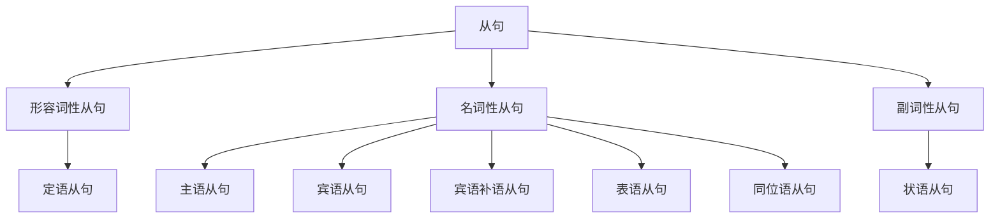

[TODO]

```mermaid
graph TD;
    A1[从句];
    A1 --> B1[形容词性从句];
    A1 --> B2[名词性从句];
    A1 --> B3[副词性从句];
    B1 --> C1[定语从句];
    B2 --> C2[主语从句];
    B2 --> C3[宾语从句];
    B2 --> C4[宾语补语从句];
    B2 --> C5[表语从句];
    B2 --> C6[同位语从句];
    B3 --> C7[状语从句];
```
