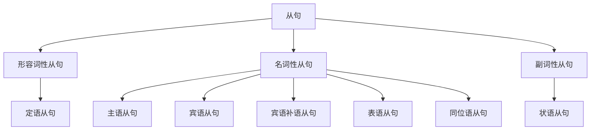

## 简介

**从句**（Subordinate Clause）是 **不能独立成句**、必须依附主句存在的结构。

从句本身包含 **主语** 和 **谓语**，但充当主句的某个成分。

按 **语法功能** 可分为 3 大类：

- **名词性从句**：在主句中充当 **名词** 的位置（主语、宾语、表语、同位语）。
- **形容词性从句**：又称 **定语从句**，修饰名词或代词。
- **副词性从句**：又称 **状语从句**，修饰动词、形容词、副词或整个主句。

## 名词性从句

**名词性从句**（Nominal Clause）在主句中占据名词的句法位置。

按功能可分为 5 种：**主语从句**、**宾语从句**、**表语从句**、**宾语补语从句**、**同位语从句**。

### 引导词

|  引导词类型  |          常见引导词           |
| :----------: | :---------------------------: |
| **从属连词** |       that, whether, if       |
| **连接代词** | who, whom, whose, what, which |
| **连接副词** |     when, where, why, how     |

:::tip

引导词的选择规则：

- **that**：陈述意义，**不充当从句成分**。
- **whether / if**：「是否」之意，**if** 只用于宾语从句。
- **wh-** 类：表 **疑问意义**，**在从句中充当成分**。

:::

### 主语从句

**主语从句** 充当主句的主语。

直接置于句首，或用 **形式主语 it** 替代，真正从句后置。

:::example

- **That he is honest** is well-known.（他很诚实这一点众所周知。）
- **It** is well-known **that he is honest**.（他很诚实这一点众所周知。）_(更常用)_
- **What he said** surprised us.（他所说的话让我们感到惊讶。）

:::

形式主语句型常见结构：

|          句型           |                         示例                          |
| :---------------------: | :---------------------------------------------------: |
|  It is + 形容词 + that  |   It is clear that he is right.（很明显他是对的。）   |
|   It is + 名词 + that   | It is a pity that you can't come.（很遗憾你不能来。） |
| It seems / happens that |     It seems that he is angry.（他似乎生气了。）      |

### 宾语从句

**宾语从句** 充当 **动词** 或 **介词** 的宾语。

:::example

- I know **that he is right**.（我知道他是对的。）
- I wonder **whether she will come**.（我想知道她是否会来。）
- I am sure **of what he said**.（我对他所说的话很确信。）

:::

引导词 **that** 在宾语从句中通常可省略，但下列情况不可省略：

- 多个并列宾语从句中的 **第二个及之后**。
- 主句和从句之间隔有其他成分。
- that 引导的主语从句、表语从句、同位语从句。

:::example

- He said **that** he was tired and **that** he wanted to rest.（他说他累了，想休息。）

:::

#### 时态呼应

主句为 **过去时态** 时，宾语从句通常使用 **相应的过去时态**。

|   主句   | 从句变化 |                        示例                        |
| :------: | :------: | :------------------------------------------------: |
| 一般现在 | 一般过去 |      He said he **was** ill.（他说他病了。）       |
| 现在完成 | 过去完成 | He said he **had finished**.（他说他已经完成了。） |
| 一般将来 | 过去将来 |     He said he **would come**.（他说他会来。）     |

:::tip

从句陈述 **客观真理**、**自然规律**、**习惯动作** 时，不受主句时态影响，始终用 **一般现在时态**。

:::

:::example

- The teacher said the earth **goes** around the sun.（老师说地球绕着太阳转。）

:::

### 表语从句

**表语从句** 充当主句的表语，置于 **连系动词** 之后。

:::example

- The truth is **that he lied**.（事实是他撒谎了。）
- The question is **whether we should go**.（问题是我们是否该去。）
- This is **what I want**.（这就是我想要的。）

:::

### 宾语补语从句

**宾语补语从句** 充当宾语补语，常见于 **make, find, think, consider** 等动词后。

:::example

- We considered it strange **that he didn't come**.（我们觉得他没来很奇怪。）
- I find **it** difficult **to understand him**.（我觉得理解他很难。）

:::

### 同位语从句

**同位语从句** 跟在 **抽象名词** 后，对该名词进行 **解释或说明**。

常接同位语从句的名词：fact, news, idea, belief, hope, suggestion, doubt, opinion, …

:::example

- The news **that he won the prize** spread quickly.（他获奖的消息很快传开了。）
- I have no doubt **that he is honest**.（我毫不怀疑他是诚实的。）

:::

#### 同位语从句 vs. 定语从句

|      类型      | 引导词 that 在从句中作用 |                                示例                                |
| :------------: | :----------------------: | :----------------------------------------------------------------: |
| **同位语从句** |   不作成分（解释名词）   |     The fact that he lied is clear.（他撒谎这一事实很清楚。）      |
|  **定语从句**  | 充当从句成分（修饰名词） | The fact that he told us is clear.（他告诉我们的那个事实很清楚。） |

## 形容词性从句

**形容词性从句**（Adjective Clause），又称 **定语从句**（Relative Clause），用于修饰 **名词** 或 **代词**。

被修饰的词称为 **先行词**（Antecedent）。

### 引导词

|  引导词类型  |              常见词               |    在从句中的作用    |
| :----------: | :-------------------------------: | :------------------: |
| **关系代词** | who, whom, whose, which, that, as | 充当主语、宾语、定语 |
| **关系副词** |         when, where, why          |       充当状语       |

| 引导词 | 适用先行词 | 在从句中作用 |                                   示例                                   |
| :----: | :--------: | :----------: | :----------------------------------------------------------------------: |
|  who   |     人     |  主语、宾语  |          The man who came is my uncle.（来的那个人是我叔叔。）           |
|  whom  |     人     |     宾语     |       The man whom I met is my uncle.（我遇到的那个人是我叔叔。）        |
| whose  |  人 / 物   |     定语     |       The boy whose father is a doctor.（父亲是医生的那个男孩。）        |
| which  |     物     |  主语、宾语  |                 The book which I read.（我读的那本书。）                 |
|  that  |  人 / 物   |  主语、宾语  | The man that came / The book that I read.（来的那个人 / 我读的那本书。） |
|  when  | 表时间名词 |   时间状语   |               The day when I met him.（我遇到他的那天。）                |
| where  | 表地点名词 |   地点状语   |               The place where I live.（我住的那个地方。）                |
|  why   |   reason   |   原因状语   |                  The reason why I came.（我来的原因。）                  |

### 限制性 vs. 非限制性

|         类型         |           特征           |                                 示例                                  |
| :------------------: | :----------------------: | :-------------------------------------------------------------------: |
|  **限制性定语从句**  | 修饰先行词不可缺，无逗号 | The boy who is reading is my brother.（正在读书的那个男孩是我弟弟。） |
| **非限制性定语从句** |   补充说明，用逗号隔开   |    My father, who is a doctor, is busy.（我父亲是医生，他很忙。）     |

:::tip

**非限制性定语从句** 不能用 **that** 引导。

:::

### 关系代词 that 与 which 的选择

下列情况只能用 **that**：

- 先行词被 **最高级**、**序数词**、**all, every, no, any, only** 等修饰。
- 先行词为 **不定代词**（something, anything, nothing, all, everything）。
- 先行词同时包含 **人和物**。

:::example

- This is the **best book that** I have ever read.（这是我读过的最好的书。）
- All **that** glitters is not gold.（闪光的未必都是金子。）

:::

下列情况只能用 **which**：

- 引导 **非限制性定语从句**。
- 介词后置时（in which, of which）。

### 介词 + 关系代词

介词可前置或后置。

- **前置**：only with whom, in which 等。
- **后置**：whom...with, that...in 等。

:::example

- The man **with whom** I spoke is my uncle.（和我交谈的那个人是我叔叔。）
- The man **whom** I spoke **with** is my uncle.（和我交谈的那个人是我叔叔。）
- The man **that** I spoke **with** is my uncle.（和我交谈的那个人是我叔叔。）_(介词后置，可用 that)_

:::

## 副词性从句

**副词性从句**（Adverbial Clause），又称 **状语从句**，用于修饰 **动词**、**形容词**、**副词** 或 **整个主句**。

按语义可分为 9 类，引导词详见 [连词](/docs/note/english/grammar/parts-of-speech/conjunctions)。

### 时间状语从句

引导词：when, while, as, before, after, since, until / till, as soon as, once, …

:::example

- I will call you **when I arrive**.（我到了就给你打电话。）
- He waited **until she came back**.（他一直等到她回来。）

:::

:::tip

时间状语从句中，**主将从现**：主句用 **将来时态**，从句用 **一般现在时态** 替代将来时态。

:::

:::example

- I will leave **when he comes**.（他来的时候我就走。）~~when he will come~~

:::

### 地点状语从句

引导词：where, wherever。

:::example

- Sit **wherever you like**.（你想坐哪就坐哪。）
- I will go **where you go**.（你去哪我就去哪。）

:::

### 原因状语从句

引导词：because, since, as, for, now that, seeing that。

:::example

- I stayed home **because it rained**.（因为下雨我待在家里。）

:::

### 目的状语从句

引导词：so that, in order that, lest, for fear that。

从句常用 **may, might, should + 动词原形**。

:::example

- Speak loudly **so that everyone may hear**.（大声说，好让大家都能听见。）

:::

### 结果状语从句

引导词：so...that, such...that, so that。

:::example

- He is **so tired that he can't walk**.（他累得走不动了。）
- It is **such a heavy box that I can't lift it**.（这箱子重得我搬不动。）

:::

### 条件状语从句

引导词：if, unless, provided that, as long as, in case。

**主将从现**：主句将来时态，从句一般现在时态。

:::example

- I will go **if it doesn't rain**.（如果不下雨我就去。）

:::

### 让步状语从句

引导词：though, although, even if, even though, while, whereas, no matter wh-, whatever, however, …

:::example

- **Although it is raining**, we'll go.（尽管在下雨，我们还是会去。）
- **However hard he tries**, he can't succeed.（无论他多么努力，都无法成功。）

:::

### 方式状语从句

引导词：as, as if, as though。

**as if / as though** 可用 **虚拟语气**（详见 [动词语气](/docs/note/english/grammar/verbs/verb-moods)）。

:::example

- Do **as I say**.（照我说的做。）
- He talks **as if he knew everything**.（他说起话来好像什么都懂。）

:::

### 比较状语从句

引导词：than, as...as, the more...the more。

:::example

- He is taller **than I am**.（他比我高。）
- The harder you work, **the more you gain**.（你越努力，收获越多。）

:::

## 思维导图

