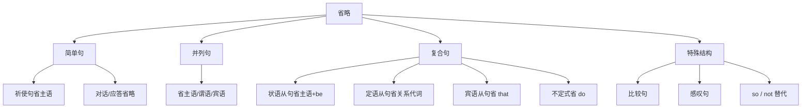

## 简介

**省略**（Ellipsis）是为避免重复或简化结构，省去句中 **可以补出** 的成分。

省略遵循 2 条基本原则：

- 省略部分必须 **能从上下文准确还原**。
- 省略后 **不影响语义**。

省略在 **口语**、**对话**、**并列句**、**比较句**、**条件句** 中尤为常见。

## 简单句中的省略

### 祈使句省略主语

祈使句默认主语为 **you**，通常省略。

:::example

- (You) Close the door.（关上门。）
- (You) Be quiet!（安静！）

:::

### 对话中的省略

口语中常省略 **主语**、**助动词**、**系动词** 等。

:::example

- (Are you) Ready?（准备好了吗？）
- (I) Got it.（明白了。）
- (Do you) Want some coffee?（想来点咖啡吗？）

:::

### 应答中的省略

简短回答常省略大部分成分。

:::example

- — Are you tired? — Yes, (I am) **a little (tired)**.（——你累了吗？——嗯，有点累。）
- — Who broke the window? — **Tom** (did).（——谁打破了窗户？——Tom。）

:::

## 并列句中的省略

并列句中相同的成分通常省略，避免重复。

### 省略主语

后一分句的主语与前句相同，且由 **and**, **but**, **or** 连接时可省略。

:::example

- He came in and (he) sat down.（他走进来坐下了。）
- She is tired but (she) refuses to rest.（她累了，但拒绝休息。）

:::

### 省略谓语

谓语相同时，常省略并用 **so / too / either / neither / nor** 替代（详见 [倒装](/docs/note/english/grammar/sentences/inversion)）。

:::example

- I like coffee, and he does **too**.（我喜欢咖啡，他也喜欢。）
- I can't swim, and **neither can he**.（我不会游泳，他也不会。）

:::

### 省略宾语

并列谓语共享同一宾语时，宾语只出现一次。

:::example

- She bought and (she) read the book.（她买了这本书并读了。）

:::

## 复合句中的省略

### 状语从句中的省略

**when, while, if, unless, though, although, as, until** 等引导的状语从句，**主从句主语一致** 且 **从句谓语含 be 动词** 时，可同时省略 **主语和 be 动词**。

:::example

- When (he was) young, he lived in Hangzhou.（他年轻时住在杭州。）
- If (you are) free, come to see me.（你有空就来看我。）
- Although (he was) tired, he kept working.（尽管累了，他仍继续工作。）
- Once (it is) printed, the page cannot be edited.（一旦打印，该页就无法再编辑。）

:::

### 定语从句中的省略

**关系代词作宾语** 时可省略。

:::example

- The book (which/that) I read is interesting.（我读的那本书很有趣。）
- The man (whom) I met is my uncle.（我遇到的那个人是我叔叔。）

:::

**关系代词 + be** 在某些结构中可同时省略。

:::example

- The book (which is) on the desk is mine.（桌上的那本书是我的。）
- The students (who are) playing football are my friends.（正在踢足球的那些学生是我的朋友。）

:::

### 宾语从句中的省略

引导词 **that** 通常可省略（详见 [从句](/docs/note/english/grammar/sentences/clauses)）。

:::example

- I know (that) he is right.（我知道他是对的。）

:::

### 不定式中的省略

不定式 **to do** 中，**do** 可省略只保留 **to**。

常见于 want, hope, like, plan, mean, try, have, used, ought, … 后。

:::example

- — Would you like to go? — Yes, I'd like **to**.（——你想去吗？——嗯，我想去。）
- I didn't go because I didn't want **to**.（我没去，因为我不想去。）

:::

但下列动词后 **to 也省略**：

- 情态动词后：can, may, must, …
- 部分动词后：let, make, help, …

:::example

- — Can you swim? — Yes, I **can**.（——你会游泳吗？——会。）

:::

## 特殊省略结构

### 比较句中的省略

`than` 和 `as...as` 之后的比较从句常省略相同成分。

:::example

- He is taller than I (am).（他比我高。）
- She works as hard as he (does).（她和他工作得一样努力。）
- This book is more interesting than that one (is).（这本书比那本更有趣。）

:::

### 感叹句中的省略

感叹句的 **主语 + be** 可省略。

:::example

- What a beautiful day (it is)!（多么美好的一天！）
- How clever (he is)!（他真聪明！）

:::

### so / not 替代从句

**think, believe, hope, suppose, expect, guess, …** 后可用 **so / not** 替代整个宾语从句。

|       句型       |            示例            |
| :--------------: | :------------------------: |
| think + so / not | I think so. / I think not.（我想是的。 / 我想不是。） |

:::example

- — Will it rain tomorrow? — I think **so**. / I hope **not**.（——明天会下雨吗？——我想会。 / 但愿不会。）

:::

### if any, if ever 等省略

`if + 主语 + be / do` 中的主语和动词可省略，仅保留连词。

:::example

- Correct mistakes, if **any**.（如有错误，请改正。）_(if there are any)_
- He seldom, if **ever**, complains.（他很少抱怨，几乎从不。）_(if he ever does)_

:::

## 易错点

### 省略不可造成歧义

省略后必须能 **唯一还原**，否则不可省略。

:::example

- I bought books, and Tom (bought) magazines.（我买了书，Tom 买了杂志。）_(可省，意义清晰)_

:::

### 不同主语不可省略

两分句主语不同时，主语 **不可省略**。

:::example

- He came in and **he** sat down.（他走进来坐下了。）_(可省 he)_
- He came in and **she** sat down.（他走进来，她坐下了。）_(she 不可省)_

:::

### be 动词只在特定从句省略

`when / if / though / unless / once` 等引导从句时，省略 **主语 + be** 需 **主从句主语一致**。

:::example

- When (he was) young, he...（他年轻时……）✓
- When young, **the books were** interesting. ✗ _(主语不一致)_

:::

## 思维导图

