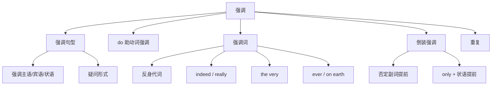

## 简介

**强调**（Emphasis）是通过 **语法手段** 突出句中某一成分，使其在语义上更为突出的修辞结构。

英语强调主要通过以下方式实现：

- **强调句型**（it 分裂句）
- **助动词 do 强调**
- **强调词修饰**
- **倒装结构**
- **重复**

## 强调句型

**强调句型**（Cleft Sentence），又称 **it 分裂句**，用 **it is/was...that...** 结构突出主语、宾语、状语等。

基本句型：

$$
\text{It is/was} + \underbrace{\text{被强调成分}}_{\text{焦点}} + \text{that/who} + \underbrace{\text{其余部分}}_{\text{从句}}
$$

### 可强调的成分

- **主语**
- **宾语**
- **状语**（时间、地点、原因、方式等）

:::example

- Tom met Lily in the park yesterday.
- $\to$ **It was Tom** that/who met Lily in the park yesterday. _(强调主语)_
- $\to$ **It was Lily** that/whom Tom met in the park yesterday. _(强调宾语)_
- $\to$ **It was in the park** that Tom met Lily yesterday. _(强调地点)_
- $\to$ **It was yesterday** that Tom met Lily in the park. _(强调时间)_

:::

:::tip

强调句型 **不能强调** 谓语动词；强调谓语用 **do/does/did** 结构。

:::

### 时态选择

`it is` 与 `it was` 的选择由 **原句时态** 决定：

- 原句为 **过去时态** $\to$ It was...that...
- 原句为 **现在 / 将来时态** $\to$ It is...that...

:::example

- I met him yesterday. $\to$ **It was** yesterday **that** I met him.
- I meet him every day. $\to$ **It is** every day **that** I meet him.

:::

### 引导词 that 与 who

| 被强调成分 |     引导词      |
| :--------: | :-------------: |
|  人为主语  |   that 或 who   |
|  人为宾语  | that, whom, who |
| 物 / 状语  |      that       |

:::example

- It was **Tom who** broke the window. _(主语为人)_
- It was **the window that** Tom broke. _(宾语为物)_

:::

### 强调句的疑问形式

#### 一般疑问句

将 **is/was** 提到句首。

:::example

- **Was it** Tom that broke the window?

:::

#### 特殊疑问句

将 **疑问词** 置于句首，构造 `疑问词 + is/was + it + that + ...`。

:::example

- **Who was it that** broke the window?
- **When was it that** you met him?
- **Where is it that** you live?

:::

### 强调句 vs. 主语从句

|     类型     |              特征              |                    示例                     |
| :----------: | :----------------------------: | :-----------------------------------------: |
|  **强调句**  |  去掉 it is...that 仍为完整句  | It is Tom that broke it.（Tom broke it. ✓） |
| **主语从句** | 去掉 it is...that 不构成完整句 | It is true that he came.（True he came. ✗） |

:::tip

判断方法：将 **it is/was 和 that** 同时删去，若剩余部分仍为 **完整句**，则为强调句；否则为主语从句。

:::

## 助动词 do 强调

在 **肯定句** 中，将 **do / does / did** 置于实义动词前，强调谓语。

|   时态   |        形式        |                    示例                    |
| :------: | :----------------: | :----------------------------------------: |
| 一般现在 | do/does + 动词原形 | I **do** love you. / She **does** know it. |
| 一般过去 |   did + 动词原形   |         He **did** come yesterday.         |
|  祈使句  |   do + 动词原形    |              **Do** sit down.              |

:::tip

- 实义动词必须用 **原形**。
- 仅用于 **肯定句**，不用于否定句、疑问句、含其他助动词的句子。

:::

:::example

- I **do** know him.（确实认识）
- She **does** love music.（确实喜欢）
- He **did** finish the work.（确实完成了）

:::

## 强调词

某些副词或形容词可置于被强调成分前，增强语气。

### 强调代词

**自身代词**（myself, yourself, …）作 **同位语** 时强调主语或宾语。

:::example

- I **myself** saw it.
- The teacher **himself** corrected the papers.

:::

### 强调副词

|               副词                |      语义       |             示例             |
| :-------------------------------: | :-------------: | :--------------------------: |
|              indeed               |      确实       |    He is **indeed** kind.    |
|              really               |      真的       | I **really** love this song. |
|               truly               |      确实       |  She is **truly** talented.  |
| absolutely / completely / totally |   完全、绝对    |   I'm **absolutely** sure.   |
|               very                | 修饰最高级/同类 |  This is the **very** best.  |

### the very + 名词

**the very + 名词** 表示 **「正是这个」**。

:::example

- This is **the very** book I want.
- He is **the very** man we are looking for.

:::

### 疑问词 + ever / on earth / in the world

强调疑问语气。

:::example

- What**ever** are you doing?
- Why **on earth** did he leave?
- Where **in the world** have you been?

:::

## 倒装强调

将 **否定副词** 或 **only + 状语** 置于句首构成 **部分倒装**（详见 [倒装](inversion)）。

:::example

- **Never** have I seen such a sight.
- **Only by working hard** can we succeed.
- **Not until** he arrived did we begin.

:::

## 重复强调

通过 **词的重复** 加强语气。

:::example

- He tried again and again.
- The pain grew worse and worse.

:::

## 易错点

### 强调句不可强调谓语

强调谓语动词必须用 **do/does/did**，不能用 **it is...that...**。

:::example

- I **do** love you. ~~It is love that I you.~~

:::

### 强调主语时主谓一致

强调主语时，**that 从句** 的谓语应与 **被强调主语** 保持一致（详见 [主谓一致](subject-verb-agreement)）。

:::example

- It was **I who am** to blame. _(被强调主语 I)_
- It is **they who are** wrong.

:::

### do + 动词原形

do 强调结构中，动词必须用 **原形**，不可用过去式或第三人称单数。

:::example

- He **did go**. ~~He did went.~~
- She **does know**. ~~She does knows.~~

:::

## 思维导图

