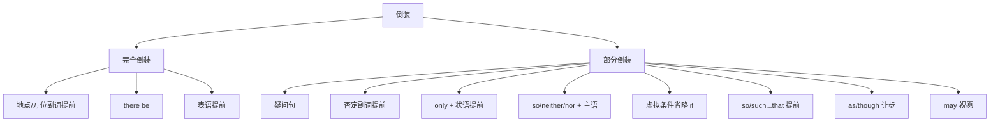

## 简介

**倒装**（Inversion）是将 **谓语** 或 **谓语的一部分** 提到 **主语** 之前的语序结构，以表达 **强调**、**疑问**、**条件** 或 **修辞效果**。

按提前部分的多少可分为 2 类：

- **完全倒装**（Full Inversion）：整个谓语动词提到主语前。
- **部分倒装**（Partial Inversion）：助动词、情态动词或 be 提到主语前，实义动词保持原位。

$$
\text{正常语序：主语} + \text{谓语} + \text{其他}
$$

$$
\text{完全倒装：谓语} + \text{主语} + \text{其他}
$$

$$
\text{部分倒装：助动词} + \text{主语} + \text{实义动词} + \text{其他}
$$

## 完全倒装

**完全倒装** 将 **整个谓语** 提到主语前，常见于以下场合。

### 地点状语提前

**地点状语** 或 **方位副词** 置于句首，且谓语为 **不及物动词** 时，使用完全倒装。

常见方位副词：here, there, in, out, up, down, away, off, back, …

:::example

- **Here comes** the bus. ~~Here the bus comes.~~
- **There goes** the bell.
- **In the room sat** an old man.
- **Down came** the rain.

:::

:::tip

主语为 **代词** 时不倒装。

:::

:::example

- Here **he comes**. ~~Here comes he.~~

:::

### there be 句型

**there be** 句型本身就是倒装结构。

:::example

- **There is** a book on the desk.
- **There are** many students in the classroom.

:::

### 表语提前

表语 + 系动词 + 主语 的句型。

:::example

- **Gone are** the days when we were poor.
- **Such was** the situation that no one dared to speak.

:::

## 部分倒装

**部分倒装** 仅将 **助动词** 或 **情态动词** 提前，常见于以下场合。

### 疑问句

最常见的部分倒装形式。

:::example

- **Do you** like music?
- **Can you** swim?
- **Have you** finished?

:::

### 否定副词置于句首

否定意义的副词或短语置于句首时，必须使用部分倒装。

常见否定副词：never, hardly, scarcely, seldom, rarely, little, no sooner, not only, not until, in no way, on no account, under no circumstances, …

:::example

- **Never have I** seen such a beautiful sight.
- **Hardly had I** sat down **when** the phone rang.
- **No sooner had I** arrived **than** it began to rain.
- **Not until** he came **did I** know the truth.

:::

:::tip

`Not until + 时间状语` 置于句首，主句倒装，**not until 从句不倒装**。

:::

### only 引导的状语置于句首

`only + 状语` 置于句首，主句倒装。

:::example

- **Only then did I** realize my mistake.
- **Only by working hard can we** succeed.
- **Only when he arrived did the meeting begin**.

:::

:::tip

**only + 主语** 不倒装，因为 only 修饰主语，不是状语。

:::

:::example

- Only Tom **knows** the answer. ~~Only Tom does know~~

:::

### so / neither / nor 引导的句子

表示 **「也（不）」** 的句子用部分倒装。

|            句型             |               示例                |
| :-------------------------: | :-------------------------------: |
|     So + 助动词 + 主语      |     He is tired. So **am I**.     |
| Neither/Nor + 助动词 + 主语 | He can't swim. Neither **can I**. |

:::tip

`so + 主语 + 助动词` 不倒装，表示 **「的确如此」**。

:::

:::example

- He is tall. So **am I**.（我也是）
- He is tall. So **he is**.（的确如此）

:::

### 虚拟条件句省略 if

**if** 省略时，**were, had, should** 提到主语前（详见 [动词语气](/docs/note/english/grammar/verbs/verb-moods)）。

:::example

- **Were I** you, I would go.
- **Had I known**, I would have come.
- **Should it rain**, we would cancel.

:::

### so/such...that 句型

`so + 形容词/副词` 或 `such + 名词` 置于句首时倒装。

:::example

- **So angry was he** that he couldn't speak.
- **Such a heavy box was it** that I couldn't lift it.

:::

### as / though 引导让步状语从句

`形容词 / 副词 / 名词 + as / though` 表示让步。

:::example

- **Tired as he was**, he kept working.
- **Child as he is**, he knows a lot.

:::

### 表达祝愿的 may

句首 **may** 表示祝愿，要倒装。

:::example

- **May you succeed!**
- **May God bless you!**

:::

### 句首 well, often, many a time 等

少数表 **频率** 的副词或短语置于句首可倒装（书面语）。

:::example

- **Many a time has he** helped me.

:::

## 易错点

### 主谓一致

倒装后 **主语数** 决定谓语形式（详见 [主谓一致](/docs/note/english/grammar/sentences/subject-verb-agreement)）。

:::example

- **Here is** a book. _(单数)_
- **Here are** the books. _(复数)_

:::

### 与强调结构区分

**强调结构** `It is...that...` 不是倒装（详见 [强调](/docs/note/english/grammar/sentences/emphasis)）。

:::example

- **It was Tom** that called me. _(强调结构)_
- **Never have I** met such a person. _(倒装)_

:::

## 思维导图

