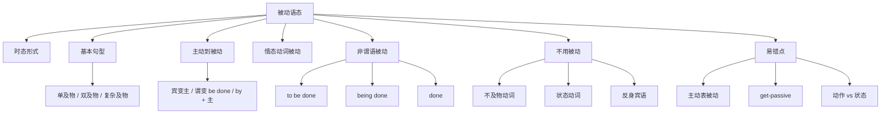

## 简介

英语语态分为 **主动语态** 和 **被动语态**，想要强调什么就把什么放在前面。

## 时态

**被动语态** 就是将主动语态句子的宾语提前当主语，并将谓语动词的 **do** 改为 **be done**。

**完成进行时态** 基本不用于被动；此外 **将来进行** 和 **过去将来进行** 的被动形式在现代英语中也很少使用，尽管语法上可以构造，但在实际写作和口语中通常避免使用。

|     时态     |                           一般                            |                                 进行                                  |                                  完成                                   |                                        完成进行                                         |
| :----------: | :-------------------------------------------------------: | :-------------------------------------------------------------------: | :---------------------------------------------------------------------: | :-------------------------------------------------------------------------------------: |
|   **现在**   |   一般现在时态 **do/does** **am/is/are done**   |  现在进行时态 am/is/are **doing** am/is/are **being done**  |     现在完成时态 have/has **done** have/has **been done**     |     现在完成进行时态 have/has been **doing** have/has been **being done**     |
|   **过去**   |     一般过去时态 **did** **was/were done**      |   过去进行时态 was/were **doing** was/were **being done**   |          过去完成时态 had **done** had **been done**          |          过去完成进行时态 had been **doing** had been **being done**          |
|   **将来**   |    一般将来时态 will **do** will **be done**    |    将来进行时态 will be **doing** will be **being done**    |    将来完成时态 will have **done** will have **been done**    |    将来完成进行时态 will have been **doing** will have been **being done**    |
| **过去将来** | 一般过去将来时态 would **do** would **be done** | 过去将来进行时态 would be **doing** would be **being done** | 过去将来完成时态 would have **done** would have **been done** | 过去将来完成进行时态 would have been **doing** would have been **being done** |

## 基本句型

对于 5 种 **基本句型**，显然被动语态需要宾语，因此只有及物动词才有被动语态。

### 不及物动词

主动语态：主语 + **do**.

没有宾语，因此没有被动语态。

### 单及物动词

主动语态：主语 + **do** + 宾语.

被动语态：宾语 + **be done** (+ by + 主语).

:::example

- She **bought** a dress.（她买了一条裙子。）$\to$ A dress **was bought** by her.

:::

### 双及物动词

主动语态：主语 + **do** + 间接宾语 + 直接宾语.

强调间接宾语的被动语态：间接宾语 + **be done** + 直接宾语 (+ by + 主语).

强调直接宾语的被动语态：直接宾语 + **be done** + to + 间接宾语 (+ by + 主语).

:::example

- I **teach** you English.（我教你英语。）$\to$ You **are taught** English by me. / English **is taught** to you by me.

:::

### 复杂及物动词

主动语态：主语 + **do** + 宾语 + 宾语补语.

被动语态：宾语 + **be done** + 宾语补语 (+ by + 主语).

:::example

- Peter **considers** you smart.（Peter 认为你聪明。）$\to$ You are considered smart by Peter.

:::

### 连系动词

主动语态：主语 + **do** + 主语补语（表语）.

没有宾语，因此没有被动语态。

## 主动 → 被动的转换

将主动语态转换为被动语态的标准步骤：

1. **确定主语**：将主动句的 **宾语** 移至句首作 **被动句的主语**。
2. **改变谓语**：将动词改为 **be + 过去分词** 形式，**保留原时态**。
3. **保留状语**：原句的状语位置不变。
4. **处理施动者**：将主动句的 **主语** 移至 **by** 之后（可省略）。

$$
\underbrace{\text{Tom}}_{\text{主}}\underbrace{\text{wrote}}_{\text{谓}}\underbrace{\text{a letter}}_{\text{宾}}\underbrace{\text{yesterday}}_{\text{状}}
\Rightarrow
\underbrace{\text{A letter}}_{\text{主}}\underbrace{\text{was written}}_{\text{谓}}\underbrace{\text{by Tom}}_{\text{by + 原主}}\underbrace{\text{yesterday}}_{\text{状}}
$$

:::example

- They **built** this bridge in 1980.（他们在 1980 年建了这座桥。）$\to$ This bridge **was built** (by them) in 1980.
- People **speak** English all over the world.（世界各地的人都讲英语。）$\to$ English **is spoken** all over the world.

:::

:::tip

**by + 施动者** 在以下情况通常 **省略**：

- 施动者 **不重要** 或 **泛指**（people, someone）。
- 施动者 **未知** 或 **难以说出**。
- 施动者 **不言而喻**。

:::

## 含情态动词的被动

情态动词后的被动语态结构为 **「情态动词 + be + 过去分词」**。

|   时态   |                结构                |                  示例                  |
| :------: | :--------------------------------: | :------------------------------------: |
| 一般被动 |       情态动词 + **be done**       |      This **can be done** easily.（这很容易做到。）      |
| 完成被动 |   情态动词 + **have been done**    |  It **must have been broken** by him.（这一定是被他弄坏的。）  |
| 进行被动 | 情态动词 + **be being done**（罕） | The car **may be being repaired** now.（这车现在也许正在维修。） |

:::example

- The work **must be finished** before five.（这项工作必须在五点前完成。）
- This problem **should be solved** immediately.（这个问题应该立即解决。）
- The letter **may have been sent** yesterday.（这封信也许昨天已经寄出了。）

:::

## 非谓语的被动

**非谓语动词**（不定式、动名词、分词）也有 **被动形式**（详见 [非谓语动词](/docs/note/english/grammar/verbs/non-finite-verbs)）。

|    非谓语    |   主动形式   |       被动形式        |                   示例                    |
| :----------: | :----------: | :-------------------: | :---------------------------------------: |
|  **不定式**  |    to do     |    **to be done**     |         I want **to be helped**.（我想得到帮助。）          |
| 不定式完成式 | to have done | **to have been done** |      It seems **to have been done**.（这似乎已经做完了。）      |
|  **动名词**  |    doing     |    **being done**     |        He likes **being praised**.（他喜欢受到表扬。）        |
| 动名词完成式 | having done  | **having been done**  |  She regretted **having been cheated**.（她后悔上了当。）   |
| **现在分词** |    doing     |    **being done**     | The boy **being punished** is my brother.（正在受罚的那个男孩是我弟弟。） |
| **过去分词** |      —       |       **done**        |  The book **written by him** is famous.（他写的那本书很有名。）   |

:::tip

- **过去分词** 本身就是 **被动 / 完成** 含义，作定语或状语时无需再变形。
- **doing** 与 **done** 作定语：**doing** 表 **主动 / 进行**，**done** 表 **被动 / 完成**。

:::

:::example

- a **running** boy（奔跑的男孩）_(主动)_ vs. a **broken** window（破碎的窗户）_(被动)_
- the **rising** sun（升起的太阳）_(主动)_ vs. the **fallen** leaves（落下的叶子）_(被动)_

:::

## 不用被动语态的情况

以下情况 **不能** 或 **不宜** 使用被动语态：

### 不及物动词

不及物动词 **没有宾语**，不能变被动。常见：appear, happen, occur, exist, arrive, belong to, last, die, rise, fall。

:::example

- An accident **happened** yesterday.（昨天发生了一起事故。）✓
- ~~An accident was happened yesterday.~~ ✗

:::

### 表示状态的及物动词

以下动词虽然及物，但表 **状态** 而非 **动作**，**不用** 被动语态：**have, fit, suit, cost, lack, resemble, contain, equal, weigh, measure**。

:::example

- This dress **fits** her well. ✓
- ~~She is fitted by this dress well.~~ ✗
- The book **cost** me 50 yuan. ✓
- ~~50 yuan was cost (by) me.~~ ✗

:::

### 反身代词作宾语

宾语是 **反身代词** 时不能变被动。

:::example

- He hurt **himself**. ✓
- ~~Himself was hurt by him.~~ ✗

:::

### 系动词

**系动词** 后接 **表语**（非宾语），无被动语态：be, become, seem, look, feel, taste, sound, smell, remain。

## 易错点

### 主动形式表被动

部分动词 / 句型用 **主动形式** 表达 **被动含义**：

| 类别                              |                             示例                             |
| :-------------------------------- | :----------------------------------------------------------: |
| 系动词 + 形容词                   |                  The cake **tastes** good.                   |
| need / want / require + doing     |   The window **needs cleaning**. _(= needs to be cleaned)_   |
| 主语 + 不及物动词 + well / easily |              This book **sells well**. _(畅销)_              |
| be + to do（主动表被动）          | The work **is to be done** today. _(也可用 be to do 表被动)_ |

:::example

- The pen **writes** smoothly. _(笔写起来流畅)_
- The book **reads** well. _(这本书读起来不错)_

:::

### get-passive

口语中常用 **get + 过去分词** 代替 **be + 过去分词**，强调 **动作 / 突发** 而非 **状态**。

:::example

- He **got hurt** in the accident. _(强调动作)_
- He **was hurt** in the accident. _(可强调状态)_

:::

### 动作被动 vs 状态被动

- **动作被动**：强调 **动作过程**，常用 **be + done + by 施动者**。
- **状态被动**：强调 **结果状态**，过去分词此时近似 **表语形容词**。

:::example

- The window **was broken** by him. _(动作被动)_
- The window **is broken**. _(状态被动，说明窗户现在是坏的)_

:::

### 主谓一致

被动句的 **be 动词** 与 **新主语**（原宾语）保持 **数** 的一致。

:::example

- The **books** **were** written by him. _(主语复数，be 复数)_
- The **book** **was** written by him. _(主语单数，be 单数)_

:::

## 思维导图

