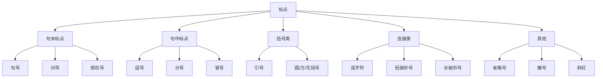

## 简介

英语 **标点符号**（Punctuation）使用 **半角** 形式，与中文 **全角** 形式有显著区别。

英语标点用于划分句子结构、表达停顿与语气，是书面语不可省略的语法成分。

## 句末标点

### 句号

**句号**（Period，`.`）用于陈述句和祈使句的结尾。

:::example

- The cat eats a fish.（那只猫吃了一条鱼。）
- Close the door.（关上门。）

:::

句号也用于缩写词。

:::example

- Mr.（先生）, Dr.（博士 / 医生）, U.S.A.（美国）, etc.（等等）

:::

### 问号

**问号**（Question Mark，`?`）用于直接疑问句的结尾。

:::example

- Where are you going?（你要去哪里？）
- Is this your book?（这是你的书吗？）

:::

间接疑问句用句号，不用问号。

:::example

- I wonder where she is.（我想知道她在哪里。） ~~I wonder where she is?~~

:::

### 感叹号

**感叹号**（Exclamation Mark，`!`）用于感叹句和强烈情感的语句结尾。

:::example

- What a beautiful day!（多么美好的一天！）
- Stop!（住手！）

:::

## 句中标点

### 逗号

**逗号**（Comma，`,`）用于句中较短的停顿，是英语使用最频繁、规则最复杂的标点。

主要用法包括：

- 分隔 3 项及以上的并列成分。
- 分隔从句与主句。
- 分隔同位语和插入语。
- 分隔引语前后。
- 用于日期、地址、数字。

:::example

- I bought apples, pears, and oranges.（我买了苹果、梨和橙子。）
- When the bell rang, we left the classroom.（铃声响起时，我们离开了教室。）
- My brother, a doctor, works in Beijing.（我哥哥是名医生，在北京工作。）
- He said, "I will come tomorrow."（他说：「我明天会来。」）
- July 4, 1776（1776 年 7 月 4 日）
- 1,234,567（一百二十三万四千五百六十七）

:::

:::tip

最后一项前的逗号称为 **牛津逗号**（Oxford Comma）。

使用与否不影响语法正确性，但应在全文保持统一。

:::

### 分号

**分号**（Semicolon，`;`）用于连接两个独立但语义相关的句子，停顿强度介于逗号和句号之间。

:::example

- The exam was hard; many students failed.（考试很难，许多学生不及格。）
- I love coffee; my sister prefers tea.（我爱喝咖啡，我姐姐更喜欢茶。）

:::

分号也用于分隔已含逗号的复杂并列项。

:::example

- We visited Paris, France; Rome, Italy; and Madrid, Spain.（我们游览了法国巴黎、意大利罗马和西班牙马德里。）

:::

### 冒号

**冒号**（Colon，`:`）用于引出 **列表**、**解释**、**引语** 或 **总结**。

:::example

- Please bring the following: pen, paper, and ruler.（请带上以下物品：笔、纸和尺子。）
- He had one goal: to win.（他只有一个目标：获胜。）
- She said: "I am ready."（她说：「我准备好了。」）

:::

冒号也用于时间、比例、书名副标题。

:::example

- 09:30（九点半）, 2 : 3（二比三）, _Hamlet: Prince of Denmark_（《哈姆雷特：丹麦王子》）

:::

## 括号类标点

### 引号

英语 **引号** 分为 **双引号**（`"…"`）和 **单引号**（`'…'`），用于直接引语、特殊词语、作品名等。

:::tip

美式英语主要使用双引号，单引号用于嵌套；英式英语相反。

:::

:::example

- He said, "She told me, 'I will come.'"（他说：「她告诉我：『我会来。』」）

:::

句末标点的位置规则：

- **美式**：句号、逗号放在引号 **内**。
- **英式**：根据是否属于引语决定位置。

:::example

- "I am tired," she said.（「我累了。」她说。） _(美式)_
- "I am tired", she said.（「我累了。」她说。） _(英式)_

:::

### 圆括号

**圆括号**（Parentheses，`()`）用于补充说明，去掉后不影响主句完整性。

:::example

- He was born in Hangzhou (Zhejiang Province) in 2009.（他 2009 年出生于杭州（浙江省）。）

:::

### 方括号

**方括号**（Brackets，`[]`）用于引语中的编辑性插入或解释。

:::example

- "She [the teacher] asked us to be quiet."（「她（那位老师）让我们安静。」）

:::

### 花括号

**花括号**（Braces，`{}`）在通用书面英语中极少使用，主要见于数学、编程和集合表示。

## 连接类标点

### 连字符

**连字符**（Hyphen，`-`，U+002D）用于连接 **复合词**，前后不加空格。

:::example

- well-known（著名的）, mother-in-law（岳母 / 婆婆）, twenty-one（二十一）

:::

### 短破折号

**短破折号**（En Dash，`–`，U+2013）用于表示 **范围**（两侧各加一个空格）或 **对等关系**（紧贴）。

:::example

- pages 10 – 20（第 10 – 20 页）
- the Beijing–Shanghai railway（京沪铁路）

:::

### 长破折号

**长破折号**（Em Dash，`—`，U+2014）用于句中插入或强调，美式前后不加空格，英式前后加空格。

:::example

- He gave me the answer—and it was wrong.（他给了我答案——而它是错的。）

:::

## 省略号

英语 **省略号**（Ellipsis，`...`）由 3 个英文句点组成，表示省略或语气未尽。

:::example

- She hesitated, then said, "I don't know..."（她犹豫了一下，然后说：「我不知道……」）

:::

:::tip

若省略号出现在完整句末尾，应保留句号，即 `....`（共 4 个点）。

:::

## 撇号

**撇号**（Apostrophe，`'`）有两种用法：

- 表示 **所有格**：在名词后加 `'s` 或 `s'`。
- 表示 **缩写**：在缩略字母位置使用。

:::example

- Tom's book（Tom 的书）, the boys' room（男孩们的房间）
- don't（不）, it's（它是）, you're（你是）

:::

:::tip

注意区分 **it's**（it is）和 **its**（它的）。

:::

## 斜杠

**斜杠**（Slash，`/`）用于表示 **二选一** 或 **分数**。

:::example

- and/or（和 / 或）, he/she（他 / 她）, 1/2（二分之一）

:::

## 思维导图

