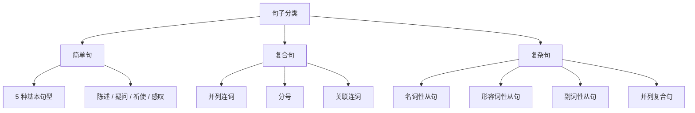

## 引入

英语中有 $3$ 种句子类别：

1. 简单句（Simple Sentences）：不能再拆分的句子。
2. 复合句（Compound Sentences）：由多个 **并列的简单句** 组成，通常用并列连词连接。
3. 复杂句（Complex Sentences）：由 **主句** 和 **从句** 组成，从句充当主句的某个句子成分。

## 简单句

**简单句**（Simple Sentence）只包含 **一个主谓结构**，是最基本的句子单位。

### 基本句型

英语简单句共有 $5$ 种基本句型。

| 序号  |      句型       |             示例             |
| :---: | :-------------: | :--------------------------: |
| **1** |      S + V      |        Birds **fly**.        |
| **2** |    S + V + P    |    She **is** a teacher.     |
| **3** |    S + V + O    |      I **like** music.       |
| **4** | S + V + IO + DO |    He **gave** me a book.    |
| **5** |  S + V + O + C  | We **elected** him chairman. |

- **S**（Subject）：主语
- **V**（Verb）：谓语动词
- **P**（Predicative）：表语
- **O**（Object）：宾语
- **IO**（Indirect Object）：间接宾语
- **DO**（Direct Object）：直接宾语
- **C**（Complement）：宾语补足语

:::tip

简单句的「简单」指 **结构上只有一个主谓**，**并非内容简单**。

通过添加定语、状语、并列主语 / 谓语等，简单句也可以很长。

:::

:::example

- Birds and butterflies fly and dance happily in the warm spring breeze.

_(并列主语 + 并列谓语 + 状语，但仍为简单句)_

:::

### 按用途分类

|    类别    |    定义     |                    示例                    |
| :--------: | :---------: | :----------------------------------------: |
| **陈述句** |  陈述事实   |              He is a student.              |
| **疑问句** |  提出疑问   |               Are you ready?               |
| **祈使句** | 请求 / 命令 |              Close the door.               |
| **感叹句** |  表达感叹   | What a beautiful day! / How clever she is! |

## 复合句

**复合句**（Compound Sentence）由 $2$ 个或以上 **语法地位相同** 的 **简单句**（也称 **分句**）组成，分句之间通常用 **并列连词** 或 **分号** 连接。

### 用并列连词连接

常见并列连词可用 **FANBOYS** 记忆：**for**、**and**、**nor**、**but**、**or**、**yet**、**so**（详见 [连词](../parts-of-speech/conjunctions)）。

:::example

- It rained, **so** we stayed inside.
- She is young, **but** she is wise.
- You can have tea, **or** you can have coffee.

:::

:::tip

并列连词连接两个独立分句时，应在连词前加 **逗号**。

:::

### 用分号连接

当两个分句语义紧密、无需连词时，可直接用 **分号** 连接。

:::example

- He didn't come; he was ill.
- The sun rose; the birds began to sing.

:::

### 用关联连词连接

**关联连词** 成对使用，连接对等的分句或成分（详见 [连词](../parts-of-speech/conjunctions)）。

:::example

- **Either** you apologize, **or** I leave.
- **Not only** did he come, **but he also** brought a gift.

:::

## 复杂句

**复杂句**（Complex Sentence）由 **一个主句** 和 **一个或多个从句** 组成，从句作为 **句子成分** 依附于主句。

### 从句分类

按语法功能分为 $3$ 大类（详见 [从句](clauses)）：

|       类别       |                 作用                 |                示例                 |
| :--------------: | :----------------------------------: | :---------------------------------: |
|  **名词性从句**  |   充当主语 / 宾语 / 表语 / 同位语    |    I know **that he is right**.     |
| **形容词性从句** |      修饰名词或代词（定语从句）      | The book **which I bought** is new. |
|  **副词性从句**  | 修饰动词 / 形容词 / 整句（状语从句） | He came **because he missed you**.  |

### 主句与从句

- **主句**（Main Clause）：能独立成句的部分。
- **从句**（Subordinate Clause）：不能独立成句，由 **从属连词** 或 **关系词** 引导。

:::example

- I know **that he is right**.

_(主句：I know；宾语从句：that he is right)_

- The book **which I bought yesterday** is on the desk.

_(主句：The book is on the desk；定语从句：which I bought yesterday)_

:::

### 并列复合句

句子中 **同时存在** 并列分句与从句时，称为 **并列复合句**（Compound-Complex Sentence）。

:::example

- I called him, **but** he didn't answer **because he was sleeping**.

_(并列连词 but 连接两个分句，第二个分句又含状语从句)_

:::

## 三类句子的对比

|    类别    |      结构      |         特征         |
| :--------: | :------------: | :------------------: |
| **简单句** |    一个主谓    | 不可再拆分为独立分句 |
| **复合句** | 多个并列的主谓 |  分句地位 **平等**   |
| **复杂句** |  主句 + 从句   | 主从地位 **不平等**  |

:::tip

判断句子类别的关键：

1. 数 **主谓结构** 的数量。
2. 看分句之间是 **并列** 还是 **主从**。

:::

## 思维导图

