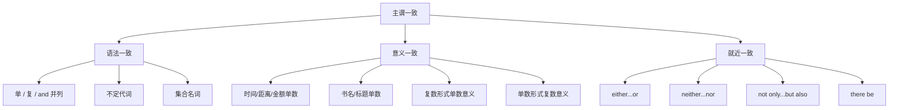

## 简介

**主谓一致**（Subject-Verb Agreement）是指 **谓语动词** 在 **人称** 和 **数** 上与 **主语** 保持一致。

英语主谓一致主要遵循 3 条基本原则：

- **语法一致**（Grammatical Concord）：谓语与主语在语法形式上一致。
- **意义一致**（Notional Concord）：谓语与主语的实际意义一致。
- **就近一致**（Proximity Concord）：谓语与最近的并列主语一致。

## 语法一致原则

谓语动词与主语的 **语法形式** 保持一致。

### 单数主语 + 单数谓语

可数名词的单数、不可数名词、表示单一概念的主语接 **单数谓语**。

:::example

- The book **is** on the desk.（这本书在桌子上。）
- Water **boils** at 100°C.（水在 100°C 时沸腾。）

:::

### 复数主语 + 复数谓语

可数名词的复数接 **复数谓语**。

:::example

- The books **are** on the desk.（这些书在桌子上。）
- Children **like** candies.（孩子们喜欢糖果。）

:::

### 由 and 连接的并列主语

由 **and** 连接的两个或多个主语通常接 **复数谓语**。

:::example

- Tom and Jerry **are** good friends.（Tom 和 Jerry 是好朋友。）

:::

但下列情况接 **单数谓语**：

- 两个主语表示 **同一人或同一事物**。
- 两个主语构成 **一个整体概念**。
- 主语前由 **each, every** 修饰。

:::example

- The singer and dancer **is** my sister.（那位歌手兼舞者是我姐姐。）（同一人）
- Bread and butter **is** my breakfast.（黄油面包是我的早餐。）（一个整体）
- Every man and woman **has** the right to vote.（每个人都有投票权。）

:::

### 不定代词作主语

|                                     不定代词                                      |   谓语   |
| :-------------------------------------------------------------------------------: | :------: |
| each, every, either, neither, one, no one, anyone, someone, nobody, anything, ... |   单数   |
|                             both, few, many, several                              |   复数   |
|                    all, some, most, half, none, plenty of, ...                    | 根据所指 |

:::example

- Each of them **has** a book.（他们每个人都有一本书。）
- Both of us **are** tired.（我们俩都累了。）
- All of the water **is** clean.（所有的水都是干净的。）（不可数）
- All of the students **are** present.（所有学生都到场了。）（可数复数）

:::

### 集合名词作主语

|                       集合名词                        |            谓语            |                                               示例                                                |
| :---------------------------------------------------: | :------------------------: | :-----------------------------------------------------------------------------------------------: |
| family, team, class, group, audience, government, ... | 单数（整体）或复数（成员） | The family **is** large.（这个家庭很大。） / The family **are** all teachers.（这家人都是老师。） |
|            people, police, cattle, poultry            |            复数            |                        The police **are** investigating.（警方正在调查。）                        |
|        furniture, equipment, baggage, jewelry         |       单数（不可数）       |                             The furniture **is** new.（家具是新的。）                             |

## 意义一致原则

谓语动词与主语的 **实际意义** 一致，不严格依据语法形式。

### 表示时间、距离、金额、重量的复数名词

被视为 **整体概念**，接 **单数谓语**。

:::example

- Ten years **is** a long time.（十年是很长的时间。）
- Two miles **is** not far.（两英里不远。）
- Five dollars **is** enough.（五美元就够了。）

:::

### 表示书名、剧名、文章标题的复数名词

被视为 **单一作品**，接 **单数谓语**。

:::example

- _The Times_ **is** a famous newspaper.（《泰晤士报》是一份著名的报纸。）
- _Great Expectations_ **is** a novel by Dickens.（《远大前程》是狄更斯的一部小说。）

:::

### 算术运算

加、减、乘、除的结果接 **单数谓语**。

:::example

- Two plus three **is** five.（二加三等于五。）
- Six divided by two **is** three.（六除以二等于三。）

:::

### 形如复数实为单数的名词

|                      名词                       | 谓语 |                        示例                         |
| :---------------------------------------------: | :--: | :-------------------------------------------------: |
|                      news                       | 单数 |        The news **is** good.（这消息不错。）        |
| 学科名词：mathematics, physics, economics, ...  | 单数 | Mathematics **is** my favorite.（数学是我的最爱。） |
| 国家名：the United States, the Philippines, ... | 单数 |    The United States **is** large.（美国很大。）    |
|      疾病名：measles, mumps, diabetes, ...      | 单数 |     Measles **is** infectious.（麻疹会传染。）      |

### 形如单数实为复数的名词

|                    名词                     | 谓语 |                           示例                           |
| :-----------------------------------------: | :--: | :------------------------------------------------------: |
|       people, police, cattle, poultry       | 复数 |          The police **are** here.（警察来了。）          |
| the rich, the poor, the young, the old, ... | 复数 | The rich **are** not always happy.（富人未必总是幸福。） |

### 「成对」名词

`a pair of` 修饰时按 `pair` 算，接 **单数谓语**；否则接 **复数谓语**。

|                      名词                      |
| :--------------------------------------------: |
| trousers, jeans, glasses, scissors, shoes, ... |

:::example

- My glasses **are** broken.（我的眼镜坏了。）
- A pair of glasses **is** on the table.（桌上有一副眼镜。）

:::

## 就近一致原则

谓语动词与 **靠近** 的主语保持一致。

适用以下连词连接的并列主语：

- either...or
- neither...nor
- not only...but also
- not...but
- or

:::example

- Either you or he **is** wrong.（不是你错就是他错。）
- Neither Tom nor his friends **are** here.（Tom 和他的朋友都不在。）
- Not only the students but also the teacher **was** present.（不仅学生们在场，老师也在。）

:::

## 特殊结构

### there be 句型

谓语与 **后面的主语** 一致（就近一致）。

:::example

- There **is** a book and two pens on the desk.（桌上有一本书和两支笔。）
- There **are** two pens and a book on the desk.（桌上有两支笔和一本书。）

:::

### with, along with, as well as, together with, including

主句谓语与 **第一个主语** 一致，**不受** with 短语影响。

:::example

- Tom, **as well as** his friends, **is** going.（Tom 和他的朋友们都要去。）
- The teacher, **together with** the students, **was** invited.（老师和学生们都受到了邀请。）

:::

### 定语从句中的主谓一致

定语从句的谓语与 **先行词** 保持一致。

:::example

- He is one of the students who **are** good at math.（他是擅长数学的学生之一。）（先行词 students，复数）
- He is the only one of the students who **is** good at math.（他是学生中唯一擅长数学的。）（先行词 one，单数）

:::

### 主语为 what 引导的从句

通常接 **单数谓语**；从句内容明显为复数时接 **复数谓语**。

:::example

- What he said **is** true.（他说的是真的。）
- What we need **are** books.（我们需要的是书。）

:::

## 思维导图

