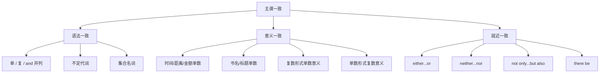

## 简介

**主谓一致**（Subject-Verb Agreement）是指 **谓语动词** 在 **人称** 和 **数** 上与 **主语** 保持一致。

英语主谓一致主要遵循 3 条基本原则：

- **语法一致**（Grammatical Concord）：谓语与主语在语法形式上一致。
- **意义一致**（Notional Concord）：谓语与主语的实际意义一致。
- **就近一致**（Proximity Concord）：谓语与最近的并列主语一致。

## 语法一致原则

谓语动词与主语的 **语法形式** 保持一致。

### 单数主语 + 单数谓语

可数名词的单数、不可数名词、表示单一概念的主语接 **单数谓语**。

:::example

- The book **is** on the desk.
- Water **boils** at 100°C.

:::

### 复数主语 + 复数谓语

可数名词的复数接 **复数谓语**。

:::example

- The books **are** on the desk.
- Children **like** candies.

:::

### 由 and 连接的并列主语

由 **and** 连接的两个或多个主语通常接 **复数谓语**。

:::example

- Tom and Jerry **are** good friends.

:::

但下列情况接 **单数谓语**：

- 两个主语表示 **同一人或同一事物**。
- 两个主语构成 **一个整体概念**。
- 主语前由 **each, every** 修饰。

:::example

- The singer and dancer **is** my sister.（同一人）
- Bread and butter **is** my breakfast.（一个整体）
- Every man and woman **has** the right to vote.

:::

### 不定代词作主语

|                                     不定代词                                      |   谓语   |
| :-------------------------------------------------------------------------------: | :------: |
| each, every, either, neither, one, no one, anyone, someone, nobody, anything, ... |   单数   |
|                             both, few, many, several                              |   复数   |
|                    all, some, most, half, none, plenty of, ...                    | 根据所指 |

:::example

- Each of them **has** a book.
- Both of us **are** tired.
- All of the water **is** clean.（不可数）
- All of the students **are** present.（可数复数）

:::

### 集合名词作主语

|                       集合名词                        |            谓语            |                            示例                             |
| :---------------------------------------------------: | :------------------------: | :---------------------------------------------------------: |
| family, team, class, group, audience, government, ... | 单数（整体）或复数（成员） | The family **is** large. / The family **are** all teachers. |
|            people, police, cattle, poultry            |            复数            |              The police **are** investigating.              |
|        furniture, equipment, baggage, jewelry         |       单数（不可数）       |                  The furniture **is** new.                  |

## 意义一致原则

谓语动词与主语的 **实际意义** 一致，不严格依据语法形式。

### 表示时间、距离、金额、重量的复数名词

被视为 **整体概念**，接 **单数谓语**。

:::example

- Ten years **is** a long time.
- Two miles **is** not far.
- Five dollars **is** enough.

:::

### 表示书名、剧名、文章标题的复数名词

被视为 **单一作品**，接 **单数谓语**。

:::example

- _The Times_ **is** a famous newspaper.
- _Great Expectations_ **is** a novel by Dickens.

:::

### 算术运算

加、减、乘、除的结果接 **单数谓语**。

:::example

- Two plus three **is** five.
- Six divided by two **is** three.

:::

### 形如复数实为单数的名词

|                      名词                       | 谓语 |              示例               |
| :---------------------------------------------: | :--: | :-----------------------------: |
|                      news                       | 单数 |      The news **is** good.      |
| 学科名词：mathematics, physics, economics, ...  | 单数 | Mathematics **is** my favorite. |
| 国家名：the United States, the Philippines, ... | 单数 | The United States **is** large. |
|      疾病名：measles, mumps, diabetes, ...      | 单数 |   Measles **is** infectious.    |

### 形如单数实为复数的名词

|                    名词                     | 谓语 |                示例                |
| :-----------------------------------------: | :--: | :--------------------------------: |
|       people, police, cattle, poultry       | 复数 |      The police **are** here.      |
| the rich, the poor, the young, the old, ... | 复数 | The rich **are** not always happy. |

### 「成对」名词

`a pair of` 修饰时按 `pair` 算，接 **单数谓语**；否则接 **复数谓语**。

|                      名词                      |
| :--------------------------------------------: |
| trousers, jeans, glasses, scissors, shoes, ... |

:::example

- My glasses **are** broken.
- A pair of glasses **is** on the table.

:::

## 就近一致原则

谓语动词与 **靠近** 的主语保持一致。

适用以下连词连接的并列主语：

- either...or
- neither...nor
- not only...but also
- not...but
- or

:::example

- Either you or he **is** wrong.
- Neither Tom nor his friends **are** here.
- Not only the students but also the teacher **was** present.

:::

## 特殊结构

### there be 句型

谓语与 **后面的主语** 一致（就近一致）。

:::example

- There **is** a book and two pens on the desk.
- There **are** two pens and a book on the desk.

:::

### with, along with, as well as, together with, including

主句谓语与 **第一个主语** 一致，**不受** with 短语影响。

:::example

- Tom, **as well as** his friends, **is** going.
- The teacher, **together with** the students, **was** invited.

:::

### 定语从句中的主谓一致

定语从句的谓语与 **先行词** 保持一致。

:::example

- He is one of the students who **are** good at math.（先行词 students，复数）
- He is the only one of the students who **is** good at math.（先行词 one，单数）

:::

### 主语为 what 引导的从句

通常接 **单数谓语**；从句内容明显为复数时接 **复数谓语**。

:::example

- What he said **is** true.
- What we need **are** books.

:::

## 思维导图

