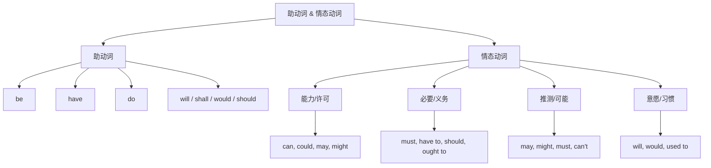

## 简介

**助动词**（Auxiliary Verb）和 **情态动词**（Modal Verb）是辅助 **实义动词** 构成谓语的动词。

二者 **本身不能单独作谓语**，必须与实义动词配合使用。

## 助动词

**助动词** 用于构造 **时态**、**语态**、**疑问句**、**否定句** 和 **强调**。

### 基本助动词

|   助动词   |                         作用                         |                           示例                            |
| :--------: | :--------------------------------------------------: | :-------------------------------------------------------: |
|   **be**   |                构造进行时态、被动语态                |            She **is** reading.（她正在阅读。）            |
|  **have**  |                     构造完成时态                     |          He **has** finished.（他已经完成了。）           |
|   **do**   | 构造一般现在时态、一般过去时态的疑问句、否定句、强调 | Do you know? / I **do** know.（你知道吗？/ 我确实知道。） |
|  **will**  |              构造一般将来时态、表示意愿              |                I **will** go.（我会去。）                 |
| **shall**  |          构造一般将来时态（第一人称，正式）          |             We **shall** see.（我们走着瞧。）             |
| **would**  |           构造过去将来、表示委婉、表示假设           |        I **would** like some tea.（我想要点茶。）         |
| **should** |             构造过去将来、表示建议或义务             |           You **should** rest.（你应该休息。）            |

### 助动词的语法功能

#### 构造时态

- **be doing**：进行时态
- **have done**：完成时态
- **have been doing**：完成进行时态
- **will do**：将来时态

:::example

- She **is writing** a letter.（她正在写信。）
- He **has finished** his homework.（他已经完成了作业。）
- I **will call** you tomorrow.（我明天会给你打电话。）

:::

#### 构造语态

**be done** 构造被动语态（详见 [被动](/docs/note/english/grammar/sentences/passive-voice)）。

:::example

- The book **was written** by him.（这本书是他写的。）

:::

#### 构造疑问句和否定句

一般现在时态、一般过去时态的疑问句和否定句通过 **do/does/did** 构造。

:::example

- Do you like music?（你喜欢音乐吗？）
- I do not like music.（我不喜欢音乐。）
- Did he go?（他去了吗？）
- He did not go.（他没去。）

:::

#### 强调

在肯定句中，**do/does/did** 可置于实义动词前表示强调。

:::example

- I **do** love you.（我真的爱你。）
- She **does** know the answer.（她确实知道答案。）
- He **did** come yesterday.（他昨天确实来了。）

:::

## 情态动词

**情态动词**（Modal Verb）表示说话人的 **语气**、**态度** 或 **可能性**，本身不表示具体动作。

### 形态特征

情态动词具有以下 **共同特征**：

1. 无人称和数的变化（不加 -s）。
2. 后接 **动词原形**（不带 to，**ought to** 例外）。
3. 自身构造疑问句和否定句，无需 **do**。
4. 没有非谓语形式（无 -ing, -ed 等形式）。

:::example

- He can swim.（他会游泳。）~~He cans swim.~~
- Can you help me?（你能帮我吗？）~~Do you can help me?~~
- I cannot do it.（我做不了。）~~I do not can do it.~~

:::

### 常见情态动词

|   情态动词   |              核心语义              |                      示例                      |
| :----------: | :--------------------------------: | :--------------------------------------------: |
|   **can**    |      能力、许可、可能（现在）      |           I can swim.（我会游泳。）            |
|  **could**   |  can 的过去式、委婉请求、虚拟推测  |       Could you help me?（你能帮我吗？）       |
|   **may**    |         许可、可能（现在）         |     You may leave now.（你现在可以走了。）     |
|  **might**   |      may 的过去式、不确定推测      |      He might be at home.（他也许在家。）      |
|   **must**   |       必须、强烈推断（一定）       | You must follow the rules.（你必须遵守规则。） |
| **have to**  |        客观必要（外在原因）        |    I have to leave early.（我不得不早走。）    |
|  **shall**   |  第一人称将来、征询意见、命令义务  |      Shall we dance?（我们跳支舞好吗？）       |
|  **should**  |       建议、义务、可能性推断       |  You should see a doctor.（你应该去看医生。）  |
|   **will**   |          意愿、习惯、推测          |        He will help us.（他会帮我们。）        |
|  **would**   |      礼貌请求、过去习惯、虚拟      |         Would you mind?（你介意吗？）          |
| **ought to** |             道义上应当             | You ought to respect them.（你应当尊重他们。） |
|   **need**   | 需要（疑问句、否定句中作情态动词） |       You needn't worry.（你不必担心。）       |
|   **dare**   |  敢（疑问句、否定句中作情态动词）  |       He dare not speak.（他不敢说话。）       |
| **used to**  |        过去常常（现在已不）        |        I used to smoke.（我以前抽烟。）        |

### 推断语气强度

按 **推断确定性** 由弱到强排序：

$$
\text{might}=\text{may}=\text{could}<\text{should}=\text{ought to}<\text{must}
$$

:::example

- He **might** be at home.（也许在家，可能性低）
- He **may** be at home.（可能在家）
- He **must** be at home.（一定在家）

:::

### 情态动词 + 完成式

**情态动词 + have done** 表示对 **过去** 的推测或评价。

|           结构           |                                   语义                                   |                           示例                            |
| :----------------------: | :----------------------------------------------------------------------: | :-------------------------------------------------------: |
|      must have done      |                        肯定的过去推测（一定做过）                        |          He must have left.（他一定已经走了。）           |
|   may/might have done    |                       不确定的过去推测（可能做过）                       |          She may have forgotten.（她可能忘了。）          |
| can't/couldn't have done |                       否定的过去推测（不可能做过）                       |       He can't have stolen it.（他不可能偷了它。）        |
|     should have done     |                        过去应该做但没做（带责备）                        |    You should have called me.（你本该给我打电话的。）     |
|    ought to have done    |                               同上，更正式                               | You ought to have studied harder.（你本应更用功学习的。） |
|    needn't have done     |                             过去做了但没必要                             | You needn't have brought an umbrella.（你本不必带伞的。） |
|     would have done      | 虚拟过去（详见 [动词语气](/docs/note/english/grammar/verbs/verb-moods)） |        I would have helped you.（我本会帮你的。）         |

## 区分

### must vs. have to

- **must**：主观必要，来自说话人意愿。
- **have to**：客观必要，来自外部条件。

:::example

- I **must** finish this.（我必须完成这个。）_(自己想完成)_
- I **have to** finish this.（我不得不完成这个。）_(被要求完成)_

:::

:::tip

- **must** 没有过去式，过去时态用 **had to**。
- **must not**（禁止）和 **don't have to**（不必）含义不同。

:::

### should vs. ought to

二者均表 **应当**，**ought to** 更正式、道义色彩更强，**should** 更日常。

### shall 的使用

**shall** 在现代英语中使用减少，仅在以下场景常见：

- 第一人称征询意见：Shall I open the window?
- 法律条文中的 **应当**：The seller shall deliver the goods.

### will 的多重含义

- 将来时态助动词：I will leave tomorrow.
- 表意愿：I will help you.
- 表习惯：He will sit there for hours.
- 表推测：That will be the postman.

## 思维导图

