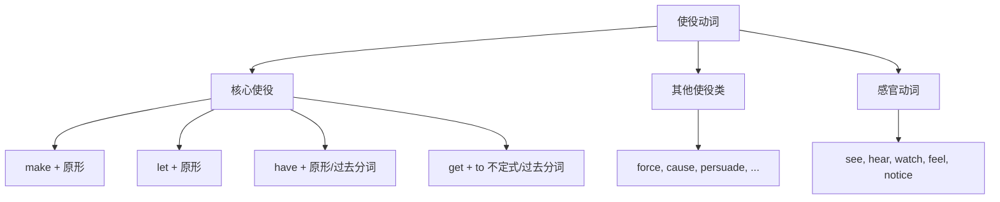

## 简介

**使役动词**（Causative Verb）表示 **主语促使宾语执行某动作** 或 **处于某状态**，是 **复杂及物动词** 的子类。

使役动词的核心句型为：

$$
\text{主语}+\text{使役动词}+\text{宾语}+\text{宾语补语}
$$

宾语补语的形式根据使役动词的不同而变化，主要有 3 种：**动词原形**、**带 to 不定式**、**过去分词**。

## 核心使役动词

英语中最常见的 4 个使役动词为 **make**、**let**、**have**、**get**。

它们在 **宾语补语形式** 上存在差异：

| 动词 | 主动语态宾语补语 |   被动语态宾语补语   |        语义        |
| :--: | :--------------: | :------------------: | :----------------: |
| make |     动词原形     |     带 to 不定式     | 强迫、使（强语气） |
| let  |     动词原形     | 动词原形（罕见用法） |      允许、让      |
| have |     动词原形     |       过去分词       |    让、使、安排    |
| get  |   带 to 不定式   |       过去分词       |    说服、设法使    |

### make

**make** 表示 **强迫** 或 **促使**，语气较强。

主动语态：宾语补语为 **动词原形**。

:::example

- The teacher **made** us **stand up**.（老师让我们站起来。）
- Don't **make** her **cry**.（别把她弄哭了。）

:::

被动语态：宾语补语变为 **带 to 不定式**。

:::example

- We **were made to stand up** by the teacher.（我们被老师要求站起来。）

:::

### let

**let** 表示 **允许** 或 **让**，语气委婉。

主动语态：宾语补语为 **动词原形**。

:::example

- **Let** me **try** once.（让我试一次。）
- My parents won't **let** me **go out**.（我父母不让我出门。）

:::

:::tip

**let** 在被动语态中极少使用，通常改用 **be allowed to**。

:::

:::example

- ~~I was let to go.~~ $\to$ I **was allowed to go**.（我被允许离开。）

:::

### have

**have** 作使役动词时，表示 **让某人做某事** 或 **使某事被做**。

接 **动词原形**：让某人主动做（强调动作执行者）。

:::example

- I'll **have** the porter **carry** the luggage.（我会让门童搬行李。）
- The teacher **had** us **read** the text aloud.（老师让我们朗读课文。）

:::

接 **过去分词**：使某物被处理（强调动作承受者）。

:::example

- I **had** my hair **cut** yesterday.（我昨天剪了头发。）
- She **had** her car **repaired**.（她把车送去修了。）

:::

:::tip

**have + 宾语 + 过去分词** 有两种语义：

- **请人做**：I **had my hair cut**. _(我请人剪了头发)_
- **遭遇**：He **had his wallet stolen**. _(他钱包被偷了)_

需根据上下文判断。

:::

### get

**get** 作使役动词，表示 **说服**、**安排某人做** 或 **使某事被做**。

接 **带 to 不定式**：说服某人做。

:::example

- I'll **get** him **to help** us.（我会说服他帮我们。）
- She finally **got** her son **to study**.（她终于让儿子去学习了。）

:::

接 **过去分词**：使某物被处理（与 have + 过去分词 类似）。

:::example

- I'll **get** the work **done** by tomorrow.（我会在明天之前完成这项工作。）

:::

## 其他使役类动词

下列动词在语义上具有使役意味，但 **不属于核心使役动词**，宾语补语为 **带 to 不定式**。

|   动词    |    语义    |                               示例                               |
| :-------: | :--------: | :--------------------------------------------------------------: |
|   force   |    迫使    |     They **forced** him **to confess**.（他们迫使他招供。）      |
|  compel   |    强迫    |   Illness **compelled** her **to resign**.（疾病迫使她辞职。）   |
|   cause   | 导致、引起 | The rain **caused** the road **to flood**.（大雨导致道路被淹。） |
|  enable   |   使能够   |  The key **enabled** me **to enter**.（这把钥匙让我得以进入。）  |
| persuade  |    说服    |        I **persuaded** him **to come**.（我说服他来了。）        |
|    ask    |    请求    |         She **asked** me **to wait**.（她请我等一下。）          |
|   tell    | 告诉、命令 |          He **told** us **to leave**.（他叫我们离开。）          |
|   order   |    命令    | The captain **ordered** them **to fire**.（船长命令他们开火。）  |
|   allow   |    允许    | They **allow** us **to smoke** here.（他们允许我们在这里抽烟。） |
|  permit   |    准许    |   The rule **permits** us **to enter**.（规定准许我们进入。）    |
| encourage |    鼓励    |   Parents **encourage** us **to read**.（父母鼓励我们阅读。）    |

## 感官动词的类似用法

**感官动词** 在结构上与使役动词类似，详情可与 [非谓语动词](/docs/note/english/grammar/verbs/non-finite-verbs) 对照学习。

|  动词  |      宾语补语       |        语义         |
| :----: | :-----------------: | :-----------------: |
|  see   | 动词原形 / 现在分词 | 看到（结果 / 过程） |
|  hear  | 动词原形 / 现在分词 | 听到（结果 / 过程） |
| watch  | 动词原形 / 现在分词 |        观看         |
| notice | 动词原形 / 现在分词 |       注意到        |
|  feel  | 动词原形 / 现在分词 |       感觉到        |

:::example

- I **saw** him **enter** the room.（我看见他进了房间。）_(看到全过程)_
- I **saw** him **entering** the room.（我看见他正在进房间。）_(看到正在进行)_

:::

被动语态中，宾语补语变为 **带 to 不定式**。

:::example

- He **was seen to enter** the room.（有人看见他进了房间。）

:::

## 思维导图

