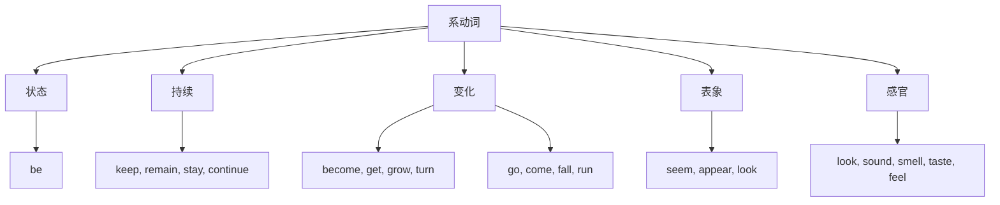

## 简介

**系动词**（Linking Verb），又称 **连系动词**，用于连接 **主语** 和 **主语补语**（表语），表示主语的 **状态**、**性质**、**特征** 或 **变化**。

系动词 **本身意义不完整**，必须与表语共同构成谓语。

$$
\underbrace{\text{The sky}}_{\text{主语}}
\underbrace{\overbrace{\text{is}}^{\text{系动词}}\text{ blue}}_{\text{谓语}}
\text{.}
$$

## 基本句型

系动词的句型为：

$$
\text{主语}+\text{系动词}+\text{表语}
$$

**表语** 可以是 **名词**、**形容词**、**代词**、**数词**、**介词短语**、**非谓语动词** 或 **从句**。

:::example

- She is **a teacher**. _(名词)_
- He looks **tired**. _(形容词)_
- The book is **mine**. _(代词)_
- The price is **fifty dollars**. _(数词)_
- He is **in the room**. _(介词短语)_
- His hobby is **collecting stamps**. _(动名词)_
- The truth is **that he lied**. _(表语从句)_

:::

## 分类

按语义可分为 5 类。

### 状态系动词

表示主语 **保持某种状态**，最常见的是 **be**。

| 系动词 |       示例        |
| :----: | :---------------: |
|   be   | She **is** happy. |

### 持续系动词

表示主语 **持续保持某种状态**。

|  系动词  |              示例               |
| :------: | :-----------------------------: |
|   keep   |      He **keeps** silent.       |
|  remain  |      She **remains** calm.      |
|   stay   |     Please **stay** still.      |
| continue | The weather **continues** fine. |

### 变化系动词

表示主语 **从一种状态变为另一种状态**。

| 系动词 |             示例              |
| :----: | :---------------------------: |
| become |    He **became** a doctor.    |
|  get   |    It is **getting** cold.    |
|  grow  |      She **grew** angry.      |
|  turn  | The leaves **turned** yellow. |
|   go   |    The milk **went** bad.     |
|  come  |   His dreams **came** true.   |
|  fall  |      He **fell** asleep.      |
|  run   |    The river **ran** dry.     |

:::tip

变化系动词在搭配上有细微差异：

- **become** 用法最广，可接名词、形容词。
- **get** 多用于口语，强调过程。
- **turn** 多用于颜色、季节等渐进变化。
- **go** 通常接 **负面** 状态（bad, mad, blind）。
- **come** 通常接 **正面** 状态（true, alive）。

:::

### 表象系动词

表示主语 **看起来像**、**显得**。

| 系动词 |           示例            |
| :----: | :-----------------------: |
|  seem  |   She **seems** tired.    |
| appear | He **appears** confident. |
|  look  | You **look** great today. |

:::tip

**seem** 强调主观推测，**appear** 强调客观显现，**look** 强调视觉印象。

:::

### 感官系动词

表示通过 **五官** 感知主语的特征。

| 系动词 |              示例               |
| :----: | :-----------------------------: |
|  look  |  The cake **looks** delicious.  |
| sound  | The music **sounds** beautiful. |
| smell  |  The flower **smells** sweet.   |
| taste  |   The soup **tastes** salty.    |
|  feel  |    The silk **feels** soft.     |

## 易错点

### 系动词后接形容词

系动词后接 **形容词**（作表语），不接 **副词**。

:::example

- She looks **beautiful**. ~~She looks beautifully.~~
- The music sounds **nice**. ~~The music sounds nicely.~~

:::

### 区分实义动词与系动词

部分动词既可作 **实义动词**，又可作 **系动词**，需根据语义判断。

:::example

- She **looked at me**. _(实义动词，「看」)_
- She **looked tired**. _(系动词，「显得」)_

:::

- 接 **副词** 或 **介词短语** $\to$ 实义动词。
- 接 **形容词** $\to$ 系动词。

### 被动语态

系动词 **没有被动语态**，因为系动词不带 **宾语**（详见 [被动](/docs/note/english/grammar/sentences/passive-voice)）。

## 思维导图

