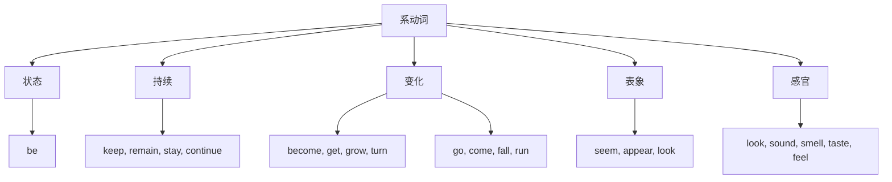

## 简介

**系动词**（Linking Verb），又称 **连系动词**，用于连接 **主语** 和 **主语补语**（表语），表示主语的 **状态**、**性质**、**特征** 或 **变化**。

系动词 **本身意义不完整**，必须与表语共同构成谓语。

$$
\underbrace{\text{The sky}}_{\text{主语}}
\underbrace{\overbrace{\text{is}}^{\text{系动词}}\text{ blue}}_{\text{谓语}}
\text{.}
$$

## 基本句型

系动词的句型为：

$$
\text{主语}+\text{系动词}+\text{表语}
$$

**表语** 可以是 **名词**、**形容词**、**代词**、**数词**、**介词短语**、**非谓语动词** 或 **从句**。

:::example

- She is **a teacher**.（她是一名老师。） _(名词)_
- He looks **tired**.（他看起来很累。） _(形容词)_
- The book is **mine**.（这本书是我的。） _(代词)_
- The price is **fifty dollars**.（价格是五十美元。） _(数词)_
- He is **in the room**.（他在房间里。） _(介词短语)_
- His hobby is **collecting stamps**.（他的爱好是集邮。） _(动名词)_
- The truth is **that he lied**.（事实是他撒了谎。） _(表语从句)_

:::

## 分类

按语义可分为 5 类。

### 状态系动词

表示主语 **保持某种状态**，最常见的是 **be**。

| 系动词 |              示例               |
| :----: | :-----------------------------: |
|   be   | She **is** happy.（她很开心。） |

### 持续系动词

表示主语 **持续保持某种状态**。

|  系动词  |                       示例                        |
| :------: | :-----------------------------------------------: |
|   keep   |       He **keeps** silent.（他保持沉默。）        |
|  remain  |       She **remains** calm.（她保持镇定。）       |
|   stay   |        Please **stay** still.（请别动。）         |
| continue | The weather **continues** fine.（天气持续晴好。） |

### 变化系动词

表示主语 **从一种状态变为另一种状态**。

| 系动词 |                     示例                      |
| :----: | :-------------------------------------------: |
| become |  He **became** a doctor.（他成了一名医生。）  |
|  get   |    It is **getting** cold.（天渐渐冷了。）    |
|  grow  |       She **grew** angry.（她生气了。）       |
|  turn  | The leaves **turned** yellow.（树叶变黄了。） |
|   go   |    The milk **went** bad.（牛奶变质了。）     |
|  come  | His dreams **came** true.（他的梦想成真了。） |
|  fall  |       He **fell** asleep.（他睡着了。）       |
|  run   |    The river **ran** dry.（河水干涸了。）     |

:::tip

变化系动词在搭配上有细微差异：

- **become** 用法最广，可接名词、形容词。
- **get** 多用于口语，强调过程。
- **turn** 多用于颜色、季节等渐进变化。
- **go** 通常接 **负面** 状态（bad, mad, blind）。
- **come** 通常接 **正面** 状态（true, alive）。

:::

### 表象系动词

表示主语 **看起来像**、**显得**。

| 系动词 |                     示例                      |
| :----: | :-------------------------------------------: |
|  seem  |     She **seems** tired.（她似乎累了。）      |
| appear |   He **appears** confident.（他显得自信。）   |
|  look  | You **look** great today.（你今天气色很好。） |

:::tip

**seem** 强调主观推测，**appear** 强调客观显现，**look** 强调视觉印象。

:::

### 感官系动词

表示通过 **五官** 感知主语的特征。

| 系动词 |                         示例                          |
| :----: | :---------------------------------------------------: |
|  look  | The cake **looks** delicious.（这蛋糕看起来很美味。） |
| sound  | The music **sounds** beautiful.（这音乐听起来很美。） |
| smell  |   The flower **smells** sweet.（这花闻起来很香。）    |
| taste  |    The soup **tastes** salty.（这汤尝起来很咸。）     |
|  feel  |   The silk **feels** soft.（这丝绸摸起来很柔软。）    |

## 易错点

### 系动词后接形容词

系动词后接 **形容词**（作表语），不接 **副词**。

:::example

- She looks **beautiful**.（她看起来很美。） ~~She looks beautifully.~~
- The music sounds **nice**.（这音乐听起来很悦耳。） ~~The music sounds nicely.~~

:::

### 区分实义动词与系动词

部分动词既可作 **实义动词**，又可作 **系动词**，需根据语义判断。

:::example

- She **looked at me**.（她看着我。） _(实义动词，「看」)_
- She **looked tired**.（她显得很累。） _(系动词，「显得」)_

:::

- 接 **副词** 或 **介词短语** $\to$ 实义动词。
- 接 **形容词** $\to$ 系动词。

### 被动语态

系动词 **没有被动语态**，因为系动词不带 **宾语**（详见 [被动](/docs/note/english/grammar/sentences/passive-voice)）。

## 思维导图

