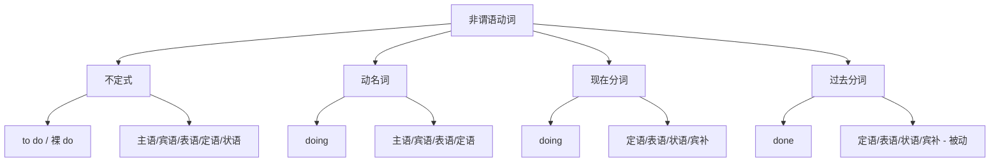

## 简介

**非谓语动词**（Non-finite Verb）是动词的 **非谓语形式**，**不能单独作谓语**，但保留动词的 **及物性** 和 **语态、时态** 特征。

英语非谓语动词有 4 种形式：**不定式**、**动名词**、**现在分词**、**过去分词**。

|     类型     | 形式  |          主要功能           |
| :----------: | :---: | :-------------------------: |
|  **不定式**  | to do |     名词、形容词、副词      |
|  **动名词**  | doing |            名词             |
| **现在分词** | doing |        形容词、副词         |
| **过去分词** | done  | 形容词、副词（被动 / 完成） |

:::tip

**动名词** 和 **现在分词** 形式相同（都是 -ing），但 **功能不同**：动名词作名词，现在分词作形容词或副词。

:::

## 不定式

**不定式**（Infinitive）由 **to + 动词原形** 构成。

部分场合使用 **不带 to** 的形式，称为 **裸不定式**（Bare Infinitive）。

### 句法功能

#### 作主语

不定式作主语时，常用 **形式主语 it** 代替，真正的不定式后置。

:::example

- **To learn** English is useful.（学英语很有用。）
- **It** is useful **to learn English**.（学英语很有用。）_(更常用)_

:::

#### 作宾语

某些动词后必须接不定式作宾语：want, decide, hope, plan, agree, promise, refuse, manage, learn, …

:::example

- I want **to leave** early.（我想早点离开。）
- She decided **to study** abroad.（她决定出国留学。）

:::

#### 作表语

不定式可作表语，表示主语的内容或目的。

:::example

- My goal is **to graduate** this year.（我的目标是今年毕业。）
- Her dream is **to travel** the world.（她的梦想是环游世界。）

:::

#### 作宾语补语

宾语补语为不定式的句型为：**主语 + 动词 + 宾语 + (to) do**。

:::example

- I want you **to come** with me.（我想让你跟我一起来。）
- The teacher told us **to be quiet**.（老师叫我们安静。）

:::

#### 作定语

不定式作定语 **后置** 修饰名词，表示 **将来动作** 或 **被动**。

:::example

- I have a lot of work **to do**.（我有很多工作要做。）
- This is the book **to read**.（这是要读的书。）

:::

#### 作状语

不定式作状语，表示 **目的**、**结果**、**原因** 或 **条件**。

:::example

- I came here **to see** you.（我来这里看你。）_(目的)_
- He grew up **to be** a doctor.（他长大成了医生。）_(结果)_
- I'm glad **to meet** you.（很高兴见到你。）_(原因)_

:::

### 裸不定式（不带 to）

下列场合使用 **不带 to** 的不定式：

- 情态动词后：can do, must do, may do
- 使役动词 **make/let/have** 后：make him do
- 感官动词 **see/hear/watch/feel/notice** 后：see him come
- 短语 had better, would rather, why not 后：had better go
- 介词 but, except, besides 后（前句含 do）：do nothing but cry

:::example

- I can **swim**.（我会游泳。）
- Let me **try**.（让我试试。）
- I saw him **leave**.（我看见他离开了。）
- You had better **rest**.（你最好休息一下。）
- He did nothing but **cry**.（他只是一个劲地哭。）

:::

### 不定式的时态和语态

|      形式      |        主动        |       被动        |
| :------------: | :----------------: | :---------------: |
|   **一般式**   |       to do        |    to be done     |
|   **进行式**   |    to be doing     |         —         |
|   **完成式**   |    to have done    | to have been done |
| **完成进行式** | to have been doing |         —         |

:::example

- She seems **to know** the answer.（她似乎知道答案。）_(一般式)_
- He seems **to be working** now.（他似乎正在工作。）_(进行式)_
- She seems **to have finished**.（她似乎已经完成了。）_(完成式)_
- The book seems **to have been read** many times.（这本书似乎被读过很多遍。）_(完成被动式)_

:::

## 动名词

**动名词**（Gerund）由 **动词 + -ing** 构成，作 **名词** 使用。

### 句法功能

#### 作主语

:::example

- **Smoking** is harmful.（吸烟有害。）
- **Reading** broadens the mind.（阅读开阔思维。）

:::

#### 作宾语

某些动词后必须接动名词：enjoy, finish, mind, avoid, suggest, consider, practice, keep, …

:::example

- I enjoy **reading**.（我喜欢阅读。）
- He finished **writing** the letter.（他写完了信。）

:::

某些介词短语后必须接动名词：look forward to, be used to, devote oneself to, …

:::example

- I look forward to **seeing** you.（我期待见到你。）
- He is used to **living** alone.（他习惯独居。）

:::

#### 作表语

:::example

- His hobby is **collecting stamps**.（他的爱好是集邮。）

:::

#### 作定语

动名词作定语表示 **用途**。

:::example

- a swimming pool（游泳用的池子）
- a sleeping bag（睡觉用的袋子）

:::

### 不定式 vs. 动名词

部分动词后既可接不定式又可接动名词，含义 **不同**：

|   动词   |     接不定式     |     接动名词     |
| :------: | :--------------: | :--------------: |
| remember | 记得要做（未做） | 记得做过（已做） |
|  forget  |     忘记要做     |     忘记做过     |
|  regret  |     遗憾要做     |     后悔做过     |
|   stop   |    停下来去做    |    停止做某事    |
|   try    |      设法做      |      尝试做      |
|   mean   |      打算做      |     意味着做     |
|  go on   |  接着做另一件事  |  继续做同一件事  |

:::example

- I remember **to lock** the door.（我记得要锁门。）_(记得要锁)_
- I remember **locking** the door.（我记得锁过门。）_(记得锁过)_
- He stopped **to smoke**.（他停下来抽烟。）_(停下来抽烟)_
- He stopped **smoking**.（他戒烟了。）_(戒烟了)_

:::

## 现在分词

**现在分词**（Present Participle）由 **动词 + -ing** 构成，作 **形容词** 或 **副词** 使用。

### 句法功能

#### 作定语

修饰名词，表示 **主动** 或 **进行**。

- 单个分词：前置。
- 短语：后置。

:::example

- a **running** boy（正在跑的男孩）
- the boy **running over there**（在那边跑的男孩）

:::

#### 作表语

主语 **主动** 引起感受。

:::example

- The story is **interesting**.（这故事很有趣。）
- The news is **exciting**.（这消息令人兴奋。）

:::

#### 作状语

充当时间、原因、条件、伴随、方式状语。

:::example

- **Hearing** the news, she cried.（听到这消息，她哭了。）_(时间)_
- **Being** ill, he stayed home.（因为生病，他待在家里。）_(原因)_
- He sat **reading** a book.（他坐着看书。）_(伴随)_

:::

#### 作宾语补语

:::example

- I saw him **running** away.（我看见他跑开了。）_(看到正在跑)_
- We kept him **waiting**.（我们让他一直等着。）_(让他等着)_

:::

## 过去分词

**过去分词**（Past Participle）通常由 **动词 + -ed** 构成，作 **形容词** 或 **副词** 使用，表示 **被动** 或 **完成**。

不规则动词的过去分词需单独记忆，如 write $\to$ written, sing $\to$ sung。

### 句法功能

#### 作定语

- 单个分词：前置。
- 短语：后置。

:::example

- a **broken** window（坏掉的窗户）
- the book **written by him**（他写的书）

:::

#### 作表语

主语 **被动** 接受感受。

:::example

- The students are **interested** in math.（学生们对数学感兴趣。）
- I am **excited** about the trip.（我对这次旅行很兴奋。）

:::

:::tip

**-ing 形容词** 和 **-ed 形容词** 的区别：

- **-ing**：主动引起感受（事物为主语）。
- **-ed**：被动接受感受（人为主语）。

:::

:::example

- The film is **boring**.（这电影很无聊。）_(电影很无聊)_
- I am **bored**.（我感到无聊。）_(我感到无聊)_

:::

#### 作状语

充当时间、原因、条件、方式状语，表示 **被动** 或 **已完成**。

:::example

- **Given** more time, I could do better.（如果给我更多时间，我能做得更好。）_(条件)_
- **Surprised** by the noise, he turned around.（被声音吓了一跳，他转过身来。）_(原因)_

:::

#### 作宾语补语

:::example

- I had my hair **cut**.（我剪了头发。）_(让头发被剪)_
- We found the door **locked**.（我们发现门锁着。）_(发现门被锁)_

:::

## 独立主格

非谓语动词与 **逻辑主语** 共同构成 **独立主格**（详见 [独立主格](/docs/note/english/grammar/sentences/absolute-constructions)）。

:::example

- **Weather permitting**, we'll have a picnic tomorrow.（如果天气允许，我们明天去野餐。）
- **The work done**, they went home.（工作完成后，他们回家了。）

:::

## 固定搭配

### to do

部分动词、形容词、名词后习惯接 **to do**。

:::example

- want / hope / decide / plan / agree / promise **to do**（想要 / 希望 / 决定 / 计划 / 同意 / 承诺做）
- be eager / glad / willing / able **to do**（渴望 / 高兴 / 愿意 / 能够做）
- a chance / decision / plan / right **to do**（做某事的机会 / 决定 / 计划 / 权利）

:::

### doing

部分动词、介词短语后习惯接 **动名词**。

:::example

- enjoy / finish / mind / avoid / suggest / practice **doing**（喜欢 / 完成 / 介意 / 避免 / 建议 / 练习做）
- look forward to / be used to / devote oneself to **doing**（期待 / 习惯于 / 致力于做）
- can't help / it's no use / there is no point **doing**（禁不住做 / 做……没用 / 做……没意义）

:::

## 分词

### doing

**现在分词** 表示 **主动** 或 **进行**。

:::example

- the **rising** sun（正在升起的太阳）
- the **running** water（流动的水）

:::

### done

**过去分词** 表示 **被动** 或 **完成**。

:::example

- the **fallen** leaves（落下的叶子）
- a **closed** door（关闭的门）

:::

## 思维导图

