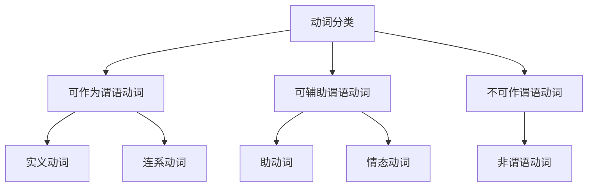

# 动词分类

## 简介

英语的核心是 **动词**。

英语句子的基础形式是 **简单句**，可以概括为“**什么** + **怎么样**”。

“什么”是 **主语**，“怎么样”是 **谓语**。

谓语通常包含一个核心动词，称为 **谓语动词**。

每个简单句 **有且仅有一个** 谓语动词。

$$
\underbrace{\text{The cat}}_{\text{主语}}
\underbrace{\overbrace{\text{eats}}^{\text{谓语动词}}\text{ a fish}}_{\text{谓语}}
\text{.}
$$

## 可作为谓语动词

谓语动词有 $5$ 个基本类别：

1. 不及物动词
2. 单及物动词
3. 双及物动词
4. 复杂及物动词
5. 连系动词

:::tip

1. “及物”的“及”意为“达到、关联、带着”，“及物”指动作需要带有对象，而这个对象就是宾语。
2. “连系动词”也称为“系动词”。

:::

### 实义动词

及物动词和不及物动词合起来就是实义动词

按动作承受者划分：及物动词、不及物动词

按状态动作划分：动作动词、状态动词

### 连系动词

详见 [系动词](linking-verbs)。

## 可辅助谓语动词

详见 [助动词 & 情态动词](auxiliary-modal-verbs)。

### 助动词

### 情态动词

## 不可作谓语动词

### 非谓语动词

详见 [非谓语动词](non-finite-verbs)。

不定式、过去分词、现在分词、动名词

## 思维导图

