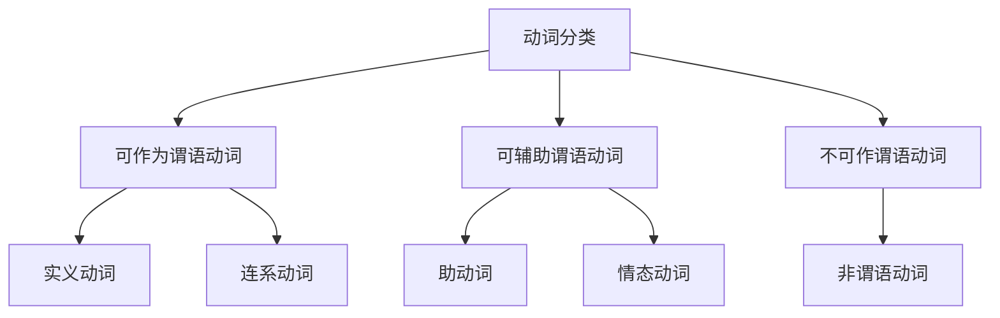

## 简介

英语的核心是 **动词**。

英语句子的基础形式是 **简单句**，可以概括为「**什么**」+「**怎么样**」。

「什么」是 **主语**，「怎么样」是 **谓语**。

谓语通常包含一个核心动词，称为 **谓语动词**。

每个简单句 **有且仅有一个** 谓语动词。

$$
\underbrace{\text{The cat}}_{\text{主语}}
\underbrace{\overbrace{\text{eats}}^{\text{谓语动词}}\text{ a fish}}_{\text{谓语}}
\text{.}
$$

## 可作为谓语动词

谓语动词有 5 个基本类别：

1. 不及物动词
2. 单及物动词
3. 双及物动词
4. 复杂及物动词
5. 连系动词

### 实义动词

及物动词和不及物动词合起来就是实义动词

按动作承受者划分：及物动词、不及物动词

按状态动作划分：动作动词、状态动词

### 连系动词

详见 [系动词](/docs/note/english/grammar/verbs/linking-verbs)。

## 可辅助谓语动词

详见 [助动词 & 情态动词](/docs/note/english/grammar/verbs/auxiliary-modal-verbs)。

### 助动词

**助动词**（Auxiliary Verb）本身没有实义，与主动词组合构成 **时态**、**语态**、**否定**、**疑问** 等结构。常见助动词：**be / have / do / will / shall**。

### 情态动词

**情态动词**（Modal Verb）表达说话人对动作的 **态度**、**可能性**、**必要性** 或 **能力**，后接 **动词原形**。常见情态动词：**can / could / may / might / must / shall / should / will / would**。

## 不可作谓语动词

### 非谓语动词

详见 [非谓语动词](/docs/note/english/grammar/verbs/non-finite-verbs)。

不定式、过去分词、现在分词、动名词

## 思维导图

