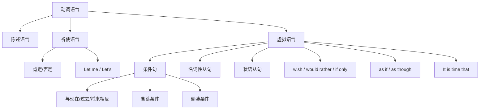

## 简介

**语气**（Mood）是动词的语法范畴，表达说话人对所说内容的 **态度**。

英语动词有 3 种基本语气：

- **陈述语气**（Indicative Mood）
- **祈使语气**（Imperative Mood）
- **虚拟语气**（Subjunctive Mood）

|   语气   |         表达内容         |                       典型示例                       |
| :------: | :----------------------: | :--------------------------------------------------: |
| 陈述语气 |    陈述事实、提出疑问    |          He is a student.（他是一名学生。）          |
| 祈使语气 |   表达命令、请求、建议   |            Close the door.（把门关上。）             |
| 虚拟语气 | 表达假设、愿望、建议要求 | If I were you, I would go.（如果我是你，我就会去。） |

## 陈述语气

**陈述语气** 用于陈述事实、描述状态、提出疑问，是英语中使用最频繁的语气。

时态、语态、人称均按 **常规规则** 变化（详见 [动词时态](/docs/note/english/grammar/verbs/verb-tenses)、[被动](/docs/note/english/grammar/sentences/passive-voice)）。

:::example

- The Earth **goes** around the Sun.（地球绕着太阳转。）
- He **didn't** come yesterday.（他昨天没来。）
- Are you a student?（你是学生吗？）

:::

## 祈使语气

**祈使语气** 用于表达 **命令**、**请求**、**建议**、**禁止** 或 **指示**。

### 形式

祈使句通常 **省略主语**（默认为 you），动词使用 **原形**。

|     类型     |                   形式                   |                 示例                 |
| :----------: | :--------------------------------------: | :----------------------------------: |
|   **肯定**   |               动词原形 ...               |    Close the door.（把门关上。）     |
|   **否定**   |           Don't + 动词原形 ...           | Don't be late again.（别再迟到了。） |
|   **婉转**   | Please + 动词原形 / 动词原形 ..., please |      Please sit down.（请坐。）      |
| **建议自身** |            Let me + 动词原形             |      Let me try.（让我试试。）       |
| **建议双方** |             Let's + 动词原形             |   Let's go now.（我们现在走吧。）    |
| **第三人称** |            Let him + 动词原形            |   Let him decide.（让他来决定。）    |

### 加强语气

句首加 **do** 可加强祈使语气，多用于请求或催促。

:::example

- **Do** sit down.（请务必坐下。）
- **Do** come early.（请一定早点来。）

:::

## 虚拟语气

**虚拟语气** 表示与 **事实相反** 的假设、不可能实现的愿望、或主观的建议要求。

### 与事实相反的条件句

**条件状语从句**（if-clause）和 **主句** 的虚拟形式根据时间不同分为 3 类。

|        时间        |                 从句（if-clause）                 |                       主句                       |                                         示例                                         |
| :----------------: | :-----------------------------------------------: | :----------------------------------------------: | :----------------------------------------------------------------------------------: |
| **与现在事实相反** |              过去时态（be 用 were）               |    would / could / should / might + 动词原形     |             If I **were** you, I **would go**.（如果我是你，我就会去。）             |
| **与过去事实相反** |                  had + 过去分词                   | would / could / should / might + have + 过去分词 |        If I **had known**, I **would have come**.（如果我早知道，我就来了。）        |
| **与将来事实相反** | 过去时态 / should + 动词原形 / were to + 动词原形 |    would / could / should / might + 动词原形     | If it **should rain** tomorrow, I **would stay** home.（如果明天下雨，我就待在家。） |

:::example

- If I **were** rich, I **would travel** the world.（如果我富有，我就会环游世界。）_(与现在相反)_
- If he **had studied** harder, he **would have passed**.（如果他当初更用功，就通过了。）_(与过去相反)_
- If the sun **were to rise** in the west, I **would believe** you.（如果太阳从西边升起，我就相信你。）_(与将来相反)_

:::

### 错综时间条件句

从句和主句的时间 **不一致** 时，各自按对应规则使用虚拟形式。

:::example

- If you **had taken** my advice, you **would not be** in trouble now.（如果你当初听了我的建议，现在就不会有麻烦。）

_(从句：与过去相反；主句：与现在相反)_

:::

### 含蓄条件句

条件不通过 **if** 引出，而通过 **介词短语**、**without**、**but for**、**otherwise** 等暗示。

:::example

- **Without** your help, I **would have failed**.（没有你的帮助，我就失败了。）
- **But for** the rain, we **would have gone** out.（要不是下雨，我们就出门了。）
- He didn't tell me; **otherwise** I **would have come**.（他没告诉我，否则我就来了。）

:::

### 倒装条件句

省略 **if**，将 **were**、**had**、**should** 提到 **句首**（详见 [倒装](/docs/note/english/grammar/sentences/inversion)）。

:::example

- **Were I** you, I would go.（如果我是你，我就会去。）_(= If I were you)_
- **Had I known**, I would have come.（如果我早知道，我就来了。）_(= If I had known)_
- **Should it rain**, we would cancel the trip.（万一下雨，我们就取消这次出行。）_(= If it should rain)_

:::

### 在名词性从句中

#### 在主语从句和表语从句中

句型 **It is + 表语 + that 从句**：表语为 **necessary, important, essential, vital, urgent, advisable, …** 时，从句谓语用 **(should) + 动词原形**。

:::example

- It is necessary that he **(should) be** present.（他有必要到场。）
- It is important that we **(should) act** at once.（我们立即行动很重要。）

:::

#### 在宾语从句中

含 **建议、要求、命令** 之意的动词后接的宾语从句，谓语用 **(should) + 动词原形**。

常见动词可用 **「一坚持，二命令，三建议，四要求」** 记忆：

- **坚持**：insist
- **命令**：order, command, demand
- **建议**：suggest, advise, propose, recommend
- **要求**：request, require, ask, desire

:::example

- The teacher insists that we **(should) finish** the work.（老师坚持要我们完成这项工作。）
- He suggested that she **(should) see** a doctor.（他建议她去看医生。）

:::

:::tip

- **insist** 表示 **「坚持认为」** 时（陈述事实），用陈述语气，不用虚拟。
- **suggest** 表示 **「暗示、表明」** 时，用陈述语气。

:::

:::example

- He insisted that he **was** innocent.（他坚称自己是无辜的。）_(坚持认为)_
- The smile suggested that he **was** happy.（那笑容表明他很开心。）_(暗示)_

:::

#### 在同位语从句和表语从句中

由 **suggestion, advice, order, request, demand, idea, proposal, …** 引导的同位语从句和表语从句，谓语用 **(should) + 动词原形**。

:::example

- His suggestion that we **(should) leave** early was accepted.（他关于我们早点离开的建议被采纳了。）
- My advice is that you **(should) study** harder.（我的建议是你要更用功学习。）

:::

### 在状语从句中

#### 让步状语从句

由 **whatever, whoever, however, …** 引导，谓语可用 **may + 动词原形** 表虚拟。

:::example

- Whatever he **may say**, don't believe him.（无论他说什么，都别信他。）

:::

#### 目的状语从句

由 **so that, in order that, lest, for fear that** 引导，谓语用 **may/might/should + 动词原形**。

:::example

- He spoke slowly so that we **might understand** him.（他说得很慢，好让我们听懂。）
- Take an umbrella lest it **should rain**.（带把伞，以防下雨。）

:::

### 表示愿望

|          引导词           |                             示例                             |
| :-----------------------: | :----------------------------------------------------------: |
|     wish + 与现在相反     |        I wish I **were** taller.（但愿我能再高些。）         |
|     wish + 与过去相反     | I wish I **had studied** harder.（要是我当初更用功就好了。） |
|     wish + 与将来相反     |      I wish it **would stop** raining.（但愿雨能停。）       |
| would rather + 与现在相反 | I would rather you **stayed** here.（我倒希望你留在这里。）  |
|    if only + 各种时间     |        If only I **were** rich!（要是我富有就好了！）        |

### 表示比较或方式

由 **as if / as though** 引导，谓语用 **过去时态** 或 **had + 过去分词**。

:::example

- He talks as if he **knew** everything.（他说起话来仿佛无所不知。）_(与现在相反)_
- She looks as if she **had seen** a ghost.（她看上去像是见了鬼。）_(与过去相反)_

:::

### It is (high) time that ...

句型 **It is (high) time that ...** 后的从句谓语用 **过去时态** 或 **should + 动词原形**，表示 **「该做某事了」**。

:::example

- It is high time that we **left**.（我们该走了。）
- It is time that you **should go** to bed.（你该去睡觉了。）

:::

## 思维导图

