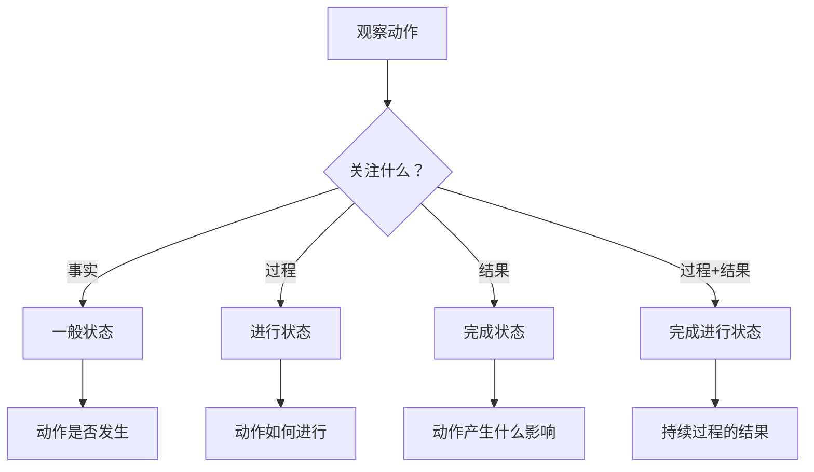

# 动词时态

## 简介

英语动词 **时态** 是表达动作或状态在时间轴上发生情况的语法系统。

时态通过 **时间** 和 **状态** 两个正交维度构建完整的语义框架。

$$
\underbrace{\text{Tense}}_{\text{时态}}
=\underbrace{\text{Time}}_{\text{时间}}
+\underbrace{\text{State}}_{\text{状态}}
$$

## 构成

时间有 $4$ 种：现在、过去、将来、过去将来。

$$
\text{时间}=\set{\text{现在},\text{过去},\text{将来},\text{过去将来}}
$$

状态有 $4$ 种：一般、进行、完成、完成进行。

$$
\text{状态}=\set{\text{一般},\text{进行},\text{完成},\text{完成进行}}
$$

根据乘法原理，英语中一共有 $16$ 种时态。

$$
\text{时态}=\text{时间}\times\text{状态}
$$

## 表格

| 时间 / 状态  |              一般              |                 进行                  |                 完成                  |                    完成进行                     |
| :----------: | :----------------------------: | :-----------------------------------: | :-----------------------------------: | :---------------------------------------------: |
|   **现在**   | **一般现在时态**<br />do/does  | **现在进行时态**<br />am/is/are doing |  **现在完成时态**<br />have/has done  |    现在完成进行时态<br />have/has been doing    |
|   **过去**   |   **一般过去时态**<br />did    | **过去进行时态**<br />was/were doing  |    **过去完成时态**<br />had done     |      过去完成进行时态<br />had been doing       |
|   **将来**   | **一般将来时态**<br />will do  |    将来进行时态<br />will be doing    |   将来完成时态<br />will have done    |   将来完成进行时态<br />will have been doing    |
| **过去将来** | 一般过去将来时态<br />would do | 过去将来进行时态<br />would be doing  | 过去将来完成时态<br />would have done | 过去将来完成进行时态<br />would have been doing |

## 时间

时间维度建立以说话时刻为原点的时间坐标系，将动作发生的时间位置精确定位到四个基本区间。

### 时间分类体系

|   时间类型   |     数学关系      |    语义定义    |   参考示例   |
| :----------: | :---------------: | :------------: | :----------: |
|   **现在**   |     $t = t_0$     |    说话时刻    |   此时此刻   |
|   **过去**   |     $t < t_0$     |    说话之前    |  已发生事件  |
|   **将来**   |     $t > t_0$     |    说话之后    |  未发生事件  |
| **过去将来** | $t_1 < t_0 < t_2$ | 过去视角的将来 | 相对将来时点 |

### 时间轴可视化

```text
过去时区 ←——————————————————|——————————————————→ 将来时区
                    现在(t₀)
                      ↓
                过去将来(相对)

时间流向: ———————————————————————————————————————→
```

### 时间类型详解

|   时间类型   |    语义定义    |     数学表达      |       典型标志词       |    语法特点    |
| :----------: | :------------: | :---------------: | :--------------------: | :------------: |
|   **现在**   | 说话的当前时刻 |     $t = t_0$     | now, today, at present | 以说话时为参照 |
|   **过去**   |  说话时刻之前  |     $t < t_0$     |  yesterday, ago, last  | 已完成的时间段 |
|   **将来**   |  说话时刻之后  |     $t > t_0$     |  tomorrow, will, next  | 尚未发生的时间 |
| **过去将来** | 过去某时点之后 | $t_1 < t_0 < t_2$ |  would, was going to   |  双重时间参照  |

### 时间选择原则

时间选择遵循"**参照点定位法**"：

1. **确定参照点**：明确以什么时刻为参照（通常是说话时刻）
2. **建立时间关系**：确定动作相对于参照点的时间位置
3. **选择时间类型**：根据时间关系选择对应的时间类别

:::info 时间理解要点

时间维度的核心在于建立正确的时间参照系统，理解动作发生的相对时间位置。

:::

## 状态

状态维度描述动作的内在结构特征，揭示说话者对动作不同方面的关注焦点。

### 状态分类体系

|   状态类型   |      英文术语      | 语义特征  | 核心概念 |   关注焦点   |
| :----------: | :----------------: | :-------: | :------: | :----------: |
|   **一般**   |       Simple       | 事实陈述  | 动作本身 | 动作是否发生 |
|   **进行**   |     Continuous     | 过程展开  | 动作进程 | 动作进行状态 |
|   **完成**   |      Perfect       | 结果影响  | 动作影响 | 动作完成结果 |
| **完成进行** | Perfect Continuous | 过程+结果 | 持续影响 | 过程的持续性 |

状态选择反映说话者的表达意图，体现对动作不同维度的语义聚焦。

### 状态语义分析

|     状态     | 语义内核 | 表达重点  |     语法特征      | 典型语境 |
| :----------: | :------: | :-------: | :---------------: | :------: |
|   **一般**   | 动作发生 | 事实本身  |     最简形式      | 客观陈述 |
|   **进行**   | 动作过程 | 进行状态  |    be + V-ing     | 现场感强 |
|   **完成**   | 动作结果 | 完成影响  |    have + V-ed    | 结果导向 |
| **完成进行** | 持续过程 | 过程+结果 | have been + V-ing | 强调延续 |

### 状态选择决策树



### 状态对比示例

以动词短语 "do homework" 为例：

|   状态类型   |            例句             |     语义重点      |
| :----------: | :-------------------------: | :---------------: |
|   **一般**   |       I do homework.        |  做作业这个事实   |
|   **进行**   |    I am doing homework.     | 正在做作业的过程  |
|   **完成**   |    I have done homework.    | 做作业的经历/影响 |
| **完成进行** | I have been doing homework. | 持续做作业的过程  |

:::tip 状态理解要点

状态选择的核心在于明确表达意图，选择最能体现语义焦点的状态类型。

:::

## 时态

### 一般现在时态

构成形式：主语 + do/does

核心用法：

- 客观事实 → Water boils at 100°C.
- 习惯动作 → I get up at 7 every morning.
- 固定计划 → The train leaves at 8:30 PM.
- 从句将来 → I'll call you when I arrive.

### 现在进行时态

构成形式：主语 + am/is/are + doing

核心用法：

- 此刻进行 → I am reading a book now.
- 阶段进行 → I am learning Spanish these days.
- 将来安排 → We are meeting at 3 PM tomorrow.
- 情感强调 → He is always complaining.

### 现在完成时态

构成形式：主语 + have/has + done

标志词：since, for, so far, already, yet, recently, over/in+时间, it is the first time that+现在完成时从句

核心用法：

- 过去→现在影响 → I have lost my keys.（现在找不到）
- 持续到现在 → I have lived here for ten years.
- 人生经历 → I have been to Paris twice.
- 最高级搭配 → This is the best movie I have ever seen.

### 现在完成进行时态

构成形式：主语 + have/has + been + doing

核心用法：

- 持续到现在 → I have been studying English for five years.
- 刚结束影响 → You look tired. Have you been working?
- 强调持续性 → She has been feeling unwell lately.

### 一般过去时态

构成形式：主语 + did

核心用法：

- 过去动作 → I visited my grandmother yesterday.
- 过去习惯 → When I was young, I often played football.
- 时间从句 → When he arrived, we were having dinner.

### 过去进行时态

构成形式：主语 + was/were + doing

标志词：when, while

核心用法：

- 过去时刻进行 → I was watching TV at 8 o'clock last night.
- 过去段时间 → It was raining all day yesterday.
- 动作背景 → While I was reading, my phone rang.
- 过去计划 → We were leaving for Beijing the next day.

### 过去完成时态

构成形式：主语 + had + done

标志词：by+过去时间点, it was the first time that + 过去完成时从句.

核心用法：

- 过去的过去 → When I arrived, they had already left.
- 时间先后 → After he had graduated, he found a job.
- 虚拟语气 → If I had studied harder, I would have passed.

### 过去完成进行时态

构成形式：主语 + had + been + doing

核心用法：

- 到过去某时的持续 → I had been waiting for two hours when he arrived.
- 强调持续影响 → He was tired because he had been running.

### 一般将来时态

构成形式：主语 + will/shall + do | 主语 + be going to + do

核心用法：

- 将来动作 → I will visit you tomorrow.
- 临时决定 (will) → I'm thirsty. I'll have some water.
- 有准备计划 (be going to) → I'm going to study abroad next year.
- 预测判断 → I think it will be a good day.

### 将来进行时态

构成形式：主语 + will + be + doing

核心用法：

- 将来时刻进行 → I will be sleeping at 11 PM tonight.
- 将来段时间 → I'll be working all day tomorrow.
- 按计划安排 → The president will be meeting with delegates.

### 将来完成时态

构成形式：主语 + will + have + done

核心用法：

- 到将来某时完成 → I will have finished my homework by 8 PM.
- 推测已完成 → He will have arrived by now.

### 将来完成进行时态

构成形式：主语 + will + have + been + doing

核心用法：

- 到将来某时的持续 → By next month, I will have been working here for two years.
- 强调持续完成 → By the end of this year, they will have been studying English for five years.

### 一般过去将来时态

构成形式：主语 + would/should + do | 主语 + was/were going to + do

核心用法：

- 过去看将来 → He said he would come to see me.
- 过去习惯 → When I was young, I would often visit my grandparents.
- 虚拟语气 → If I were you, I would accept the offer.

### 过去将来进行时态

构成形式：主语 + would + be + doing

核心用法：

- 过去看将来进行 → He said he would be working in the garden at 3 PM.
- 过去预测进行 → They thought it would be snowing by evening.

### 过去将来完成时态

构成形式：主语 + would + have + done

核心用法：

- 过去看将来完成 → He said he would have finished the project by Friday.
- 虚拟语气过去 → If I had studied harder, I would have passed.

### 过去将来完成进行时态

构成形式：主语 + would + have + been + doing

核心用法：

- 过去看将来持续完成 → He said by next month he would have been working there for two years.

## 法则

时态选择遵循"**先定位，后描述**"的二步法则：

1. **时间定位**：确定动作相对于说话时刻的时间位置
2. **状态描述**：选择最符合语义需求的动作状态

:::tip

理解时态的关键在于掌握时间参考点的转换和动作状态的区分，建议通过大量例句练习强化语感。

:::

### 时态呼应规律

| 主句时态 | 从句时态范围 |                   示例                    |
| :------: | :----------: | :---------------------------------------: |
|  现在时  |   任意时态   |     I think he is/was/will be right.      |
|  过去时  |  过去时态系  | I thought he was/had been/would be right. |

### 时间标志词系统

| 时态类别 |              标志词组              |
| :------: | :--------------------------------: |
| 一般现在 | always, usually, often, every day  |
| 现在进行 |   now, at the moment, these days   |
| 现在完成 |  already, yet, since, for, so far  |
| 一般过去 | yesterday, ago, last week, in 1990 |
| 过去进行 |     at that time, when, while      |
| 将来时态 |     tomorrow, next week, soon      |
