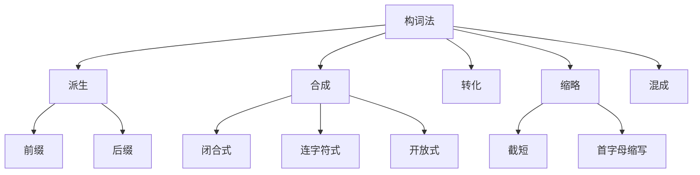

## 简介

**构词法**（Word Formation）是英语词汇的生成规则，研究词如何由 **词根**、**词缀** 和 **其他词** 组合而成。

英语构词法主要有 $5$ 种方式：**派生**、**合成**、**转化**、**缩略**、**混成**。

掌握构词法可以根据已知词推断未知词的含义，对扩大词汇量极为重要。

## 派生法

**派生法**（Derivation）通过在词根上添加 **前缀** 或 **后缀** 构成新词。

### 前缀

**前缀**（Prefix）通常改变词义，不改变词性。

|    语义类型    |                 常见前缀                  |              示例               |
| :------------: | :---------------------------------------: | :-----------------------------: |
|  **否定意义**  | un-, in-, im-, ir-, il-, dis-, non-, mis- |   unhappy, illegal, dishonest   |
|  **数量意义**  |   uni-, bi-, tri-, multi-, semi-, poly-   |  bicycle, triangle, multimedia  |
|  **位置意义**  | pre-, post-, sub-, super-, inter-, trans- |  preview, submarine, interact   |
|  **程度意义**  |   over-, under-, hyper-, hypo-, ultra-    | overwork, underline, hypersonic |
| **重复或回复** |                    re-                    |         rewrite, return         |
| **共同或互相** |           co-, com-, con-, syn-           |   cooperate, connect, synonym   |

|   前缀   |             含义 / 用法              |                       例词                        |            中文含义            |
| :------: | :----------------------------------: | :-----------------------------------------------: | :----------------------------: |
|   un-    |  最通用的否定，常表示“不、未、相反”  |             unhappy, unfair, unknown              |   不开心的、不公平的、未知的   |
|   in-    |       偏正式，常用于拉丁来源词       |               invisible, incomplete               |       看不见的、不完整的       |
|   im-    |    in- 的变体，用于 b / p / m 前     |           impossible, impolite, immoral           |  不可能的、不礼貌的、不道德的  |
|   il-    |        in- 的变体，用于 l 前         |                illegal, illogical                 |       非法的、不合逻辑的       |
|   ir-    |        in- 的变体，用于 r 前         |             irregular, irresponsible              |      不规律的、不负责任的      |
|   non-   |      中性否定，表示“非、不属于”      |         non-smoking, non-profit, nonhuman         |   禁烟的、非营利的、非人类的   |
|   dis-   |      表示否定、相反、分离或取消      |           dislike, disagree, disconnect           |    不喜欢、不同意、断开连接    |
|   mis-   |          表示错误地、不当地          |          misunderstand, misread, misuse           |        误解、误读、误用        |
|  anti-   |         表示反对、抵抗、对抗         |          anti-war, antibiotic, antivirus          |    反战的、抗生素、杀毒软件    |
| counter- |         表示反向、反制、对抗         | counterattack, counterargument, counterproductive |   反击、反驳论点、适得其反的   |
|   de-    |      表示去除、降低、解除或反向      |           deactivate, decode, deforest            |      停用、解码、砍伐森林      |
| a- / an- | 表示没有、缺乏，多用于正式或学术词汇 |            atypical, anonymous, amoral            | 非典型的、匿名的、无道德属性的 |

### 后缀

**后缀**（Suffix）通常改变词性，有时也改变词义。

|    词性    |                      常见后缀                      |                示例                |
| :--------: | :------------------------------------------------: | :--------------------------------: |
|  **名词**  | -tion, -sion, -ness, -ment, -ity, -ance, -er, -ist | action, happiness, payment, runner |
| **形容词** |   -ful, -less, -ous, -al, -ive, -able, -ic, -ish   | useful, careless, active, magical  |
|  **副词**  |                     -ly, -ward                     |         quickly, backward          |
|  **动词**  |                -ize, -fy, -en, -ate                |    modernize, simplify, soften     |

:::example

- happy（形）+ -ness $\to$ happiness（名）
- modern（形）+ -ize $\to$ modernize（动）
- use（动）+ -ful $\to$ useful（形）
- quick（形）+ -ly $\to$ quickly（副）

:::

## 合成法

**合成法**（Compounding）将两个或多个独立词合并为一个新词。

按拼写形式可分为 $3$ 类：

- **闭合式**（无空格）：notebook, blackboard, sunshine
- **连字符式**：mother-in-law, well-known, twenty-one
- **开放式**（带空格）：high school, ice cream, post office

按词性可分为：

|      类型      |                 示例                  |
| :------------: | :-----------------------------------: |
|  **合成名词**  |    blackboard, classroom, sunlight    |
| **合成形容词** | good-looking, world-famous, blue-eyed |
|  **合成动词**  |     baby-sit, sleepwalk, overcome     |
|  **合成副词**  |          however, somewhere           |

:::tip

合成词的拼写形式没有严格规则，应以 **词典** 为准。同一词的拼写可能随时代变化。

:::

## 转化法

**转化法**（Conversion）是词的形态不变，词性发生转化的构词方式。

常见转化方向：

- **名词 $\to$ 动词**：water $\to$ to water，email $\to$ to email
- **动词 $\to$ 名词**：to run $\to$ a run，to walk $\to$ a walk
- **形容词 $\to$ 动词**：empty $\to$ to empty，dry $\to$ to dry
- **形容词 $\to$ 名词**：the rich, the poor, the young

:::example

- I will **water** the flowers. _(名 $\to$ 动)_
- Let's go for a **walk**. _(动 $\to$ 名)_
- **The young** should respect **the old**. _(形 $\to$ 名)_

:::

## 缩略法

**缩略法**（Shortening）将原词截取或缩写，构造便于使用的短词。

### 截短

**截短**（Clipping）只保留原词的一部分。

:::example

- advertisement $\to$ ad
- examination $\to$ exam
- laboratory $\to$ lab
- telephone $\to$ phone
- influenza $\to$ flu

:::

### 首字母缩写

**首字母缩略词**（Initialism / Acronym）取多词短语首字母组成。

按读法分为 $2$ 类：

- **逐字母读**（Initialism）：CPU, USA, FBI
- **整体拼读**（Acronym）：NASA, RADAR, LASER

:::example

- Central Processing Unit $\to$ CPU
- National Aeronautics and Space Administration $\to$ NASA
- Light Amplification by Stimulated Emission of Radiation $\to$ LASER

:::

## 混成法

**混成法**（Blending）将两个词的部分拼合，构造新词。

:::example

- breakfast + lunch $\to$ brunch
- smoke + fog $\to$ smog
- motor + hotel $\to$ motel
- internet + citizen $\to$ netizen
- web + log $\to$ blog

:::

## 思维导图

