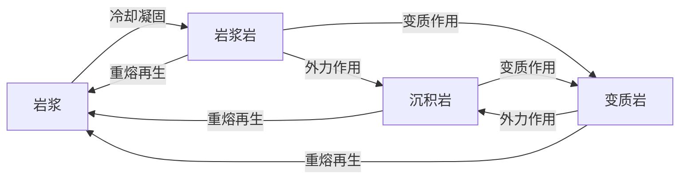

地理选考笔记，对应湘教版《自然地理基础》（选择性必修一），按章节整理。

## 第一章 地球的运动

### 地球的自转和公转

#### 地球的自转

- **概念**：地球绕地轴的旋转运动，地轴北端始终指向北极星附近；
- **方向**：自西向东；北极上空俯视为逆时针，南极上空俯视为顺时针（**北逆南顺**）；
- **周期**：以恒星为参照的 **恒星日**为 $23$ 时 $56$ 分 $4$ 秒，是自转真正周期；以太阳为参照的 **太阳日**为 $24$ 时，是昼夜交替周期；
- **速度**：角速度除极点外处处相等，约 $15^\circ/\text{h}$；线速度由赤道向两极递减，赤道最大，两极为零。

太阳日比恒星日长约 $4$ 分钟，原因是地球自转的同时又绕日公转。恒星日转过 $360^\circ$，太阳日需多转约 $1^\circ$ 才能使太阳再次上中天。

线速度还随海拔升高而增大，同纬度海拔越高线速度越大。发射卫星选低纬（线速度大，节省燃料）、开阔向东的场地。

#### 地球的公转

- **概念**：地球绕太阳的运动；
- **轨道**：近似正圆的椭圆，太阳位于一个焦点上；
- **方向**：自西向东，北极上空俯视为逆时针；
- **周期**：以恒星为参照的 **恒星年**为 $365$ 日 $6$ 时 $9$ 分 $10$ 秒；
- **速度**：符合开普勒第二定律，近日点最快、远日点最慢。

|  位置  |  时间  | 日地距离 | 公转速度 |
| :----: | :----: | :------: | :------: |
| 近日点 | 1 月初 |   最近   |   最快   |
| 远日点 | 7 月初 |   最远   |   最慢   |

近日点在 1 月初、远日点在 7 月初，是判断北半球冬夏的关键：北半球冬季地球公转快，故北半球冬半年（秋分至次年春分）短于夏半年。

#### 黄赤交角

**黄赤交角**是黄道面（公转轨道面）与赤道面（自转平面）之间的夹角，当前约为 $23^\circ 26'$。

黄赤交角的存在，使太阳直射点在南北回归线之间往返移动，这是四季更替、五带划分、正午太阳高度和昼夜长短变化的总根源。

太阳直射点的回归运动周期为 $365$ 日 $5$ 时 $48$ 分 $46$ 秒，称 **回归年**。移动规律：

- 春分（3 月 21 日前后）直射赤道，此后北移；
- 夏至（6 月 22 日前后）直射北回归线，为北移最北点；
- 秋分（9 月 23 日前后）直射赤道，此后南移；
- 冬至（12 月 22 日前后）直射南回归线，为南移最南点。

黄赤交角的度数等于回归线的纬度，也等于极圈到极点的纬度差。若黄赤交角变大，则回归线纬度升高、极圈纬度降低，热带与寒带范围扩大、温带缩小；若变小则反之。

### 地球自转的地理意义

#### 昼夜交替

地球是不发光、不透明的球体，任一时刻只有半球被照亮，被照亮的是昼半球，背光的是夜半球，二者分界线为 **晨昏线**（圈）。

- **晨线**：顺自转方向由夜进入昼的分界线；
- **昏线**：顺自转方向由昼进入夜的分界线；
- 晨昏线与太阳光线垂直，且始终平分赤道；
- 昼夜交替周期为一个太阳日（$24$ 时），周期短，使地表增温降温和缓，有利于生命存在。

晨昏线的判读：顺着自转方向，将要进入白昼的是晨线，将要进入黑夜的是昏线。晨昏线只在春秋分日与经线圈重合，二至日与极圈相切。

#### 地方时与区时

地球自西向东自转，同一纬度上位置偏东的地点先见日出，时刻偏早。

- **地方时**：因经度不同而不同的时刻。经度每差 $15^\circ$，地方时相差 $1$ 时；每差 $1^\circ$，相差 $4$ 分钟；东早西晚，东加西减；
- **时区**：全球按经度每 $15^\circ$ 划为一个时区，共 $24$ 个时区；
- **区时**：各时区以本区中央经线的地方时作为统一时间。相邻时区区时相差 $1$ 时。

时区数的计算：用当地经度除以 $15$，商四舍五入取整即为时区数（东经为东时区，西经为西时区）。中央经线经度等于时区数乘 $15$。

区时计算遵循「东加西减」：求东边时区区时用加，求西边时区区时用减，差几个时区就加减几个小时。

我国全国统一使用东八区区时，即 **北京时间**（东经 $120^\circ$ 的地方时），并非北京市（东经 $116^\circ$）的地方时。

#### 国际日界线

原则上以 $180^\circ$ 经线作为地球上「今天」与「昨天」的分界，称 **国际日界线**。为避开陆地，实际界线有几处弯曲。

- 自西向东（由东十二区进入西十二区）越过日界线，日期减一天；
- 自东向西越过日界线，日期加一天；
- 日界线两侧钟点相同、日期相差一天。

地球上还有一条随时刻变动的自然日界线，即地方时为 $0$ 时（$24$ 时）的经线。两条日界线把地球分为两个日期，$0$ 时经线以东至 $180^\circ$ 为「今天」，以西为「昨天」。当 $180^\circ$ 恰为 $0$ 时，全球同属一个日期。

#### 沿地表水平运动物体的偏转

地球自转产生 **地转偏向力**，使沿地表水平运动的物体方向发生偏转。

- 规律：**北半球右偏，南半球左偏，赤道不偏**；
- 大小：随纬度升高而增大，赤道为零，极点最大；只改变方向，不改变速率；
- 影响：影响风向、洋流方向、河流侵蚀（北半球河流右岸侵蚀强、左岸堆积），影响炮弹弹道与气旋反气旋旋转方向。

判断偏向：面对物体运动方向，北半球向右手一侧偏，南半球向左手一侧偏。

### 地球公转的地理意义

#### 正午太阳高度的变化

**太阳高度**是太阳光线与地平面的夹角。一天中太阳高度最大值出现在正午（地方时 $12$ 时），称 **正午太阳高度**。

正午太阳高度的计算公式：

$$H=90^\circ-|\varphi-\delta|$$

其中 $\varphi$ 为当地纬度，$\delta$ 为太阳直射点纬度（直射点所在半球取正，另一半球取负）。$|\varphi-\delta|$ 即当地与直射点的纬度差。

**纬度分布规律**：正午太阳高度由直射点所在纬线向南北两侧递减。离直射点越近，正午太阳高度越大；直射点上为 $90^\circ$。

**季节变化规律**：

- 夏至日直射北回归线，北回归线及以北各地正午太阳高度达全年最大，南半球达最小；
- 冬至日直射南回归线，南回归线及以南各地达全年最大，北半球达最小；
- 南北回归线之间的地区，一年有两次直射，两次达到 $90^\circ$。

正午太阳高度决定太阳辐射强度，也是楼间距、太阳能热水器倾角设计的依据。楼间距应保证冬至日正午后排楼不被前排遮挡，纬度越高冬至正午太阳高度越小，所需楼间距越大。

#### 昼夜长短的变化

昼弧与夜弧的长短决定昼夜长短。太阳直射点所在半球昼长夜短，且纬度越高昼越长；直射点向该半球移动时，该半球昼渐长。

以北半球为例：

|    节气    | 直射点位置 |          北半球昼夜          |     极昼极夜     |
| :--------: | :--------: | :--------------------------: | :--------------: |
|    夏至    |  北回归线  | 昼最长夜最短，纬度越高昼越长 | 北极圈及以北极昼 |
|    冬至    |  南回归线  | 昼最短夜最长，纬度越高昼越短 | 北极圈及以北极夜 |
| 春分、秋分 |    赤道    |         全球昼夜等长         |        无        |

规律要点：

- 春分至秋分（夏半年），北半球昼长夜短，夏至昼最长；
- 秋分至次年春分（冬半年），北半球昼短夜长，冬至昼最短；
- 赤道全年昼夜平分；
- 纬度越高，昼夜长短的年变化幅度越大，极圈以内出现极昼极夜。

昼长可由日出、日落地方时推算：昼长 $=2\times(12-\text{日出时刻})=2\times(\text{日落时刻}-12)$。日出时刻 $=12-\text{昼长}/2$。

#### 四季和五带

**四季更替**源于正午太阳高度和昼夜长短的年变化，二者共同决定地面获得太阳辐射的多少。

- 天文四季：夏季是白昼最长、太阳最高的季节，冬季相反；春秋为过渡；
- 北温带国家常以 3、4、5 月为春，6、7、8 月为夏，依此类推。

**五带**依太阳辐射的纬度差异划分，以回归线和极圈为界：

|  温度带  |       范围       | 太阳直射 | 极昼极夜 |
| :------: | :--------------: | :------: | :------: |
|   热带   |  南北回归线之间  |    有    |    无    |
| 南北温带 | 回归线与极圈之间 |    无    |    无    |
| 南北寒带 |  极圈与极点之间  |    无    |    有    |

热带有太阳直射、终年高温；寒带有极昼极夜、终年严寒；温带既无直射也无极昼极夜、四季分明。

## 第二章 岩石圈与地表形态

### 岩石圈的物质组成及物质循环

#### 地球的内部圈层

以 **地震波**波速的突变面（不连续面）划分地球内部圈层。地震波分纵波（$P$ 波）与横波（$S$ 波）：

- **纵波**：速度快，可在固、液、气三态中传播；
- **横波**：速度慢，只能在固态中传播。

| 不连续面 |        深度        |        波速变化        |
| :------: | :----------------: | :--------------------: |
|  莫霍面  | 地面下平均 $17$ km |  纵波、横波都明显加快  |
| 古登堡面 |  地面下 $2900$ km  | 纵波骤减，横波完全消失 |

据此把地球内部分为三层：

- **地壳**：莫霍面以上，厚薄不一，大陆厚、大洋薄；
- **地幔**：莫霍面到古登堡面之间，上地幔上部存在 **软流层**，是岩浆的主要发源地；
- **地核**：古登堡面以下。横波在古登堡面消失，说明外核为液态或熔融态。

**岩石圈**指软流层以上的部分，包括地壳和上地幔顶部（软流层以上），并非等同于地壳。

#### 三大类岩石

|  类型  |              成因              |            常见岩石            |
| :----: | :----------------------------: | :----------------------------: |
| 岩浆岩 |          岩浆冷却凝固          | 花岗岩（侵入）、玄武岩（喷出） |
| 沉积岩 | 外力风化侵蚀搬运沉积、固结成岩 |    石灰岩、砂岩、页岩、砾岩    |
| 变质岩 |       高温高压下变质作用       |  大理岩、石英岩、板岩、片麻岩  |

沉积岩有 **层理构造**、可能含 **化石**，是判断岩层新老与古地理环境的重要依据。变质岩由已有岩石变质而成：石灰岩变大理岩、砂岩变石英岩、页岩变板岩、花岗岩变片麻岩。

#### 岩石圈的物质循环

三大类岩石在内、外力作用下相互转化，构成 **岩石圈物质循环**。

判读要点：

- 指向 **岩浆**的只有一个箭头来源为岩浆的过程（冷却凝固），故三个箭头指向的是岩浆岩；
- **岩浆**只能生成岩浆岩；只有岩浆岩不能由沉积岩、变质岩直接得到；
- 三大类岩石都可 **重熔再生**为岩浆，都可经外力变为沉积岩、经变质作用变为变质岩。

### 地表形态的变化

#### 内力作用与外力作用

|          |          能量来源          |              表现形式              |       对地表的影响       |
| :------: | :------------------------: | :--------------------------------: | :----------------------: |
| 内力作用 | 地球内部（放射性元素衰变） | 地壳运动、岩浆活动、变质作用、地震 | 使地表起伏，形成高山盆地 |
| 外力作用 |       太阳辐射、重力       |  风化、侵蚀、搬运、沉积、固结成岩  | 削高填低，使地表趋于平坦 |

内力作用奠定地表形态的基本格局，总趋势是使地表变得高低不平；外力作用不断把高处削低、低处填平。二者同时进行，共同塑造地表形态，一般以内力作用为主。

#### 地质构造与构造地貌

**地质构造**是地壳运动留下的痕迹，主要有褶皱和断层。

**褶皱**由岩层受水平挤压弯曲而成，基本单位是背斜和向斜。

|      | 岩层弯曲 |    岩层新老    | 一般地貌 |       倒置地貌       |
| :--: | :------: | :------------: | :------: | :------------------: |
| 背斜 | 向上拱起 | 中心老、两翼新 |   成山   | 顶部受张力被侵蚀成谷 |
| 向斜 | 向下弯曲 | 中心新、两翼老 |   成谷   |  槽部受挤压坚实成山  |

判断背斜向斜的根本依据是 **岩层新老关系**，而非表面起伏：中心岩层老、两翼岩层新者为背斜。背斜顶部受张力、岩石破碎易被侵蚀成谷，向斜槽部受挤压、岩石坚实抗侵蚀成山，形成 **地形倒置**。

构造实践意义：

- **背斜**是良好的储油、储气构造（气轻上浮、油居中、水在下）；工程隧道宜选背斜（岩层稳定、不易积水）；
- **向斜**是良好的储水构造，利于寻找地下水；
- 断层带岩石破碎，工程、水库须避开。

**断层**由岩层受力破裂并沿断裂面明显位移而成。

- 上升的岩块（地垒）常形成块状山地或高地，如华山、庐山、泰山；
- 下降的岩块（地堑）常形成谷地或低地，如渭河平原、汾河谷地；
- 断层沿线岩石破碎，常发育沟谷、河流，易发地震、泥石流。

#### 板块构造学说

**板块构造学说**认为岩石圈由六大板块拼合而成：亚欧板块、非洲板块、印度洋板块、太平洋板块、美洲板块、南极洲板块。板块漂浮在软流层之上，处于不断运动之中。

- **生长边界**（板块张裂）：地壳张裂，常形成裂谷、海洋、海岭，如东非大裂谷、红海、大洋中脊；
- **消亡边界**（板块碰撞）：地壳挤压，大陆与大陆相撞形成高大山脉与高原（喜马拉雅山、青藏高原），大陆与大洋相撞形成海沟、岛弧、海岸山脉（马里亚纳海沟、安第斯山脉）。

板块交界处地壳活跃，多火山、地震；板块内部地壳稳定。环太平洋火山地震带、地中海–喜马拉雅火山地震带都分布在消亡边界附近。

#### 外力作用与地貌

外力作用因主导营力和所处环节不同，形成不同地貌。同一营力常在上游侵蚀、下游沉积。

| 外力 |          侵蚀地貌          |         沉积地貌         |    主要分布    |
| :--: | :------------------------: | :----------------------: | :------------: |
| 流水 | V 型谷、峡谷、瀑布、喀斯特 | 冲积扇、冲积平原、三角洲 | 湿润、半湿润区 |
| 风力 |  风蚀蘑菇、风蚀城堡、雅丹  |   沙丘、沙垄、黄土堆积   | 干旱、半干旱区 |
| 冰川 |  角峰、刃脊、冰斗、U 型谷  |     冰碛丘陵、冰碛湖     | 高纬、高海拔区 |
| 海浪 |  海蚀崖、海蚀柱、海蚀平台  |    沙滩、沙嘴、离岸堤    |    滨海地带    |

沉积地貌普遍具有 **分选性**：流水、风力搬运时，颗粒大、比重大的先沉积，颗粒小、比重小的后沉积，故冲积扇由扇顶向扇缘颗粒变细。冰川沉积则杂乱无分选。

新月形沙丘 **迎风坡缓、背风坡陡**，两翼延伸方向指向下风向，可据此判断盛行风向。

#### 河流地貌

河流在不同河段的作用与地貌各异：

- **上游**：落差大、流速快，以下蚀（垂直侵蚀）和溯源侵蚀为主，形成 V 型谷、峡谷、瀑布；
- **中游**：以侧蚀（侧向侵蚀）为主，河道弯曲，凹岸侵蚀、凸岸堆积，形成河曲、牛轭湖、河漫滩；
- **下游及河口**：地势低平、流速缓，以堆积为主，形成宽广的冲积平原和三角洲。

凹岸侵蚀、凸岸堆积是河流地貌的重要规律：河流凹岸水深、适合建港，凸岸泥沙淤积、适合聚落与农耕。

冲积平原是重要的农业区和聚落区：地形平坦、土壤肥沃、水源充足、交通便利。

## 第三章 大气的运动

### 大气受热过程

太阳辐射是大气和地面的根本能量来源。太阳辐射为 **短波辐射**，地面辐射、大气辐射为 **长波辐射**。

大气受热过程分三个环节：

1. **太阳暖大地**：太阳短波辐射穿过大气，大气直接吸收很少，大部分到达并加热地面；
2. **大地暖大气**：地面增温后以长波辐射把热量传给大气，是近地面大气的直接、主要热源；
3. **大气还大地**：大气增温后向外辐射，其中射向地面的 **大气逆辐射**把部分热量还给地面，起保温作用。

- **削弱作用**：大气对太阳辐射的反射、散射、吸收；
- **保温作用**：大气逆辐射把地面损失的热量补偿回来。

由此解释诸多现象：

- 白天多云，云层反射强、削弱作用强，气温偏低；夜间多云，大气逆辐射强、保温作用强，气温偏高。故 **多云的昼夜温差小，晴朗的昼夜温差大**；
- 高原空气稀薄，白天削弱作用弱、太阳辐射强，夜间保温作用弱、散热快，故昼夜温差大、太阳辐射强而气温不高；
- 深秋晴朗夜晚易霜冻，因大气逆辐射弱、地面降温快；
- 人造烟雾防霜冻，利用增强大气逆辐射。

### 热力环流与大气水平运动

#### 热力环流

**热力环流**是由地面冷热不均引起的最简单大气运动，是大气运动的基本形式。

形成过程：

$$\text{地面冷热不均}\to\text{空气垂直运动}\to\text{同一水平面气压差异}\to\text{大气水平运动（风）}$$

具体地，受热处空气 **膨胀上升**，近地面形成低压、高空形成高压；冷却处空气 **收缩下沉**，近地面形成高压、高空形成低压。同一水平面上气流由高压流向低压。

气压与高度、冷热的关系要点：

- 同一地点气压随高度升高而降低，故近地面气压恒高于高空；
- 近地面受热则形成低压，冷却则形成高压；高空气压与近地面相反；
- 等压面在高压处向上凸、低压处向下凹（**高凸低凹**）。

常见热力环流：海陆风（白天海风、夜晚陆风）、山谷风（白天谷风、夜晚山风）、城市风（郊区流向城市的热岛环流）。

#### 大气的水平运动

风的形成受三个力共同作用：

- **水平气压梯度力**：由高压指向低压、垂直于等压线，是形成风的原动力和直接原因；
- **地转偏向力**：垂直于风向，只改变方向不改变风速，北半球使风右偏、南半球左偏；
- **摩擦力**：与风向相反，既减小风速又影响风向，仅在近地面明显。

|          |              受力              |      风向与等压线关系      |
| :------: | :----------------------------: | :------------------------: |
|  高空风  |     气压梯度力、地转偏向力     |        平行于等压线        |
| 近地面风 | 气压梯度力、地转偏向力、摩擦力 | 与等压线斜交，偏向低压一侧 |

高空只受气压梯度力和地转偏向力，二力平衡时风向与等压线平行；近地面多了摩擦力，风向与等压线斜交，斜穿等压线指向低压。

### 大气环流与气候

#### 三圈环流与气压带风带

假设地表均匀，则受高低纬受热不均和地转偏向力共同作用，形成 **三圈环流**：低纬环流、中纬环流、高纬环流。三圈环流在近地面形成 **七个气压带、六个风带**，南北对称分布。

|     气压带     |           成因           |   性质   |
| :------------: | :----------------------: | :------: |
|  赤道低气压带  |   受热膨胀上升（热力）   | 湿热多雨 |
| 副热带高气压带 |   高空堆积下沉（动力）   | 干热少雨 |
| 副极地低气压带 | 冷暖气流相遇抬升（动力） | 温湿多雨 |
|  极地高气压带  |   冷却收缩下沉（热力）   | 干冷少雨 |

风带由高压带吹向低压带，经地转偏向力偏转而成：低纬信风带、中纬西风带、高纬极地东风带。北半球信风为东北风、西风为西南风，南半球相反。

气压带风带随太阳直射点移动而 **南北移动**：大致夏季北移、冬季南移，就北半球而言，夏至偏北、冬至偏南。这种移动使部分地区形成季节交替的气候。

#### 海陆分布对气压带的影响

实际地表海陆相间，海陆热力性质差异破坏了气压带的带状分布，使其断裂成一个个高、低气压中心。

- 1 月（北半球冬季）：大陆冷却成高压，亚洲高压（蒙古–西伯利亚高压）切断副极地低压带；
- 7 月（北半球夏季）：大陆增温成低压，亚洲低压（印度低压）切断副热带高压带。

海洋因热容量大，气压变化小，形成较稳定的气压中心，如太平洋上的夏威夷高压、阿留申低压。

#### 季风环流

**季风**是大范围地区盛行风向随季节显著改变的现象，成因主要有二：

- **海陆热力性质差异**：夏季陆地增温快形成低压，风由海洋吹向陆地；冬季陆地降温快形成高压，风由陆地吹向海洋。这是东亚季风的主要成因；
- **气压带风带的季节移动**：南半球东南信风北移越过赤道，受地转偏向力右偏成西南风，形成南亚夏季风。这是南亚季风的重要成因。

|          |      冬季风      |      夏季风      |
| :------: | :--------------: | :--------------: |
| 东亚季风 | 西北风，寒冷干燥 | 东南风，高温湿润 |
| 南亚季风 | 东北风，温暖干燥 | 西南风，高温多雨 |

东亚背靠世界最大的大陆、面临最大的大洋，海陆热力差异最显著，季风最典型。

#### 常见天气系统

**锋**是冷暖气团的交界面（锋面）与地面相交的过渡带，锋面附近多阴雨天气。

|   类型   | 主动气团 |           过境时天气           |        过境后天气        |        典型实例        |
| :------: | :------: | :----------------------------: | :----------------------: | :--------------------: |
|   冷锋   |  冷气团  | 阴天、大风、雨雪，降水多在锋后 | 气温下降、气压升高、转晴 | 北方夏季暴雨、冬季寒潮 |
|   暖锋   |  暖气团  |    连续性降水，降水多在锋前    | 气温上升、气压下降、转晴 |     一场春雨一场暖     |
| 准静止锋 | 势均力敌 |            阴雨连绵            |            ——            | 江淮梅雨、昆明准静止锋 |

**低压（气旋）与高压（反气旋）**由气流的旋转方向和垂直运动决定天气：

|      系统      |      气压      | 气流（北半球） | 垂直运动 | 天气 |
| :------------: | :------------: | :------------: | :------: | :--: |
|  气旋（低压）  | 中心低、四周高 |   逆时针辐合   |   上升   | 阴雨 |
| 反气旋（高压） | 中心高、四周低 |   顺时针辐散   |   下沉   | 晴朗 |

气旋中心气流上升、易成云致雨，如台风、夏秋东南沿海的暴雨；反气旋中心气流下沉、天气晴朗，如秋高气爽、伏旱、寒潮前的晴冷。

#### 气候的成因

气候由 **气温**和 **降水**两大要素决定，主要影响因素：

- **纬度位置**：决定太阳辐射多少，是气温高低和气候带的根本因素；
- **海陆位置**：决定海洋性或大陆性，影响降水与气温年较差；
- **大气环流**：气压带风带和季风控制降水的多少与季节分配；
- **地形**：海拔影响气温（每升高 100 米气温约降 0.6 ℃），迎风坡多雨、背风坡少雨；
- **洋流**：暖流增温增湿、寒流降温减湿。

分析某地气候成因，先看纬度定热量带，再看海陆位置和大气环流定水分，最后叠加地形、洋流等因素。

## 第四章 水的运动

### 水循环

**水循环**是水在陆地、海洋、大气之间通过一系列环节连续运动的过程。按发生领域分三类：

|    类型    |    发生领域    |          主要环节          |       意义       |
| :--------: | :------------: | :------------------------: | :--------------: |
| 海陆间循环 | 海洋与陆地之间 | 蒸发、水汽输送、降水、径流 | 使陆地水不断更新 |
| 陆地内循环 |    陆地内部    |      蒸发、蒸腾、降水      |    补给水量少    |
| 海上内循环 |    海洋上空    |         蒸发、降水         |   参与水量最大   |

海陆间循环最重要，又称大循环，使陆地淡水得以更新。主要环节为蒸发、蒸腾、水汽输送、降水、地表径流、下渗、地下径流。

水循环的意义：

- 联系海陆、沟通四大圈层，促进物质迁移和能量交换；
- 维持全球水量平衡，使陆地淡水资源不断更新；
- 调节全球热量、缓解不同纬度间的热量差异；
- 塑造地表形态。

人类可通过修水库、跨流域调水、植树造林等 **影响地表径流环节**，人工降雨则作用于降水环节。破坏植被会减少下渗、增大地表径流，加剧洪涝和水土流失。

### 海水的性质

#### 海水温度

- **水平分布**：由低纬向高纬递减；同纬度暖流流经处偏高、寒流流经处偏低；
- **垂直分布**：随深度增加而降低，$1000$ 米以下水温低而稳定；
- **影响因素**：太阳辐射（主要）、洋流、海陆位置。

海水温度影响海洋生物分布、气候和海冰。低纬海区水温高，海洋生物种类多。

#### 海水盐度

**盐度**是单位质量海水中所含盐类物质的质量，世界大洋平均盐度约 35‰。

- **水平分布**：由副热带海区分别向高纬和赤道两侧递减，副热带海区盐度最高；
- **影响因素**：
  - **降水量与蒸发量**：蒸发大于降水则盐度高，赤道降水多故盐度略低，副热带蒸发旺盛故盐度最高；
  - **入海径流**：河口区大量淡水注入，盐度偏低；
  - **洋流**：暖流流经处盐度偏高，寒流偏低；
  - **结冰与融冰**：结冰析出盐分使盐度升高，融冰稀释使盐度降低；
  - **海域封闭度**：封闭海域与外海交换少，盐度受局地气候放大。

红海盐度最高：地处副热带、蒸发旺盛，几无淡水注入，海域封闭。波罗的海盐度最低：地处较高纬、蒸发弱，周围淡水河注入多，海域封闭。

#### 海水密度

- **水平分布**：由赤道向两极递增，高纬冷海水密度大；
- **垂直分布**：一般随深度增大，低纬海区存在密度突变的密度跃层；
- **影响因素**：温度（主要，负相关）、盐度（正相关）、深度（压力）。

海水密度差异是洋流运动的动力之一。潜艇可借密度跃层隐蔽（声波在此折射）。

### 海水的运动

#### 波浪与潮汐

- **波浪**：主要由风力引起，风浪、涌浪最常见；海啸由海底地震、火山等引起，破坏力大；
- **潮汐**：海水在月球和太阳引力（以月球为主）作用下产生的周期性涨落。白天涨落为「潮」、夜间为「汐」。

潮汐规律为 **一日两涨两落、一月两大两小**。日、地、月成一线（朔、望）时引力叠加，形成大潮；成直角（上下弦）时形成小潮。潮汐可用于潮汐发电、盐业、航运。

#### 洋流的成因与分布

**洋流**是海水沿一定方向的大规模常年流动，按性质分暖流、寒流。

- **暖流**：由低纬流向高纬，水温高于流经海区；
- **寒流**：由高纬流向低纬，水温低于流经海区。

洋流成因主要有风海流（盛行风推动，为主）、密度流、补偿流。全球洋流分布规律：

- **中低纬海区**：以副热带为中心的大洋环流，北半球顺时针、南半球逆时针；大陆东岸为暖流、西岸为寒流；
- **中高纬海区（北半球）**：以副极地为中心的大洋环流，呈逆时针；大陆东岸为寒流、西岸为暖流；
- **南半球中高纬**：形成横贯三大洋、自西向东的西风漂流（寒流）；
- **北印度洋**：季风洋流，夏顺（顺时针）冬逆（逆时针）。

#### 洋流对地理环境的影响

- **气候**：暖流增温增湿（西欧温带海洋性气候受北大西洋暖流影响），寒流降温减湿（沿岸荒漠如秘鲁、纳米比亚沿岸）；
- **渔场**：寒暖流交汇处海水扰动、饵料上泛，形成大渔场（北海道、纽芬兰、北海渔场）；上升补偿流带来营养盐（秘鲁渔场）；
- **航海**：顺洋流航行省时省燃料；寒暖流交汇处多海雾，威胁航行安全；
- **海洋污染**：加快污染物净化和扩散速度，同时扩大污染范围。

四大渔场成因：北海道、纽芬兰、北海渔场由寒暖流交汇形成；秘鲁渔场由离岸风引起的上升补偿流形成。

#### 海—气相互作用

海洋与大气之间不断进行 **热量、水分和动量交换**。海洋通过蒸发向大气输送水汽和热量，大气通过风向海洋传递动量、驱动洋流。海—气相互作用调节全球水热平衡。

**厄尔尼诺**（El Niño）：赤道太平洋中东部海温异常偏高的现象。此时东南信风减弱，秘鲁沿岸上升流减弱，海温升高，渔业减产，并引起全球气候异常——南美西岸多雨洪涝、澳大利亚和印度尼西亚干旱。

**拉尼娜**（La Niña）：与厄尔尼诺相反，赤道太平洋中东部海温异常偏低，东南信风增强，气候异常方向相反。

厄尔尼诺与拉尼娜交替出现，是海—气相互作用引起的年际气候波动，通过大气环流影响全球天气与气候。

## 第五章 自然环境的整体性与差异性

### 自然环境的整体性

自然环境由 **气候、地貌、水文、生物、土壤**等要素组成。各要素通过 **水循环、大气循环、生物循环、岩石圈物质循环**相互联系、相互制约，构成有机整体，这就是自然环境的 **整体性**。

整体性表现在三方面：

- **要素间相互联系、相互制约**：一个要素改变会引起其他要素乃至整体的改变，如气候变干则植被退化、河流减少、土壤贫瘠；
- **牵一发而动全身**：局部要素的变化会波及整个环境，如植被破坏引起水土流失、河流含沙量增大、下游泥沙淤积；
- **各地区之间相互影响**：某一区域的变化会影响其他区域，如黄土高原水土流失导致黄河下游「地上河」。

整体性给人类的启示：开发利用自然要素时，须顾及对其他要素和整体环境的连锁影响。

### 自然环境的地域差异性

#### 地域分异规律

不同地区自然环境存在差异，且呈现有规律的更替，称 **地域分异规律**。地带性分异由太阳辐射（热量）和水分的地带性分布决定。

|  分异规律  |     主导因素     |    更替方向    |    延伸方向    |     典型分布     |
| :--------: | :--------------: | :------------: | :------------: | :--------------: |
| 纬度地带性 | 热量（太阳辐射） | 南北（随纬度） | 东西（沿纬线） |  低纬和高纬明显  |
| 经度地带性 | 水分（海陆位置） | 东西（沿经度） | 南北（沿经线） |  中纬度大陆明显  |
| 垂直地带性 |  水热（随海拔）  |   山麓到山顶   |    沿等高线    | 相对高度大的山地 |

- **纬度地带性**（由赤道到两极的地域分异）：以热量为基础，自然带沿纬线延伸、随纬度更替。如非洲从赤道向南北依次出现雨林、草原、荒漠；
- **经度地带性**（由沿海到内陆的地域分异）：以水分为基础，自然带沿经线延伸、随经度更替。如我国由东向西出现森林、草原、荒漠；
- **垂直地带性**（山地垂直地域分异）：随海拔升高水热变化，自然带从山麓到山顶更替，类似从当地纬度向高纬的变化。山地纬度越低、相对高度越大，垂直带谱越复杂。

#### 垂直地带性的判读

- **基带**（山麓自然带）与当地水平自然带一致，据此可推断山地所处纬度带；
- 同一自然带，向阳坡（北半球南坡）分布海拔高于背阴坡；
- 迎风坡降水多，雪线偏低；背风坡降水少，雪线偏高。同一山体阳坡雪线一般高于阴坡。

#### 非地带性

受海陆分布、地形起伏、洋流、水分等 **非地带性因素**影响，自然带偏离地带性规律，出现缺失、错位或斑块状分布，称 **非地带性**。

常见实例：

- 南半球缺失亚寒带针叶林带和苔原带（该纬度带几乎全是海洋）；
- 南美安第斯山南段西侧为温带森林、东侧为巴塔哥尼亚荒漠（地形阻挡西风）；
- 赤道东非高原因地势高、气温低、对流弱，形成热带草原而非雨林；
- 沙漠中的绿洲、天山山麓的绿洲，由高山冰雪融水提供水分。

判断地带性还是非地带性：符合上述三大规律的是地带性，因地形、洋流、海陆分布等造成的异常是非地带性。
