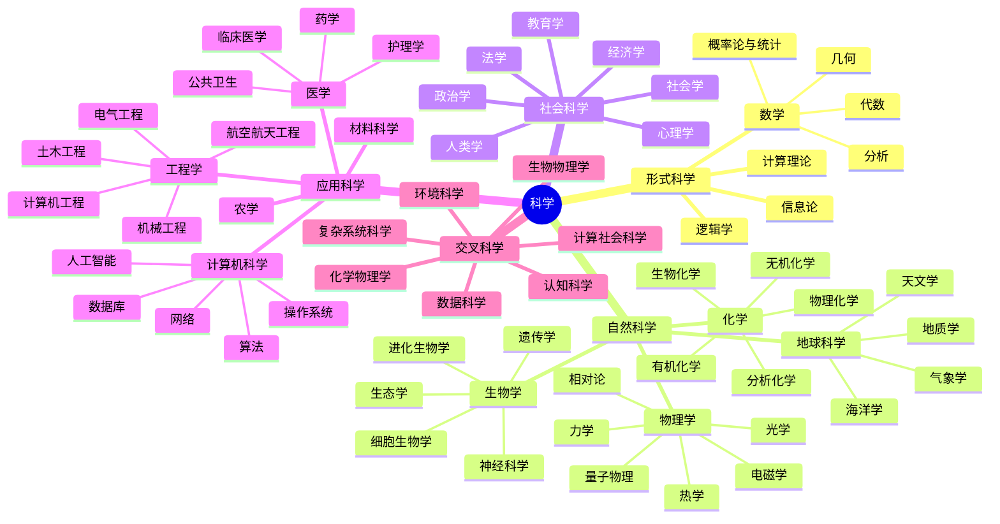

import Link from '@docusaurus/Link';

**笔记**（Note）板块沉淀了我在日常学习中梳理过的知识和方法，按浙江高中语文、数学、英语、物理、化学、生物、政治、历史、地理、技术十门学科分类，收录各科的概念笔记和备考整理。

## 倒计时

export const today = new Date().toISOString().split('T')[0];
export const daysUntil = (target) => Math.ceil((new Date(target) - new Date()) / 86400000);

今天是 **{today}**，距离：

- **2027 年首考** 还有 **{daysUntil('2027-01-06')}** 天
- **2027 年高考** 还有 **{daysUntil('2027-06-07')}** 天
- **2027 年学考** 还有 **~{daysUntil('2027-07-04')}** 天
- **2028 年首考** 还有 **~{daysUntil('2028-01-06')}** 天
- **2028 年高考** 还有 **~{daysUntil('2028-06-07')}** 天

## 教材

GitHub 上的开源项目 **TapXWorld/ChinaTextbook** 收录了几乎所有中小学和大学的 **PDF 教材**。

如果你 **无法访问 GitHub** 或 **不会下载资源**，可以到 [国家中小学智慧教育平台](https://basic.smartedu.cn/tchMaterial) 或 [人民教育出版社官网](https://jc.pep.com.cn) 在线预览 **电子教材**。

<GitHub repo="TapXWorld/ChinaTextbook" />

## 高中

### 学期安排

|    学期    |                        考试安排                        |
| :--------: | :----------------------------------------------------: |
| 高一上学期 |                           —                            |
| 高一下学期 |     **历史**、**地理**、**化学**、**生物学** 学考      |
| 高二上学期 |              **思想政治**、**物理** 学考               |
| 高二下学期 |           **语文**、**数学**、**技术** 学考            |
| 高三上学期 |        **外语** 高考兼学考、**七选三科目** 选考        |
| 高三下学期 | **语文**、**数学**、**外语** 高考、**七选三科目** 选考 |

### 课程结构

浙江省普通高中新课程新教材的课程结构。

<table>
  <thead>
    <tr>
      <th>科目</th>
      <th>必修课程</th>
      <th>选择性必修课程</th>
    </tr>
  </thead>
  <tbody>
    <tr>
      <td>语文</td>
      <td>
        
必修（上）

        
必修（下）

      </td>
      <td>
        
选择性必修上册

        
选择性必修中册

        
选择性必修下册

      </td>
    </tr>
    <tr>
      <td>数学</td>
      <td>
        
必修第一册

        
必修第二册

      </td>
      <td>
        
选择性必修第一册

        
选择性必修第二册

        
选择性必修第三册

      </td>
    </tr>
    <tr>
      <td>外语</td>
      <td>
        
必修第一册

        
必修第二册

        
必修第三册

      </td>
      <td>
        
选择性必修第一册

        
选择性必修第二册

        
选择性必修第三册

        
选择性必修第四册

      </td>
    </tr>
    <tr>
      <td>思想政治</td>
      <td>
        

          <Link to="/docs/note/politics/socialism">必修 1 中国特色社会主义</Link>
        

        

          <Link to="/docs/note/politics/economy">必修 2 经济与社会</Link>
        

        

          <Link to="/docs/note/politics/politics-law">必修 3 政治与法治</Link>
        

        

          <Link to="/docs/note/politics/philosophy-culture">必修 4 哲学与文化</Link>
        

      </td>
      <td>
        

          <Link to="/docs/note/politics/international-politics">
            选择性必修 1 当代国际政治与经济
          </Link>
        

        

          <Link to="/docs/note/politics/law-life">选择性必修 2 法律与生活</Link>
        

        

          <Link to="/docs/note/politics/logic-thinking">选择性必修 3 逻辑与思维</Link>
        

      </td>
    </tr>
    <tr>
      <td>历史</td>
      <td>
        

          <Link to="/docs/note/history/china">中外历史纲要（上）</Link>
        

        

          <Link to="/docs/note/history/world">中外历史纲要（下）</Link>
        

      </td>
      <td>
        

          <Link to="/docs/note/history/state-governance">选择性必修 1 国家制度与社会治理</Link>
        

        

          <Link to="/docs/note/history/economy-society">选择性必修 2 经济与社会生活</Link>
        

        

          <Link to="/docs/note/history/cultural-exchange">选择性必修 3 文化交流与传播</Link>
        

      </td>
    </tr>
    <tr>
      <td>地理</td>
      <td>
        

          <Link to="/docs/note/geography/physical">必修第一册</Link>
        

        

          <Link to="/docs/note/geography/human">必修第二册</Link>
        

      </td>
      <td>
        

          <Link to="/docs/note/geography/natural-foundation">选择性必修 1 自然地理基础</Link>
        

        

          <Link to="/docs/note/geography/regional-development">选择性必修 2 区域发展</Link>
        

        

          <Link to="/docs/note/geography/resource-security">选择性必修 3 资源、环境与国家安全</Link>
        

      </td>
    </tr>
    <tr>
      <td>物理</td>
      <td>
        

          <Link to="/docs/note/physics/required-1">必修第一册</Link>
        

        

          <Link to="/docs/note/physics/required-2">必修第二册</Link>
        

        

          <Link to="/docs/note/physics/required-3">必修第三册</Link>
        

      </td>
      <td>
        

          <Link to="/docs/note/physics/elective-1">选择性必修第一册</Link>
        

        

          <Link to="/docs/note/physics/elective-2">选择性必修第二册</Link>
        

        

          <Link to="/docs/note/physics/elective-3">选择性必修第三册</Link>
        

      </td>
    </tr>
    <tr>
      <td>化学</td>
      <td>
        

          <Link to="/docs/note/chemistry/required-1">必修第一册</Link>
        

        

          <Link to="/docs/note/chemistry/required-2">必修第二册</Link>
        

      </td>
      <td>
        

          <Link to="/docs/note/chemistry/reaction-principle">选择性必修 1 化学反应原理</Link>
        

        

          <Link to="/docs/note/chemistry/structure-property">选择性必修 2 物质结构与性质</Link>
        

        

          <Link to="/docs/note/chemistry/organic">选择性必修 3 有机化学基础</Link>
        

      </td>
    </tr>
    <tr>
      <td>生物学</td>
      <td>
        

          <Link to="/docs/note/biology/molecule-cell">必修 1 分子与细胞</Link>
        

        

          <Link to="/docs/note/biology/heredity-evolution">必修 2 遗传与进化</Link>
        

      </td>
      <td>
        

          <Link to="/docs/note/biology/homeostasis">选择性必修 1 稳态与调节</Link>
        

        

          <Link to="/docs/note/biology/ecology">选择性必修 2 生物与环境</Link>
        

        

          <Link to="/docs/note/biology/biotechnology">选择性必修 3 生物技术与工程</Link>
        

      </td>
    </tr>
    <tr>
      <td>信息技术</td>
      <td>
        

          <Link to="/docs/note/technology/data-computation">必修 1 数据与计算</Link>
        

        

          <Link to="/docs/note/technology/information-system">必修 2 信息系统与社会</Link>
        

      </td>
      <td>
        

          <Link to="/docs/note/technology/data-structure">选择性必修 1 数据与数据结构</Link> ※
        

        
选择性必修 2 网络基础

        
选择性必修 3 数据管理与分析

        
选择性必修 4 人工智能初步

        
选择性必修 5 三维设计与创意

        
选择性必修 6 开源硬件项目设计

      </td>
    </tr>
    <tr>
      <td>通用技术</td>
      <td>
        

          <Link to="/docs/note/technology/technology-design-1">必修 技术与设计 1</Link>
        

        

          <Link to="/docs/note/technology/technology-design-2">必修 技术与设计 2</Link>
        

      </td>
      <td>
        

          <Link to="/docs/note/technology/electronic-control">选择性必修 电子控制技术</Link> ※
        

        
选择性必修 机器人设计与制作

        
选择性必修 工程设计基础

        
选择性必修 现代家政技术

        
选择性必修 服装及其设计

        
选择性必修 智能家居应用设计

        
选择性必修 职业技术基础

        
选择性必修 技术与职业探索

        
选择性必修 创造力开发与技术发明

        
选择性必修 科技人文融合创新专题

        
选择性必修 产品三维设计与制造

      </td>
    </tr>
    <tr>
      <td>音乐</td>
      <td>
        
音乐鉴赏、歌唱、演奏、

        
音乐编创、音乐与舞蹈、音乐与戏剧

      </td>
      <td>
        
合唱、合奏、舞蹈表演、

        
戏剧表演、音乐基础理论、视唱练耳

      </td>
    </tr>
    <tr>
      <td>美术</td>
      <td>
        
美术鉴赏、绘画、中国书画、

        
雕塑、设计、工艺、现代媒体艺术

      </td>
      <td>
        
绘画、中国书画、雕塑、

        
设计、工艺、现代媒体艺术

      </td>
    </tr>
    <tr>
      <td>体育与健康</td>
      <td>体育与健康（全一册）</td>
      <td>健康教育、体能和运动技能系列模块</td>
    </tr>
    <tr>
      <td>综合实践活动</td>
      <td>研究性学习、社会实践</td>
      <td>—</td>
    </tr>
    <tr>
      <td>劳动</td>
      <td>志愿服务、劳动实践</td>
      <td>—</td>
    </tr>
  </tbody>
</table>

## 科学

## 目录

<DocCardList />
