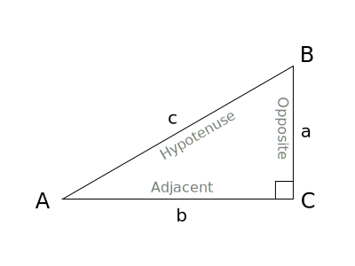

# 三角函数

## 参考资料

- [三角函数 - 维基百科](https://zh.wikipedia.org/zh-cn/三角函数)
- [《关于我不背三角公式，高考数学144这件事》 一个式子推出所有三角公式 - bilibili](https://www.bilibili.com/video/BV18f4y1Q7GC)

## 前置知识

### 任意角

一条射线绕端点 **逆时针** 旋转形成的角称为正角，**顺时针** 旋转形成的角称为负角。

由于旋转方向和圈数都不受限制，任意角的大小可以是 **任意实数**。

### 弧度制

小学和初中常用的角度单位是 **角度制**，将一个周角平均分为 $360$ 份，其中每一份定义为 $1^\circ$。

但在更高层次的数学中，我们发现同一角的 **弧长** 与 **半径** 的比值是一个常数，据此引入了另一种角度单位——**弧度制**。


一个 $360^\circ$ 的周角对应整个圆周，其弧长为 $2\pi r$，半径为 $r$，所以比值为 $\frac{2\pi r}{r}=2\pi$，因此 $360^\circ = 2\pi$ 弧度。

弧度与角度成正比，其他角度都可以通过换算得到：

|    角度    |       弧度       |    角度     |       弧度       |
| :--------: | :--------------: | :---------: | :--------------: |
| $0^\circ$  |       $0$        | $90^\circ$  | $\frac{\pi}{2}$  |
| $15^\circ$ | $\frac{\pi}{12}$ | $120^\circ$ | $\frac{2\pi}{3}$ |
| $30^\circ$ | $\frac{\pi}{6}$  | $180^\circ$ |      $\pi$       |
| $45^\circ$ | $\frac{\pi}{4}$  | $270^\circ$ | $\frac{3\pi}{2}$ |
| $60^\circ$ | $\frac{\pi}{3}$  | $360^\circ$ |      $2\pi$      |

### 单位圆

单位圆指平面直角坐标系上，圆心为 **原点** $O(0,0)$ 且半径为 **单位长度** $1$ 的圆，方程为 $x^2+y^2=1$。

<Desmos url="wocs5bz2f4" />

### 距离公式

两点 $A(x_0,y_0),B(x_1,y_1)$ 之间的距离为 $\sqrt{(x_0-x_1)^2+(y_0-y_1)^2}$。

<Desmos url="bjodmisvtc" />

构造直角三角形，两条直角边的长度分别为 $|x_0-x_1|$ 和 $|y_0-y_1|$。

而斜边的长度就是 $A$ 点和 $B$ 点的距离 $|AB|$，根据勾股定理：

$$
|AB|=\sqrt{(x_0-x_1)^2+(y_0-y_1)^2}
$$

:::tip

$A,B$ 两点之间的距离一般用 $|AB|$ 表示。

:::

### 三角形的约定

- 详见 [解三角形 - 三角形的约定](../geometry/triangle-solving#三角形的约定)

## 定义

### 锐角三角函数

锐角三角函数是在 **直角三角形** 中，以一个 **锐角** $\theta$ 为基准，定义 **对边** $a$、**邻边** $b$ 和 **斜边** $c$ 中两边之比的函数。

图中 $\theta=\angle BAC,a=|BC|,b=|AC|,c=|AB|$：

$$
\sin{\theta}=\frac{a}{c},\cos{\theta}=\frac{b}{c},\tan{\theta}=\frac{a}{b},\cot{\theta}=\frac{b}{a},\sec{\theta}=\frac{c}{b},\csc{\theta}=\frac{c}{a}
$$



### 任意角三角函数

锐角三角函数定义是基于 **直角三角形** 的，但直角三角形的锐角只能在 $(0,\frac{\pi}{2})$ 范围内。

超出这个范围的三角函数就没有意义了，所以高中时会用 **单位圆** 定义任意角三角函数。

<Desmos url="dzl65z2m99" />

如图，将斜边为 $1$ 的直角三角形放入单位圆内，令：

$$
\theta=\angle BAC,a=|BC|,b=|AC|,c=|AB|=1
$$

带入 $\sin$ 和 $\cos$ 的锐角三角函数的定义：

$$
\sin \theta=\frac{a}{c}=a,\cos \theta=\frac{b}{c}=b
$$

而 $a$ 和 $b$ 是该直角三角形的两边，是这个点的 **纵坐标** 和 **横坐标**.

因此，单位圆上辐角为 $t$ 的点 $B$ 的坐标为：

$$
B(\cos \theta,\sin \theta)
$$

:::tip

这个点的坐标是 $(\cos \theta, \sin \theta)$，请注意顺序不要弄错。

:::

所以


## 性质

### 基本性质

|  函数  |    $\sin{x}$     |    $\cos{x}$     |        $\tan{x}$         |    $\cot{x}$     |        $\sec{x}$         |     $\csc{x}$      |
| :----: | :--------------: | :--------------: | :----------------------: | :--------------: | :----------------------: | :----------------: |
|  名称  |       正弦       |       余弦       |           正切           |       余切       |           正割           |        余割        |
|  定义  |  $\frac{a}{c}$   |  $\frac{b}{c}$   |      $\frac{a}{b}$       |  $\frac{b}{a}$   |      $\frac{c}{b}$       |   $\frac{c}{a}$    |
| 定义域 | $x\in\mathbb{R}$ | $x\in\mathbb{R}$ | $x\ne\frac{\pi}{2}+k\pi$ |   $x\ne k\pi$    | $x\ne\frac{\pi}{2}+k\pi$ |    $x\ne k\pi$     |
|  值域  |   $y\in[-1,1]$   |   $y\in[-1,1]$   |     $y\in\mathbb{R}$     | $y\in\mathbb{R}$ |    $y\le1 \lor y\ge1$    | $y\le1 \lor y\ge1$ |
| 奇偶性 |      奇函数      |      偶函数      |          奇函数          |      奇函数      |          偶函数          |       奇函数       |
|  周期  |      $2\pi$      |      $2\pi$      |          $\pi$           |      $\pi$       |          $2\pi$          |       $2\pi$       |

### 函数图像

红色为 $\sin$，蓝色为 $\cos$，绿色为 $\tan$，橙色为 $\cot$，紫色为 $\sec$，黑色为 $\csc$。[link](https://www.desmos.com/calculator/zhow2jcijw)

<Desmos url="zhow2jcijw" />

### 常用值速查表

<style>{`
  .center-table th, .center-table td {
    text-align: center;
  }
`}</style>

<table className="center-table">
  <thead>
    <tr>
      <th>角度</th>
      <th>弧度</th>
      <th>$\sin{\theta}$</th>
      <th>$\cos{\theta}$</th>
      <th>$\tan{\theta}$</th>
      <th>$\cot{\theta}$</th>
      <th>$\sec{\theta}$</th>
      <th>$\csc{\theta}$</th>
    </tr>
  </thead>
  <tbody>
    <tr><td>$0^\circ$</td><td>$0$</td><td>$0$</td><td>$1$</td><td>$0$</td><td>$/$</td><td>$1$</td><td>$/$</td></tr>
    <tr><td>$15^\circ$</td><td>$\frac{\pi}{12}$</td><td>$\frac{\sqrt{6}-\sqrt{2}}{4}$</td><td>$\frac{\sqrt{6}+\sqrt{2}}{4}$</td><td>$2 - \sqrt{3}$</td><td>$2 + \sqrt{3}$</td><td>$\frac{4}{\sqrt{6}+\sqrt{2}}$</td><td>$\frac{4}{\sqrt{6}-\sqrt{2}}$</td></tr>
    <tr><td>$30^\circ$</td><td>$\frac{\pi}{6}$</td><td>$\frac{1}{2}$</td><td>$\frac{\sqrt{3}}{2}$</td><td>$\frac{\sqrt{3}}{3}$</td><td>$\sqrt{3}$</td><td>$\frac{2}{\sqrt{3}}$</td><td>$2$</td></tr>
    <tr><td>$45^\circ$</td><td>$\frac{\pi}{4}$</td><td>$\frac{\sqrt{2}}{2}$</td><td>$\frac{\sqrt{2}}{2}$</td><td>$1$</td><td>$1$</td><td>$\sqrt{2}$</td><td>$\sqrt{2}$</td></tr>
    <tr><td>$60^\circ$</td><td>$\frac{\pi}{3}$</td><td>$\frac{\sqrt{3}}{2}$</td><td>$\frac{1}{2}$</td><td>$\sqrt{3}$</td><td>$\frac{\sqrt{3}}{3}$</td><td>$2$</td><td>$\frac{2}{\sqrt{3}}$</td></tr>
    <tr><td>$90^\circ$</td><td>$\frac{\pi}{2}$</td><td>$1$</td><td>$0$</td><td>$/$</td><td>$0$</td><td>$/$</td><td>$1$</td></tr>
    <tr><td>$120^\circ$</td><td>$\frac{2\pi}{3}$</td><td>$\frac{\sqrt{3}}{2}$</td><td>$-\frac{1}{2}$</td><td>$-\sqrt{3}$</td><td>$-\frac{\sqrt{3}}{3}$</td><td>$-2$</td><td>$\frac{2}{\sqrt{3}}$</td></tr>
    <tr><td>$180^\circ$</td><td>$\pi$</td><td>$0$</td><td>$-1$</td><td>$0$</td><td>$/$</td><td>$-1$</td><td>$/$</td></tr>
    <tr><td>$270^\circ$</td><td>$\frac{3\pi}{2}$</td><td>$-1$</td><td>$0$</td><td>$/$</td><td>$0$</td><td>$/$</td><td>$-1$</td></tr>
    <tr><td>$360^\circ$</td><td>$2\pi$</td><td>$0$</td><td>$1$</td><td>$0$</td><td>$/$</td><td>$1$</td><td>$/$</td></tr>
  </tbody>
</table>

## 恒等式

### 平方恒等式

$$
\sin^2{\alpha}+\cos^2{\alpha}=1
$$

$$
1+\tan^2{\alpha}=\sec^2{\alpha}
$$

$$
\cot^2{\alpha}+1=\csc^2{\alpha}
$$

### 商数恒等式

$$
\tan{\alpha}=\frac{\sin{\alpha}}{\cos{\alpha}}
$$

$$
\cot{\alpha}=\frac{\cos{\alpha}}{\sin{\alpha}}
$$

### 倒数恒等式

$$
\sin{\alpha}=\frac{1}{\csc{\alpha}}
$$

$$
\cos{\alpha}=\frac{1}{\sec{\alpha}}
$$

$$
\tan{\alpha}=\frac{1}{\cot{\alpha}}
$$

### 积的恒等式

$$
\sin{\alpha}=\tan{\alpha}\cos{\alpha}
$$

$$
\cos{\alpha}=\cot{\alpha}\sin{\alpha}
$$

$$
\tan{\alpha}=\sin{\alpha}\sec{\alpha}
$$

$$
\cot{\alpha}=\cos{\alpha}\csc{\alpha}
$$

$$
\sec{\alpha}=\tan{\alpha}\csc{\alpha}
$$

$$
\csc{\alpha}=\sec{\alpha}\cot{\alpha}
$$

### 推导过程

上图中蓝色三角形是直角三角形，根据勾股定理：

$$
\sin^2{\theta}+\cos^2{\theta}=1
$$

等式两边同时除以 $\sin^2{\theta}$ 或 $\cos^2{\theta}$ 可得：

$$
1+\tan^2{\alpha}=\sec^2{\alpha}
$$

$$
\cot^2{\alpha}+1=\csc^2{\alpha}
$$

对于其他三组恒等式，将锐角三角函数的定义带入即可证明：

$$
\sin{\theta}=\frac{a}{c},\cos{\theta}=\frac{b}{c},\tan{\theta}=\frac{a}{b},\cot{\theta}=\frac{b}{a},\sec{\theta}=\frac{c}{b},\csc{\theta}=\frac{c}{a}
$$

:::note[示例]

- $\frac{\sin{\theta}}{\cos{\theta}}=\frac{a/c}{b/c}=\frac{a}{b}=\tan{\theta}$

:::

## 公式

### 两角和差公式

#### 无字证明

一个精妙的无字证明：


$$
\sin{(\alpha+\beta)}=\sin{\alpha}\cos{\beta}+\cos{\alpha}\sin{\beta}
$$

$$
\cos{(\alpha+\beta)}=\cos{\alpha}\cos{\beta}-\sin{\alpha}\sin{\beta}
$$


$$
\tan{(\alpha+\beta)}=\frac{\tan{\alpha}+\tan{\beta}}{1-\tan{\alpha}\tan{\beta}}
$$

#### 推导过程

##### 余弦差角公式推导

:::tip

余弦差角公式是本文 **唯一** 需要通过几何推导来证明的公式。

其他公式都可以通过代入已有公式推导得出。

:::


如图，设 $\angle AOB'=\alpha,\angle BOB'=\beta$。

则 $A,B$ 两点的坐标分别为 $A(\cos{\alpha},\sin{\alpha}),B(\cos{\beta},\sin{\beta})$。

根据距离公式：

$$
\begin{aligned}
  |AB|^2 &= (\cos{\alpha}-\cos{\beta})^2+(\sin{\alpha}-\sin{\beta})^2 \\
  &= \cos^2{\alpha}-2\cos{\alpha}\cos{\beta}+\cos^2{\beta}+sin^2{\alpha}-2\sin{\alpha}\sin{\beta}+sin^2{\beta} \\
  &= 2-2(\cos{\alpha}\cos{\beta}+\sin{\alpha}\sin{\beta})
\end{aligned}
$$

让 $OA$ 和 $OB$ 同时绕原点顺时针旋转 $\beta$，得到 $OA'$ 和 $OB'$。

此时 $OB$ 和 $x$ 轴重合，$\angle A'OB'=\alpha-\beta$。

所以 $A',B'$ 两点的坐标分别为 $A'(\cos{(\alpha-\beta)},\sin{(\alpha-\beta)}),B'(1,0)$。

根据距离公式：

$$
\begin{aligned}
  |A'B'|^2 &= (\cos{(\alpha-\beta)}-1)^2+(\sin{(\alpha-\beta)}-0)^2 \\
  &= \cos^2{(\alpha-\beta)}-2\cos{(\alpha-\beta)}+1+\sin^2{(\alpha+\beta)} \\
  &= 2-2\cos{(\alpha-\beta)}
\end{aligned}
$$

不难证明 $\triangle ABO\cong\triangle A'B'O$，所以 $|AB|=|A'B'|$。

所以 $|AB|^2=|A'B'|^2=\cos{(\alpha-\beta)}=\cos{\alpha}\cos{\beta}+\sin{\alpha}\sin{\beta}$。

##### 余弦和角公式推导

$$
\begin{aligned}
  \cos{(\alpha+\beta)} &= \cos{(\alpha-(-\beta))} \\
  &= \cos{\alpha}\cos{(-\beta)}+\sin{\alpha}\sin{(-\beta)} \\
  &= \cos{\alpha}\cos{\beta}-\sin{\alpha}\sin{\beta}
\end{aligned}
$$

##### 正弦差角公式推导

$$
\cos{(\frac{\pi}{2}-\theta)}=\cos{\frac{\pi}{2}}\cos{\theta}+\sin{\frac{\pi}{2}}\sin{\theta}=\sin{\theta}
$$

$$
\sin{(\frac{\pi}{2}-\theta)}=\cos{(\frac{\pi}{2}-(\frac{\pi}{2}-\theta))}=\cos{\theta}
$$

$$
\begin{aligned}
  \sin{(\alpha-\beta)} &= \cos{(\frac{\pi}{2}-(\alpha-\beta))} \\
  &= \cos{((\frac{\pi}{2}-\alpha)+\beta)} \\
  &= \cos{(\frac{\pi}{2}-\alpha)}\cos{\beta}-\sin{(\frac{\pi}{2}-\alpha)}\sin{\beta} \\
  &= \sin{\alpha}\cos{\beta}-\cos{\alpha}\sin{\beta}
\end{aligned}
$$

##### 正弦和角公式推导

$$
\begin{aligned}
  \sin{(\alpha+\beta)} &= \sin{(\alpha-(-\beta))} \\
  &= \sin{\alpha}\cos{(-\beta)}+\cos{\alpha}\sin{(-\beta)} \\
  &= \sin{\alpha}\cos{\beta}+\cos{\alpha}\sin{\beta}
\end{aligned}
$$

##### 正切差角公式推导

$$
\begin{aligned}
  \tan{(\alpha-\beta)} &= \frac{\sin{(\alpha-\beta)}}{\cos{(\alpha-\beta)}} \\
  &= \frac{\sin{\alpha}\cos{\beta}-\cos{\alpha}\sin{\beta}}{\cos{\alpha}\cos{\beta}+\sin{\alpha}\sin{\beta}} \\
  &= \frac{\tan{\alpha}-\tan{\beta}}{1+\tan{\alpha}\tan{\beta}}
\end{aligned}
$$

##### 正切和角公式推导

$$
\begin{aligned}
  \tan{(\alpha+\beta)} &= \tan{(\alpha-(-\beta))} \\
  &= \frac{\tan{\alpha}-\tan{(-\beta)}}{1+\tan{\alpha}\tan{(-\beta})} \\
  &= \frac{\tan{\alpha}+\tan{\beta}}{1-\tan{\alpha}\tan{\beta}}
\end{aligned}
$$

#### 公式总结

$$
\sin{(\alpha+\beta)}=\sin{\alpha}\cos{\beta}+\cos{\alpha}\sin{\beta}
$$

$$
\sin{(\alpha-\beta)}=\sin{\alpha}\cos{\beta}-\cos{\alpha}\sin{\beta}
$$

$$
\cos{(\alpha+\beta)}=\cos{\alpha}\cos{\beta}-\sin{\alpha}\sin{\beta}
$$

$$
\cos{(\alpha-\beta)}=\cos{\alpha}\cos{\beta}+\sin{\alpha}\sin{\beta}
$$

$$
\tan{(\alpha+\beta)}=\frac{\tan{\alpha}+\tan{\beta}}{1-\tan{\alpha}\tan{\beta}}
$$

$$
\tan{(\alpha-\beta)}=\frac{\tan{\alpha}-\tan{\beta}}{1+\tan{\alpha}\tan{\beta}}
$$

### 诱导公式

#### 推导过程

诱导公式可以用和差角公式直接计算。

:::note[示例]

$$
\sin{(\frac{\pi}{2}+\alpha)}=\sin{\frac{\pi}{2}}\cos{\alpha}+\cos{\frac{\pi}{2}}\sin{\alpha}=\cos{\alpha}
$$

:::

#### 记忆方法

口诀：奇变偶不变，符号看象限。

1. 奇变偶不变：奇偶指 $\frac{\pi}{2}$ 的系数，例如 $\pi,2\pi$ 是偶数，$\frac{\pi}{2},\frac{3\pi}{2}$ 是奇数。如果是偶数，公式前后函数名一致；如果是奇数，改成对应的函数名。（$\sin\leftrightarrow\cos,\tan\leftrightarrow\cot,\sec\leftrightarrow\csc$）

2. 符号看象限：把 $\alpha$ 看作第一象限角（例如设 $\alpha=\frac{\pi}{4}$），计算出前面的值在后面函数的正负号：

|   象限   |                范围                 | $\sin{\alpha}$ | $\cos{\alpha}$ | $\tan{\alpha}$ | $\cot{\alpha}$ | $\sec{\alpha}$ | $\csc{\alpha}$ |
| :------: | :---------------------------------: | :------------: | :------------: | :------------: | :------------: | :------------: | :------------: |
| 第一象限 |    $(2k\pi,2k\pi+\frac{\pi}{2})$    |      $+$       |      $+$       |      $+$       |      $+$       |      $+$       |      $+$       |
| 第二象限 |  $(2k\pi+\frac{\pi}{2},2k\pi+\pi)$  |      $+$       |      $-$       |      $-$       |      $-$       |      $-$       |      $+$       |
| 第三象限 | $(2k\pi+\pi,2k\pi+\frac{3\pi}{2})$  |      $-$       |      $-$       |      $+$       |      $+$       |      $-$       |      $-$       |
| 第四象限 | $(2k\pi+\frac{3\pi}{2},2k\pi+2\pi)$ |      $-$       |      $+$       |      $-$       |      $-$       |      $+$       |      $-$       |

原理：单位圆具有对称性和周期性；所有三角函数在第一象限内均为正数。

:::note[示例]

化简 $\sin{(\frac{3\pi}{2}-\alpha)}$。

1. $\frac{3\pi}{2}=3\cdot\frac{\pi}{2}$ 是奇数，所以要将 $\sin$ 变成 $\cos$。
2. 把 $\alpha$ 看作第一象限角，则 $\frac{3\pi}{2}-\alpha$ 为第三象限角，$\cos$ 在第三象限为负数，所以为负号。

综上所述 $\sin{(\frac{3\pi}{2}-\alpha)}=-\cos{\alpha}$。

:::

#### 公式总结

第一组（$\frac{\pi}{2}$）

$$
\sin{(\frac{\pi}{2}+\alpha)}=\cos{\alpha}
$$

$$
\sin{(\frac{\pi}{2}-\alpha)}=\cos{\alpha}
$$

$$
\cos{(\frac{\pi}{2}+\alpha)}=-\sin{\alpha}
$$

$$
\cos{(\frac{\pi}{2}-\alpha)}=\sin{\alpha}
$$

第二组（$\pi$）

$$
\sin{(\pi+\alpha)}=-\sin{\alpha}
$$

$$
\sin{(\pi-\alpha)}=\sin{\alpha}
$$

$$
\cos{(\pi+\alpha)}=-\cos{\alpha}
$$

$$
\cos{(\pi-\alpha)}=-\cos{\alpha}
$$

第三组（$\frac{3\pi}{2}$）

$$
\sin{(\frac{3\pi}{2}+\alpha)}=-\cos{\alpha}
$$

$$
\sin{(\frac{3\pi}{2}-\alpha)}=-\cos{\alpha}
$$

$$
\cos{(\frac{3\pi}{2}+\alpha)}=\sin{\alpha}
$$

$$
\cos{(\frac{3\pi}{2}-\alpha)}=-\sin{\alpha}
$$

第四组（$2\pi$）

$$
\sin{(2\pi+\alpha)}=\sin{\alpha}
$$

$$
\sin{(2\pi-\alpha)}=-\sin{\alpha}
$$

$$
\cos{(2\pi+\alpha)}=\cos{\alpha}
$$

$$
\cos{(2\pi-\alpha)}=\cos{\alpha}
$$

### 二倍角公式

#### 推导过程

##### 余弦二倍角公式推导

$$
\begin{aligned}
  \cos{2\alpha} &= \cos{(\alpha+\alpha)} \\
  &= \cos{\alpha}\cos{\alpha}-\sin{\alpha}\sin{\alpha} \\
  &= \cos^2{\alpha}-\sin^2{\alpha}=1-2\sin^2{\alpha}=2\cos^2{\alpha}-1
\end{aligned}
$$

:::tip

最后一行的三个公式等价。

:::

##### 正弦二倍角公式推导

$$
\begin{aligned}
  \sin{2\alpha} &= \sin{(\alpha+\alpha)} \\
  &= \sin{\alpha}\cos{\alpha}+\cos{\alpha}\sin{\alpha} \\
  &= 2\sin{\alpha}\cos{\alpha}
\end{aligned}
$$

##### 正切二倍角公式推导

$$
\begin{aligned}
  \tan{2\alpha} &= \frac{\sin{2\alpha}}{\cos{2\alpha}} \\
  &= \frac{2\sin{\alpha}\cos{\alpha}}{\cos^2{\alpha}-\sin^2{\alpha}} \\
  &= \frac{2\sin{\alpha}\cos{\alpha}}{\cos^2{\alpha}-\sin^2{\alpha}} \\
  &= \frac{2\sin{\alpha}\cos{\alpha}/\cos^2{\alpha}}{\cos^2{\alpha}/\cos^2{\alpha}-  \sin^2{\alpha}/\cos^2{\alpha}} \\
  &= \frac{2\tan{\alpha}}{1-\tan^2{\alpha}}
\end{aligned}
$$

#### 公式总结

$$
\sin{2\alpha}=2\sin{\alpha}\cos{\alpha}
$$

$$
\cos{2\alpha}=\cos^2{\alpha}-\sin^2{\alpha}=1-2\sin^2{\alpha}=2\cos^2{\alpha}-1
$$

$$
\tan{2\alpha}=\frac{2\tan{\alpha}}{1-\tan^2{\alpha}}
$$

### 三倍角公式

#### 推导过程

##### 正弦三倍角公式推导

$$
\begin{aligned}
  \sin{3\alpha} &= \sin{(2\alpha+\alpha)} \\
  &= \sin{2\alpha}\cos{\alpha}+\cos{2\alpha}\sin{\alpha} \\
  &= 2\sin{\alpha}(1-\sin^2{\alpha})+(1-2\sin^2{\alpha})\sin{\alpha} \\
  &= 3\sin{\alpha}-4\sin^3{\alpha}
\end{aligned}
$$

##### 余弦三倍角公式推导

$$
\begin{aligned}
  \cos{3\alpha} &= \cos{(2\alpha+\alpha)} \\
  &= \cos{2\alpha}\cos{\alpha}-\sin{2\alpha}\sin{\alpha} \\
  &= (2\cos^2{\alpha}-1)\cos{\alpha}-2(1-\cos^2{\alpha})\cos{\alpha} \\
  &= 4\cos^3{\alpha}-3\cos{\alpha}
\end{aligned}
$$

##### 正切三倍角公式推导

$$
\begin{aligned}
  \tan{3\alpha} &= \frac{\sin{3\alpha}}{\cos{3\alpha}} \\
  &= \frac{3\sin{\alpha}-4\sin^3{\alpha}}{4\cos^3{\alpha}-3\cos{\alpha}} \\
  &= \frac{4\sin{\alpha}\sin{(\frac{\pi}{3}+\alpha)}\sin{(\frac{\pi}{3}-\alpha)}}{4\cos{\alpha}\cos{(\frac{\pi}{3}-\alpha)}\cos{(\frac{\pi}{3}+\alpha)}} \\
  &= \tan{\alpha}\tan{(\frac{\pi}{3}-\alpha)}\tan{(\frac{\pi}{3}+\alpha)}
\end{aligned}
$$

#### 公式总结

$$
\sin{3\alpha}=3\sin{\alpha}-4\sin^3{\alpha}
$$

$$
\cos{3\alpha}=-3\cos{\alpha}+4\cos^3{\alpha}
$$

$$
\tan{3\alpha}=\tan{\alpha}\tan{(\frac{\pi}{3}-\alpha)}\tan{(\frac{\pi}{3}+\alpha)}
$$

### 半角公式

#### 推导过程

##### 余弦半角公式推导

$$
\cos{2\theta}=2\cos^2{\theta}-1
$$

令 $\alpha=2\theta$。

$$
\begin{array}{l}
  \cos{\alpha}=2\cos^2{\frac{\alpha}{2}}-1 \\
  \Rightarrow \cos^2{\frac{\alpha}{2}}=\frac{1+\cos{\alpha}}{2} \\
  \Rightarrow \cos{\frac{\alpha}{2}}=\pm\sqrt{\frac{1+\cos{\alpha}}{2}}
\end{array}
$$

##### 正弦半角公式推导

$$
\cos{2\theta}=1-2\sin^2{\theta}
$$

令 $\alpha=2\theta$。

$$
\begin{array}{l}
  \cos{\alpha}=1-2\sin^2{\frac{\alpha}{2}} \\
  \Rightarrow \sin^2{\frac{\alpha}{2}}=\frac{1-\cos{\alpha}}{2} \\
  \Rightarrow \sin{\frac{\alpha}{2}}=\pm\sqrt{\frac{1-\cos{\alpha}}{2}}
\end{array}
$$

##### 正切半角公式推导

$$
\begin{aligned}
  \tan{\frac{\alpha}{2}} &= \frac{\sin{\frac{\alpha}{2}}}{\cos{\frac{\alpha}{2}}} \\
  &= \frac{\pm\sqrt{\frac{1-\cos{\alpha}}{2}}}{\pm\sqrt{\frac{1+\cos{\alpha}}{2}}} \\
  &= \pm\sqrt{\frac{1-\cos{\alpha}}{1+\cos{\alpha}}}
\end{aligned}
$$

$$
\begin{aligned}
  \tan{\frac{\alpha}{2}} &= \frac{\sin{\frac{\alpha}{2}}}{\cos{\frac{\alpha}{2}}} \\
  &= \frac{\sin{\frac{\alpha}{2}}\cdot2\cos{\frac{\alpha}{2}}}{\cos{\frac{\alpha}{2}}\cdot2\cos{\frac{\alpha}{2}}} \\
  &= \frac{2\sin{\frac{\alpha}{2}}\cos{\frac{\alpha}{2}}}{2\cos^2{\frac{\alpha}{2}}} \\
  &= \frac{\sin{\alpha}}{1+\cos{\alpha}}
\end{aligned}
$$

$$
\begin{aligned}
  \tan{\frac{\alpha}{2}} &= \frac{\sin{\frac{\alpha}{2}}}{\cos{\frac{\alpha}{2}}} \\
  &= \frac{\sin{\frac{\alpha}{2}}\cdot2\sin{\frac{\alpha}{2}}}{\cos{\frac{\alpha}{2}}\cdot2\sin{\frac{\alpha}{2}}} \\
  &= \frac{2\sin^2{\frac{\alpha}{2}}}{2\sin{\frac{\alpha}{2}}\cos{\frac{\alpha}{2}}} \\
  &= \frac{1-\cos{\alpha}}{\sin{\alpha}}
\end{aligned}
$$

:::tip

以上的三个正切半角公式等价。

:::

#### 公式总结

$$
\sin{\frac{\alpha}{2}}=\pm\sqrt{\frac{1-\cos{\alpha}}{2}}
$$

$$
\cos{\frac{\alpha}{2}}=\pm\sqrt{\frac{1+\cos{\alpha}}{2}}
$$

$$
\tan{\frac{\alpha}{2}}=\pm\sqrt{\frac{1-\cos{\alpha}}{1+\cos{\alpha}}}=\frac{\sin{\alpha}}{1+\cos{\alpha}}=\frac{1-\cos{\alpha}}{\sin{\alpha}}
$$

### 积化和差公式

#### 推导过程

正弦两角和差公式：

$$
\sin{(\alpha+\beta)}=\sin{\alpha}\cos{\beta}+\cos{\alpha}\sin{\beta}
$$

$$
\sin{(\alpha-\beta)}=\sin{\alpha}\cos{\beta}-\cos{\alpha}\sin{\beta}
$$

令 $\sin{\alpha}\cos{\beta}=x,\cos{\alpha}\sin{\beta}=y$。

已知 $x,y$ 两数的和为 $\sin{(\alpha+\beta)}$，差为 $\sin{(\alpha-\beta)}$。

这是 ~~小学二年级~~ 的和差问题：

$$
x=\sin{\alpha}\cos{\beta}=\frac{1}{2}[\sin{(\alpha+\beta)}+\sin{(\alpha-\beta)}]
$$

$$
y=\cos{\alpha}\sin{\beta}=\frac{1}{2}[\sin{(\alpha+\beta)}-\sin{(\alpha-\beta)}]
$$

同理，用余弦两角和差公式，可以求出另外两组积化和差公式：

$$
\cos{(\alpha+\beta)}=\cos{\alpha}\cos{\beta}-\sin{\alpha}\sin{\beta}=x-y
$$

$$
\cos{(\alpha-\beta)}=\cos{\alpha}\cos{\beta}+\sin{\alpha}\sin{\beta}=x+y
$$

$$
x=\cos{\alpha}\cos{\beta}=\frac{1}{2}[\cos{(\alpha+\beta)}+\cos{(\alpha-\beta)}]
$$

$$
y=\sin{\alpha}\sin{\beta}=-\frac{1}{2}[\cos{(\alpha+\beta)}-\cos{(\alpha-\beta)}]
$$

#### 记忆方法

```text
sc=(s+s)/2
cs=(s-s)/2
cc=(c+c)/2
ss=-(c-c)/2
```

#### 公式总结

$$
\sin{\alpha}\cos{\beta}=\frac{1}{2}[\sin{(\alpha+\beta)}+\sin{(\alpha-\beta)}]
$$

$$
\cos{\alpha}\sin{\beta}=\frac{1}{2}[\sin{(\alpha+\beta)}-\sin{(\alpha-\beta)}]
$$

$$
\cos{\alpha}\cos{\beta}=\frac{1}{2}[\cos{(\alpha+\beta)}+\cos{(\alpha-\beta)}]
$$

$$
\sin{\alpha}\sin{\beta}=-\frac{1}{2}[\cos{(\alpha+\beta)}-\cos{(\alpha-\beta)}]
$$

### 和差化积公式

#### 推导过程

积化和差公式：

$$
\sin{\alpha}\cos{\beta}=\frac{1}{2}[\sin{(\alpha+\beta)}+\sin{(\alpha-\beta)}]
$$

$$
\cos{\alpha}\sin{\beta}=\frac{1}{2}[\sin{(\alpha+\beta)}-\sin{(\alpha-\beta)}]
$$

$$
\cos{\alpha}\cos{\beta}=\frac{1}{2}[\cos{(\alpha+\beta)}+\cos{(\alpha-\beta)}]
$$

$$
\sin{\alpha}\sin{\beta}=-\frac{1}{2}[\cos{(\alpha+\beta)}-\cos{(\alpha-\beta)}]
$$

令 $\alpha+\beta=A,\alpha-\beta=B$，则 $\alpha=\frac{A+B}{2},\beta=\frac{A-B}{2}$。

带入积化和差公式：

$$
\sin{\frac{A+B}{2}}\cos{\frac{A-B}{2}}=\frac{1}{2}[\sin{A}+\sin{B}]
$$

$$
\cos{\frac{A+B}{2}}\sin{\frac{A-B}{2}}=\frac{1}{2}[\sin{A}-\sin{B}]
$$

$$
\cos{\frac{A+B}{2}}\cos{\frac{A-B}{2}}=\frac{1}{2}[\cos{A}+\cos{B}]
$$

$$
\sin{\frac{A+B}{2}}\sin{\frac{A-B}{2}}=-\frac{1}{2}[\cos{A}-\cos{B}]
$$

移项得：

$$
\sin{A}+\sin{B}=2\sin{\frac{A+B}{2}}\cos{\frac{A-B}{2}}
$$

$$
\sin{A}-\sin{B}=2\cos{\frac{A+B}{2}}\sin{\frac{A-B}{2}}
$$

$$
\cos{A}+\cos{B}=2\cos{\frac{A+B}{2}}\cos{\frac{A-B}{2}}
$$

$$
\cos{A}-\cos{B}=-2\sin{\frac{A+B}{2}}\sin{\frac{A-B}{2}}
$$

#### 公式总结

$$
\sin{\alpha}+\sin{\beta}=2\sin{\frac{\alpha+\beta}{2}}\cos{\frac{\alpha-\beta}{2}}
$$

$$
\sin{\alpha}-\sin{\beta}=2\cos{\frac{\alpha+\beta}{2}}\sin{\frac{\alpha-\beta}{2}}
$$

$$
\cos{\alpha}+\cos{\beta}=2\cos{\frac{\alpha+\beta}{2}}\cos{\frac{\alpha-\beta}{2}}
$$

$$
\cos{\alpha}-\cos{\beta}=-2\sin{\frac{\alpha+\beta}{2}}\sin{\frac{\alpha-\beta}{2}}
$$

### 辅助角公式

#### 推导过程

$$
\begin{aligned}
  a\sin{\theta}+b\cos{\theta} &= \sqrt{a^2+b^2}(\frac{a}{\sqrt{a^2+b^2}}\sin{\theta}+\frac{b}{\sqrt{a^2+b^2}}\cos{\theta}) \\
  &= \sqrt{a^2+b^2}(\cos{\varphi}\sin{\theta}+\sin{\varphi}\cos{\theta}) \\
  &= \sqrt{a^2+b^2}\sin{(\theta+\varphi)}
\end{aligned}
$$

:::tip

第一行到第二行，$\frac{a}{\sqrt{a^2+b^2}}$ 和 $\frac{b}{\sqrt{a^2+b^2}}$ 的平方和等于 $1$，而 $\cos{\varphi}$ 和 $\sin{\varphi}$ 的平方和也等于 $1$，所以可以换元。

:::

同理，可以将 $\cos{\varphi}$ 和 $\sin{\varphi}$ 交换位置。

$$
\begin{aligned}
  a\sin{\theta}+b\cos{\theta} &= \sqrt{a^2+b^2}(\frac{a}{\sqrt{a^2+b^2}}\sin{\theta}+\frac{b}{\sqrt{a^2+b^2}}\cos{\theta}) \\
  &= \sqrt{a^2+b^2}(\sin{\varphi}\sin{\theta}+\cos{\varphi}\cos{\theta}) \\
  &= \sqrt{a^2+b^2}\cos{(\theta-\varphi)}
\end{aligned}
$$

#### 公式总结

$$
a\sin{\theta}+b\cos{\theta}=\sqrt{a^2+b^2}\sin{(\theta+\varphi)},\tan{\varphi}=\frac{b}{a}
$$

$$
a\sin{\theta}+b\cos{\theta}=\sqrt{a^2+b^2}\cos{(\theta-\varphi)},\tan{\varphi}=\frac{a}{b}
$$

### 万能公式

#### 推导过程

##### 正弦万能公式推导

$$
\begin{aligned}
  \sin{\alpha} &= \sin{(\frac{\alpha}{2}+\frac{\alpha}{2})} \\
  &= 2\sin{\frac{\alpha}{2}}\cos{\frac{\alpha}{2}} \\
  &= \frac{2\sin{\frac{\alpha}{2}}\cos{\frac{\alpha}{2}}}{\cos^2{\frac{\alpha}{2}}+\sin^2{\frac{\alpha}{2}}} \\
  &= \frac{2\tan{\frac{\alpha}{2}}}{1+\tan^2{\frac{\alpha}{2}}}
\end{aligned}
$$

##### 余弦万能公式推导

$$
\begin{aligned}
  \cos{\alpha} &= \cos{(\frac{\alpha}{2}+\frac{\alpha}{2})} \\
  &= \cos^2{\frac{\alpha}{2}}-\sin^2{\frac{\alpha}{2}} \\
  &= \frac{\cos^2{\frac{\alpha}{2}}-\sin^2{\frac{\alpha}{2}}}{\cos^2{\frac{\alpha}{2}}+\sin^2{\frac{\alpha}{2}}} \\
  &= \frac{1-\tan^2{\frac{\alpha}{2}}}{1+\tan^2{\frac{\alpha}{2}}}
\end{aligned}
$$

##### 正切万能公式推导

$$
\tan{\alpha}=\frac{\sin{\alpha}}{\cos{\alpha}}=\frac{2\tan{\frac{\alpha}{2}}}{1-\tan^2{\frac{\alpha}{2}}}
$$

#### 公式总结

$$
\sin{\alpha}=\frac{2\tan{\frac{\alpha}{2}}}{1+\tan^2{\frac{\alpha}{2}}}
$$

$$
\cos{\alpha}=\frac{1-\tan^2{\frac{\alpha}{2}}}{1+\tan^2{\frac{\alpha}{2}}}
$$

$$
\tan{\alpha}=\frac{2\tan{\frac{\alpha}{2}}}{1-\tan^2{\frac{\alpha}{2}}}
$$

## 应用

### 正切与斜率


如图，带入 $\tan$ 的锐角三角函数的定义：

$$
\tan{\theta}=\frac{\Delta y}{\Delta x}
$$

不难发现，$\frac{\Delta y}{\Delta x}$ 也是直线的斜率 $k$ 的计算公式。

所以一条 **倾斜角** 为 $\theta$ 的直线，斜率 $k=\tan{\theta}$。

$$
k=\tan{\theta}=\frac{\Delta y}{\Delta x}
$$

### 正弦定理

对于任意 $\triangle ABC$，有：

$$
\frac{a}{\sin \angle A} = \frac{b}{\sin \angle B} = \frac{c}{\sin \angle C} = 2R
$$

### 余弦定理

对于任意 $\triangle ABC$，有：

$$
a^2 = b^2 + c^2 - 2bc\cos A
$$

$$
b^2 = a^2 + c^2 - 2ac\cos B
$$

$$
c^2 = a^2 + b^2 - 2ab\cos C
$$

:::tip

**勾股定理** 实际上是 **余弦定理** 在一个角为 **直角** 时的特殊情形。

当 $\angle C=90^\circ$ 时，有 $\cos \angle C=0$，代入余弦定理公式得到：

$$
c^2=a^2+b^2
$$

但直接用余弦定理证明勾股定理，可能会构成 **循环论证**，因为余弦定理本身可能依赖于勾股定理的成立。

:::

## 拓展

以下内容为 **高中物理** 或 **大学数学** 的内容，可作为扩展阅读。

### 反三角函数

$$
\sin{(\arcsin x)}=x
$$

- [反三角函数 - 维基百科](https://zh.wikipedia.org/zh-cn/反三角函数)
- [这个视频可能颠覆你对反三角函数的认识！ - bilibili](https://www.bilibili.com/video/BV1oC4y1G7Zk/)

### 欧拉公式

$$
e^{i\theta}=\cos{\theta}+i\sin{\theta}
$$

- [【官方双语】微分方程概论-第五章：在3.14分钟内理解e^iπ - bilibili](https://www.bilibili.com/video/BV1G4411D7kZ)
- [用几何直觉理解欧拉公式！【中学生也能懂|manim】 - bilibili](https://www.bilibili.com/video/BV1bF411P7RL)

### 双曲函数

$$
e^{j\theta}=\cosh{\theta}+j\sinh{\theta}
$$

- [双曲函数——带你领略课本上没有的神奇函数！ - bilibili](https://www.bilibili.com/video/BV1xp4y1v7cw)
- [双曲正弦，余弦是如何得到的？有和正弦余弦有什么关系？|manim - bilibili](https://www.bilibili.com/video/BV1RV411o7sY)

### 简谐运动

$$
x=A\cos{(\omega t+\varphi)}
$$

- [地球打穿一个洞，人跳进去会发生什么？李永乐老师讲简谐运动 - bilibili](https://www.bilibili.com/video/BV1Nb411g76W)

### 傅里叶变换

$$
F(\omega)=\int_{-\infty}^{\infty}f(x)e^{-i\omega x}dx
$$

- [【官方双语】形象展示傅里叶变换 - bilibili](https://www.bilibili.com/video/BV1pW411J7s8)
- [这个算法改变了世界 - bilibili](https://www.bilibili.com/video/BV1CY411R7bA)
