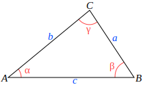

# 解三角形

## 参考资料

- [三角形 - 维基百科](https://zh.wikipedia.org/zh-cn/三角形)
- [【最全汇总】最全三角形面积公式！我赌你只会五个（doge） - bilibili](https://www.bilibili.com/video/BV1RTg5zgE1m)

## 约定

对于三角形 $\triangle ABC$，如果没有特别说明，则：

1. 边长 $a$、$b$、$c$ 分别为角 $\angle A$、$\angle B$、$\angle C$ 的对边。
2. $S$ 表示三角形面积，$C=a+b+c$ 表示三角形周长。
3. $r$ 表示内切圆的半径，$R$ 表示外接圆的半径。

## 面积公式

### 基本公式（底 + 高）

$$
S=\frac{1}{2}ah_a=\frac{1}{2}bh_b=\frac{1}{2}ch_c
$$

### 两边 + 夹角

$$
S=\frac{1}{2}ab\cos{\angle C}=\frac{1}{2}ac\cos{\angle B}=\frac{1}{2}bc\cos{\angle A}
$$

### 三边

海伦公式：

$$
S=\sqrt{p(p-a)(p-b)(p-c)},p=\frac{C}{2}=\frac{a+b+c}{2}
$$

秦九昭公式：

$$
S=\sqrt{\frac{1}{4}\left(a^2c^2-\left(\frac{a^2+c^2-b^2}{2}\right)^2\right)}
$$

### 内切圆 + 三边

$$
S=\frac{1}{2}rC=\frac{1}{2}r(a+b+c)
$$

### 外接圆 + 边/角

$$
S=\frac{abc}{4R}=2R^2\sin{\angle A}\sin{\angle B}\sin{\angle C}=\frac{1}{2}R^2(\sin{\angle 2A}+\sin{\angle 2B}+\sin{\angle 2C})
$$

### 三角 + 一边

$$
S=\frac{a^2\sin{\angle B}\sin{\angle C}}{\sin{\angle A}}=\frac{b^2\sin{\angle A}\sin{\angle C}}{\sin{\angle B}}=\frac{c^2\sin{\angle A}\sin{\angle B}}{\sin{\angle C}}
$$

### 三边 + 一角

$$
S=\frac{1}{4}(a^2+b^2-c^2)\tan{\angle C}=\frac{1}{4}(a^2+c^2-b^2)\tan{\angle B}=\frac{1}{4}(b^2+c^2-a^2)\tan{\angle A}
$$

$$
S=p(p-a)\tan{\frac{\angle A}{2}}=p(p-b)\tan{\frac{\angle B}{2}}=p(p-c)\tan{\frac{\angle C}{2}},p=\frac{C}{2}=\frac{a+b+c}{2}
$$

### 两边 + 两角

$$
S=\frac{1}{4}a^2\sin{2\angle B}+\frac{1}{4}b^2\sin{2\angle A}=\frac{1}{4}a^2\sin{2\angle C}+\frac{1}{4}c^2\sin{2\angle A}=\frac{1}{4}b^2\sin{2\angle C}+\frac{1}{4}c^2\sin{2\angle B}
$$

### 向量

$$
S=\frac{1}{2}\left|\overrightarrow{AB}\times\overrightarrow{AC}\right|=\frac{1}{2}\left|\overrightarrow{BA}\times\overrightarrow{BC}\right|=\frac{1}{2}\left|\overrightarrow{CA}\times\overrightarrow{CB}\right|
$$

### 等边三角形

$$
S=\frac{\sqrt 3}{4}a^2
$$
